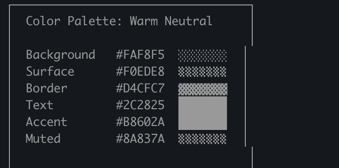
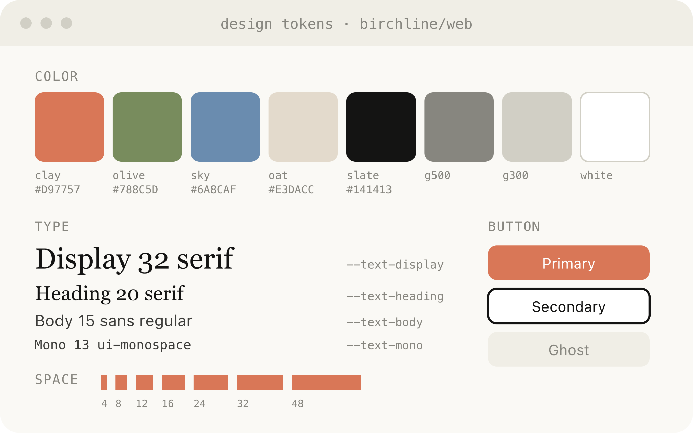

# 使用 Claude Code：HTML 的不合理有效性

> 来源：Claude Blog · Anthropic
> 原文链接：[using-claude-code-the-unreasonable-effectiveness-of-html](https://claude.com/blog/using-claude-code-the-unreasonable-effectiveness-of-html)
> 发布日期：2026-05-20 · 作者：Thariq Shihipar（技术团队成员）
> 译校：对照英文原文人工重译

---

Markdown 已成为智能体与人类沟通时主导性的文件格式。它简单、可移植，具备一定的富文本能力，也易于编辑。Claude 甚至已经能在 Markdown 文件里用 ASCII 画出图表，效果好得惊人。

但随着智能体变得越来越强大，我发现 Markdown 已经成了一个日益受限的格式。具体来说，我发现很难读完一个超过一百行的 Markdown 文件；我希望用 Claude 生成更丰富的可视化、配色和图表；而且我希望能更轻松地分享这些输出。

我也越来越不自己编辑这些文件了，而是把它们当作规格说明和参考文件来用。即便我真的做修改，通常也是让 Claude 去编辑它们，而这恰恰消减了 Markdown 最大的优势之一。

于是，我开始偏好用 HTML 作为输出格式，而不是 Markdown；并且越来越看到 Claude Code 团队里的其他人也在采用这种模式。在这篇文章里，我分享了我们团队为何以及如何使用 HTML，来产出更丰富、更易读的 Claude Code 输出。如果你想跟着试，也可以直接使用这些面向常见用例的 [HTML 文件模板](https://thariqs.github.io/html-effectiveness/#code-review)。

# 为什么使用 HTML？

有几件事让 HTML 比 Markdown 更适合我现在用 Claude Code 做的这类工作，包括那些需要或涉及以下内容的任务：

## 信息密度

与 Markdown 相比，HTML 能传达丰富得多的信息。当然，它可以做简单的文档结构，比如标题和排版，但它还能表示各种其他信息，例如：

- 用表格呈现的表格数据
- 用 CSS 呈现的设计数据
- 用 SVG 绘制的插图
- 用 script 标签包裹的代码片段
- 用 HTML 元素配合 JavaScript + CSS 实现的交互
- 用 SVG 与 HTML 展现的工作流
- 用绝对定位和画布呈现的空间数据
- 用 image 标签嵌入的图像

在我看来，Claude 能读取的信息，几乎没有什么是一套信息不能用 HTML 高效表示的。这让它成为一种极其高效的方式，让模型把深入的信息传达给你，也让你能审阅它。

我发现，如果做不到这一点，模型可能会在 Markdown 里做些更低效的事，比如用 ASCII 画图表——或者我最喜欢的，用 unicode 字符来"估算"颜色。

## 视觉清晰度与易读性

随着 Claude 能够应对更复杂的工作，它也能写出越来越长的规格说明和计划。我发现，我往往根本读不完一个超过 100 行的 Markdown 文件，而我肯定也没法让组织里的其他任何人去读它。

但 HTML 文档要易读得多，因为 Claude 可以从视觉上把结构组织得便于导航——用标签页、插图和链接。它甚至可以做移动端响应式，这样你就能根据设备形态以不同的方式阅读。

## 轻松共享

Markdown 文件相当难分享，因为大多数浏览器原生对它的渲染并不好。你往往得把它们作为附件加到邮件或消息里。

只要上传 HTML 文件，你就能轻松分享链接。你的同事可以在任何地方打开它，并轻松引用。

如果你的规格说明、报告或 PR 总结是 HTML 格式的，别人真正去读它的概率会高得多。

## 双向互动

HTML 还能让你[与文档交互](https://x.com/trq212/status/2017024445244924382)；例如，你可能想让它加上滑块或旋钮来调整某个设计，或者让你去微调算法里的不同选项，看看会发生什么。你也可以让它把你这些改动复制进一个提示词，再粘贴回 Claude Code 里。

在有用的时候，这可以让你为正在处理的特定问题，创建专门的编辑环境。

## 数据摄取

用 Claude Code 而不是 Claude.ai 或 Claude Design 来生成 HTML 文件，最大的理由之一是 Claude Code 能够摄取的所有上下文。例如，在写这篇文章时，我让 Claude Code 通读我的代码文件夹，找出我生成过的所有 HTML 文件，对它们分组和归类，然后制作了一个带图表的 HTML 文件，用图表代表每一种类型。你在本文中看到的图表，正是这一过程的直接产物。

除了文件系统，Claude Code 还能通过你的 MCP（如 Slack、Linear 等）、你的网页浏览器（Chrome 中的 Claude），以及你的 git 历史记录，找到额外的上下文。

# 开始使用

有一点值得注意：你不需要做太多，就能让 Claude 生成这样的 HTML。你可以直接提示它去"生成一个 HTML 文件"或"生成一个 HTML 工件"。关键在于你想清楚这个工件要做什么、你会怎么用它。随着时间推移，围绕反复出现的模式构建一个技能或许是有意义的；但从零开始提示，是感受它在不同用例中如何运作的好方法。

## 使用场景

为了让这种方法更具体，下面列出一些[示例用例](https://thariqs.github.io/html-effectiveness/)，我认为在这些场景下用 HTML 文件比 Markdown 更有意义。你也可以跟着这个 GitHub 图库一起看，[点击这里](https://github.com/anthropics/html-effectiveness)。

### 规格、规划与探索

HTML 是 Claude 深入钻研问题的丰富画布。当我开始处理一个问题时，我期待的不是一份简单的 Markdown 计划，而是一张 HTML 文件的网。例如，我可能先让 Claude Code 头脑风暴，并对不同方案做一些探索。然后我会让它就其中一个方案深入展开，也许再做些模型或类型接口的样例。最后，当我感觉差不多了，就让它写一份实施计划。等我对计划满意了，我会新建一个会话，把所有这些文件都传进去让它实施。

在做验证时，我还会让验证智能体读入这些文件，它就会对需要什么有更全面的上下文。

**示例提示词：**

- *我拿不准引导页该往哪个方向做。生成 6 种截然不同的方案——在布局、色调和信息密度上做出差异——并把它们放在一个 HTML 文件里以网格排布，方便我并排比较。给每一种都标出它所做的取舍。*
- *在一个 HTML 文件里创建一份详尽的实施计划，务必做些模型图、展示数据流，并加上我可能想审阅的重要代码片段。让它易于阅读和理解。*

**适用场景：**

- 探索在代码中实现某事的其它方式
- 一次性试验多种视觉设计

### 代码审查与理解

代码在 Markdown 文件里可能很难读，但用 HTML，我们可以渲染差异、批注、流程图和模块。用 HTML 来理解智能体编写的代码、审查代码，或向审查你代码的人解释一个 PR。

**示例提示词：**

*帮我审查这个 PR，方法是创建一个描述它的 HTML 工件。我对流/背压（streaming/backpressure）逻辑不太熟悉，所以请重点讲它。用行内边距批注渲染实际的 diff，按严重程度给发现项做颜色编码，并用任何其它有助于把概念讲清楚的东西。*

**适用场景：**

- 创建 PR
- 审查 PR
- 理解代码中的某个主题

### 设计与原型

Claude Design 以 HTML 为基础，因为 HTML 在设计上极具表现力，即便你最终的表面不是 HTML。Claude 可以用 HTML 勾勒出设计草图，然后再用你选择的语言——无论是 React、Swift 还是其它——把它写出来。

你也可以对交互做原型，比如动画、动作等等。不妨让 Claude 做滑块、旋钮之类的控件，来精确调出你想要的效果。

**示例提示词：**

我想给一个新的结账按钮做原型：点击时会播放一段动画，然后迅速变成紫色。创建一个 HTML 文件，里面放几个滑块和选项，让我在这个动画上尝试不同参数，并给我一个复制按钮，用来复制那些效果不错的参数。

**适用场景：**

- 创建设计系统工件
- 调整组件
- 可视化组件库
- 动画原型

### 报告、研究与学习

Claude Code 非常擅长综合多个数据源的信息，并将其转化为易读的报告。你可以提示 Claude 去搜索你的 Slack、你的代码库、git 历史或互联网，并用它生成易于阅读的报告。

你可以把它整理成长篇 HTML 文档、交互式讲解页，甚至是幻灯片/演示文稿。让 Claude 用 SVG 画图来帮助可视化。

**示例提示词：**

*我不理解我们的限流器（rate limiter）到底是怎么工作的。读取相关代码，生成一个单独的 HTML 讲解页：一张令牌桶（token-bucket）流程图、3–4 段带注释的关键代码片段，以及底部一个"踩坑点"小节。针对只读一次的人做优化。*

**适用场景：**

- 撰写特性摘要
- 生成讲解文档
- 起草每周状态报告
- 创建事件报告
- 制作 SVG 插图、流程图和技术图表

### 自定义编辑界面

有时，光靠文本框很难描述你想要什么。对于这个用例，我常会让 Claude 为我正在处理的东西构建一个一次性的编辑器：不是产品，也不是可复用的工具，而只是一个为这一份数据量身打造的 HTML 文件。

诀窍始终是：以一个导出动作收尾——一个"复制为 JSON"或"复制为提示词"按钮，把我在这个 UI 里做的任何操作，重新变回可以粘贴进 Claude Code 或提交到文件的东西。你始终处在循环之中，而这个循环变得紧凑得多。

**示例提示词：**

- *我需要重新排定这 30 张 Linear 工单的优先级。给我做一个 HTML 文件，每张工单是一张可拖拽的卡片，分布在"现在 / 下一步 / 之后 / 砍掉"这几列中。先按你最好的猜测给它们预排序。加一个"复制为 Markdown"按钮，导出最终的排序，并为每个分组附上一行理由。*
- *这是我们特性开关（feature flag）的配置。为它构建一个基于表单的编辑器，按区域对开关分组，展示它们之间的依赖关系，如果我启用了一个前置条件未开启的开关就警告我。加一个"复制 diff"按钮，只给我那些改动过的键。*
- *我正在调一个系统提示词。做一个并排的编辑器：左侧是可编辑的提示词，把变量槽位高亮；右侧是三个示例输入，可以实时重新渲染填充后的模板。加一个字符/令牌计数器和复制按钮。*

**适用场景：**

- 重新排序、分流或分桶任何东西（工单、测试用例、反馈）
- 编辑结构化配置（特性开关、环境变量、带约束的 JSON/YAML）
- 通过实时预览调整提示词、模板或文案
- 整理数据集——批准/拒绝行、标记样本、导出选择
- 给文档、转写稿或 diff 加批注并导出批注
- 挑选那些难以用文字表达的值：颜色、缓动曲线、裁剪区域、cron 计划、正则表达式

### 常见问题

以下是我被问到最多的、关于在 Claude Code 中使用 HTML 的问题，以及我沉淀下来的、实用的日常习惯：

**这难道不是更低效吗？**

虽然 Markdown 通常用更少的令牌，但我发现，HTML 增加的表现力，加上我更可能去读它的高得多的概率，意味着我总体上得到了更好的输出。在 Opus 4.7 的 1MM（百万级）上下文窗口下，令牌用量的增加在上下文窗口里几乎察觉不到。

**你现在什么时候还会用 Markdown？**

老实说，我几乎已经完全不再用 Markdown 做任何事了，不过我大概算是非常偏向 HTML 最大化的一端。

**这就是你取代计划的方式吗？**

我发现，我倾向的不是只有一个计划，而是为计划的不同部分/阶段准备几个不同的 HTML 文件。例如，我可能会在 HTML 里写一份实施计划，然后再做另一个文件来探索 UI，最后再做一个 HTML 组件，列出每一种设计。我往往会把这些文件留存下来，既作为未来的参考，也用于验证。

## 与 Claude 保持同步

综上所述，我使用 HTML 而非 Markdown 的真正原因，是它让我感觉与 Claude 的同步程度高得多。随着 Claude 承担得越来越多，我注意到自己读计划越来越不仔细，而我希望有一种方式能持续参与它的选择，而不是简单地把它们甩手交给它。HTML 恰好就是这种方式。我现在比以往任何时候都更有"在环"的感觉。

开始使用 [Claude Code](https://claude.com/product/claude-code)。

*本文由技术团队成员 Thariq Shihipar 撰写，表达了他对在 Claude Code 中使用 HTML 文件的个人观点与偏爱。*
