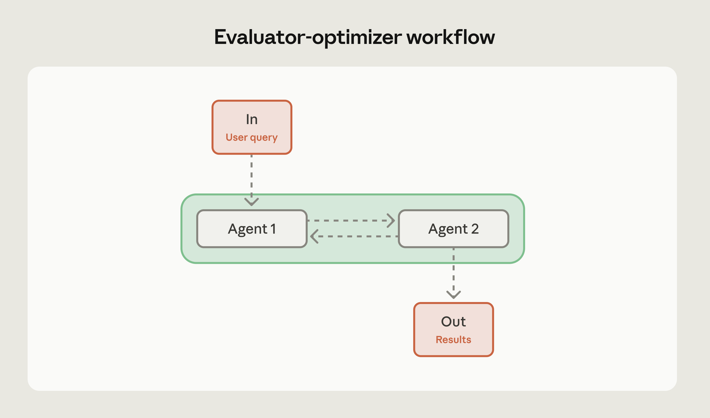

# AI 智能体的常见工作流程模式（以及何时使用它们）

> 来源：Claude Blog · Anthropic
> 原文链接：[common-workflow-patterns-for-ai-agents-and-when-to-use-them](https://claude.com/blog/common-workflow-patterns-for-ai-agents-and-when-to-use-them)
> 发布日期：2026-03-05
> 译校：对照英文原文人工重译

---

[AI 智能体](https://www.anthropic.com/research/building-effective-agents) 能够自主做出决策，而工作流正是你为这种自主性赋予结构的方式。它们建立起执行模式，将智能体的能力引导到那些需要协调步骤、可预测结果和精心安排时序的复杂问题上。

当你需要多个智能体协同工作时，真正的关键决策是：哪种模式契合你的问题。

我们与数十个构建 AI 智能体的团队合作过，在生产环境中，三种模式覆盖了绝大多数用例：顺序式、并行式与评估器—优化器式。

每种模式解决不同的问题，而选错模式会在延迟、token 或可靠性上让你付出代价。本文逐一拆解这三种模式，并给出每种模式分别适用何时、以及如何组合它们的指导。

## 工作流与智能体如何协同工作

如果你管理过团队，那么你已经理解了工作流。

想象一条制造装配线：每个工位都有一名熟练工人，就自己的具体任务做决策，但整体流程是提前设计好的——即便个别步骤涉及路由或重试这类动态决策。

智能体工作流的运行方式如出一辙。

### 理解工作流与自主智能体的区别

工作流不会取代智能体的自主性；它们塑造的是智能体在何处、以何种方式运用这种自主性。

**完全自主的智能体决定一切**：使用哪些工具、以什么顺序执行任务、何时停止。

**工作流提供结构**：它建立整体流程、定义检查点，并为智能体在每一步中的运作方式设定边界，同时仍允许在这些边界之内出现动态行为。

工作流中的每一步仍然可以利用智能体的推理与工具调用，但整体的编排遵循一条既定路径。工作流模式让你在每一步都获得智能体的智能，同时在整项任务中保持可预测的流转。

## 智能体工作流模式

在生产中，我们最常看到三种工作流模式。把它们视为构建模块，而非僵化的模板——随着需求演进，你通常会组合或嵌套它们：

1. **顺序工作流**——用于按固定顺序执行任务
2. **并行工作流**——用于在多个智能体上同时运行相互独立的任务
3. **评估器—优化器工作流**——用于需要迭代打磨的输出

每种工作流类型解决特定的问题，并在复杂性、成本与性能方面有着明确的权衡。

| 模式 | 它解决的问题 | 何时使用 | 权衡 | 收益 |
| --- | --- | --- | --- | --- |
| **顺序式** | 任务存在依赖关系：步骤 B 需要步骤 A 的输出 | 多阶段流程、数据管道、草稿—审查—打磨循环 | 增加延迟（每一步都要等待上一步） | 通过让每个智能体专注于一件事，提升准确率 |
| **并行式** | 任务彼此独立，但逐个执行很慢 | 多维度评估、代码审查、文档分析 | 成本更高（多个并发 API 调用），且需要聚合策略 | 加快完成速度，并实现工程团队间的关注点分离 |
| **评估器—优化器式** | 初稿质量不够好 | 技术文档、客户沟通、针对特定标准生成代码 | 成倍增加 token 消耗，并拉长迭代时间 | 通过结构化的反馈循环，产出更优结果 |

从能解决你问题的最简单模式起步。默认用顺序式。当延迟成为瓶颈且任务彼此独立时，再转向并行式；只有当你能衡量质量提升时，才加入评估器—优化器循环。

### 顺序工作流

顺序工作流按预定顺序执行任务。

每个阶段的智能体处理输入、做出决策、按需进行工具调用，然后将结果传递给下一阶段。最终形成一条清晰的操作链，输出沿系统线性流动。

**何时使用：** 当任务能自然拆解为带有明确依赖关系的不同阶段时，顺序工作流最为得心应手。你用一部分延迟换取更高的准确率——让每个智能体专注于特定的子任务，而不是试图一口气处理所有事情。

在以下情况使用顺序工作流：

- 多阶段流程，每一步都依赖上一步的输出
- 数据转换管道，每个阶段都增添特定价值
- 因固有的依赖关系而无法并行化的任务
- 迭代改进循环，如草稿—审查—打磨循环

**何时避免：** 当单个智能体就能有效处理整个任务，或者当智能体需要协作而非按顺序交接工作时，请跳过顺序工作流。如果你硬要把一个本来不适合这种结构的任务塞进顺序步骤，只会增加不必要的复杂度。

**示例：** 当每一步都涉及截然不同的工作时，顺序工作流表现很好：

- 先生成营销文案，再将其翻译成多种语言——或者从文档中提取数据、对照模式校验，再载入数据库
- 内容审核管道同样适合顺序执行：提取内容、分类、套用审核规则，再进行恰当路由

**专业建议：** 先尝试把你的管道作为一个单个智能体来跑，让各步骤只是提示词的一部分。如果这样已经够好，那你就解决了问题，且没有引入额外复杂度。只有当单个智能体无法稳定处理时，才拆分成多步骤工作流。

### 并行工作流

并行工作流把相互独立的任务分派给同时执行的多个智能体。你不必等一个智能体结束再开始下一个，而是同时运行多个智能体，再合并它们的结果。

当任务彼此不依赖时，这种模式可以带来速度上的提升。

这种方法类似于分布式系统中的扇出/扇入（fan-out/fan-in）模式。你把相同或相关的工作发给多个智能体，各自独立处理，然后聚合或综合它们的输出。

智能体之间不互相交接工作——它们自主运行，产出贡献于整体任务的结果。

**何时使用：** 当你能把工作拆成受益于同时处理的独立子任务，或者当你需要针对同一问题获得多种视角时，并行化才有意义。它还能实现关注点分离：不同的工程师可以各自独立地拥有并优化单个智能体，彼此的工作互不干扰。对于复杂任务，用独立的 AI 调用来处理每一项考量，往往优于试图在单次调用中兼顾所有内容。

在以下场景考虑并行工作流：

- 分块处理的方式，即不同智能体负责不同侧面（例如一个处理查询，另一个筛查安全问题）
- 评估场景，每个智能体评判不同的质量维度
- 投票模式，多个智能体分析相同内容，你再汇总它们的评判

**何时避免：** 当智能体需要累积上下文、或必须建立在彼此工作之上时，不要使用并行工作流。当 API 配额等资源限制导致并发处理效率低下，或者当你缺乏处理不同智能体矛盾结果的明确策略时，请跳过此模式。如果结果聚合变得过于复杂、或拉低了输出质量，并行化就不值得了。

**示例：** 并行工作流适用于：

- 自动化评估（每个智能体检查不同的质量指标）或代码审查（多个智能体审查不同的漏洞类别）
- 文档分析是另一个强用例：并行提取关键主题、做情感分析、进行事实核查，再综合各项洞见

**专业建议：** 在实现并行智能体之前，先设计好你的聚合策略。是采用多数投票？平均置信度分数？还是听从最专业的那个智能体？为综合结果制定清晰的计划，才能避免收集到一堆互相冲突、却无从调和的输出。

### 评估器—优化器工作流

评估器—优化器工作流让两个智能体在一个迭代循环中配对：一个生成内容，另一个依据特定标准评估它，生成器再根据反馈加以打磨。如此持续，直到输出达到你的质量阈值，或达到最大迭代次数。

关键的洞见在于：生成与评估是不同的认知任务。将它们分离，可以让每个智能体各司其职——生成器专注产出内容，评估器专注贯彻一致的质量标准。

**何时使用：** 当你拥有清晰、可量化、且 AI 评估器能一贯施行的质量标准，并且首稿与终稿之间的质量差距大到足以证明额外的 token 与延迟合情合理时，这种模式才奏效。

在以下场景考虑评估器—优化器工作流：

- 带有特定要求的代码生成（安全标准、性能基准、风格指南）
- 语气与精确度至关重要的专业沟通
- 任何首稿质量持续达不到要求的场景

**何时避免：** 当首稿质量已经满足需求时，请跳过评估器—优化器工作流——你只是在无谓的迭代上燃烧 token。不要把这种模式用于需要即时响应的实时应用、基础分类之类的简单例行任务，或者评估标准对 AI 评估器来说过于主观、无法一贯施行的情况。如果存在确定性工具（如用于代码风格的 linter），直接用它。当资源限制超过质量收益时，也应避免此模式。

**示例：** 评估器—优化器工作流适用于：

- 生成 API 文档（生成器写文档，评估器对照代码库检查完整性、清晰度与准确性）
- 撰写客户沟通内容（生成器起草邮件，评估器评估语气与政策合规性）
- 生成 SQL 查询（生成器编写查询，评估器检查效率与安全问题）

**专业建议：** 在开始迭代前，先设定明确的停止标准。定义最大迭代次数和具体的质量阈值。没有这些护栏，你可能会陷入昂贵的循环：评估器不断挑出小毛病，生成器不断微调，但质量早在你停止迭代之前就已经趋于平稳。要懂得「够好」就是够好。

## 选择正确的工作流模式

恰当的工作流模式取决于你的任务结构、质量要求和资源限制。

在选择模式之前，先尝试用单次智能体调用来完成任务。如果它达到了你的质量门槛，那就大功告成。如果没有，找出它不足之处——这正告诉你该用哪种模式。

以下几个问题可以帮你做决定：

- 单个智能体能否有效处理此任务？如果能，那就完全不要用工作流。
- 任务是否存在明确的顺序依赖？用顺序工作流。
- 子任务能否独立且同时处理，且更快完成会有帮助？考虑并行工作流。
- 经过迭代打磨，质量能否获得有意义的提升？考虑评估器—优化器模式。

选定模式后，还要考虑：

- **故障处理：** 为每一步定义兜底行为与重试逻辑。
- **延迟与成本约束：** 它们决定了你能运行多少个智能体、负担得起多少次迭代。
- **衡量改进：** 用单个智能体建立基线，这样你才能判断工作流是否真的有帮助。

**组合模式：** 这些模式并非互斥。你可以按复杂度需要嵌套它们。

- 一个评估器—优化器工作流，可以采用并行评估：多个评估器同时评判不同的质量维度。
- 一个顺序工作流，可以在某些阶段引入并行处理：在进入下一步之前，先并行完成多个独立操作。

关键在于让模式复杂度与实际需求相匹配。不要因为「能做」就去加并行处理——只有当并发执行能带来明显收益时才加。除非评估器—优化器循环能以可衡量的方式提升输出质量，否则不要实现它。

## 循序渐进地演进你的工作流

我们最好的建议：从最简单、管用的模式起步。如果顺序工作流已经能应付你的用例，就不要加并行化。如果首稿质量已经够好，就跳过评估器—优化器循环。

随着需求变化，这三种模式为你提供了清晰的升级路径。顺序工作流可以在瓶颈阶段融入并行处理。当质量标准收紧时，智能体式的方法可以加入评估；而且由于这些模式是模块化的，你无需彻底重写。

有关实现指南、详细示例，以及包含混合方法在内的高级模式，请查阅我们的完整白皮书：[*构建高效的 AI 智能体：架构模式与实现框架*](https://resources.anthropic.com/ty-building-effective-ai-agents)。

*立即在 [Claude 开发者平台](https://claude.com/platform/api) 之上开始构建。*
