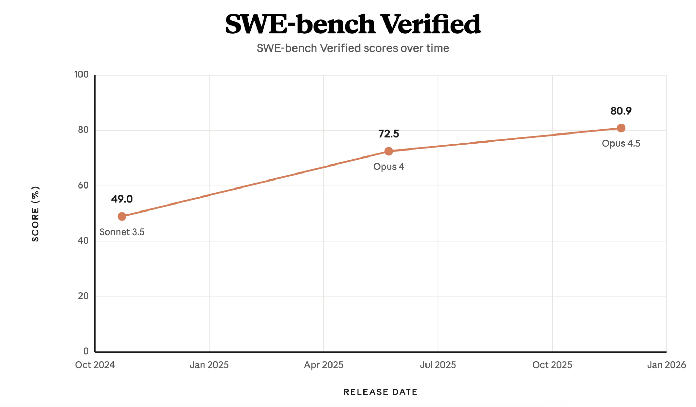
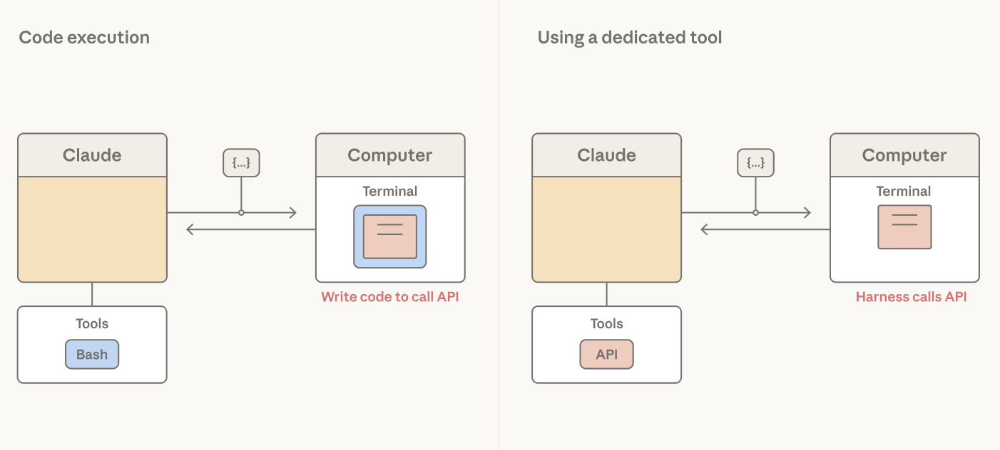

# 智能体线束设计：利用 Claude 智能的 3 种模式

> 来源：Claude Blog · Anthropic
> 原文链接：[harnessing-claudes-intelligence](https://claude.com/blog/harnessing-claudes-intelligence)
> 发布日期：2026-04-02 · 作者：Lance Martin（Claude Platform 团队技术成员）
> 译校：对照英文原文人工重译

---

Anthropic 的联合创始人之一 Chris Olah [表示](https://www.darioamodei.com/post/the-urgency-of-interpretability)，像 Claude 这样的生成式 AI 系统更多是「生长」出来的，而非「构建」出来的。研究者设定引导生长的条件，但涌现出的确切结构或能力并不总是可预测的。

这给基于 Claude 的构建工作带来一个挑战：[智能体线束中编码了对 Claude 自身无法完成之事的假设](https://www.anthropic.com/engineering/harness-design-long-running-apps)，但随着 Claude 能力增强，这些假设会逐渐过时。

智能体线束是包裹在模型外的软件支架：循环、工具、上下文管理与护栏，它们把原始智能转化为能实际工作的智能体。[智能体线束设计](https://claude.com/blog/harnessing-claudes-intelligence) 是一门实践艺术——决定哪些东西应当留在支架里，以及随着模型改进，又有哪些可以被移走。

本文中，我们分享团队在构建应用时应当遵循的三种模式：这些应用既要跟上 Claude 不断演进的智能，又要在延迟与成本之间取得平衡——善用 Claude 已知的本领、厘清哪些事可以不再亲手去做，并在智能体线束中谨慎划定边界。

### 1. 倚重模型而非线束：善用 Claude 已知的本领

我们建议用 Claude 理解得很好的工具来构建应用。

2024 年末，Claude 3.5 Sonnet 在 SWE-bench Verified 上取得了 49% 的成绩——当时属 [业界最佳水平](https://www.anthropic.com/engineering/swe-bench-sonnet)——而它只借助了一个 [Bash 工具](https://platform.claude.com/docs/en/agents-and-tools/tool-use/bash-tool) 和一个 [文本编辑器工具](https://platform.claude.com/docs/en/agents-and-tools/tool-use/text-editor-tool) 来查看、创建和编辑文件。Claude Code 正是建立在同样的工具之上。[Bash](https://platform.claude.com/docs/en/agents-and-tools/tool-use/bash-tool) 并非为构建智能体而设计，但它是 Claude *懂得* 如何使用的工具，并且会随时间推移越用越好。



*Claude 各模型版本在 SWE-bench Verified 基准上的得分，凸显了其能力的演进。*

我们见过 Claude 将这些通用工具组合成解决不同问题的模式。例如，[智能体技能（Skills）](https://agentskills.io/home)、[程序化工具调用](https://platform.claude.com/docs/en/agents-and-tools/tool-use/programmatic-tool-calling) 与 [记忆工具](https://platform.claude.com/docs/en/agents-and-tools/tool-use/memory-tool)，全都是由 Bash 与文本编辑器工具构建而成的。


*程序化工具调用、技能与记忆，都是我们的 Bash 与文本编辑器工具的组合产物。*

### 2. 精简你的智能体线束：厘清哪些事可以不再做

[智能体线束中编码了对 Claude 自身无法完成之事的假设](https://www.anthropic.com/engineering/harness-design-long-running-apps)。随着 Claude 能力增强，这些假设理应被重新审视。

**让 Claude 自己编排行动**

一个常见的假设是：每一次工具调用结果都应当经 Claude 的 [上下文窗口](https://platform.claude.com/docs/en/build-with-claude/context-windows) 回流，以指导下一步行动。如果把工具结果当作 token 来处理，当结果只须传递给下一个工具、或 Claude 只在意其中一小部分时，这样做既慢又贵，且毫无必要。


*Claude 调用工具，这些工具在环境中被执行。*

不妨设想读取一张大表、只为推理其中某一列：整张表都会落进上下文，而 Claude 要为每一行它本不需要的数据支付 token 成本。这个问题可以在工具设计层面解决——使用 [硬编码过滤器](https://platform.claude.com/docs/en/about-claude/models/migration-guide#additional-recommended-changes)。但这并没有触及根本：做出 *编排决策* 的其实是智能体线束，而这件事本该由 Claude 来做更合适。

给 Claude 一个 [代码执行](https://platform.claude.com/docs/en/agents-and-tools/tool-use/code-execution-tool) 工具（例如 [Bash 工具](https://platform.claude.com/docs/en/agents-and-tools/tool-use/bash-tool) 或 [特定语言的 REPL](https://platform.claude.com/docs/en/agents-and-tools/tool-use/code-execution-tool)）就能解决这个问题：它让 Claude 通过编写代码来表达工具调用，以及这些调用之间的逻辑。于是，不再是线束决定把每个工具调用结果都当作 token 来处理，而是由 Claude 自行决定把哪些结果传递、过滤，或以管道方式接入下一次调用——全程不触碰上下文窗口。只有代码执行的输出才会进入 Claude 的上下文窗口。


*Claude 可以编写代码来表达工具调用，以及它们之间的逻辑。*

编排决策从线束转移到了模型。由于代码是 Claude 编排行动的通用手段，一个强大的编码模型也就是一个强大的 *通用* 智能体。采用这种模式，Claude 在 [非编码评测](https://claude.com/blog/improved-web-search-with-dynamic-filtering) 上也表现强劲：在 BrowseComp（一个测试智能体浏览网页能力的 [基准](https://arxiv.org/abs/2504.12516)）上，赋予 Opus 4.6 过滤自身工具输出的能力，将准确率从 45.3% 提升到了 61.6%。

**让 Claude 自己管理上下文**

特定于任务的上下文，引导着 Claude 对 Bash、文本编辑器工具等通用工具的使用。一个常见的假设是：[系统提示词](https://platform.claude.com/docs/en/release-notes/system-prompts) 应当针对具体任务手工编写指令。问题在于，用指令预加载提示词的方式无法在大量任务间扩展：每多一个 token，都会消耗 [Claude 的注意力预算](https://www.anthropic.com/engineering/effective-context-engineering-for-ai-agents)；而用很少用到的指令去预加载上下文，更是一种浪费。

赋予 Claude 访问 [技能（Skills）](https://platform.claude.com/docs/en/agents-and-tools/agent-skills/overview) 的能力，便解决了这个问题：每个技能的 YAML frontmatter 是一段简短描述，会被预加载进上下文窗口，提供该技能内容的概览。当任务需要时，Claude 可以调用读文件工具，以渐进式披露的方式加载完整的技能内容。


*Claude 可以借助技能，渐进式地披露与任务相关的上下文。*

虽然技能让 Claude 能自由地自行拼装上下文窗口，[上下文编辑](https://platform.claude.com/docs/en/build-with-claude/context-editing) 却走向反面——它提供了一种机制，可以主动移除已经过时或不再相关的上下文，例如旧的工具结果或思维块。

借助 [子代理](https://code.claude.com/docs/en/sub-agents)，Claude 越来越擅长判断何时该分叉出一个全新的上下文窗口，以隔离某项特定任务的工作。[在 Opus 4.6 上](https://www-cdn.anthropic.com/0dd865075ad3132672ee0ab40b05a53f14cf5288.pdf)，生成子代理的能力相较最佳的单智能体运行，将 BrowseComp 上的成绩提升了 2.8%。

**让 Claude 自己持久化上下文**

长时间运行的智能体，可能会超出单个 [上下文窗口](https://platform.claude.com/docs/en/build-with-claude/context-windows) 的上限。一个常见的假设是：记忆系统应当依赖模型外围的检索基础设施。我们的许多工作，聚焦于为 Claude 提供简单的方式来 *自行选择* 要持久保存哪些内容。

例如，[压实（compaction）](https://platform.claude.com/docs/en/build-with-claude/compaction) 让 Claude 总结自己过去的上下文，从而在长周期任务中保持连续性。在多个版本迭代中，Claude 在选择「记住什么」方面越来越得心应手。[在 BrowseComp 上](https://www-cdn.anthropic.com/14e4fb01875d2a69f646fa5e574dea2b1c0ff7b5.pdf)（一个智能体式搜索任务），无论我们给它多大的压实预算，Sonnet 4.5 始终稳定在 43%；而在同样的设置下，Opus 4.5 提升到了 68%，Opus 4.6 更是达到了 84%。

[记忆文件夹](https://platform.claude.com/docs/en/agents-and-tools/tool-use/memory-tool) 是另一种思路，它允许 Claude 把上下文写入文件，并在需要时再读回来。我们见过 Claude 将其用于智能体式搜索。在 BrowseComp-Plus 上，给 Sonnet 4.5 配备一个记忆文件夹，[将准确率从 60.4% 提升到了 67.2%](https://www-cdn.anthropic.com/bf10f64990cfda0ba858290be7b8cc6317685f47.pdf)。


*Claude 可以把上下文持久化到记忆文件夹中。*

[长周期游戏](https://www.youtube.com/watch?v=CXhYDOvgpuU)（如 Pokémon）是 Claude 改进「使用记忆文件夹」能力的一个例证。Sonnet 3.5 把记忆当成了一份转录稿，记下非玩家角色（NPC）说了什么，而不是记下什么才重要。在走了 14,000 步之后，它积累了 31 个文件——其中有两个关于毛毛虫 Pokémon 的文件几乎重复——却仍然停留在第二个城镇：

```
caterpie_weedle_info:
- Caterpie and Weedle are both caterpillar Pokémon.
- Caterpie is a caterpillar Pokémon that does not have poison.
- Weedle is a caterpillar Pokémon that does have poison.
- This information is crucial for future encounters and battles.
- If our Pokémon get poisoned, we should seek healing at a Pokémon
  Center as soon as possible.
```

而后来的模型会写下战术笔记。在相同的步数下，Opus 4.6 把 10 个文件组织进了目录，获得了三枚道馆徽章，并产出了一个从自身失败中提炼出的「经验教训」文件：

```
/gameplay/learnings.md:
- Bellsprout Sleep+Wrap combo: KO FAST with BITE before Sleep
  Powder lands. Don't let it set up!
- Gen 1 Bag Limit: 20 items max. Toss unneeded TMs before dungeons.
- Spin tile mazes: Different entry y-positions lead to DIFFERENT
  destinations. Try ALL entries and chain through multiple pockets.
- B1F y=16 wall CONFIRMED SOLID at ALL x=9-28 (step 14557)
```

### 3. 在智能体线束设计中谨慎设定边界

智能体线束在 Claude 外围提供结构，以落实用户体验、成本或安全方面的要求。

**设计上下文以最大化缓存命中**

[Messages API](https://platform.claude.com/docs/en/build-with-claude/working-with-messages) 是无状态的。Claude 看不到此前各轮对话的历史。这意味着，智能体线束需要在每一轮把新的上下文，连同所有过往操作、工具描述以及对 Claude 的指令，一并打包好。

提示词可以基于设定的 [断点](https://platform.claude.com/docs/en/build-with-claude/prompt-caching) 进行缓存。换句话说，Claude API 会把断点之前的内容写入缓存，并检查这段上下文是否与先前的某个缓存条目相匹配。

由于缓存 token 的成本仅为 [基础输入 token 的 10%](https://platform.claude.com/docs/en/about-claude/pricing)，以下是智能体线束中有助于最大化缓存命中率的一些原则：

| 原则 | 描述 |
| --- | --- |
| 静态在前，动态在后 | 组织请求，让稳定的内容（系统提示词、工具）排在前面。 |
| 更新消息 | 在消息中追加一个 `<system-reminder>`，而不是去修改提示词。 |
| 不要更换模型 | 避免在会话期间切换模型。缓存是针对特定模型的；切换会使其失效。如果需要更便宜的模型，请用子代理。 |
| 谨慎管理工具 | 工具位于缓存前缀中。新增或移除任何一个都会使缓存失效。对于动态发现，请使用 **工具搜索（tool search）**，它以追加方式工作，不会破坏缓存。 |
| 更新断点 | 对于多轮应用（如智能体），应将断点移动到最新的消息，以保持缓存最新。为此可使用 **自动缓存（auto-caching）**。 |

**用声明式工具落实用户体验、可观察性或安全边界**

Claude 未必知晓一个应用的安全边界或用户体验界面。Claude 发出工具调用，由线束负责处理。Bash 工具赋予 Claude 广泛的编程能力来执行操作，但它交给线束的只是一个命令字符串——无论什么操作，形状都一样。把操作提升为专用工具，就能给线束提供一个「针对该操作的钩子」，带着可类型化的参数，可供其拦截、把关、渲染或审计。

需要安全边界的操作，天然适合做成专用工具。可逆性常是一个不错的判断标准——难以逆转的操作（如外部 API 调用）可以通过用户确认来把关。类似 `edit` 这样的写入工具，可以加入「陈旧性检查」，避免 Claude 覆盖掉自上次读取以来已被改动的文件。



*专用工具可用于基于安全、用户体验或可观察性考虑的操作。*

当某个操作需要呈现给用户时，工具也很有用。例如，它们可以被渲染成一个模态框，向用户清晰地展示一个问题、提供多个选项，或在用户提供反馈前阻塞智能体循环。

最后，工具对于可观察性也很有用。当操作是一个类型化工具时，线束就能拿到结构化的参数，可以记录、追踪和回放。

把操作提升为工具这一决策，应当被持续重新评估。例如，Claude Code 的 [auto-mode（自动模式）](https://www.anthropic.com/engineering/claude-code-auto-mode)（本文发布时处于研究模式）就在 Bash 工具外围提供了一道安全边界：它由第二个 Claude 读取命令字符串，并判断其是否安全。这种模式可以 *减少* 对专用工具的需求，但只应被用于用户信任其总体方向的任务。对于某些高风险操作，专用工具依然有其一席之地。

### 智能体线束设计的未来

Claude 的智能前沿始终在变化。关于「Claude 不能做什么」的假设，需要随着其能力每一次阶跃式的变化而被重新检验。

我们见过这种模式反复上演。在一个 [我们为长周期任务构建的智能体](https://www.anthropic.com/engineering/harness-design-long-running-apps) 中，Sonnet 4.5 一旦感知到上下文上限临近，就会提前收尾。我们为此加入了重置机制以清空上下文窗口，来应对这种「上下文焦虑」。到了 Opus 4.5，这种行为消失了。我们为补偿而构建的上下文重置，已经变成了智能体线束中的累赘。

移除这些累赘十分重要，[因为它可能成为 Claude 性能的瓶颈](http://www.incompleteideas.net/IncIdeas/BitterLesson.html)。久而久之，我们应用中的结构或边界，都应当以这样一个问题为准绳加以修剪：*有哪些事是我可以不再去做的？*

*要运用本文讨论的所有工具与模式，请查看* [*我们的 claude-api 技能*](https://github.com/anthropics/skills/tree/main/skills/claude-api)*。*

### 致谢

本文由 Claude Platform 团队技术成员 Lance Martin 撰写。特别感谢 Thariq Shihipar、Barry Zhang、Mike Lambert、David Hershey 与 Daliang Li 就文中主题提供的有益讨论。感谢 Lydia Hallie、Lexi Ross、Katelyn Lesse、Andy Schumeister、Rebecca Hiscott、Jake Eaton、Pedram Navid 与 Molly Vorwerck 的编辑审阅与反馈。
