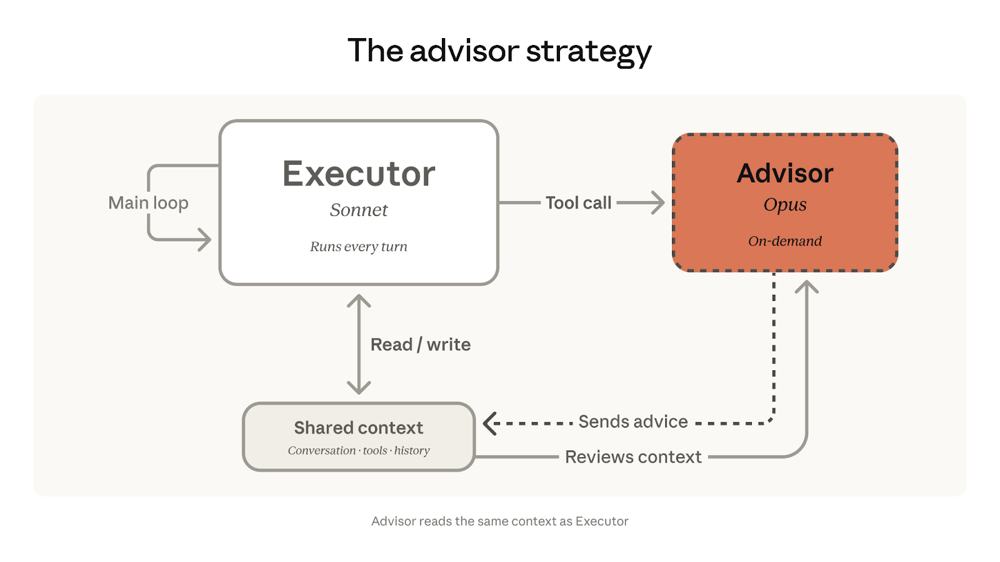
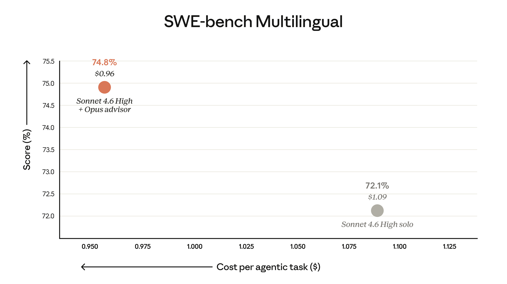

# 顾问策略：用 Opus 为 Sonnet 提供智力提升

> 来源：Claude Blog · Anthropic
> 原文链接：[the-advisor-strategy](https://claude.com/blog/the-advisor-strategy)
> 发布日期：2026-04-09
> 译校：对照英文原文人工重译

---

想要更好地平衡智能与成本的开发者，已经汇聚到我们称之为「顾问策略」的做法上：把 Opus 当顾问，与作为执行者的 Sonnet 或 Haiku 配对。这为你的智能体带来接近 Opus 级别的智能，同时把成本维持在接近 Sonnet 的水平。

今天，我们在 Claude Platform 上推出顾问工具（advisor tool），让顾问策略变成 API 调用里的一行改动。

## 用顾问策略构建高性价比的智能体



在顾问策略中，Sonnet 或 Haiku 作为执行者端到端地运行任务：调用工具、读取结果、迭代出解决方案。当执行者遇到一个它无法合理决策的问题时，会向作为顾问的 Opus 寻求指导。Opus 访问共享上下文，返回一个计划、一次纠正或一个停止信号，然后由执行者继续。顾问从不调用工具，也不产生面向用户的输出，只向执行者提供指导。

这颠覆了一种常见的子代理模式——在那种模式里，更大的协调器模型负责拆解工作，并把任务委派给更小的「工人」模型。而在顾问策略中，一个更小、更具成本效益的模型来驱动并向上求助，无需拆解、无需工人池、也无需编排逻辑。前沿级别的推理，只在执行者真正需要时才动用，其余的运行都停留在执行者级别的成本上。

在我们的评测中，以 Opus 为顾问的 Sonnet，相比单独使用 Sonnet，在 [SWE-bench Multilingual](https://www.swebench.com/multilingual.html)¹ 上提升了 2.7 个百分点，同时把每个智能体式任务的成本降低了 11.9%。



## 顾问工具

我们把顾问策略带进了 API，通过 [**顾问工具**](https://platform.claude.com/docs/en/agents-and-tools/tool-use/advisor-tool)——一个服务端工具，Sonnet 和 Haiku 知道在需要针对特定任务的指导或帮助时去调用它。

在我们的评测中，以 Opus 为顾问的 Sonnet，在 BrowseComp² 与 Terminal-Bench 2.0³ 基准上都取得了更高分数，而每个任务的成本却低于单独使用 Sonnet。


顾问策略同样支持以 Haiku 作为执行者。在 BrowseComp 上，以 Opus 为顾问的 Haiku 拿到了 41.2% 的分数，是其单独得分 19.7% 的两倍多。以 Opus 为顾问的 Haiku 在分数上比单独使用 Sonnet 落后 29%，但每个任务的成本却低了 85%。顾问相对单独的 Haiku 增加了成本，但合计价格仍然只是 Sonnet 成本的一小部分，这使它成为「需要兼顾智能与成本」的大批量任务的强力选项。


在 Messages API 请求中声明 `advisor_20260301`，模型交接就会发生在单个 `/v1/messages` 请求内部——没有额外的往返，也无需管理上下文。由执行者模型自行决定何时调用它。一旦调用，我们会把精心整理的上下文路由给顾问模型，返回计划，然后执行者在同一请求内继续运行。

```python
response = client.messages.create(
    model="claude-sonnet-4-6",  # executor
    tools=[
        {
            "type": "advisor_20260301",
            "name": "advisor",
            "model": "claude-opus-4-6",
            "max_uses": 3,
        },
        # ... your other tools
    ],
    messages=[...]
)

# Advisor tokens reported separately
# in the usage block.
```

**定价。** 顾问 token 按顾问模型的费率计费；执行者 token 按执行者模型的费率计费。由于顾问只会生成一个简短的计划（通常 400–700 个文本 token），而执行者以其较低的费率处理完整输出，因此总体成本远低于端到端地跑顾问模型。

**内置成本控制。** 设置 `max_uses` 即可限制每个请求的顾问调用次数。顾问 token 会在 usage 块中单独报告，方便你按层级追踪开销。

**与现有工具协同工作。** 顾问工具只是你 Messages API 请求里的又一个条目。你的智能体可以在同一个循环里 [搜索网页](https://platform.claude.com/docs/en/agents-and-tools/tool-use/web-search-tool)、[执行代码](https://platform.claude.com/docs/en/agents-and-tools/tool-use/code-execution-tool)，并向 Opus 请教。

## 开始上手

顾问工具现已在 Claude Platform 上以 beta 形式原生提供。要开始使用：

1. 添加 beta 特性请求头：`anthropic-beta: advisor-tool-2026-03-01`
2. 在 Messages API 请求中加入 `advisor_20260301`
3. 根据你的使用场景，调整 [系统提示词](https://platform.claude.com/docs/en/agents-and-tools/tool-use/advisor-tool#suggested-system-prompt-for-coding-tasks)

我们建议用你现有的评测套件，分别跑一下「单独 Sonnet」「以 Opus 为顾问的 Sonnet 执行者」和「单独 Opus」三组。如需深入了解，请查阅 [文档](https://platform.claude.com/docs/en/agents-and-tools/tool-use/advisor-tool)。

## 脚注

1. **SWE-bench Multilingual：** 单独运行的 Sonnet 4.6 使用了自适应思考（adaptive thinking）。Sonnet 4.6 + Advisor 使用了我们针对编码任务的建议系统提示词，并关闭了思考。两组运行都使用了高强度（high effort）模式，并配有 bash 与文件编辑工具。分数取自九种语言、共 300 道题目的五次试验平均值。所有运行中，顾问模型均为 Opus 4.6。
2. **BrowseComp：** 所有运行都关闭了思考，并使用了网页搜索与网页抓取工具。Sonnet 4.6 运行使用了中等强度（medium effort）。Sonnet 4.6 + Advisor 使用了我们针对编码任务的建议系统提示词；Haiku 4.5 + Advisor 则没有。未使用程序化工具调用或上下文压实。分数基于 1,266 道题目、每题一次尝试。所有运行中，顾问模型均为 Opus 4.6。
3. **Terminal-Bench 2.0：** 所有运行都关闭了思考，并使用了 bash 与文件编辑工具。Sonnet 4.6 运行使用了中等强度（medium effort）。两次 Advisor 运行均未使用我们针对编码任务的建议系统提示词。每个任务在隔离的 pod 中运行，资源配置为 3 倍、超时为 1 倍。分数取自 89 道任务、每道任务五次尝试的平均值。所有运行中，顾问模型均为 Opus 4.6。
