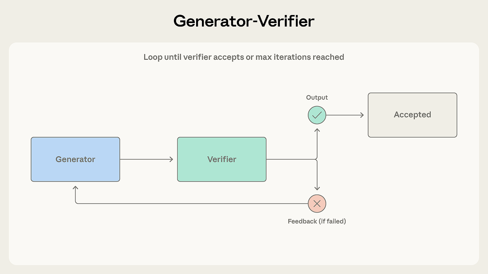
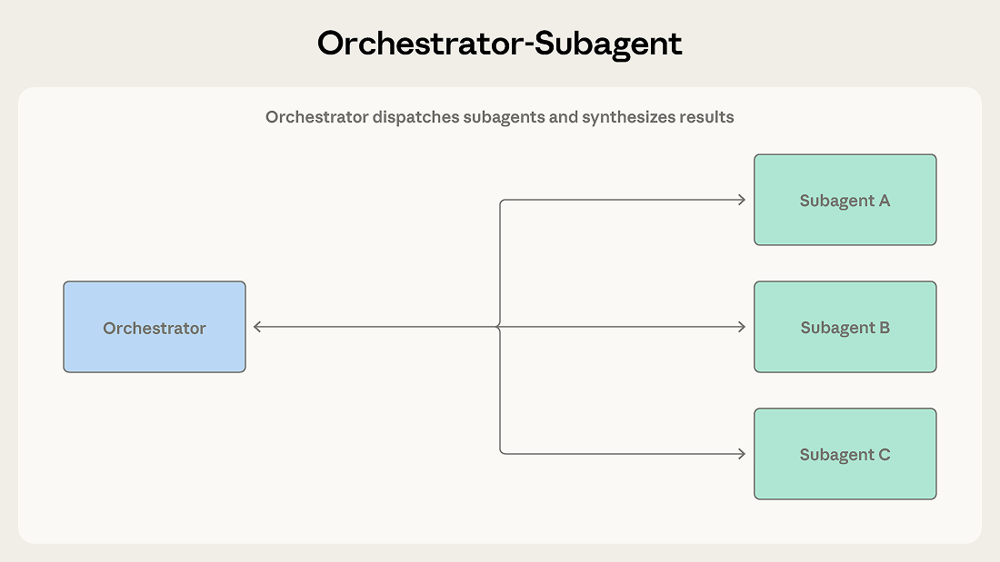
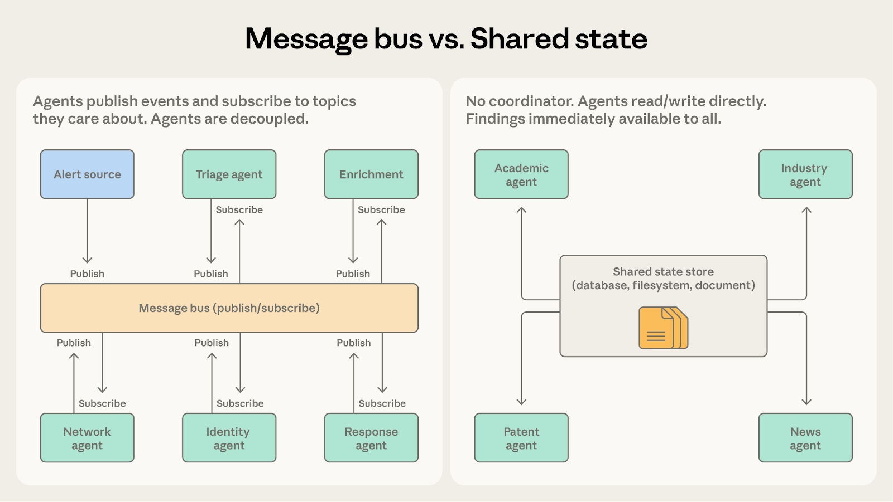

# 多智能体协调模式：五种方法以及何时使用它们

> 来源：Claude Blog · Anthropic
> 原文链接：[multi-agent-coordination-patterns](https://claude.com/blog/multi-agent-coordination-patterns)
> 发布日期：2026-04-10 · 作者：Cara Phillips（Eugene Yan、Jiri De Jonghe、Samuel Weller、Erik S. 亦有贡献）
> 译校：对照英文原文人工重译

---

在之前的文章中，我们探讨了多智能体系统何时能创造价值、以及何时单个智能体才是更好的选择。这篇文章面向的，是已经做出这一判断、现在需要决定哪种协调模式才契合自身问题的团队。

我们见过一些团队，选择模式的依据是「听起来够不够高级」，而非「是否契合手头的问题」。我们建议从最简单、可能奏效的模式起步，观察它在哪里吃力，再从那里演进。本文剖析五种模式的机制与局限：

- **生成器—验证器（Generator-Verifier）**，面向有明确评估标准的质量关键型输出
- **协调器—子代理（Orchestrator-Subagent）**，面向子任务边界清晰、任务分解明确的场景
- **智能体团队（Agent Teams）**，面向可长时间并行、独立推进的子任务
- **消息总线（Message Bus）**，面向拥有不断壮大的智能体生态、事件驱动的管道
- **共享状态（Shared State）**，面向智能体彼此以对方发现为基础的协作工作

## 模式 1：生成器—验证器

这是最简单的多智能体模式，也是部署最广泛的模式之一。我们在上一篇文章中把它作为「验证子代理模式」引入；这里我们使用更广义的「生成器—验证器」框架，因为生成器未必非得是协调器。

### 它是如何运作的

生成器接收一项任务，产出初始输出，并将其交给验证器评估。验证器检查输出是否满足要求的标准，要么判定其合格，要么附上反馈将其驳回。若被驳回，该反馈会被送回生成器，生成器据此产出一版修订。这个循环持续进行，直到验证器接受输出，或达到最大迭代次数。

### 效果好的地方

设想一个客服系统，它为客户的工单生成邮件回复。生成器借助产品文档与工单上下文，产出初始回复。验证器对照知识库核查准确性，依据品牌准则评估语气，并确认回复涵盖了所提出的每一个问题。检查未通过时，会把反馈连同确切的问题点（例如某项功能被错误归到错误的定价档位、或工单中的某个问题未被回答）一并返还给生成器。

当输出质量至关重要、且评估标准能够明确化时，请使用此模式。它对代码生成（一个智能体写代码，另一个写测试并运行）、事实核查、基于量规的评分、合规校验，以及任何「一次错误输出的代价高于多一轮生成」的领域都很有效。

### 挣扎的地方

验证器的好坏，取决于它所依据的标准。如果只告诉验证器「检查输出是否良好」、再无其他标准，它就会对生成器的输出盖章放行。团队最常见的失败，是在没有界定「验证到底意味着什么」的情况下就实现了循环，从而制造出「看似有质量控制、实则空有其表」的假象。（上一篇文章中我们讨论过这种「早期胜利问题」。）

该模式还假设生成与验证是可分离的技能。如果评估一个创造性方案，其难度与想出这个方案本身不相上下，那么验证器未必能可靠地发现问题。

最后，迭代循环可能会停滞。如果生成器无法回应验证器的反馈，系统就会在振荡中迟迟无法收敛。设置带有回退策略的最大迭代上限（升级给人工、或附上注意事项返回最佳尝试），能防止它变成死循环。

## 模式 2：协调器—子代理

层级结构定义了这种模式。一个智能体充当「团队主管」，负责规划工作、委派任务并综合结果。子代理处理具体职责，并向其汇报。

### 它是如何运作的

主管智能体收到任务，并决定如何推进。它可能会亲自处理部分子任务，同时把另一些分派给子代理。子代理完成工作后返回结果，由协调器综合成最终输出。

[Claude Code](https://claude.com/product/claude-code) 使用的就是这种模式。主智能体亲自编写代码、编辑文件、运行命令；当它需要搜索庞大的代码库或调查独立问题时，会在后台派发子代理，以便在主智能体继续工作的同时，结果不断流回。每个子代理都在自己的上下文窗口中运行，并返回经过提炼的发现。这让协调器的上下文聚焦于主任务，而探索工作则在并行中进行。

### 效果好的地方

设想一个自动化代码审查系统。当一份 pull request 到来时，系统需要检查安全漏洞、验证测试覆盖率、评估代码风格，并审视架构一致性。每项检查都彼此独立，需要不同的上下文，并产出清晰的输出。协调器把每项检查分派给专门的子代理，收集结果，再综合成一份统一的审查意见。

当任务分解清晰、且子任务之间几乎不存在相互依赖时，请使用此模式。协调器对整体目标保持连贯的把握，而子代理则专注于各自的职责。

### 挣扎的地方

协调器成了信息瓶颈。当一个子代理发现了与另一个子代理的工作相关的内容时，这条信息必须经由协调器传回。如果安全子代理发现了一个会影响架构子代理分析的鉴权缺陷，协调器就必须识别这种依赖关系，并恰当地把信息路由过去。经过几次这样的交接后，关键细节往往会被丢失，或被概括得无影无踪。

顺序执行也限制了吞吐量。除非显式并行化，否则子代理会一个接一个地运行——这意味着系统付出了多智能体的 token 成本，却换不来速度上的收益。

## 模式 3：智能体团队

当工作能被拆解为可以长时间独立推进的并行子任务时，协调器—子代理模式可能会显得不必要的束手束脚。

### 它是如何运作的

协调器将多个工作型智能体作为独立进程派生出来。队友们从共享队列中认领任务，跨多个步骤自主推进，并发出完成信号。

与协调器—子代理的区别在于「工人的持久性」。协调器为某个有界的子任务派生一个子代理，子代理在返回结果后便终止。而队友则在多项任务中持续存活，积累上下文与领域专长，从而随时间推移提升表现。协调器负责分配工作、收集成果，但不在任务之间重置工人。

### 效果好的

设想把一个大型代码库从一种框架迁移到另一种。一个队友可以独立迁移每个服务，各自配有自己的依赖项、测试套件与部署配置。协调器把每个服务分配给一名队友，每位队友自主地完成迁移：更新依赖、改动代码、修复测试、做验证。协调器收集已完成的迁移，并在整个系统上运行集成测试。

当子任务相互独立、并能从持续的多步骤工作中获益时，请使用此模式。每位队友都会建立起关于自己领域的上下文，而非每次分派都从零开始。

### 挣扎的地方

独立性是关键要求。与协调器—子代理不同（协调器能在子代理之间居中调解、路由信息），队友是自主运作的，无法轻易共享中间发现。如果一位队友的工作影响了另一位，双方都无从察觉，它们的输出便可能发生冲突。

完成检测也更难。由于队友自主工作、耗时长短不一，协调器必须应对「部分完成」的局面：一位队友两分钟就收工，另一位却要二十分钟。

共享资源会让这两个问题雪上加霜。当多个队友操作同一个代码库、数据库或文件系统时，两位队友可能会编辑同一文件，或做出互不兼容的改动。该模式需要谨慎的任务划分与冲突解决机制。

## 模式 4：消息总线

随着智能体数量增加、交互模式日趋复杂，直接协调变得难以管理。消息总线引入了一层共享的通信层，智能体在其中发布事件、并订阅事件。

### 它是如何运作的

智能体通过两个原语交互：发布（publish）与订阅（subscribe）。智能体订阅自己关心的主题，路由器再把匹配的消息投递过去。具备新能力的新智能体可以开始接收相关工作，而无需重新接线已有的连接。

### 效果好的地方

一个安全运营自动化系统，正好展示了这种模式的长处。警报来自多个源头，分诊智能体按严重性与类型对每个警报分类，把高严重性的网络警报路由给网络调查智能体，把凭证相关的警报路由给身份分析智能体。每个调查智能体都可以发布「enrichment 请求」，由上下文收集智能体来满足。发现结果流向响应协调智能体，由其决定采取何种适当动作。

这条管道之所以契合消息总线，是因为事件从一个阶段流向下一个阶段，团队可以随着威胁类别的演进而加入新的智能体类型，并且可以独立地开发与部署智能体。

请将此模式用于事件驱动的管道——其工作流是由事件「涌现」出来的，而非预先设定的序列，并且智能体生态很可能不断壮大。

### 挣扎的地方

事件驱动通信的灵活性，让追溯变得更加困难。当一条警报触发跨五个智能体的连锁事件时，要弄清发生了什么，需要仔细的日志记录与关联分析。调试比顺着协调器的顺序决策走要难得多。

路由的准确性同样关键。如果路由器误分类或丢弃了某个事件，系统就会「静默失败」：什么都不处理，却也绝不会崩溃。基于 LLM 的路由器带来了语义层面的灵活性，却也引入了自己的失效模式。

## 模式 5：共享状态

前面几种模式里的协调器、团队主管与消息路由器，都是对信息流做集中式管理。共享状态去掉了这个中间层——它让智能体通过一个所有智能体都能直接读写的持久化存储来彼此协调。

### 它是如何运作的

智能体自主运作，读取并写入一个共享的数据库、文件系统或文档。这里没有中央协调器。智能体去存储里查找相关信息，基于所发现的内容采取行动，再把结果写回。工作通常始于一个初始化步骤——它往存储里「播种」一个问题或数据集；而结束于某个终止条件被满足：时间上限、收敛阈值，或某个被指定的智能体判定「存储中已包含足够答案」。

### 效果好的地方

设想一个研究综合系统，多个智能体分别调查一个复杂问题的不同侧面。一个探索学术文献，一个分析行业报告，一个查阅专利申请，一个监控新闻报道。每个智能体的发现，都可能为其他智能体的调查提供线索。学术文献智能体或许会发掘出一位关键研究者，而行业智能体正应更仔细地审视其所在公司。

有了共享状态，发现结果会直接写入存储。行业智能体能立即看到学术智能体的发现，而无需等待协调器来路由信息。智能体以彼此的工作为基础，共享存储也演变成一个不断生长的知识库。

共享状态还消除了协调器这一单点故障。哪怕任意一个智能体停摆，其余的仍能继续读写。而在协调器与消息总线系统中，协调器或路由器的故障会让一切停摆。

### 挣扎的地方

没有显式协调，智能体可能会重复劳动，或走上相互矛盾的道路。两个智能体可能各自独立地调查同一条线索。智能体的交互产生的是「系统行为」，而非自上而下的设计，这使得结果更难预测。

更棘手的失效模式是反应循环（reactive loop）。例如：智能体 A 写入一个发现，智能体 B 读取它并写入后续结果，智能体 A 看到后续结果又做出回应。系统会不断在不收敛的工作上燃烧 token。重复劳动与并发写入都有已知的工程解法（加锁、版本化、分区）。反应循环却是一个行为层面的问题，需要一等公民的终止条件：时间预算、收敛阈值（连续 N 个周期没有新发现），或某个专职智能体——它的职责就是判断「存储何时已包含足够的答案」。那些把终止当作「事后才想」的系统，往往会无限循环，或是在某个智能体的上下文被填满时任意停下。

## 模式之间的选择与演进

正确的模式取决于关于系统的一小撮结构性问题。在上一篇文章中，我们主张「以上下文为中心的分解」——按每个智能体所需的上下文来划分工作，而非按工作类型。这个原则在此同样适用。这些模式的差异，正在于它们如何管理上下文边界与信息流。

### 协调器—子代理 vs. 智能体团队

两者都涉及协调器把工作分派给其他智能体。问题在于：工人需要把自己的上下文维持多久。

- **选协调器—子代理**，当子任务简短、聚焦、且产出清晰时。代码审查系统在此表现良好，因为每次检查都运行自己的分析、生成报告、并在单次有界的调用内返回。子代理不需要跨多个周期携带上下文。
- **选智能体团队**，当子任务能从持续、多步骤的工作中获益时。代码库迁移正契合于此，因为每位队友都真正熟悉自己被分配到的服务：依赖关系图、测试模式、部署配置。这种累积起来的上下文，以一次性分派无法复制的方式提升了表现。

当子代理需要在多次调用之间保留状态时，智能体团队是更合适的选择。

### 协调器—子代理 vs. 消息总线

两者都能处理多步骤工作流。问题在于：工作流结构的可预测程度如何。

- **选协调器—子代理**，当步骤的顺序在事前就已确定时。代码审查系统遵循一条固定的管道：接收 PR、运行检查、综合结果。
- **选消息总线**，当工作流由事件「涌现」出来、并可能随发现内容而变化时。安全运营系统无法预测什么警报会到来、又需要怎样的调查路径。新的警报类型可能出现，需要新的处理方式。消息总线把事件路由给有能力的智能体，而不是遵循预设序列，从而容纳了这种多变性。

当协调器中累积的条件逻辑越来越多、以应对不断膨胀的各类情形时，消息总线能让路由变得显式且可扩展。

### 智能体团队 vs. 共享状态

两者都涉及智能体自主工作。问题在于：智能体是否需要彼此的发现。

- **选智能体团队**，当智能体在互不交互的独立分区上工作时。代码库迁移契合于此，因为每位队友都处理自己的服务，而协调器最后再合并结果。
- **选共享状态**，当智能体的工作具有协作性、且发现应在彼此之间实时流动时。研究综合系统更匹配这一点，因为学术智能体所发掘出的「关键研究者」，会立刻与行业智能体的调查产生关联。

一旦队友之间需要相互沟通、而不只是共享最终结果，共享状态会让这种沟通更加自然。

### 消息总线 vs. 共享状态

两者都支撑复杂的多智能体协调。问题在于：工作是作为离散事件流动，还是累积成一个共享知识库。

- **选消息总线**，当智能体对管道中的事件做出反应时。安全运营系统逐阶段地处理警报，每个事件在完成之前都会触发下一个。这种模式能高效地把事件路由给有能力的智能体。
- **选共享状态**，当智能体建立在随时间累积的发现之上时。研究综合系统持续地收集知识。智能体反复回到存储，查看他人的发现并调整自己的调查。

消息总线仍然有一个路由器，意味着仍由某个中央组件决定事件的去向。共享状态则是去中心化的。如果消除单点故障是头等大事，共享状态能更彻底地满足这一点。

如果消息总线系统中的智能体，是为了「共享发现」而发布事件、而非为了「触发动作」，那么共享状态会是更合适的选择。

## 开始上手

生产系统常常是多种模式的组合。一种常见的混合，是用协调器—子代理承载整体工作流，再用共享状态处理协作密集的子任务。另一种，是用消息总线做事件路由，并让「智能体团队式」的工人来处理每种事件类型。这些模式是构建模块，而非互斥的选项。

下表概括了每种模式各自适用的情境。

| 情境 | 模式 |
| --- | --- |
| 质量关键型输出，且评估标准明确 | 生成器—验证器 |
| 任务分解清晰，子任务边界明确 | 协调器—子代理 |
| 并行工作负载，独立且长时间运行的子任务 | 智能体团队 |
| 事件驱动的管道，智能体生态不断壮大 | 消息总线 |
| 协作式研究，智能体彼此分享发现 | 共享状态 |
| 要求不存在单点故障 | 共享状态 |

对大多数用例，我们建议从协调器—子代理起步。它以最少的协调开销，处理最广泛的问题。观察它在哪里吃力，再随着特定需求逐渐清晰，向其他模式演进。

*在后续文章中，我们将通过生产级实现与案例研究，逐一深入剖析每种模式。关于「多智能体系统何时值得投入」的背景，请参阅* [*构建多智能体系统：何时以及如何使用它们*](https://claude.com/blog/building-multi-agent-systems-when-and-how-to-use-them)*。*

## 致谢

由 Cara Phillips 撰写，Eugene Yan、Jiri De Jonghe、Samuel Weller 与 Erik S. 亦有贡献。
