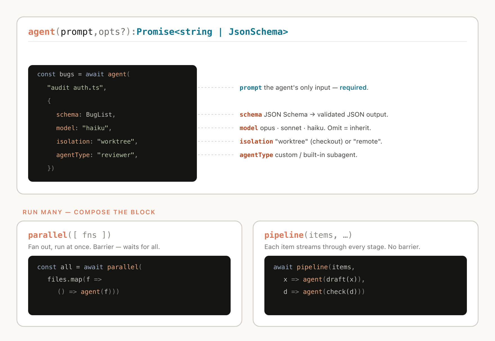
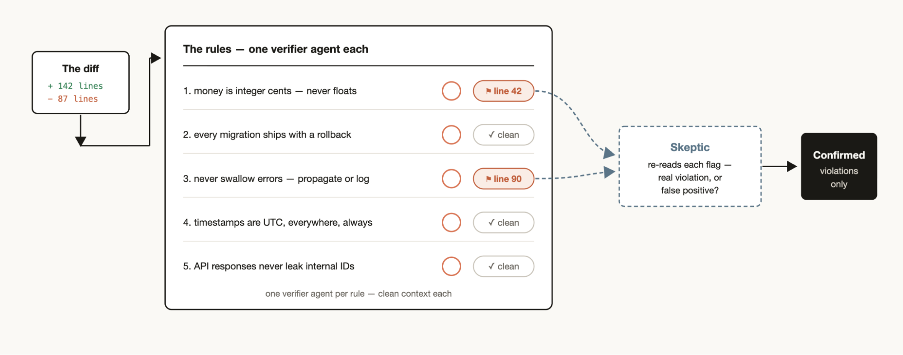
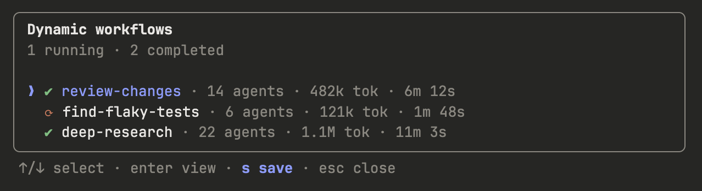
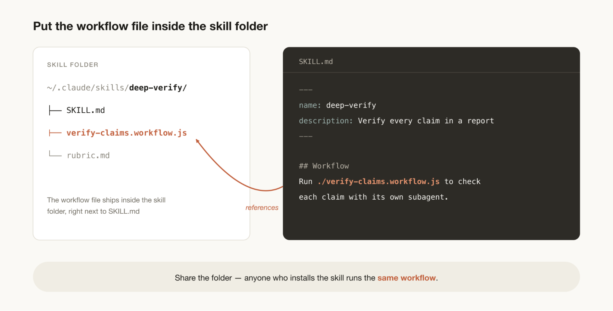

# 适用于每项任务的工具：Claude Code 中的动态工作流

> 来源：Claude Blog · Anthropic
> 原文链接：[a-harness-for-every-task-dynamic-workflows-in-claude-code](https://claude.com/blog/a-harness-for-every-task-dynamic-workflows-in-claude-code)
> 发布日期：2026-06-02 · 作者：Thariq Shihipar、Sid Bidasaria（Anthropic 技术成员，从事 Claude Code 工作）
> 译校：对照英文原文人工重译

---

Claude Code 现在可以即时编写并编排属于自己的多智能体线束。本文介绍动态工作流如何运作，以及最能发挥它们价值的使用模式。

上周，我们在 Claude Code 中发布了 [动态工作流](https://code.claude.com/docs/en/workflows)。Claude 现在可以即时编写属于自己的 [线束](https://code.claude.com/docs/en/glossary#agentic-harness)，并针对手头的任务量身定制。

虽然 Claude Code 默认的线束是为编码而构建的，但它对许多其他类型的任务也很有用——因为事实证明，很多任务都与编码任务相似。但对于某些类别的任务，我们必须在 Claude Code 之上构建自定义线束，才能取得最佳表现，例如 [研究](https://support.claude.com/en/articles/11088861-using-research-on-claude)、[安全分析](https://support.claude.com/en/articles/11932705-automated-security-reviews-in-claude-code)、[智能体团队](https://code.claude.com/docs/en/agent-teams)，或 [代码审查](https://code.claude.com/docs/en/code-review)。

工作流让你能够动态创建构建在 Claude Code 之上的线束，使 Claude 更原生地解决上述所有问题。你还可以与他人共享、复用这些工作流。

本文中，我将分享自己最初使用工作流的体验与心得，助你充分加以利用。请记住，最佳实践仍在演进之中：动态工作流通常会消耗更多 token，最适合复杂、高价值的任务。

## 示例提示词

在深入技术细节之前，我想先用几个示例提示词，帮你打开关于工作流可能性的思路：

「这个测试大概每 50 次运行会失败 1 次。建立一个工作流来复现它。就这个竞态条件形成相互竞争的理论，直到有某个理论经受住证据检验才罢休。」

「用工作流过一遍我最近的 50 个会话，挖掘出我反复在犯的修正，把那些反复出现的整理成 `CLAUDE.md` 规则。」

「用工作流深挖过去六个月 Slack 里的 #incidents，找出那些没人提交工单的重复性根因。」

「拿我的商业计划来，跑一个工作流，让不同的智能体分别从投资者、客户和竞争对手的视角把它拆开来审视。」

「这是一个装着 80 份简历的文件夹，用工作流为后端岗位给它们排序，并复核前 10 名。用 AskUserQuestion 工具，依据一份评分标准对我做个面试。」

「我需要给这个 CLI 工具起个名字。用工作流头脑风暴一堆选项，再办个锦标赛挑出前 3 名。」

「用工作流把我们的 User 模型在所有地方重命名为 Account。」

「过一遍我的博客文章草稿，用工作流对照代码库逐条核验每一个技术论断——我不想发出任何错误的内容。」

## 动态工作流如何运作

动态工作流会执行一个 JavaScript 文件，其中包含几个有助于生成并协调 [子代理](https://code.claude.com/docs/en/sub-agents) 的特殊函数：

动态工作流还包含 JSON、Math、Array 这类标准 JavaScript 函数，以辅助数据处理。

特别值得了解的是：动态工作流可以决定智能体使用哪个模型、以及子代理是否运行在各自的工作树（worktree）中——这让 Claude 能够按需选择所需的智能层级与隔离程度。

如果工作流被打断（例如用户操作或退出终端），恢复会话后，工作流可以从中断处继续。

## 为什么采用动态工作流

当你让默认的 Claude Code 线束去执行一项任务时，它需要在同一个上下文窗口中既做规划、又做执行。对于许多编码任务，这非常高效；但在长时间运行、大规模并行、高度结构化，和/或对抗性的任务上，它可能会失灵。

这是因为：Claude 在单一上下文窗口中处理复杂任务的时间越长，就越容易受到几种特定失效模式的影响：

- **智能体式懒惰（agentic laziness）**：指 Claude 在一项特别复杂的多部分任务尚未完成时就停下，在取得部分进展后便宣称任务已结束——例如安全审查 50 项只处理了 35 项。
- **自我偏好偏差（self-preferential bias）**：指 Claude 倾向于偏爱自己的结果或发现，尤其是在被要求依据某个评分标准去验证或评判它们时。
- **目标漂移（goal drift）**：指在多轮对话中，对原始目标的忠实度逐渐流失，尤其是在压实（compaction）之后。每一步摘要都是有损的，像边界情况要求、"不要做 X" 这类约束，都可能被丢掉。

创建工作流，正是通过编排各个拥有独立上下文窗口、目标聚焦且相互隔离的 Claude 子代理，来对抗这些问题。

## 动态与静态工作流

你以前可能用过 Claude Agent SDK 或 `claude -p` 创建过静态工作流，把多个 Claude Code 实例协调在一起。

但静态工作流因为必须能应对所有边界情况，通常更通用。有了 [Claude Opus 4.8](https://www.anthropic.com/news/claude-opus-4-8) 与动态工作流，Claude 如今已经足够聪明，能为你的用例量身编写一份自定义线束。

## 使用动态工作流时的有用模式

你只需让 Claude 做一个动态工作流，或使用触发词 "`ultracode`"，即可确保 Claude Code 创建工作流。

不过，在脑中建立一套「动态工作流如何运作」的心智模型，能帮你判断何时该用它、以及如何通过提示词来推动 Claude。

在构建工作流时，Claude 可能会使用并组合以下几种常见模式：

### 分类—行动（classify-and-act）

用一个分类器智能体判断任务类型，再据此把任务路由给不同的智能体或行为。或者，在最后用一个分类器来决定输出。

### 扇出—综合（fan-out-and-synthesize）

把任务拆成许多更小的步骤，在每个步骤上跑一个智能体，然后综合这些结果。当存在大量小步骤、或每个步骤都受益于自己干净的上下文窗口（从而互不干扰、互不污染）时，这尤其有用。综合这一步是一道屏障——它会等待所有扇出智能体，再把它们的结构化输出合并成单一结果。

### 对抗性验证（adversarial verification）

对每个生成的智能体，再跑一个独立生成的智能体，依据评分标准或准则对其输出做对抗性验证。

### 生成—过滤（generate-and-filter）

就某个主题生成大量想法，再用评分标准或验证加以过滤、去重，只返回质量最高、经过检验的想法。

### 锦标赛（tournament）

不去拆分工作，而是让智能体彼此竞争。生成 N 个智能体，各自用不同方法尝试同一任务。然后由提示词或模型通过一个评判智能体，以两两对比的方式给结果打分，直到决出胜者。

### 循环直到完成（loop until done）

对于工作量未知的任务，循环生成智能体，直到满足某个停止条件（没有新发现、或日志中不再有错误）才停，而不是跑固定次数的轮次。

## 使用案例

发挥创意，去思考何时、以及如何让 Claude Code 来制作动态工作流。我发现，工作流有时对非技术工作反而更有用。

### 迁移与重构

[Bun](https://bun.com/) 就是借助工作流从 Zig 重写为 Rust 的。你可以在 [Jarred 的 X 动态](https://x.com/jarredsumner/status/2060050578026189172) 中读到具体做法，或看看我们如何对百万行级别的代码库运行 [AI 代码迁移](https://claude.com/blog/ai-code-migration)。

关键在于把任务拆成一系列需要逐个操作的步骤，例如调用点、失败的测试、模块等。为每个修复在工作树里分派一个子代理来完成修复，再让另一个智能体做对抗性审查，然后合并。考虑告诉智能体不要使用资源密集型的命令，这样你才能最大化并行度，而不至于耗尽本机资源。

### 深度研究

我们在 Claude Code 内发布了一个深度研究技能（`/deep-research`），它就用到了动态工作流。具体而言，它会扇出式地发起网络搜索、抓取来源、对其主张做对抗性验证，并综合出一份带引用的报告。

但这类研究并不只是为了网络搜索。例如，让 Claude 依据 Slack 中的上下文编译一份状态报告，或借助深入探索代码库来研究某个功能如何运作。

### 深度验证

另一方面，如果你手头有一份报告，想逐一核对并溯源其中引用的每一条事实论断，你可能会想生成一个工作流：先由一个智能体识别出所有事实论断，再分派子代理逐条详细核查。你还可以让一个验证智能体去检查那个溯源子代理，确保它所用的来源质量够高。

### 排序

你可能有这样一份清单，想按某种你认为 Claude Code 擅长评估的定性维度来排序，例如：按 bug 严重程度给支持工单排序。但如果你试图在一个提示词里对 1000+ 行排序，质量会下降，而且上下文也装不下。取而代之，可以跑锦标赛、一组成对比较智能体（比较式判断比绝对打分更可靠），或者先做并行分桶排序再合并。每一次比较都是它自己的智能体，于是确定性的循环只负责维护对阵表，而上下文中只保留运行顺序。

### 记忆与规则遵循

如果你发现有一组特定规则，即便写进了 `CLAUDE.md`，Claude 还是会漏掉或处理不好，那就创建一个工作流，里面带上一份「必须由验证者智能体逐条检查」的规则清单——每条规则配一个验证者。再创建一个持怀疑态度的角色子代理来审查这些规则、确保它们站得住脚，有助于减少过多的误报。

反向操作同样可行：挖掘你最近的会话与代码审查评论，找出你反复在犯的修正，用并行智能体对它们聚类，再对抗性验证每个候选（「这条规则当初能阻止一个真实错误吗？」），然后把「幸存者」提炼回 `CLAUDE.md`。

### 根因调查

调试在「提出几个相互独立的假设并逐一检验」时效果最好；但如果你只用单一上下文窗口，Claude 就可能陷入自我偏好偏差。

工作流能从结构上防止这一点：它派发智能体，基于互不相交的证据来生成假设。例如，分别用独立智能体去处理日志、文件与数据。然后，每个假设都可以面对一组验证者与反驳者。

这不仅仅适用于代码。工作流也能用于销售（为什么三月份销售额下滑？）、数据工程（为什么这条管道失败了？），或任何复盘（post-mortem）场景。

### 大规模分诊

每个团队都有这样一个支持队列、错误报告，或其他某种人类无法完全消化掉的积压。

一个分诊工作流会对每一项分类、对照已跟踪的内容去重，然后采取行动。这可能意味着尝试修复，或升级给人类用户。

分诊工作流有一个很有用的模式叫「隔离（quarantine）」：它禁止那些读取不受信任公共内容的智能体去执行高权限操作，这类操作改由负责「基于信息采取行动」的智能体来完成。

把分诊工作流与 `/loop` 搭配，可以让 Claude 持续不断地做这件事。

### 探索与品味

在探索解决方案的不同路径时，工作流很有用——尤其是当这件事依赖品味（比如设计或命名）、并能从一份评分标准中获益时。

试着让 Claude 探索一堆解决方案，并给一个审查智能体一份「好方案长什么样」的评分标准。当审查智能体觉得标准已被满足时，任务即告完成。解决方案也可以通过基于该标准的锦标赛来排序或甄选。

### 评测（evals）

你可以对特定任务跑轻量级评测：在工作树里分派出独立的智能体，再分派出比较智能体，依据评分标准去对比、为具体输出打分。例如，针对某个特定标准，评估并打磨你创建的一个技能。

### 模型与智能路由

创建一个针对你的任务调校过的分类器智能体，由它决定用哪个模型。当你的任务会涉及大量工具调用时，这点尤其有用——因为在执行之前先做研究，就能识别出最适合这项工作的模型。

例如，「解释 auth 模块如何运作」这个任务该用哪个最佳模型，取决于 auth 模块里有多少文件，以及代码库的形状。分类器智能体可以做这项研究，再根据任务的预期复杂度路由到 Sonnet 或 Opus。

## 何时不该使用动态工作流

工作流还很新。尽管在许多用例里它能创造出超乎寻常的成果，但并非每项任务都需要它，而且它最终可能消耗显著更多的 token。

最好发挥创意，用工作流把 Claude Code 推向你此前未曾涉足的方向。对于常规编码任务，不妨先问自己一句：它真的需要更多算力吗？例如，大多数传统编码任务并不需要一整组 5 人评审团。

同一套判断在更高一层、即架构层上同样适用：[多智能体 vs 单智能体](https://claude.com/blog/building-multi-agent-systems-when-and-how-to-use-them) 的决策遵循相似的逻辑——并行与专业化，必须「挣回」它们的协调成本。

## 构建动态工作流的技巧

### 提示词

针对动态工作流，使用我们上文描述的那些具体技巧来做详尽提示，能得到最好的结果。

工作流不只适用于大任务。你也可以提示模型使用「快速工作流（quick workflow）」。例如，对一个假设做一次快速的对抗性审查。

### 与 `/goal` 和 `/loop` 结合

当使用可重复的工作流（如分诊、研究或验证）时，把它们和 `/loop` 搭配以定期运行，并用 `/goal` 设定一个硬性完成要求。

### token 使用预算

你可以为动态工作流设定显式的 token 使用预算，以限制一项任务所用的 token 数量。你可以用类似「使用 10k token」这样的预算来提示它，它就会设下上限。

### 保存与共享动态工作流

你可以在工作流菜单里按「s」来保存工作流。你可以把它们纳入版本管理，放进 `~/.claude/workflows`，或通过技能来分发。

要通过技能共享它们，把你的 JavaScript 工作流文件放进该技能所在的文件夹，并在 [SKILL.md](http://skill.md) 中引用它们。为了获得更大的灵活性，你或许会想提示 Claude：把技能里的工作流视为「模板」，而非一份需要逐字运行的脚本。

## 探索的新起点

工作流是扩展 Claude Code 的一种有用的新方式。我鼓励你把它们视为探索「如何用 Claude 助力完成任务」的新方法的起点。关于如何把它们的潜力发挥到极致，仍有许多值得发掘之处。如果你有了什么发现，欢迎告知。

*关于「线束里究竟该放什么」的首要原则，请参阅我们为用 Claude 构建而总结的三种* [*线束设计模式*](https://claude.com/blog/harnessing-claudes-intelligence)*。*

*本文由 Anthropic 的技术人员 Thariq Shihipar 与 Sid Bidasaria 撰写，他们从事 Claude Code 的相关工作。*
