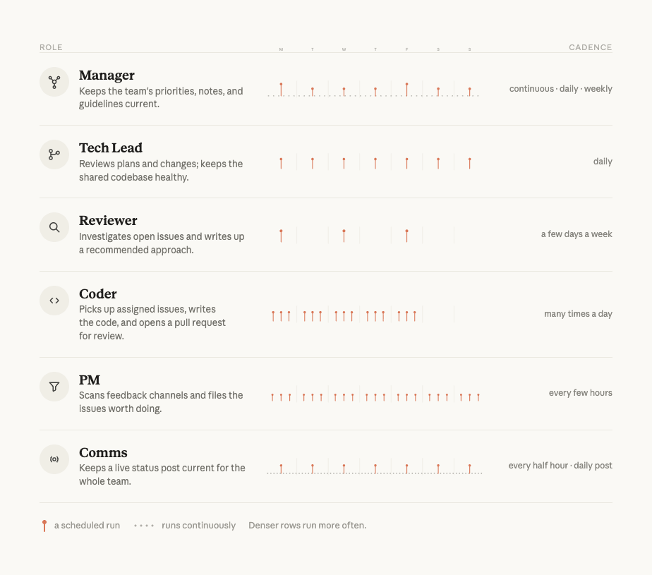

# 打造高效的人力—智能体团队

> 来源：Claude Blog · Anthropic
> 原文链接：[building-effective-human-agent-teams](https://claude.com/blog/building-effective-human-agent-teams)
> 发布日期：2026-06-24 · 作者：Kristen Swanson（Anthropic 教育团队成员）
> 译校：对照英文原文人工重译

---

过去，使用 AI 意味着一个人对着一个聊天窗口。随着时间推移，AI 处理复杂、长时间运行的工作（如编码、研究、财务分析）的能力越来越强。随之，我们也见到了许多使用 AI 的新方式——从终端、IDE 到电子表格和演示文稿——但这项工作在很大程度上仍是一种「单人」体验：一个人与一个智能体合作，完成各自的任务。

随着 [Claude Tag](https://www.anthropic.com/news/introducing-claude-tag) 这类工具的发布，这种情况正在改变。现在，人类与智能体可以在同一个工作空间里协作，为团队共享的目标共同努力。如今的工作更像是 *多人游戏*：由人类团队制定策略，由 Claude 执行工作。

这带来了一些新的工作方式。在 Anthropic，过去几个月我们一直在测试「让人力—智能体团队取得成功」所需的技术。本文中，我们将解释什么是多人智能体（multiplayer agents），以及我们在构建它们时收获的经验教训。

## 什么是多人智能体？

「多人智能体」是我们在此用来指称那些能同时与许多不同人类协作的 AI 模型。与常规智能体一样，它们拥有自己的 [记忆](https://platform.claude.com/docs/en/managed-agents/memory) 与 [技能（Skills）](https://www.anthropic.com/engineering/equipping-agents-for-the-real-world-with-agent-skills)。但在其他方面，它们又大为不同：它们拥有自己的 [凭证](https://www.anthropic.com/engineering/managed-agents)，并且驻留在「工作发生的地方」。在 Anthropic，这指的是 Slack 之类的团队协作工具内部。

下面是一个人力—智能体团队在 Slack 中一起分析数据集的例子：

要让智能体高效地参与团队频道，它们需要具备一些特定能力：

- [**持久记忆，**](https://platform.claude.com/docs/en/managed-agents/memory) 以便记住目标，并据此调整自己的执行
- [**不绑定人类的凭证**](https://www.anthropic.com/engineering/managed-agents)**，** 以便其在安全、可预测的护栏之内运作
- [**持续、广泛的信息获取能力**](https://www.anthropic.com/engineering/effective-context-engineering-for-ai-agents)**，** 让自己能了解组织如何运转，并采取行动、为团队目标服务

这些能力，构成了一个智能体得以在多人力团队中高效参与的「技术基础」。然而，要让人力—智能体团队真正 *成功*，需要的远不止于此：团队还需要特定的协作方式，以及共享的规范。

## 第 1 课：在公开场合工作，并赋予智能体广阔上下文

Anthropic 的团队会主动、公开地共享信息。当智能体加入团队时这一点尤为关键，因为智能体完全依靠团队「可被搜索到的文本」来构建自己的理解：Slack、代码、文档、会议记录。私信、走廊闲聊、受限文档，都无法为智能体提供上下文。对智能体而言，没有被写下来、无法被访问的东西，就等于不存在。

我们不是「逐个文档、逐个 Slack 频道」地去决定该向智能体开放哪些信息，而是采用明确定义的安全边界——这些边界适用于整个 Slack 工作区，也适用于会议转录与文档库。在安全边界之内，上下文流向每一位团队成员——无论人类还是 AI。这不仅扩大了人类与智能体可访问的范围，也减少了对「什么能共享、该与谁共享」的困惑。人类和智能体都很难在「逐项共享」的软边界中穿行：*这个频道该公开还是私密？这份文档能分享给那个人吗？这个智能体被允许看那条对话串吗？* 少数几条清晰、工作区级别的边界，能消除日常工作中的「决策疲劳」。

高度的透明度是有回报的。例如，能读到团队会议决策的智能体，就不会去提议那些已被降优先级（deprioritized）的任务或项目。能访问本团队之外产品规格的智能体，可以推荐其他团队已验证成功的模式。而且，由于智能体阅读海量文本的速度远快于人类，它们常常能浮出那些人类原本会错过的相关工作。在节奏快、变动频繁的行业里，我们高度依赖智能体来保持信息灵通与协同一致。

在 Anthropic，「公开协作」的实践是这样的：

- 在公司层面选定少数几条安全边界，并创建与之匹配的工作区与文档共享设置
- 组织内新建的沟通频道默认设为公开，并确保每一次决策都落进频道、文档与会议记录中
- 撰写的工件与会议记录要让智能体找得到，因为智能体如今已是团队文档的主要消费者
- 确保 AI 能访问完成任务所需的恰当工具与信息

默认「信息对内公开」可能需要文化上的转变。但「有上下文」与「没上下文」的人力—智能体团队之间，差距悬殊到不容忽视。

当然，某些交互是敏感的，需要在一个人类与 AI 之间保持私密。对此，使用 Claude Tag，你可以给 @Claude 发一条私信，也可以使用现有的 [Claude.ai](http://claude.ai) 与 Claude Cowork 应用。这些工具让 Claude 通过你的个人 MCP 连接器访问私人信息，并且你与智能体的对话、以及你分享的内容都将保持私密。

## 第 2 课：为每个「人」和智能体定义清晰的角色，并配齐称手的工具

人力—智能体团队共享同一份名册、同一套工件、同一个工作空间。智能体拥有自己的 [凭证](https://www.anthropic.com/engineering/how-we-contain-claude)、[技能（Skills）](https://www.anthropic.com/engineering/equipping-agents-for-the-real-world-with-agent-skills) 与工具权限。不同的智能体还承担不同的角色：例如，一个可能负责项目的数据分析，另一个负责把持并执行设计标准，第三个负责研究综合。

项目启动时，人类与智能体一起沟通，确定要分配哪些角色、以及人类和智能体将如何协作。

一旦人类与智能体的分工明确，某个智能体可能会再拉起其他智能体，以确保具体任务由「拥有恰当记忆与相应权限」的智能体来处理。重要的是，它们需要访问完成工作所需的全部工具：负责数据分析的智能体可能需要访问 BigQuery，而执行 QA 的智能体可能需要访问 Playwright MCP。

清晰的角色与职责，是人力—智能体团队成功的前提。人类常常与智能体工作在同一个对话线程里，但他们承担的是只有人类才能担起的角色。这保证了整体协同运作，也让人类判断被用在最重要的决策上。若没有清晰角色，人们最终会在旁边各自跑起一堆个人 AI，既重复劳动，又割裂了团队的上下文。指标跟踪就是一个常见例子：一个多人智能体只需做一遍，就能让所有人看到同一组数字。

在 Anthropic，人力—智能体团队中「清晰定义角色」的实践是这样的：

- 一份达成共识的任务清单：团队的人类与其智能体就「谁负责什么」达成一致
- 人类与智能体工作在相同的共享线程中，任何人都能从他人中断处接手
- 人类与智能体都能访问完成各自工作所需的恰当工具
- 对智能体角色与职责范围的描述

*Claude 智能体共同承担代码库的日常维护、反馈分诊、规划、编写代码、审查改动与状态汇报。每个智能体都拥有明确的任务，并按自己的节奏工作；人类负责设定目标、审查产出。*

Anthropic 的一个工程团队开始建立「名册（roster）」来固化人类与智能体的角色，因为这让推进工作变得容易得多、也具体得多。一些让他们早早「对上电波」的体会：

- 具体角色还能帮人类轻松追踪「责任落在哪里」——无论是单个任务，还是整个团队的责任集合
- 编写 [技能文件](https://platform.claude.com/docs/en/agents-and-tools/agent-skills/overview) 来定义特定智能体的角色，能让「专业化」变得轻而易举，并让全公司的人都能快速拉起同类型的其他智能体
- 当项目变得更复杂时，团队会增配新智能体，聚焦新领域。例如，他们新增了一个「发布经理」智能体，专门应对新的软件发布

这些方法，让人类对「人力—智能体团队」的心智模型，能随智能体数量的增长而平滑扩展。

## 第 3 课：设定北极星，让智能体更主动

尽管 Anthropic 内部有些智能体只是完成被分配的任务，但最重要的那些会主动提议新项目与新工作流。这通常发生在：一个已经给智能体喂足了丰富上下文、明确了角色的团队，又补上了另一重指引——北极星（north star）。

北极星是雄心勃勃、影响广泛的目标，能帮助团队判断哪些任务与工作流才是正确的。在 Anthropic，北极星始终由人类设定，并扎根于公司的使命与业务目标。

一旦北极星被清晰、书面地表述出来，人类就把它分享给团队里的智能体。然后，同样关键的一步是：人类要挑选出 *哪些* 智能体可以主动提议新工作流，以助实现这个长期目标。（团队里不太可能每个智能体都具备主动提议工作所需的技能与信任。）

例如，一个内部工具团队以「让产品上手过程更有帮助」为北极星，结果有一个智能体主动建议：修订上手流程中错误消息的文案。这些改动在接下来的一周里，显著提升了上手成功率。

在 Anthropic，设定北极星的实践是这样的：

- 让人类讨论、辩论，并书面记录下他们人力—智能体团队的一个雄心勃勃的北极星目标——它要植根于公司的使命与业务目标
- 把北极星分享给团队中的智能体，并明确点名 *哪些* 智能体可以主动推荐新工作流
- 在日历上保护「高保真的人类时间」，让会议聚焦于最重要的工作

清晰的北极星，给智能体指明了持续努力的一致方向，也带来了主动支持团队工作的有意义机会。

## 第 4 课：随时间建立起信任

Anthropic 的团队会按照「已验证的可靠性」成比例地授予智能体自主权，然后再有意地加以扩展。工程师们已经成功调度团队里的智能体独立处理过 500 个 bug 修复——但事情显然不是一开始就如此。

当一位新的人类同事加入团队，需要时间去评估他的能力、并建立稳固的工作惯例。通常要经历多个反馈周期，才能把「任务最佳完成方式」里的所有隐性知识外显出来。智能体也是如此。用户必须尝试把许多不同任务交给智能体，才能摸清它的能力边界、如何清晰地描述目标、它需要哪些技能文件，以及哪些提示词最能引出期望的行为。随着模型的演进与提升，重新测试任务也很重要。提示词可能需要重新措辞，而曾经有益的护栏，可能会束缚更聪明的模型去追求更有创意的解法。

值得一提的是，我们发现表现最好的长周期智能体，在人类审阅其工作之前，就有多种方式来验证自己的产出。代码当然有测试，但绝大多数其他工作也能被验证。例如，技术文档可以套用评分标准与风格指南。当人类设定好标尺、并确保分配给智能体的所有工作都能被审查，质量就能保持在高位、不偏离初衷。此外，与人类协作同理，让一个智能体负责执行任务、另一个智能体负责检查前者的工作，往往很有帮助。这通常被称为 [「Doer-Verifier（执行者—验证者）」智能体线束](https://www.anthropic.com/engineering/harness-design-long-running-apps)。

在 Anthropic，随时间与智能体建立信任的实践是这样的：

- 初期手动审查智能体的工作，以把关质量、提供反馈，并设计任务验证清单
- 作为任务的一部分，告诉智能体调用一个「验证器（verifier）」智能体来检查它自己的工作
- 把反思嵌入循环，要求智能体回顾自己的失误，使工作随时间的推移而改进
- 追踪每个智能体已在哪些任务类型上「挣得」了自主权，并在反复成功后，就每种任务类型扩大其权限范围

Anthropic 的一位工程领导者接手了一个积压严重的新团队。为了摸清状况，他邀请了几位人类和几个智能体来帮自己梳理积压、排出轻重缓急。团队里的一组智能体通读了积压中的全部条目，弄清楚是否有人在跟进这些条目，并为任何「无主」条目打上复杂度分数。另一组则从清单中筛出中、低复杂度的条目，创建代码改动。一开始，人类审查智能体做出的每一个决策，并标记出任何需要人类介入的决策。随后，人类教会智能体把这些决策直接提报给人类，确保那些涉及艰难权衡的决策始终有「人在回路」。

每周，这位领导者和他的团队都会让智能体编写一份周报，其中包含「经验教训与失误」，以便智能体记录错误、避免将来再犯。随着时间推移，这位领导者得以把越来越复杂的代码改动交给他的智能体，而花在指导智能体日常任务上的时间越来越少。

一旦智能体变得更加独立，这位领导者便引导它们把「人类注意力」视作稀缺资源：把问题批量集中、一次性回答；复述关键上下文，让人快速进入状态；并限制每个人类同时看到的事项数量。

帮助智能体良好沟通，能确保它们持续有用且高效。有些人的团队里配有专门的智能体，唯一职责就是决定「如何批量处理、并只把最重要的沟通上浮给人类成员」。另一些人则为「智能体每天该做多少工作」设下护栏，好让人类能有意义地参与到工作中。这类护栏，既保障了人类维持那些对他们重要的技能，也让「需要人类审查的事项数量」保持在可持续的水平。

## 需要自问的几个问题

当你为人力—智能体团队打下基础时，不妨考虑以下问题：

1. 智能体与人类所需的全部信息与访问权限，是否都既公开、又可被广泛搜索？
2. 你能否写下团队的名单（人类与智能体），并说清每个成员负责什么？
3. 团队里的每个「人」和智能体，是否都能访问完成其工作所需的恰当工具？
4. 你是否为人类与智能体准备了评分标准或测试，用以验证关键工作成果？
5. 你的团队是否有一个清晰的、人人可参照的北极星？

## 向前走

这些模式没有一种是新的——至少对人类而言不是。强大的北极星、清晰的角色、扎实的文档、共同的质量标尺，以及从错误中学习的空间，都是我们几十年来熟知的健康团队习惯。智能体只是让「不要跳过它们」变得更重要罢了。

那些从智能体身上收获最大的团队，正是那些最有意识地去践行这些基本面的团队。

*使用* [*智能体团队*](https://code.claude.com/docs/en/agent-teams) *在 Claude Code 中，或使用* [*Claude Tag*](https://support.claude.com/en/articles/15594475-what-is-claude-tag) *，开始构建你的多人智能体。*

## 致谢

本文由 Anthropic 教育团队成员 Kristen Swanson 撰写。她感谢 Matt Bell、Erik Olesund、Hasnain Lakhani、Shale Craig、Nolan Caudill、Mike Schiraldi、Aleks Todorova 与 Molly Vorwerck 对本文的贡献。
