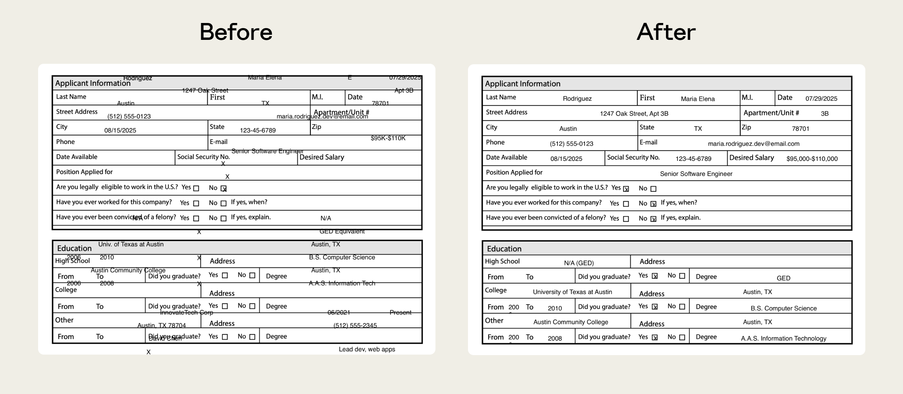
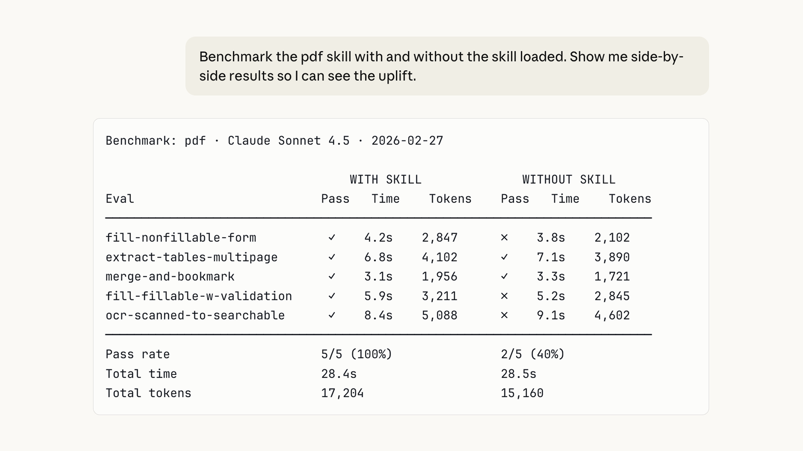
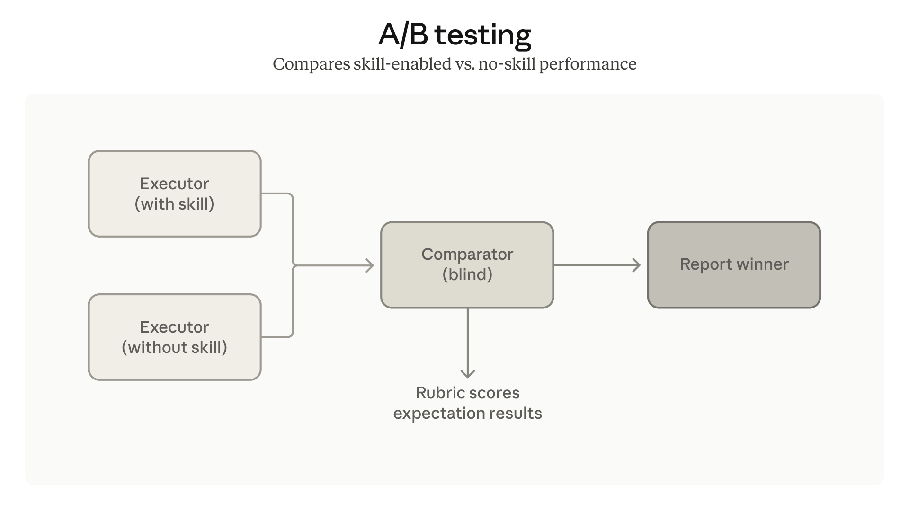
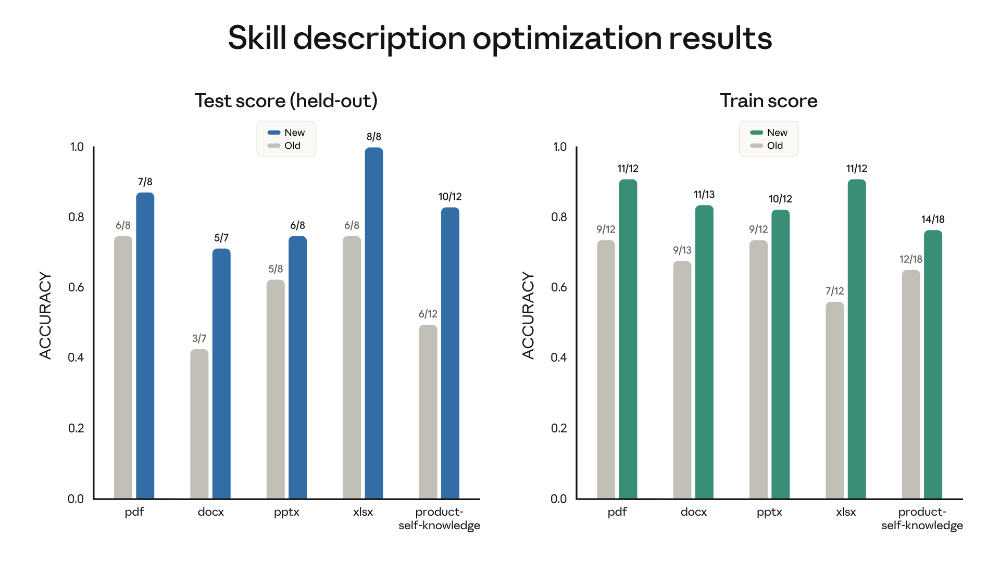

# 提高技能创造者：测试、测量和完善智能体技能

> 来源：Claude Blog · Anthropic
> 原文链接：[improving-skill-creator-test-measure-and-refine-agent-skills](https://claude.com/blog/improving-skill-creator-test-measure-and-refine-agent-skills)
> 发布日期：2026-03-03
> 译校：对照英文原文人工重译

---

技能作者现在可以验证他们的技能是否好用、捕捉质量回退，并改进描述。

Skill-creator 现在可以帮助你编写评估（evals）、运行基准测试，并随着模型的演进让你的技能持续发挥作用。这些更新现已在 Claude.ai 和 Cowork 中提供，既可作为 [Claude Code 的插件](https://github.com/anthropics/claude-plugins-official/tree/main/plugins/skill-creator)，也位于 [我们的仓库中](https://github.com/anthropics/skills/tree/main/skills/skill-creator)。

自去年十月 [推出智能体技能](https://claude.com/blog/skills) 以来，我们注意到大多数作者都是主题专家，而非工程师。他们熟知自己的工作流程，却缺少工具来判断：某项技能在新模型上是否仍然有效、是否在该触发时触发，或者在编辑之后是否真的有所改进。

今天，我们宣布对技能创建器（skill-creator）的增强，帮助作者更有把握地进行创作。我们正把软件开发的一些严谨做法（测试、基准测试、迭代改进）引入技能创作，而且不需要任何人编写代码。

## **两类技能**

技能大致分为两类：

**能力增强（Capability uplift）** 技能帮助 Claude 完成基础模型做不到、或无法稳定做到的事情。我们的 [文档创建技能](https://github.com/anthropics/skills/tree/main/skills) 就是很好的例子。它们把那些能产出比单纯提示更好结果的技术和模式编码其中。

**编码偏好（Encoded preference）** 技能记录的是这样一类工作流程：Claude 其实已经能完成其中每一步，只是技能会按照你团队的流程把它们串联起来。例如：一项对照既定标准走完 NDA 审查的技能，或者一项整合来自各个 MCP 的数据来起草每周更新的技能。

这种区分很重要，因为这两类技能可能需要因不同原因而接受测试：

- 随着模型能力提升，能力增强技能可能会变得不再那么必要。评估会告诉你这种情况何时发生。
- 编码偏好技能更持久，但其价值取决于它对实际工作流程的还原度。评估用来验证这种还原度。

无论如何，测试都是把一项"似乎"可用的技能，变成一项你"知道"确实可用的技能。

## **用评估来测试并改进技能**

Skill-creator 现在能帮你编写评估——也就是检查 Claude 针对给定提示词是否如你所愿的测试。如果你写过软件测试，这会很熟悉：定义一些测试提示词（必要时附上文件），描述"好"的标准长什么样，技能创建器就会告诉你该技能是否经得起检验。

举个例子，我们的 PDF 技能此前在处理不可填写的表单时经常卡壳。Claude 必须把文字放到精确的坐标上，却没有可供引导的已定义字段。评估定位到了这个失败点，于是我们发布了一个修复，把定位锚定到抽取出的文本坐标上。

评估在许多方面都有帮助，其中两个重要用途是捕捉质量回退，以及了解模型的进展。

第一，**捕捉质量回退。** 随着模型及其周边基础设施不断演进，上个月表现良好的技能，今天可能行为就不一样了。针对新模型运行评估，能在某些情况发生变化、尚未影响你团队工作之前，就给你一个早期信号。

第二，**知道通用模型能力何时已经超越了你的技能。** 这主要适用于能力增强技能。如果基础模型在 *未* 加载技能的情况下就开始通过你的评估，那就说明该技能的技术可能已经被吸收进了模型的默认行为里。技能并没有坏，只是不再必要了。

我们还增加了一个 **基准模式（benchmark mode）**，用你的评估来运行标准化的评测。你可以在模型更新之后，或在反复打磨技能本身的过程中运行它。它会跟踪评估通过率、耗时和 token 用量。

你的评估和结果始终归你所有。把它们存在本地、接入仪表盘，或者插进 CI 系统均可。

## **借助多智能体支持，更快、更一致地完成评估**

串行运行评估可能很慢，而且不断累积的上下文会在各次测试运行之间"渗漏"。技能创建器现在会用 **多智能体支持** 拉起相互独立的智能体，并行运行评估——每个智能体都处在干净的上下文中，拥有各自的 token 与计时指标。结果更快得出，也没有交叉污染。

我们还加入了 **比较器智能体（comparator agents）**，用于 A/B 对比：两个技能版本之间，或是"有技能"与"无技能"之间。它们在不明身份的情况下评判输出，让你能判断某次改动是否真的有帮助。

## **让技能在正确的时机触发**

评估衡量的是输出质量，但这只有在你的技能"该触发时触发"才有意义。随着技能数量增多，描述的精确度变得至关重要：太宽泛会误触发，太狭窄则永远不触发。技能创建器现在能帮你调优描述，实现更可靠的触发——它会结合示例提示词分析你当前的描述，并建议编辑以同时减少误报和漏报。

我们在文档创建技能上跑了一次，发现 6 项公共技能中有 5 项的触发能力得到了改善。

## **展望未来**

随着模型能力提升，"技能"与"规范（specification）"之间的界限可能会变得模糊。今天，一个 SKILL.md 文件本质上是一份实施计划，提供详尽的指令，告诉 Claude *如何* 做某事。随着时间的推移，一段描述技能 *应该做什么* 的自然语言，或许就足够了，剩下的交给模型去解决。

我们今天发布的评估框架，正是朝这个方向迈出的一步。评估已经在描述"做什么"。最终，那段描述本身，可能就是技能。

## **开始使用**

技能创建器的所有更新现已在 Claude.ai 和 Cowork 上线。请 Claude 使用技能创建器即可上手。

Claude Code 用户可以安装 [插件](https://github.com/anthropics/claude-plugins-official/tree/main/plugins/skill-creator)，或从我们的 [仓库](https://github.com/anthropics/skills/tree/main/skills/skill-creator) 下载。
