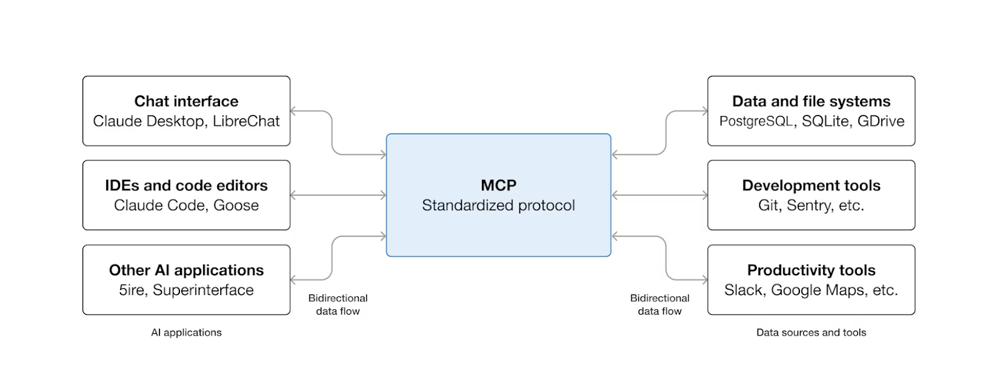

# 技能解释：技能与提示词、项目、MCP 和子代理的比较

> 来源：Claude Blog · Anthropic
> 原文链接：[skills-explained](https://claude.com/blog/skills-explained)
> 发布日期：2026-03-05
> 译校：对照英文原文人工重译

---

技能正成为创建自定义 AI 工作流与智能体日益强大的工具，但它们在 Claude 技术栈中处于什么位置？我们将解释该在何时使用哪种工具——以及它们如何协同工作。

自 [技能](https://www.anthropic.com/news/skills) 推出以来，越来越多的人想要了解 Claude 智能体式生态中的各个组件是如何协同工作的。

无论你是在 [Claude Code](https://www.claude.com/product/claude-code) 中构建复杂的工作流、用 API 打造企业级解决方案，还是在 [Claude.ai](http://claude.ai/redirect/claudedotcom.v1.claude_com.v1.0bad64a2-7905-4b41-9138-f073d21af98f) 上最大化个人效率，知道该伸手去用哪个工具——以及何时用——都能改变你与 Claude 协作的方式。

本指南拆解了每一个构建模块，解释了该在何时使用什么，并向你展示如何将它们组合起来，构建强大的智能体式工作流。

## **了解你的智能体式构建块**

### **什么是技能？**

[视频：智能体技能——你可以自定义的专业功能](https://www.youtube.com/embed/IoqpBKrNaZI)

技能是包含指令、脚本与资源的文件夹，Claude 会在与任务相关时动态地发现并加载它们。把它们看作专门的训练手册，为 Claude 提供特定领域的专业知识——从使用 Excel 电子表格，到遵循你所在组织的品牌规范。

**技能如何运作：** 当 Claude 遇到一项任务时，它会扫描可用的技能，寻找相关的匹配项。技能采用渐进式披露：先加载元数据（约 100 个 token），为 Claude 提供刚好足够的信息来判断某项技能何时相关。完整的指令在需要时加载（少于 5k token），而捆绑的文件或脚本仅在确实必要时才加载。

**何时使用技能：** 当你需要 Claude 持续、高效地执行专门任务时，请选择技能。它们非常适合：

- **组织工作流**：品牌规范、合规流程、文档模板
- **领域专业知识**：Excel 公式、PDF 操作、数据分析
- **个人偏好**：笔记系统、编码模式、研究方法

**示例：** 创建一个 [品牌规范技能](https://github.com/anthropics/skills/tree/main/skills/brand-guidelines)，包含你公司的调色板、排版规则和版式规范。当 Claude 创建演示文稿或文档时，它会自动套用这些标准，无需你每次都重新解释。

[了解更多](https://support.claude.com/en/articles/12512176-what-are-skills) 关于技能的内容，并查看 [我们持续增长的技能库](https://github.com/anthropics/skills)。

### **什么是提示词？**

[视频：提示词](https://www.youtube.com/embed/ysPbXH0LpIE)

[提示词](https://docs.claude.com/en/prompt-library/library) 是你在对话过程中用自然语言提供给 Claude 的指令。它们是短暂的、对话式的、被动响应的——你在当下提供背景与方向。

**何时使用提示词：** 把提示词用于：

- 一次性请求："总结这篇文章"
- 对话式细化："把语气改得更专业一些"
- 即时上下文："分析这些数据并识别趋势"
- 临时指令："把它整理成要点列表"

**示例：**

*请对这段代码做一次全面的安全审查。我希望找出：*

*1. 常见漏洞，包括：*

- *注入缺陷（SQL、命令、XSS 等）*
- *认证与授权问题*
- *敏感数据暴露*
- *安全配置错误*
- *访问控制失效*
- *加密失败*
- *输入校验问题*
- *错误处理与日志问题*

*2. 对于你发现的每个问题，请提供：*

- *严重程度（严重/高/中/低）*
- *location in the code (line numbers or function names)* → 代码中的位置（行号或函数名）
- *解释它为什么是安全风险，以及可能被如何利用*
- *尽可能给出带代码示例的具体修复建议*
- *防止类似问题的最佳实践指引*

*3. 代码背景：[描述这段代码的功能、所用语言/框架，以及运行环境——例如"这是一个处理用户认证并处理支付数据的 Node.js REST API"]*

*4. 其他注意事项：*

- *是否存在 OWASP Top 10 漏洞？*
- *代码是否遵循[特定框架/语言]的安全最佳实践？*
- *是否存在已知漏洞的依赖项？*

*请按严重程度和潜在影响对发现结果排序。*

**专业提示：** 提示词是你与 Claude 交互的主要方式，但它们不会跨对话保留。对于重复的工作流或专业知识，不妨考虑把提示词沉淀为技能或项目说明。

**何时改用技能：** 如果你发现自己在不同对话中反复输入相同的提示词，那就是时候创建一个技能了。把那些反复出现的指令——例如"用 OWASP 标准审查这段代码的安全漏洞"或"用执行摘要、关键发现和建议来格式化这份分析"——转化为技能。这样你不必每次都重新解释流程，也保证了执行的一致性。

看看我们的 [提示词库](https://docs.claude.com/en/prompt-library/library)、[提示词工程最佳实践](http://claude.com/blog/prompt-engineering-best-practices)，或者 [我们的智能提示词生成器](https://claude.ai/redirect/claudedotcom.v1.claude_com.v1.0bad64a2-7905-4b41-9138-f073d21af98f/public/artifacts/3796db7e-4ef1-4cab-b70c-d045778f23ec) 来上手。

### **什么是项目？**

[视频：Claude 中可共享的项目](https://www.youtube.com/embed/nbG2DO6Xsek)

[项目](https://support.claude.com/en/articles/9517075-what-are-projects) 适用于所有付费 Claude 套餐，是自带聊天记录与知识库的自包含工作区。每个项目都包含一个 200K 的上下文窗口，你可以在其中上传文档、提供上下文，并设置适用于该项目内所有对话的自定义指令。

**项目如何运作：** 你上传到项目知识库的所有内容，都会在项目内的所有聊天中可用。Claude 会自动使用这些上下文，给出更周全、更相关的回复。当你的项目知识接近上下文上限时，Claude 会无缝启用检索增强生成（RAG）模式，将容量最多扩展 10 倍。

**何时使用项目：** 当你需要以下情形时，请选择项目：

- **持久上下文**：每项对话都应包含的背景知识
- **工作区组织**：为不同举措设置相互独立的上下文
- **团队协作**：共享知识与对话历史（Team 和 Enterprise 套餐）
- **自定义指令**：项目特定的语气、视角或方法

**示例：** 创建一个"Q4 产品发布"项目，里面放入市场研究、竞品分析和产品规格。该项目中的每次聊天都能访问这些知识，无需重新上传或重新解释上下文。

**何时改用技能：** 项目为某一份具体工作（你公司的代码库、某项研究计划、一段持续的客户合作）向 Claude 提供持久上下文。技能则教 Claude *如何* 做事。一个项目可能包含你产品发布所需的全部背景，而一项技能可以教 Claude 你团队的写作标准或代码审查流程。如果你发现自己正在多个项目间复制相同的指令，那就说明你该创建一个技能了。

[了解更多](https://support.claude.com/en/articles/9517075-what-are-projects) 关于项目的内容。

### **什么是子代理？**

[子代理](https://docs.claude.com/en/docs/claude-code/sub-agents) 是专门的 AI 助手，拥有各自的上下文窗口、自定义系统提示词和特定的工具权限。它们在 Claude Code 和 Claude Agent SDK 中可用，独立处理离散的任务，并把结果返回给主智能体。

**子代理如何运作：** 每个子代理都以自己的配置运行——你可以定义它做什么、如何解决问题，以及它能访问哪些工具。Claude 会根据描述自动把任务委派给合适的子代理，你也可以显式请求某个特定的子代理。

**何时使用子代理：** 把子代理用于：

- **任务专业化**：代码审查、测试生成、安全审计
- **上下文管理**：在把专门工作卸载出去的同时，保持主对话的聚焦
- **并行处理**：多个子代理可同时处理不同方面
- **工具限制**：把特定子代理限定在安全操作内（例如只读访问）

**示例：**

```
Create a code-reviewer subagent with access to Read, Grep, and Glob tools but not Write or Edit. When you modify code, Claude automatically delegates to this subagent for quality and security review without risking unintended code changes.
```

**何时改用技能：** 如果多个智能体或对话需要相同的专业知识——例如安全审查流程或数据分析方法——那就创建一个技能，而不是把知识写进各个子代理里。技能是可移植、可复用的，而子代理是专为特定工作流量身打造的。用技能去传授任何智能体都能应用的专门知识；当你需要具有特定工具权限与上下文隔离的独立任务执行时，才使用子代理。

[了解更多](https://code.claude.com/docs/en/sub-agents) 关于子代理的内容。

### **什么是 MCP？**



MCP 在 AI 应用与你已有的工具和数据源之间，创建了一层通用连接。

模型上下文协议（MCP）是一项开放标准，用于将 AI 助手连接到数据所在的外部系统——内容仓库、业务工具、数据库和开发环境。

**MCP 如何运作：** MCP 提供了一种把 Claude 连接到你的工具与数据源的标准化方式。你无需为每个数据源构建定制化集成，只需面向单一协议构建即可。MCP 服务器对外暴露数据和能力，而 MCP 客户端（如 Claude）连接到这些服务器。

**何时使用 MCP：** 当你需要 Claude 完成以下事情时，请选择 MCP：

- 访问外部数据：Google Drive、Slack、GitHub、数据库
- 使用业务工具：CRM 系统、项目管理平台
- 连接到开发环境：本地文件、IDE、版本控制
- 与自定义系统集成：你专有的工具与数据源

**示例：** 通过 MCP 把 Claude 连接到你公司的 Google Drive。现在 Claude 可以搜索文档、阅读文件、引用内部知识，而无需手动上传——连接会一直保持并自动更新。

**何时改用技能：** MCP 把 Claude 连接到数据；技能教 Claude 如何处理这些数据。如果你在解释 *如何* 使用某个工具或遵循某套流程——例如"查询我们的数据库时，始终先按日期范围过滤"，或者"用这些特定公式来格式化 Excel 报表"——那是一项技能。如果你首先需要 Claude *访问* 数据库或 Excel 文件，那就是 MCP。两者一起使用：MCP 负责连接，技能负责程序性知识。

[了解更多](https://www.anthropic.com/news/model-context-protocol) 关于 MCP 的内容，并查看 [文档](https://modelcontextprotocol.io/docs/develop/build-server) 了解如何构建 MCP 服务器。

## **它们如何协同工作**

当你把这些构建模块组合在一起时，真正的威力才会显现。每一个都服务于不同的目的，合在一起便构成了复杂的智能体式工作流。

### **对比：选择正确的工具**

| 特性 | 技能 | 提示词 | 项目 | 子代理 | MCP |
| --- | --- | --- | --- | --- | --- |
| **它提供什么** | 程序性知识 | 即时指令 | 背景知识 | 任务委派 | 工具连接 |
| **持久性** | 跨对话 | 单一对话 | 项目内 | 跨会话 | 持续连接 |
| **包含** | 指令 + 代码 + 资产 | 自然语言 | 文档 + 上下文 | 完整的智能体逻辑 | 工具定义 |
| **何时加载** | 按需动态加载 | 每轮 | 始终在项目内 | 被调用时 | 随时可用 |
| **能否包含代码** | 是 | 否 | 否 | 是 | 是 |
| **最适合** | 专业知识 | 快速请求 | 集中式上下文 | 专门任务 | 数据访问 |

### **示例智能体式工作流：研究智能体**

我们来构建一个综合的研究智能体，把多个构建模块组合起来。这个例子展示了如何组装并激活一个用于竞品分析的智能体。

**第 1 步：搭建你的项目**

创建一个"竞争情报"项目，并上传：

- 行业报告与市场分析
- 竞品产品文档
- 来自 CRM 的客户反馈
- 以往的研究摘要

添加项目指令：

*从我们产品战略的角度分析竞争对手。聚焦差异化机会与新兴的市场趋势。给出带有具体证据和可执行建议的发现。*

**第 2 步：通过 MCP 连接数据源**

启用以下 MCP 服务器：

- Google Drive（用于访问共享的研究文档）
- GitHub（审查竞品的开源仓库）
- 网络搜索（获取实时市场信息）

**第 3 步：创建专门的技能**

创建一个"竞品分析"技能：

```
# My Company GDrive Navigation Skill

## Overview
Optimized search and retrieval strategy for Meridian Tech's Google Drive structure. Use this skill to efficiently locate internal documents, research, and strategic materials.

## Drive Organization

**Top-level structure:**
- `/Strategy & Planning/` - OKRs, quarterly plans, board decks
- `/Product/` - PRDs, roadmaps, technical specs
- `/Research/` - Market research, competitive intel, user studies
- `/Sales & Marketing/` - Case studies, pitch decks, campaign materials
- `/Customer Success/` - Implementation guides, success metrics
- `/Company Ops/` - Policies, org charts, team directories

**Naming conventions:**
- Format: `YYYY-MM-DD_DocumentName_vX`
- Final versions marked with `_FINAL`
- Drafts include `_DRAFT` or `_WIP`

## Search Best Practices

1. **Start broad, then filter** - Use folder context + keywords
2. **Target document owners** - Sales materials from Sales/, not root
3. **Check recency** - Prioritize documents from last 6 months for current strategy
4. **Look for "source of truth"** - Files with `_FINAL`, `_APPROVED`, or in `/Archives/Official/`

## Research Agent Workflow

1. Identify topic category (product, market, customer)
2. Search relevant folder with targeted keywords
3. Retrieve 3-5 most recent/relevant documents
4. Cross-reference with `/Strategy & Planning/` for context
5. Cite sources with file names and dates
```

**第 4 步：配置子代理（仅限 Claude Code / SDK）**

创建专门的子代理：

`market-researcher` 子代理：

```
name: market-researcher
description: Research market trends, industry reports, and competitive landscape data. Use proactively for competitive analysis.
tools: Read, Grep, Web-search
---
You are a market research analyst specializing in competitive intelligence.

When researching:
1. Identify authoritative sources (Gartner, Forrester, industry reports)
2. Gather quantitative data (market share, growth rates, funding)
3. Analyze qualitative insights (analyst opinions, customer reviews)
4. Synthesize trends and patterns

Present findings with citations and confidence levels.
```

`technical-analyst` 子代理：

```
name: technical-analyst
description: Analyze technical architecture, implementation approaches, and engineering decisions. Use for technical competitive analysis.
tools: Read, Bash, Grep
---
You are a technical architect analyzing competitor technology choices.

When analyzing:
1. Review public repositories and technical documentation
2. Assess architecture patterns and technology stack
3. Evaluate scalability and performance approaches
4. Identify technical strengths and limitations

Focus on actionable technical insights that inform our product decisions.
```

**第 5 步：激活你的研究智能体**

现在，当你问 Claude："分析我们的三大竞争对手如何定位它们的新 AI 功能，并找出我们可以利用的差距"

发生的事情如下：

1. **项目上下文加载**：Claude 访问你上传的研究文档，并遵循项目指令
2. **MCP 连接激活**：Claude 在你的 Google Drive 中搜索近期的竞品简报，并拉取 GitHub 数据
3. **技能介入**：竞品分析技能提供了分析框架
4. **子代理执行**（在 Claude Code 中）：市场研究员收集行业数据，技术分析师审查技术实现
5. **提示词细化**：你给出对话式指引："特别关注医疗健康领域的企业客户"

**结果：** 一份全面的竞品分析，源自多个数据源，遵循你的分析框架，调用了专门知识，并在整个研究项目中保持了上下文。

## **常见问题**

#### **技能如何运作？**

技能采用 [渐进式披露](https://www.anthropic.com/engineering/equipping-agents-for-the-real-world-with-agent-skills) 来保持 Claude 的高效。在处理任务时，Claude 首先扫描技能元数据（描述与摘要）以识别相关的匹配项。如果某项技能匹配，Claude 会加载完整的指令。最后，如果技能包含可执行代码或参考文件，这些才会按需加载。

这种架构意味着你可以拥有许多可用技能，而不会因为上下文窗口被压垮。Claude 在需要的时刻，精确访问它所需要的内容。

#### **技能 vs. 子代理：何时使用什么**

**使用技能时：** 你希望获得任何 Claude 实例都能加载并使用的功能。技能就像培训材料——它们让 Claude 在所有对话中更好地完成特定任务。

**使用子代理时：** 你需要完整的、自包含的智能体，专为特定目的设计，能独立处理工作流。子代理就像拥有自己上下文与工具权限的专职员工。

**一起使用时：** 你希望子代理具备专门知识。例如，代码审查子代理可以使用技能来实现特定语言的最佳实践，把子代理的独立性同技能的可移植专业知识结合起来。

#### **技能 vs. 提示词：何时使用什么**

**使用提示词时：** 你正在给出一次性指令、提供即时上下文，或进行来回的对话。提示词是被动响应且短暂的。

**使用技能时：** 你拥有需要反复使用的流程或专业知识。技能是主动的——Claude 知道何时应用它们——并且能跨对话持续存在。

**一起使用：** 提示词与技能天然互补。用技能提供基础专业知识，再用提示词为每项任务提供具体的上下文与细化。

#### **技能 vs. 项目：何时使用什么**

**使用项目时：** 你需要能够告知某个特定举措下所有对话的背景知识与上下文。项目提供始终加载的静态参考资料。

**使用技能时：** 你需要程序性知识，以及仅在相关时才激活的可执行代码。技能提供按需加载的动态专业知识，从而节省你的上下文窗口。

**一起使用：** 你既想要持久上下文，又想要专门的能力。例如，"产品开发"项目包含产品规格与用户研究，再结合用于创建技术文档、分析用户反馈数据的技能。

**核心区别：** 项目说"这是你需要知道的东西"。技能说"这是做事的方法"。项目提供你工作的知识库。技能提供在任何地方都适用——任何对话、任何项目——的能力。

#### **子代理可以使用技能吗？**

可以。在 Claude Code 和智能体 SDK 中，子代理可以像主智能体一样访问并使用技能。这会带来强大的组合：专门的子代理借助可移植的专业知识发挥作用。

例如，你的 python 开发者子代理可以使用 pandas-analysis 技能，按照团队的约定执行数据转换；而你的文档撰写子代理则使用技术写作技能，始终如一地格式化 API 文档。

## **开始使用**

准备好用技能来构建了？下面是上手方法：

[**Claude.ai**](https://Claude.ai) **用户：**

- 在 设置 → 功能 中启用技能
- 在 claude.ai/projects 创建你的第一个项目
- 尝试把项目知识与技能结合起来，完成你下一个分析任务

**API 开发者：**

- 在 [文档](https://docs.anthropic.com) 中探索技能端点
- 查看我们的 [技能食谱（cookbook）](https://platform.claude.com/cookbook/skills-notebooks-01-skills-introduction)

**Claude Code 用户：**

- 通过 [插件市场](https://code.claude.com/docs/en/plugin-marketplaces) 安装技能
- 查看我们的 [技能食谱（cookbook）](https://platform.claude.com/cookbook/skills-notebooks-01-skills-introduction)
