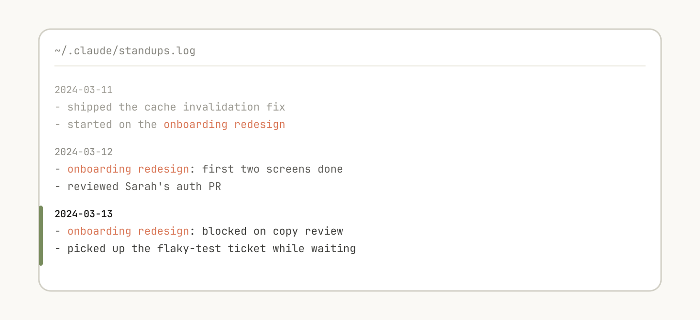

# 构建 Claude Code 的经验教训：我们如何使用技能

> 来源：Claude Blog · Anthropic
> 原文链接：[lessons-from-building-claude-code-how-we-use-skills](https://claude.com/blog/lessons-from-building-claude-code-how-we-use-skills)
> 发布日期：2026-06-03
> 译校：对照英文原文人工重译

---

我们在 Anthropic 内部构建并规模化使用数百项技能的过程中，积累了一些经验。

- [Claude Code](https://claude.com/blog/category/claude-code)

技能已经成为 Claude Code 中使用最频繁的扩展点之一。它们灵活、易于制作，也易于分发。

但这种灵活性也让人难以判断什么最好用。哪些类型的技能值得做？你该如何组织一项技能？又该在什么时候把它们分享给别人？

我们在 Anthropic 内部对技能的使用已经非常深入，数百项技能正处于活跃使用中。以下是我们关于用技能加速开发所收获的经验。

## 什么是技能？

技能是包含指令、脚本和资源的文件夹，智能体可以发现并使用它们，从而更准确、更高效地完成事情。本文假设你已熟悉技能的基础知识；如果你是新手，请从我们的 [Skilljar 上的"智能体技能入门"课程](https://anthropic.skilljar.com/introduction-to-agent-skills) 开始。

关于技能，我们常听到一个误解，认为它们"只是 Markdown 文件"。实际上它们是文件夹，可以包含智能体能够发现、探索并操作的脚本、资产、数据等。

在 Claude Code 中，技能还拥有 [多种多样的配置选项](https://code.claude.com/docs/en/skills#frontmatter-reference)，包括注册动态挂钩。

我们发现，Claude Code 中一些最有效的技能，都很好地利用了这些配置选项与文件夹结构。

## 技能类型

在 Anthropic 对内部所有技能进行分类之后，我们注意到它们聚成了九类。最好的技能能干净利落地归入其中一类；而那些试图做太多事的技能，会横跨好几类，把智能体搞糊涂。这不是一份定论性的清单，但它是一个有用的框架，可以用来识别你自己的技能库中的空白。

Claude Code 团队对我们的内部技能进行了分类，发现它们可以归入九个不同的类别。

### **1. 库与 API 参考**

这类技能解释如何正确使用某个库、CLI 或 SDK。它们既适用于内部库，也适用于 Claude Code 有时难以处理的通用库。这些技能通常包含一个参考代码片段文件夹，以及一份 Claude 在编写脚本时应避开的陷阱清单。

示例包括：

- `billing-lib` — 你的内部计费库：边界情况、易错点（footgun）等。
- `internal-platform-cli` — 你的内部 CLI 封装器的每个子命令，以及何时使用的示例。
- `sandbox-proxy` — 为开发工作配置你组织的出口网关：哪些主机可访问、如何调试"connection refused"错误、如何添加白名单条目。

### **2. 产品验证**

这类技能描述如何测试或验证你的代码是否正常工作。它们通常会与 playwright、tmux 或其他外部工具配合进行验证。

验证技能对 Claude 内部输出质量的影响最为可衡量。花一周时间把你的验证技能打磨到位，往往是值得的。

可以考虑一些技巧，比如让 Claude 录制其输出的视频，这样你就能精确看到它测试了什么；或者在每一步对状态强制做程序化断言。这些通常通过在技能中包含各种脚本来实现。

示例包括：

- `signup-flow-driver` — 在无头浏览器中跑通 注册 → 邮件验证 → 登录，并在每一步用钩子断言状态
- `checkout-verifier` — 用 Stripe 测试卡驱动结账 UI，验证发票确实落到了正确的状态
- `tmux-cli-driver` — 用于交互式 CLI 测试，即你要验证的内容需要一个 TTY 的场景

### **3. 数据获取与分析**

这类技能连接你的数据与监控技术栈。它们可能包含用凭据获取数据的库、特定的仪表盘 ID 等，以及关于常见工作流或获取数据方式的说明。

示例包括：

- `funnel-query` — "我要关联哪些事件才能看到 注册 → 激活 → 付费"，再加上真正含有规范 `user_id` 的表
- `cohort-compare` — 比较两个群组的留存或转化，标记统计上显著的差异，并链接到细分定义
- `grafana` — 数据源 UID、集群名称、问题 → 仪表盘查找表
- `datadog` — 字段引用（`@request_id` 与 `trace_id` 的区别）、服务列表、指标前缀约定

### **4. 业务流程与团队自动化**

这类技能把重复的工作流自动化成一条命令。它们通常只是相当简单的指令，但可能对其他技能或 MCP 有更复杂的依赖。对于这类技能，把先前的结果保存在日志文件中，有助于模型保持一致，并反映出工作流此前的执行情况。

示例包括：

- `standup-post` — 聚合你的工单追踪器、GitHub 活动和此前的 Slack → 格式化后的站会播报，只报增量
- `create-<ticket-system>-ticket` — 强制实施结构（合法的枚举值、必填字段），以及创建后的工作流（提醒审阅者、在 Slack 中贴链接）
- `weekly-recap` — 合并的 PR + 关闭的工单 + 部署 → 格式化的回顾帖

### **5. 代码脚手架与模板**

这类技能为代码库中某个特定功能生成框架样板。你可以把这些技能与可组合的脚本结合起来。当你的脚手架存在无法完全由代码覆盖的自然语言要求时，它们尤其有用。

示例包括：

- `new-<framework>-workflow` — 用你的注解搭建新的服务 / 工作流 / 处理器
- `new-migration` — 你的迁移文件模板，以及常见陷阱
- `create-app` — 新的内部应用，预置好你的认证、日志和部署配置

### **6. 代码质量与审查**

这类技能能强化组织内部的代码质量，并帮助审查代码。它们可以包含确定性的脚本或工具，以获得最大的稳健性。你可能希望把它们作为钩子的一部分，或在 GitHub Action 内部自动运行。

- `adversarial-review` — 生成一个以全新视角审视的子代理来进行批评、实施修复、反复迭代，直到发现的问题退化成吹毛求疵（nitpick）
- `code-style` — 强制执行代码风格，尤其是 Claude 默认情况下做得不好的那些风格
- `testing-practices` — 关于如何编写测试、该测试什么的说明

### **7. CI/CD 与部署**

这类技能帮助你在代码库中获取、推送和部署代码。它们可能会引用其他技能来收集数据。

示例包括：

- `babysit-pr` — 监控 PR → 重试不稳定的 CI → 解决合并冲突 → 启用自动合并
- `deploy-<service>` — 构建 → 冒烟测试 → 逐步放量并对比错误率 → 出现回归时自动回滚
- `cherry-pick-prod` — 隔离的工作树 →  cherry-pick → 解决冲突 → 用模板发 PR

### **8. 操作手册（Runbook）**

这类技能接收一个症状（例如 Slack 线程、告警或错误特征），经过多工具调查，产出一份结构化报告。

示例包括：

- `<service>-debugging` — 映射 症状 → 工具 → 针对你流量最高服务的查询模式
- `oncall-runner` — 获取告警 → 检查常见嫌疑点 → 格式化结果
- `log-correlator` — 给定一个请求 ID，从每个可能接触过它的系统中提取匹配的日志

### **9. 基础设施运维**

这类技能执行日常的维护和运维流程，其中一些涉及受益于护栏（guardrail）的破坏性操作。它们让工程师在关键操作中更容易遵循最佳实践。

示例包括：

- `<resource>-orphans` — 找出孤立的 pod / 卷 → 发到 Slack → 浸泡期（soak period） → 用户确认 → 级联清理
- `dependency-management` — 你组织的依赖审批工作流
- `cost-investigation` — "为什么我们的存储 / 出口账单突然飙升"，配合具体的桶和查询模式

## 制作技能的小贴士

一旦你决定了要做哪项技能，又该如何动笔？以下是 Claude Code 团队在制作技能方面的一些最佳实践、提示与技巧。

### 不要说显而易见的事

Claude 已经知道如何编码，也能读懂你的代码库。一份只是重申 Claude 默认就会做的事情的技能，增加了上下文却没有增加价值。如果你要发布的技能主要关乎知识，那就聚焦于能让 Claude 跳出常规思维的信息。

[前端设计技能](https://github.com/anthropics/skills/blob/main/skills/frontend-design/SKILL.md) 就是一个很好的例子；它由 Anthropic 的一位工程师通过与客户迭代、改进 Claude 的设计品味而构建，避开了 Inter 字体和紫色渐变这类经典套路。

### 建立一个"陷阱"小节

任何技能中信号量最高的内容，就是"陷阱（Gotchas）"小节。这些小节应当基于 Claude 在使用你的技能时遇到的常见失败点来逐步积累。理想情况下，你会随着时间推移不断更新技能，把这些陷阱捕捉进去。

例如：

" `subscriptions` 表是只追加（append-only）的。你要的那一行是版本号最高的那行，而不是 `created_at` 最新的那行。""这个字段在 API 网关中叫 `@request_id`，在计费服务中叫 `trace_id`。它们是同一个值。""即使 Stripe webhook 实际上没有处理，Staging 也会返回 200。请检查 `payment_events` 看真实状态。"

### 利用文件系统和渐进式披露

SKILL.md 文件会指向另外几个文件，Claude 可以在特定情境下参考它们。例如，如果某个作业处于待处理状态，它就应该引用 `stuck-jobs.md`。

正如我们前面所说，技能是一个文件夹，而不只是一个 Markdown 文件。你应该把整个文件系统视为一种上下文工程和渐进式披露的形式。告诉 Claude 你的技能里有哪些文件，它会在恰当的时机读取它们。

渐进式披露最简单的形式，是指向其他供 Claude 使用的 Markdown 文件。例如，你可以把详细的函数签名和使用示例拆到 `references/api.md` 里。

另一个例子：如果你的终产物是一个 markdown 文件，你可以在 `assets/` 中放一个模板文件供复制使用。

你还可以拥有 references、scripts、examples 等文件夹，这有助于 Claude 更高效地工作。

### 别把 Claude 框死

Claude 通常会努力遵循你的指令，而由于技能可重复使用，你需要小心，别在指令里写得太死板。给 Claude 它所需的信息，但也要给它适应具体情境的灵活性。

例如：

### 想清楚配置

如果配置中没有包含 Slack 频道，上面这项技能就会提示用户。

某些技能可能需要结合用户的上下文来做配置。例如，如果你正在做一项把站会播报发布到 Slack 的技能，你可能会希望 Claude 询问要发布到哪个 Slack 频道。

一个很好的做法是，把这些配置信息存进技能目录下的一个 `config.json` 文件，就像上面的示例那样。如果配置尚未设置，智能体就可以向用户询问这些信息。

如果你希望智能体呈现结构化的多选问题，可以指示 Claude 使用 AskUserQuestion 工具。

### 为模型写描述，而不是为人写描述

当 Claude Code 启动一个会话时，它会构建一份所有可用技能及其描述的清单。Claude 扫描的正是这份清单，以判断"有没有适合这个请求的技能？"这意味着 description 字段不是摘要，而是关于"何时触发该技能"的描述。

在描述里纳入技能的触发词很有帮助，比如 "babysit"（看护）。

### 帮 Claude 记住

这个文本日志文件帮助 Claude 记住过去的事件，比如审查过 Sarah 的授权 PR。

有些技能可以通过在其中存储数据，来拥有某种形式的记忆。你可以把数据存进任何简单的载体，比如只追加的文本日志文件或 JSON 文件，也可以复杂到 SQLite 数据库。

例如，一个 `standup-post` 技能可能会为它写过的每一篇播报保留一个 `standups.log`，这意味着下次你运行它时，Claude 会读取自己的历史，并知道自昨天以来发生了什么变化。

你可以使用环境变量 `${CLAUDE_PLUGIN_DATA}` 来获得一个稳定的、可以存储数据的目录，关于技能中持久化数据的更多内容，请见：[https://code.claude.com/docs/en/plugins-reference#persistent-data-directory](https://code.claude.com/docs/en/plugins-reference#persistent-data-directory)。

### 存放脚本并生成代码

你能给 Claude 的最强工具之一，就是代码。给 Claude 提供脚本和库，让它把轮次用在组合上——决定下一步做什么，而不是重建样板。

例如，在你的 `data-science` 技能里，你可能拥有一组从事件源获取数据的函数。为了让 Claude 做复杂的分析，你可以像下面这样给它一组辅助函数：

然后，Claude 可以动态生成脚本来组合这些功能，从而对"星期二发生了什么？"这样的提示词做更高级的分析。

### 使用按需挂钩

技能可以包含仅在技能被调用时才激活、且只在该会话期间持续存在的挂钩。把它用于那些你不想一直运行、但有时极其有用的、带有更强主张的挂钩。

例如：

- `/`**`careful`** — 通过 Bash 上的 PreToolUse 匹配器，拦截 `rm -rf`、`DROP TABLE`、强制推送、`kubectl delete`。只有当你明确知道自己正在触碰生产环境时才需要它——一直开着会让人发疯。
- `/`**`freeze`** — 拦截任何不在特定目录中的编辑 / 写入。在调试时很有用："我想加日志，但总是不小心'顺手修'了不相关的代码。"

## 分发技能

技能最大的好处之一，就是你可以把它们分享给团队的其他成员。

你也许想通过两种方式把技能分享给别人：

- 把你的技能签入（check in）到你的代码仓库中（位于 `./.claude/skills` 下）
- 做一个 **插件（plugin）**，并拥有一个 Claude Code 插件市场，用户可以在其中上传和安装插件（详情见 [文档](https://code.claude.com/docs/en/plugin-marketplaces)）

对于在相对较少的仓库中协作的小型团队来说，把技能签入仓库效果不错。但每签入一项技能，也会给模型的上下文增加一点负担。随着规模扩大，内部插件市场能让你分发技能，并让团队决定安装哪些，还能包含一套配置流程。

## 管理技能市场

你该如何决定哪些技能进入市场？人们又如何提交它们？

在 Anthropic，我们没有一个集中式的团队来做决定；相反，我们试图有机地发现最有用的技能。如果有人有一项技能想让别人试用，他们可以把它上传到 GitHub 里的一个沙箱文件夹，并在 Slack 或其他论坛上把人引向它。

一旦某项技能获得了关注（这由技能所有者自行判断），他们就可以提交一个 PR，把它推进市场。

## 组合技能

你可能会想要互相依赖的技能。例如，你可能有一项负责上传文件的文件上传技能，以及一项负责生成 CSV 并上传的 CSV 生成技能。这种依赖管理尚未原生内置于市场或技能中，但你可以按名称引用其他技能，模型会在它们被安装后调用它们。

## 衡量技能

为了了解技能的使用情况，我们使用一个 PreToolUse 挂钩，来记录公司内部的技能使用状况（[示例代码在此](https://gist.github.com/ThariqS/24defad423d701746e23dc19aace4de5)）。这意味着我们可以找出受欢迎的技能，或者那些与我们预期相比触发偏少的技能。

## 开始使用

技能的最佳实践仍在不断演进。我们绝大多数最好的技能，都始于寥寥几行代码和一个陷阱，然后随着 Claude 不断遇到新的边缘情况、人们持续往里补充，才变得更好。

理解技能最好的方式，就是开始动手、尝试，并看看什么对你有效。

- 看看 [我们的技能文档](https://code.claude.com/docs/en/skills)
- [寻找可供定制的示例技能](https://github.com/anthropics/skills)

*本文由 Anthropic 技术员工 Thariq Shihipar 撰写，他从事 Claude Code 的相关工作。*
