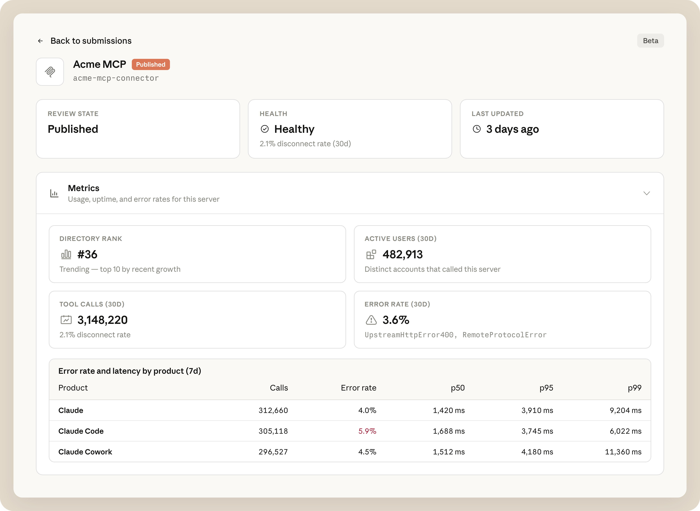

# 开发人员构建连接器的可观察性

> 来源：Claude Blog · Anthropic
> 原文链接：[observability-for-developers-building-connectors](https://claude.com/blog/observability-for-developers-building-connectors)
> 发布日期：2026-06-08
> 译校：对照英文原文人工重译

---
*开发者现在可以监控他们的连接器在 Claude 各产品上的表现，并直接在应用内将连接器提交到目录。*

## 监控、调试和改进连接器

已发布的连接器 [目录](https://claude.ai/directory/connectors) 现在提供了一个仪表盘，展示它们在 Claude 各产品界面上的表现。连接器所有者可以用它来：

- **跟踪采用情况。** 监控一段时间内的活跃用户、工具调用总数和目录排名。
- **诊断错误与延迟。** 一眼看清健康评分、错误率和延迟，并通过每个工具的错误细分来定位失败原因。
- **按产品拆解使用情况。** 对比 Claude、Claude Code、Cowork 等产品的工具调用，了解用户在哪些地方参与。

*连接器可观察性的示意图。数据仅为示意。*

今天以公开测试版形式提供。在 Claude 中，通过 [组织设置](https://claude.ai/admin-settings/organization) 下的 [目录](https://claude.ai/admin-settings/directory/submissions) 找到它。需要 Team 或 Enterprise 套餐上的管理员（Admin）或所有者（Owner）权限。在 Enterprise 上，所有者还可以通过 [自定义角色](https://support.claude.com/en/articles/13930452-manage-custom-roles-on-enterprise-plans) 委派具有目录管理或库权限的访问。

## 加入目录

连接器建立在 [模型上下文协议（MCP）](https://modelcontextprotocol.io/docs/getting-started/intro) 之上。[目录](https://claude.ai/directory/connectors) 中已有超过 300 个第三方连接器，每天有数百万人使用。如果你想把自己的 MCP 服务器提交到该目录，现在可以直接在 Claude 中完成。[了解更多](https://claude.com/docs/connectors/building/submission)。
