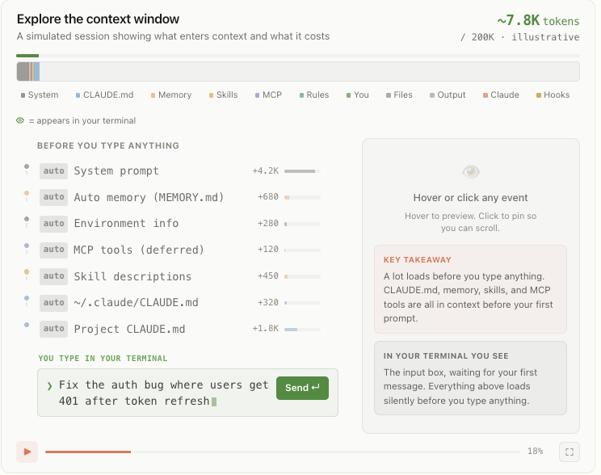

# 转向 Claude Code：何时使用 Claude.md、技能、挂钩和子代理

> 来源：Claude Blog · Anthropic
> 原文链接：[steering-claude-code-skills-hooks-rules-subagents-and-more](https://claude.com/blog/steering-claude-code-skills-hooks-rules-subagents-and-more)
> 发布日期：2026-06-18
> 译校：对照英文原文人工重译

---

Claude 的设计理念是顺应你的工作方式，而在 Claude Code 中，你可以对它进行定制。

有七种方法可以指示 Claude 的行为：CLAUDE.md 文件、规则、[**技能**](https://code.claude.com/docs/en/skills)、[**子代理**](https://code.claude.com/docs/en/sub-agents)、[**挂钩**](https://code.claude.com/docs/en/hooks-guide)、输出样式，以及追加系统提示词。

每种方法都控制着：

- 指令何时加载进上下文；
- 它能否在长会话中持久存在（压缩行为）；以及
- 它承载多少权威性。

下表快速总结了每种方法的关键差异，而本文还会提供更详细的说明，以及一个用于判断你的每条 Claude 指令该放在哪里的决策框架。

| 方法 | 加载时机 | 压缩行为 | 上下文成本 | 何时使用 |
| --- | --- | --- | --- | --- |
| CLAUDE.md（根目录） | 会话启动时加载；在整个会话期间保留在上下文中 | 记忆化。读取一次并缓存到本次会话；压缩后缓存清空并重新读取 | 高。每一行都会消耗 token，无论是否相关 | 构建命令、目录布局、monorepo 结构、编码约定、团队规范 |
| CLAUDE.md（子目录） | 按需加载，当 Claude 读取该子目录下的文件时 | 在再次触及该子目录之前一直丢失 | 低。仅在正在处理相关子目录时消耗上下文 | 特定于某个子目录的约定 |
| 规则 | 会话启动时（用户级规则），或仅当匹配的文件被触及（路径范围）时 | 压缩时重新注入 | 中。除非限定了路径范围，否则始终开启 | 特定的约束或约定（例如，所有 API 处理器都必须用 Zod 校验输入） |
| 技能 | 名称和描述在会话启动时加载；完整正文在技能被调用时加载 | 被调用的技能会重新注入，直到达到一个共享预算；最旧的先被丢弃 | 低。完整正文仅在被调用时加载；受跨所有被调用技能的共享 token 预算约束 | 程序性工作流（部署或发布清单） |
| 子代理 | 名称、描述和工具列表在会话启动时加载；正文仅在通过 Agent 工具调用时加载 | 只有最终消息（摘要加元数据）返回主会话 | 低。在调用之前对主上下文零成本；运行在自身独立的上下文窗口中 | 并行运行工作，或应当隔离运行、只返回摘要的副任务（深度搜索、日志分析、依赖审计） |
| 挂钩 | 在生命周期事件上触发 | 完全绕过压缩 | 低。配置位于主上下文之外；部分输出可能会返回（例如阻塞错误） | 确定性自动化：运行 linter、完成时发到 Slack、阻止命令、在 PreCompact 时备份聊天记录 |
| 输出样式 | 会话启动时加载；注入系统提示词 | 永不压缩 | 高。占据上下文窗口，但会覆盖默认系统提示词 | 显著的角色变更（从代码助手变为通用助手） |
| 追加系统提示词 | 会话启动时加载；作为 CLI 标志传入 | 永不压缩；仅适用于该次调用 | 中。在会话中首次请求后被缓存 | 语气、回复长度、格式偏好 |

## 提供指令的七种方法

有七种方式可以定制 Claude Code 的行为：用 CLAUDE.md 文件提供始终在线的项目上下文，用规则设定硬性约束，用技能封装可复用的流程，用子代理委派工作，用挂钩实现确定性自动化，用输出样式或系统提示词追加来做全局变更。

每种方法都在上下文成本与权威性之间做权衡。这些方法影响的是 Claude 的行为，而另外两个独立的"旋钮"——[你选择的模型和努力程度](https://claude.com/blog/claude-model-and-effort-level-in-claude-code)——控制的则是它有多强、有多卖力。

### CLAUDE.md 文件

CLAUDE.md 是你项目根目录下的一个 Markdown 文件。它在会话启动时加载进上下文，并在整个会话期间一直驻留。

构建命令、目录布局、monorepo 结构、编码约定和团队规范，都天然适合放在这里。

它有两种类型，加载方式不同：

- **始终加载**：第一种是根目录的 CLAUDE.md 文件，要么位于共享仓库中，要么/并且为你的个人偏好（针对特定项目）保存在本地。所有这些文件都在会话启动时加载，并且在长会话中不会丢失或被削弱。当 Claude Code 压缩对话时，会重新读取这些文件。
- **按需加载**：位于你初始化会话的文件夹之下的子目录中的 CLAUDE.md 文件。例如，`app/api/CLAUDE.md` 只在 Claude 读取 `app/api` 下的文件时才加载，而不是在会话启动时。它与路径范围的规则共享同样的压缩行为：在被再次触及之前一直不在上下文中。

当前工作目录（cwd）之下所有子目录的 CLAUDE.md 文件，都会在 Claude 读取该目录内的文件时加载。

在共享仓库中，CLAUDE.md 会像任何无人认领的配置文件一样不断膨胀：每个团队都往里追加自己的指令，却没人删除任何内容。这个成本会随着规模复利式增长。

对于在仓库中工作的每一位工程师、每一次会话，文件的每一行都会被加载，无论是否与他们手头的任务相关。这会消耗 token，并稀释对真正重要的那些指令的遵循度。随着文件增长，应当把团队特定的约定推进到路径范围的规则中，把流程推进到技能中——它们只在相关时才加载。

**提示：** 把 CLAUDE.md 控制在 200 行以内，给它指定一个负责人，并像对待代码一样审查对它的改动。内容本身应遵循与任何提示词相同的原则：[写出有效的提示词](https://claude.com/blog/best-practices-for-prompt-engineering) 意味着要具体明确、解释约束背后的原因，并给出示例。

把这份文件看作让 Claude 概览你的代码库，或者当作一个索引——指向那些 Claude 在需要时可以进一步查找更多信息的地方。

在 monorepo 中，给每个团队的目录配上自己的子目录 CLAUDE.md，这样各团队只会加载自己的约定；开发者还可以用 `claudeMdExcludes` 设置，跳过那些自己从不接触其代码的团队的配置文件。

对于必须适用于组织内每一个仓库的标准——安全策略、合规要求——可以通过 MDM 或配置管理，把集中管理的 CLAUDE.md 部署到开发者的机器上，而且它无法被个人设置排除。

关于搭建 CLAUDE.md 的更多内容，见我们的博客文章 [《CLAUDE.md 文件：为你的代码库定制 Claude Code》](https://claude.com/blog/using-claude-md-files)。

### 规则

[**规则**](https://code.claude.com/docs/en/memory#organize-rules-with-claude/rules/) 是 `.claude/rules/` 目录下的 Markdown 文件，用于给 Claude 特定的约束或约定。

无范围的规则表现得像 CLAUDE.md：它们总是在会话启动时加载，并在压缩时重新注入。即使加载的上下文与手头任务无关，这也会浪费 token。

路径范围的规则允许你通过添加一个控制加载时机的 `paths` 字段，只在相关时才加载规则指令。

例如：一条范围限定为 `src/api/**` 的规则，在纯文档会话期间不会进入上下文。它只会在 Claude 读取 `src/api/` 目录中的文件时才被加载。

它看起来是这样的：

```yaml
---
paths:
  - "src/api/**"
  - "**/*.handler.ts"
---
All API handlers must validate input with Zod before processing.
```

**提示**：文件级别的约束，例如"迁移只能追加（append-only）"，最适合作为 **规则** 放在你的 `paths:` frontmatter 中。当一条指令涉及的是横切关注点，或是出现在代码库多个（但不是全部）角落的文件时，比起嵌套的 CLAUDE.md 文件，更应优先选择路径范围的规则。

### 技能

[**技能**](https://code.claude.com/docs/en/skills) 位于 `.claude/skills/` 目录下，是包含指令、脚本和资源的文件夹，由 Claude 动态加载。每个技能都有一个 `SKILL.md` 文件，包含名称、描述和正文。

只有名称和描述在会话启动时加载；完整正文在 Claude 通过斜杠命令（/code-review）或自动匹配任务来调用该技能时才会加载。


技能通过你的系统提示词触发。

例如，`/code-review` 是一项内置技能，它会审查你当前的 diff 并报告发现，而不编辑文件。该技能定义了"剧本"，因此 Claude 每次调用它时都遵循同样结构化的方法。

在压缩时，Claude Code 会重新注入被调用过的技能，直至所有被调用技能的总预算。如果你在一次会话中调用了许多技能，那么最早期的技能会最先被丢弃。

**提示：** 程序性的指令——例如部署工作流、发布清单或审查流程——属于技能，而不是 CLAUDE.md。

Claude Code 自带技能，但你也可以编写自己的自定义技能。我们的 [《Claude 技能构建完整指南》](https://claude.com/blog/complete-guide-to-building-skills-for-claude) 会告诉你怎么做。

### 子代理

[**子代理**](https://code.claude.com/docs/en/sub-agents) 是 `.claude/agents/` 目录下的 Markdown 文件，为特定的副任务定义独立的助手。每个文件都使用 YAML frontmatter（名称、描述，以及可选的模型和工具访问字段），后跟成为该子代理系统提示词的正文。

子代理与技能相似：名称、描述和工具列表在会话启动时加载，但代理正文里更大的上下文不会自动调用。Claude 通过 Agent 工具调用它们，并传入一个提示词字符串。



Claude Code 的上下文窗口包含了 Claude 对你的会话所知的一切。这个 [交互式时间轴](https://code.claude.com/docs/en/context-window) 会带你了解什么被加载、何时加载。

子代理正文里更大的指导性上下文，不仅不会自动调用，而且根本不会进入父会话。

随后，子代理在它自己全新的上下文窗口中运行，返回主会话的唯一内容是子代理的最终消息（通常是许多子任务的聚合结果）加上元数据。

这种模式具有可扩展性：子代理最多可以嵌套五层深度，而 [动态工作流](https://claude.com/blog/a-harness-for-every-task-dynamic-workflows-in-claude-code) 可以编排数十到数百个后台智能体，无需你指定子代理架构的每一个细节。编排计划和中间结果存在于脚本变量中，而不是存在于 Claude 的上下文窗口里，这能够实现扩展，又不损失指令保真度。

**提示：** 这种隔离正是人们往往选择子代理而非技能的主要原因之一。当诸如深度搜索、日志分析遍历或依赖审计之类的副任务，会用你不会再引用的中间结果把主对话搅得混乱时，请使用子代理。当你希望流程在主线程内展开、以便你能查看并引导每一步时，请使用技能。

### 挂钩

[**挂钩**](https://code.claude.com/docs/en/hooks-guide) 是用户定义的命令、HTTP 端点或 LLM 提示词，通过在 [Claude 生命周期中的特定事件](https://code.claude.com/docs/en/hooks#hook-lifecycle)（如文件编辑、工具调用或会话启动）上触发，对 Claude 的行为提供更确定性的控制。


当挂钩可以触发时，Claude Code 会话中的事件映射。

你在 `settings.json`、托管策略设置，或技能 / 智能体 frontmatter 中注册挂钩。

挂钩有多种类型：command、HTTP、mcp_tool、prompt 和 agent。所有挂钩都是确定性触发的。前三种是确定性执行的，而后两种（prompt 和 agent）使用 Claude 的判断，而非一套规则，来决定输出。

挂钩的上下文成本较低，因为配置或指令位于主上下文窗口之外。线束（harness）运行处理程序（command、http、mcp_tool），或根据挂钩类型使用独立的窗口（prompt、agent）进行模型调用。

某些挂钩可能会把输出保存到主上下文窗口中。例如，阻塞挂钩的标准错误（stderr）会保存在上下文里，这样 Claude 才知道调用为何被拒绝。

但大多数挂钩不会把输出保存到主窗口，除非配置显式返回它。如果你在压缩之前用 `PreCompact` 事件把聊天记录备份到另一个文件以供日后参考，Claude 并不知道是哪个文件保存了聊天记录。

这使得这些挂钩类型与 CLAUDE.md、规则和技能有着根本的不同。你可以在我们的文章 [**《如何配置挂钩》**](https://claude.com/blog/how-to-configure-hooks) 中了解更多。

**提示：** 把挂钩用于任何应当确定性发生的事情：编辑后运行 linter、完成后发布到 Slack，或在执行之前阻止特定命令。一个 `PreToolUse` 挂钩可以检查任何工具调用，并以退出码 2 来拒绝它。

它们的上下文成本较低，因为它们是由线束运行的代码，而不是加载进上下文的 Claude 指令。技能和挂钩也是构建 [智能体循环](https://claude.com/blog/getting-started-with-loops) 的基石——即重复运行、直至满足停止条件的工作流。

### 输出样式

[**输出样式**](https://code.claude.com/docs/en/output-styles) 是 `.claude/output-styles/` 目录下的文件，将指令注入系统提示词。它们永不会被压缩，在每次会话启动时加载，并在会话中首次请求之后被缓存，这意味着它们的上下文成本适中。

因为它们位于系统提示词中，输出样式在我们迄今介绍的所有方法中，拥有最高的指令遵循权重，因此应当审慎使用。

**对输出样式的更改将替换默认输出样式**（除非你在样式的 frontmatter 中设置 `keep-coding-instructions: true`）。

在 Claude Code 中，这会移除那些告诉 Claude 它正在帮助用户完成软件工程任务的指令，并包含其他关键的默认指令，例如：

- 如何确定变更范围；
- 何时添加或省略代码注释；
- 对于安全问题该怎么办；以及
- 验证习惯，例如在宣布工作完成之前运行测试。

默认情况下，自定义输出样式会放弃所有这些，使 Claude Code 更像一个通用助手，而不是软件工程师助手。

**提示**：在编写自定义输出样式之前，请先查看内置样式。**Proactive**、**Explanatory** 和 **Learning** 覆盖了最常见的需求（自主性、教学模式、协作编码），而你无需维护样式文件。

### 追加系统提示词

修改输出样式的另一种方式是 `append-system-prompt` 标志。修改输出样式文件可能会对 Claude 的行为产生较大、且出乎意料的更改，而追加标志只对原始系统提示词做"加法"。它不会修改 Claude 的角色；它只是向其默认角色添加指令。

它也在调用时传入，并且只适用于那一次调用，而不是作为文件跨会话持久保存。

与其他传递指令的方法相比，追加系统提示词可能有更高的上下文成本。它会增加输入 token，尽管提示词缓存在会话中首次请求之后会降低这一成本。指示 Claude 使用更详细或更长的样式，也会增加输出 token。

**提示：** 追加系统提示词最适合添加特定的编码标准、输出格式或特定领域的知识。请记住，追加系统提示词在遵循度上存在递减回报。一般来说，你用这种方法提供的指令越多，Claude 遵循它们的严格程度就越低，尤其是在存在任何矛盾的情况下。

## 何时使用每种方法

如果你发现自己正在做以下事情之一，或许应考虑把指令放到别处：

**在 CLAUDE.md 里写"每次 X，总是做 Y"。** 如果行为应当可靠地发生，例如每次编辑后运行 prettier，或完成后发布到 Slack，请改用 `settings.json` 里的挂钩。模型"选择"去运行格式化程序，与格式化程序自动运行，是两回事。

**在 CLAUDE.md 里写"绝不要这样做"。** 当某些事情绝对不能发生时，指令是错误的工具。Claude 在大多数情况下都会遵循指令，但在压力下、长会话中或模糊情境下，或者由于作为任务一部分被访问的文件里存在提示词注入，模型都可能无法遵循被提示的规则。真正的护栏必须是确定性的，执行方法是 [挂钩](https://code.claude.com/docs/en/hooks) 和 [权限](https://code.claude.com/docs/en/permissions)。一个 `PreToolUse` 挂钩可以检查调用，并以退出码 2 退出以阻止它。[**托管设置**](https://code.claude.com/docs/en/settings#managed-settings) 更进一步：它们由管理员部署，无法被用户的本地配置覆盖，并且是强制实施确定性的、组织范围的护栏的唯一方法。

**在 CLAUDE.md 里放一段 30 行的流程。** 流程属于技能。CLAUDE.md 用于 Claude 应当始终牢记的事实：构建命令、monorepo 布局、团队约定。部署运行手册或安全审查清单应当放在 `.claude/skills/` 中，其中的正文只在被调用时加载。

**没有路径范围的 API 特定规则。** 如果一条规则只适用于 `src/api/**`，用 `paths:` 限定其范围，能让它在无关的工作中脱离上下文。无范围的规则在机制上与把内容放进 CLAUDE.md 完全相同：总是加载，总是消耗 token。

**把个人偏好写进项目级 CLAUDE.md 文件。** 所有基于文件的方法，都会为每一次 Claude Code 会话加载一个用户级对应项，无论你身处哪个仓库。把本地文件用于个人偏好（总是使用语义化提交消息）。把项目级文件保留给那些团队范围、但特定于某个代码库的偏好。

## Claude Code 定制入门

你可以在我们的 [Claude Code 最佳实践](https://code.claude.com/docs/en/best-practices#write-an-effective-claude-md) 文档中，找到更多关于充分发挥 Claude Code 的诀窍与模式——从配置环境，到跨并行会话扩展。

一旦你有其中几项跑通了，就可以把它们中的许多（技能、子代理、挂钩、输出样式）打包为一个 [插件](https://code.claude.com/docs/en/plugins)，以便在团队成员或项目之间共享一致的设置。

*本文由 Anthropic 员工 Michael Segner 撰写。*
