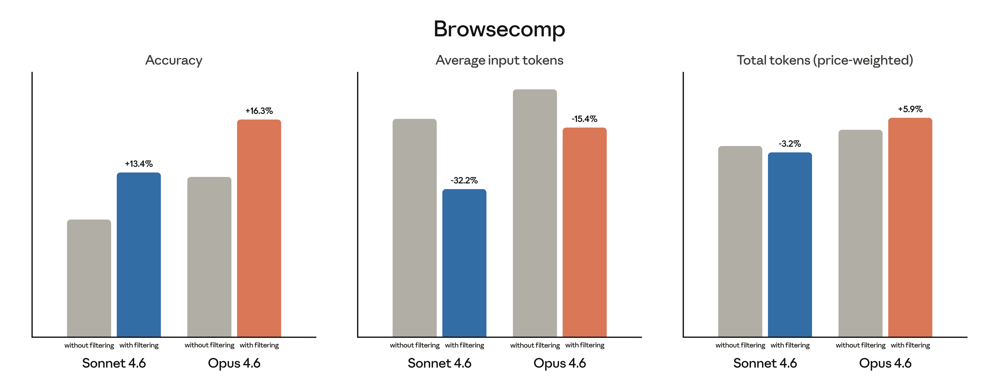
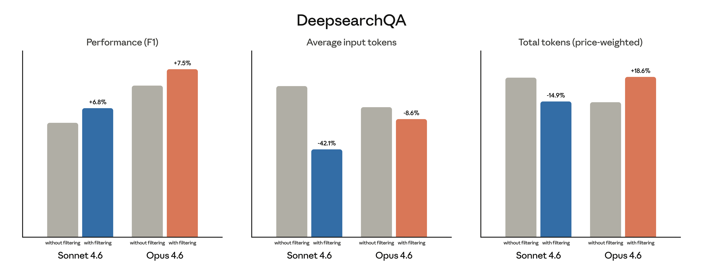

# 通过动态过滤提高网络搜索的准确性和效率

> 来源：Claude Blog · Anthropic
> 原文链接：[improved-web-search-with-dynamic-filtering](https://claude.com/blog/improved-web-search-with-dynamic-filtering)
> 发布日期：2026-02-17
> 译校：对照英文原文人工重译

---

继 [Claude Opus 4.6](https://www.anthropic.com/news/claude-opus-4-6) 和 [Sonnet 4.6](https://www.anthropic.com/news/claude-sonnet-4-6) 之后，我们正在发布新版本的[网络搜索](https://platform.claude.com/docs/en/agents-and-tools/tool-use/web-search-tool)和[网络获取](https://platform.claude.com/docs/en/agents-and-tools/tool-use/web-fetch-tool)工具。Claude 现在可以在网络搜索过程中原生编写并执行代码，从而在结果进入上下文窗口之前对其进行过滤，提升响应的准确性与令牌效率。

## **具有动态过滤的网络搜索**

网络搜索是一项高度消耗令牌的任务。使用基础网络搜索工具的智能体需要发起查询、将搜索结果拉入上下文、从多个网站抓取完整的 HTML 文件，并在给出回复前对这一切进行推理。但从搜索中拉入的上下文往往与任务无关，这会降低回复的质量。

为了提升 Claude 在网络搜索上的表现，我们的网络搜索和网络获取工具现在会自动编写并执行代码，对查询结果进行后处理。Claude 无需再对完整的 HTML 文件进行推理，而是可以在将搜索结果加载进上下文之前对其进行动态过滤，只保留相关的内容，丢弃其余部分。

我们[此前已经发现](https://www.anthropic.com/engineering/advanced-tool-use)，这项技术在其他智能体式工作流中同样有效，并且我们已经为 API 加入了原生支持，例如[代码执行](http://docs.anthropic.com/en/docs/agents-and-tools/tool-use/code-execution-tool)和[程序化工具调用](https://platform.claude.com/docs/en/agents-and-tools/tool-use/programmatic-tool-calling)。现在我们正把同样的技术引入网络搜索和网络获取。

## **评估 Claude 的网络搜索能力**

我们在仅启用网络搜索、不启用其他工具的情况下，分别评估了 Sonnet 4.6 和 Opus 4.6 在开启与关闭动态过滤时的表现。在两个基准测试——[BrowseComp](https://cdn.openai.com/pdf/5e10f4ab-d6f7-442e-9508-59515c65e35d/browsecomp.pdf) 和 [DeepsearchQA](https://storage.googleapis.com/deepmind-media/DeepSearchQA/DeepSearchQA_benchmark_paper.pdf)——上，动态过滤平均将性能提升了 11%，同时将输入令牌减少了 24%。

**BrowseComp：搜索网络以找到一个答案**

BrowseComp 测试智能体能否浏览大量网站，找到一条刻意被隐藏、难以在网络上查到的特定信息。动态过滤显著提升了 Claude 的准确率：Sonnet 4.6 从 33.3% 提升到 46.6%，Opus 4.6 从 45.3% 提升到 61.6%。



**DeepsearchQA：搜索网络以找到许多答案**

DeepsearchQA 会向智能体提出包含多个正确答案的研究型查询，且所有答案都必须通过网络搜索找到。它测试智能体能否系统地规划并执行多步搜索而不遗漏任何答案。它使用“F1 分数”来衡量，该分数在精确率与召回率之间取得平衡——既捕捉返回答案的准确性，也捕捉搜索的完整性。

动态过滤将 Sonnet 4.6 的 F1 分数从 52.6% 提升到 59.4%，将 Opus 4.6 的 F1 分数从 69.8% 提升到 77.3%。



令牌成本会因模型需要编写多少代码来过滤上下文而有所不同。在两个基准上，Sonnet 4.6 的价格加权令牌有所下降，但 Opus 4.6 的价格加权令牌有所上升。要更好地了解你自己的成本，我们建议用你的智能体在生产环境中可能遇到的一组有代表性的网络搜索查询来评估该工具。

## 客户聚焦：Quora

[Poe](https://poe.com)（由 [Quora](https://quora.com) 推出）是最大的多模型 AI 平台之一，让数百万用户可以通过单一界面访问超过 200 个模型。Quora 的内部团队发现，开启动态过滤的 Opus 4.6“在与其他前沿模型的内部评估对比中实现了最高的准确率”，产品与研究负责人 Gareth Jones 表示。“模型的行为就像一个真正的研究人员，编写 Python 来解析、过滤和交叉引用结果，而不是在上下文中对原始 HTML 进行推理。”

## 网络搜索与网络获取工具中的动态过滤

在使用我们的新网络搜索和网络获取工具配合 Sonnet 4.6 和 Opus 4.6 时，动态过滤在 Claude API 上默认开启。对于复杂的网络搜索查询，例如筛选技术文档或核验引文，你可以期待获得与上述类似的性能提升。

以下是在 API 中使用它的方式：

```javascript
{
  "model": "claude-opus-4-6",
  "max_tokens": 4096,
  "tools": [
    {
      "type": "web_search_20260209",
      "name": "web_search"
    },
    {
      "type": "web_fetch_20260209",
      "name": "web_fetch"
    }
  ],
  "messages": [
    {
      "role": "user",
      "content": "Search for the current prices of AAPL and GOOGL, then calculate which has a better P/E ratio."
    }
  ]
}
```

## 代码执行、记忆与更多工具现已正式可用

我们还让多个工具转为正式可用（GA），以帮助智能体在消耗令牌的任务中表现得更好：

- [代码执行](http://docs.anthropic.com/en/docs/agents-and-tools/tool-use/code-execution-tool)：为智能体提供沙箱环境，使其在对话过程中可以运行代码来过滤上下文、分析数据或执行计算。
- [记忆](https://platform.claude.com/docs/en/agents-and-tools/tool-use/memory-tool)：通过持久化的文件目录跨对话存储和检索信息，使智能体能够保留上下文，而无需把所有内容都放在上下文窗口中。
- [程序化工具调用](https://platform.claude.com/docs/en/agents-and-tools/tool-use/programmatic-tool-calling)：在代码中执行复杂的多工具工作流，将中间结果保留在上下文窗口之外。
- [工具搜索](https://platform.claude.com/docs/en/agents-and-tools/tool-use/tool-search-tool)：从大型工具库中动态发现工具，而无需把所有工具定义都加载进上下文窗口。
- [工具使用示例](https://platform.claude.com/docs/en/agents-and-tools/tool-use/implement-tool-use#providing-tool-use-examples)：直接在工具定义中提供示例性的工具调用，以演示使用模式并减少参数错误。

改进后的网络搜索和网络获取，以及代码执行、记忆、程序化工具调用、工具搜索和工具使用示例，现已在 Claude Platform 上可用。阅读我们的 [API 文档](https://platform.claude.com/docs/en/build-with-claude/overview) 即可开始使用。
