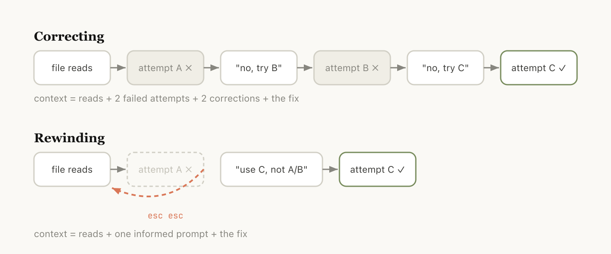

# 使用 Claude Code：会话管理与 1M 上下文

> 来源：Claude Blog · Anthropic
> 原文链接：[using-claude-code-session-management-and-1m-context](https://claude.com/blog/using-claude-code-session-management-and-1m-context)
> 发布日期：2026-04-15 · 作者：Thariq Shihipar
> 译校：对照英文原文人工重译

---

我们发布了 **`/usage`**，一个新的斜杠命令，帮助你了解自己在 Claude Code 中的用量情况。这个功能的灵感来自我们与客户的多场对话。

在这些对话中反复浮现的一个问题是：用户管理会话的方式差异极大，尤其是我们最近为 Claude Code 更新了 100 万令牌的上下文之后。

你是只在终端里保持打开一个会话，还是开两个？你会不会每条提示词都开一个新会话？你什么时候使用[压缩](https://platform.claude.com/docs/en/build-with-claude/compaction)、倒带或[子代理](https://code.claude.com/docs/en/sub-agents)？又是什么导致一次糟糕的压缩或糟糕的会话？

这里有许多出人意料的细节，能真正影响你使用 [Claude Code](https://claude.com/product/claude-code) 的体验，而几乎所有要点都来自[管理你的上下文窗口](https://code.claude.com/docs/en/how-claude-code-works)。

## **关于上下文、压缩与上下文腐烂的快速入门**

上下文窗口是模型在生成下一条回复时“一眼能看到”的全部内容。它包括你的系统提示词、到目前为止的对话、每一次工具调用及其输出，以及已读取的每个文件。Claude Code 拥有 100 万令牌的上下文窗口。

遗憾的是，使用上下文会对性能产生轻微影响，这通常被称为上下文腐烂（context rot）。上下文腐烂是指：随着上下文增长，模型性能会下降，因为注意力被分散到更多的令牌上，而较早的、不相关的内容开始干扰当前的任务。

上下文窗口是一道硬上限，因此当你接近上下文窗口的末尾时，你正在处理的任务会被自动总结成一段更短的描述，模型则在一个新的上下文窗口中继续工作。我们称之为压缩（compaction）。你也可以自己手动触发压缩。

## **每个回合都是一个分支点**

假设你刚刚让 Claude 做了某件事并且它已经完成——现在上下文里已经有了一些信息（工具调用、工具输出、你的指令），而接下来你其实有数量惊人的选择：

- **继续**——在同一个会话中再发送一条消息
- **`/rewind`（Esc Esc）**——跳回到上一条消息，并从那里重新尝试
- **`/clear`**——开启一个新会话，通常会附带你从刚才所学内容中提炼出的一份简要说明
- **压缩**——总结到目前为止的会话，并基于这份总结继续推进
- **子代理**——把下一段工作委派给一个拥有自己干净上下文的智能体，只把它的结果拉回来

虽然最自然的做法就是继续，但另外四个选项的存在是为了帮你管理上下文。

## **何时开始新会话**

什么时候该保留一个长时间运行的会话，什么时候又该开新会话？我们的一般经验法则是：当你开始一项新任务时，也应该开启一个新会话。

虽然 1M 上下文窗口意味着你现在可以更可靠地完成更长的任务（例如从零开始构建一个全栈应用），但上下文腐烂仍可能发生。

有时你会做一些相关的任务，其中部分上下文仍然必要，但并非总是如此。例如，为你刚实现的功能编写文档。虽然你可以开一个新会话，但 Claude 必须重新读取你刚刚实现的那些文件，这会更慢也更昂贵。

## **倒带而非纠正**

在 Claude Code 中，双击 Esc（或运行 `/rewind`）可以让你跳回任意一条先前的消息，并从那里重新输入提示词。该点之后的消息会从上下文中被丢弃。

倒带通常是一种更好的纠正方式。例如，Claude 读取了五个文件，尝试了一种方法，但不奏效。你的直觉可能是输入“这不起作用，试试 X”。但更好的做法或许是倒回到文件读取刚完成之后，并用你学到的内容重新提示词：“别用方案 A，foo 模块没有暴露那个接口——直接用 B。”

你也可以使用*“从这里总结”*或 `/rewind` 这个斜杠命令，让 Claude 总结它学到的内容并创建一条交接消息，有点像 Claude 未来的自己写给上一轮迭代（尝试了某种方法却失败了）的一条信息。

## **压缩与启动全新会话**

一旦会话变长，你有两种方式可以甩掉无关的上下文：`/compact` 或 `/clear`（然后重新开始）。它们感觉相似，但行为截然不同。

**压缩** 要求模型总结到目前为止的对话，然后用这份总结替换历史记录。它是有损的，但你无需自己写任何内容，而且 Claude 在纳入重要的学习成果或文件时可能会更周全。你也可以通过传入指令来引导它（`/compact focus on the auth refactor, drop the test debugging`）。

使用 `/clear` 时，**你**来写下重要的事项（“我们正在重构身份验证中间件，约束条件是 X，重要的文件是 A 和 B，我们已经排除方案 Y”），然后干净利落地重新开始。这更费力，但得到的上下文正是你认为相关的内容。

## **是什么导致自动压缩出错？**

如果你运行过很多长时间会话，可能注意到某些时候压缩会特别糟糕。在这种情况下，我们经常发现：当模型无法预测你工作的走向时，就可能出现糟糕的压缩。

在上面的例子中，自动压缩在一段漫长的调试会话之后被触发，并总结了调查过程，而你的下一条消息却是“现在去修复我们在 bar.ts 里看到的那条其他警告”。

但由于会话的重点一直在调试上，那条“其他警告”可能已经从总结中被删去了。

这一点尤其棘手，因为受到上下文腐烂的影响，模型在压缩时正处于它最不聪明的时刻。有了 100 万上下文，你就有更充裕的时间主动用 `/compact` 描述你想做什么。

## **子代理与全新的上下文窗口**

[子代理](https://claude.com/blog/subagents-in-claude-code) 在你提前知道一大块工作会产生大量、且你不再需要的中间输出时，往往表现很好。

当 Claude 通过任务工具（Agent 工具）生成一个子代理时，该子代理会获得属于自己的全新上下文窗口。它可以根据需要完成任意多的工作，然后综合其结果，只有最终的报告会返回给父级。

我们在 Anthropic 内部使用的判断标准是：*我还需要再次用到这个工具输出，还是只需要结论？*

虽然 Claude Code 会自动调用子代理，但你可能希望显式地告诉它这样做。例如，你也许想让它：

- “启动一个子代理，根据下面的规范文件核验这项工作的结果”
- “分拆一个子代理，去通读另一个代码库并总结它是如何实现身份验证流程的，然后你用同样的方式自己实现一遍”
- “分拆一个子代理，根据我的 git 改动为这个功能编写文档”

**把它们放在一起**

为了帮你选择该使用哪种上下文管理功能，我们整理了一张实用的表格，概述了常见场景、该使用什么工具，以及原因。

| 场景 | 可以考虑使用 | 原因 |
| --- | --- | --- |
| 相同任务，上下文仍然相关 | 继续 | 窗口里的一切仍然在用；不必花钱重建它。 |
| Claude 走错了方向 | 倒带（`double-Esc`） | 保留有用的文件读取，丢弃失败的尝试，用你学到的内容重新提示词。 |
| 任务进行中，但会话因过时的调试/探索而变得臃肿 | `/compact <提示>` | 省力；由 Claude 决定什么重要。需要时用指令引导它。 |
| 开始一项真正全新的任务 | `/clear` | 零腐烂；你能精确控制接下来保留什么。 |
| 下一步会产生大量输出，而你只需要其中的结论（代码库搜索、核验、写文档） | 子代理 | 中间的工具噪声留在子代理的上下文里；只有结果返回。 |

我们期待看到你构建出的成果。

*今天就[开始使用 Claude Code](https://claude.com/product/claude-code)。*

***关于作者：*** *Thariq Shihipar 是 Anthropic 的技术人员，负责 Claude Code 的相关工作。*
