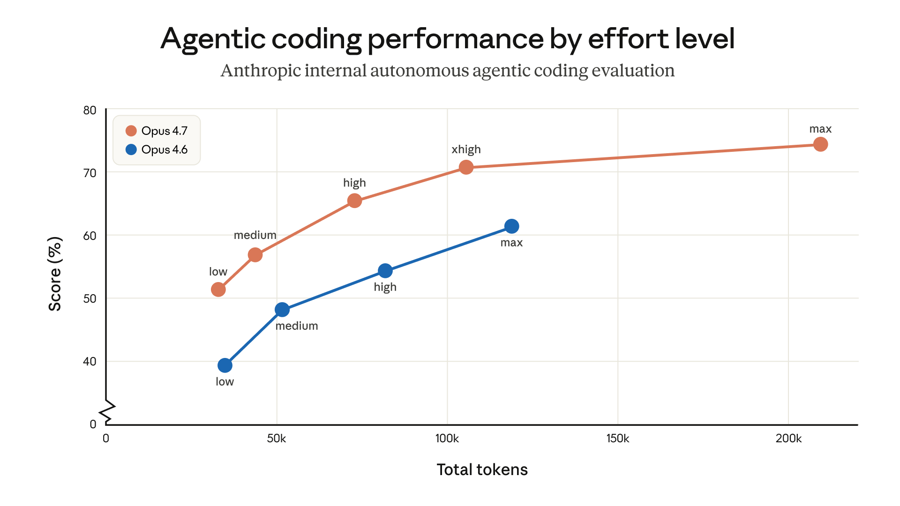

# 将 Claude Opus 4.7 与 Claude Code 结合使用的最佳实践

> 来源：Claude Blog · Anthropic
> 原文链接：[best-practices-for-using-claude-opus-4-7-with-claude-code](https://claude.com/blog/best-practices-for-using-claude-opus-4-7-with-claude-code)
> 发布日期：2026-04-16
> 译校：对照英文原文人工重译

---

[Opus 4.7](https://www.anthropic.com/news/claude-opus-4-7) 是我们迄今为止最强的通用模型，适用于编码、企业工作流以及长时间运行的智能体式任务。相比 Opus 4.6，它能更好地处理歧义，更善于发现 bug 并审查代码，更可靠地跨会话传递上下文，并且能在缺乏指引的情况下对模糊的任务进行推理。

在[发布通告](https://www.anthropic.com/news/claude-opus-4-7)中，我们指出了两点变化——更新后的分词器，以及在更高工作量级别上更倾向于多加思考的倾向（尤其是在较长会话的后续回合中）——它们会影响令牌用量。因此，当用 Opus 4.7 替换 Opus 4.6 时，可能需要做一些调优才能达到最佳性能。对提示词和线束做一些调整，就能带来很大的不同。

这篇文章将介绍有哪些变化，以及如何在 Claude Code 中最有效地使用 Opus 4.7。

## 构建交互式编码会话

Opus 4.7 的令牌用量和行为可能因部署方式而异：你部署的究竟是拥有单用户回合、更自主的异步编码智能体，还是拥有多用户回合、更具交互性的同步编码智能体。在交互式设置中，它会在用户回合之后进行更多推理：这提升了它在长会话中的连贯性、指令遵循度和编码质量，但也倾向于消耗更多令牌。

为了在 Claude Code 中最大化发挥 Opus 4.7 的能力，我们发现把它当作一位你委以重任、能力出众的工程师，比当作一位你逐行指导的结对程序员更有效：

- **在第一回合就明确指定任务。** 包含意图、约束、验收标准以及相关文件位置的清晰任务描述，能为 Opus 4.7 提供产出更强结果所需的上下文。在多轮对话中逐步传递的模糊提示词，往往会降低令牌效率，有时还会拉低整体质量。
- **减少所需的用户交互次数。** 每一次用户回合都会增加推理开销。把你的疑问批量提出，并为模型提供持续推进所需的背景信息。
- **在合适的时候使用** [**自动模式**](https://claude.com/blog/auto-mode)。对于你信任模型、无需频繁确认即可安全执行的任务，自动模式能缩短周期时间。它特别适合那些你已经预先提供完整上下文的长时间运行任务。自动模式现已面向 Claude Code Max 用户开放研究预览——你可以用 Shift+Tab 打开它。
- **为已完成的任务设置通知**。让 Claude 在任务完成时播放提示音，它可以创建基于钩子的自定义通知。

## Opus 4.7 的推荐工作量级别

Claude Code 中 Opus 4.7 的默认工作量级别现在是 `xhigh`。这是一个介于 `high` 和 `max` 之间的新工作量级别，让用户能更好地在难题上的推理与延迟之间做权衡。我们建议对大多数智能体式编码工作使用 xhigh，尤其是那些对智能敏感的任务，例如设计 API 与模式、迁移遗留代码，以及审查大型代码库。

以下是针对每个工作量级别的一些额外建议：

- **`medium` 和 `low`**：适用于成本敏感、延迟敏感或范围狭窄的工作。模型在处理更困难的任务时，能力会低于在较高工作量级别下的表现，但它仍然优于以相同工作量级别运行的 Opus 4.6（有时还能用更少的令牌）。
- **`high`**：平衡智能与成本。如果你在运行并发会话，或希望在不大幅牺牲质量的前提下减少支出，请选择 high。
- **`xhigh`（默认，推荐）**：绝大多数编码与智能体式用法的最佳设置。它具备强大的自主性与智能，又不会出现 max 在长时间智能体式运行中可能产生的失控令牌消耗。
- **`max`**：在真正困难的问题上挤出额外性能，但收益递减，且更容易过度思考。请有意地将其用于诸如在评估中测试模型的能力上限，以及对智能极度敏感、对成本不敏感的场景。

如果你要升级到新模型，我们建议尝试调整工作量级别，而不仅仅照搬旧设置。你可以在同一任务进行期间在不同工作量级别之间切换，从而更有效地管理令牌用量与推理。

我们将 Opus 4.7 的默认工作量级别设为 xhigh，是因为我们相信这是大多数编码任务的最佳设置。如果你是现有的 Claude Code 用户，但尚未手动设置工作量级别，你会自动升级到 `xhigh`。你仍然可以手动调整自己的工作量级别。

## 使用适应性思维

**Opus 4.7 不支持带有固定思维预算的扩展思维（Extended Thinking）。** 取而代之，Opus 4.7 提供的是适应性思维（adaptive thinking）。它让思考在每一步都成为*可选*的，并允许模型根据上下文自行决定何时使用更多思考。它可以对简单的查询快速响应，在某一步无法从中获益时跳过思考，并把思考令牌投入到最有可能有用的地方。在智能体式运行过程中，这能带来更快的响应和更好的用户体验。

适应性思维在这一版本中得到了实质性改进——尤其是 Opus 4.7 更不容易过度思考。

如果你想更多地控制思考的节奏，可以直接用提示词来引导：

- **如果你想要更多思考，** 试试这样写：“在回答之前仔细思考，一步步来；这个问题比看起来更难。”
- **如果你想要更少思考，** 试试这样写：“优先快速响应，而不是深入思考。有疑问时直接回答。” 你会省下令牌，但可能在更困难的步骤上损失一些准确性。

## 值得了解的行为变化

Opus 4.6 与 4.7 之间有一些默认行为发生了变化，如果你为旧版模型仔细调整过提示词或线束，就值得了解一下。

**回复长度会根据任务复杂度进行校准。** Opus 4.7 不像 Opus 4.6 那样默认啰嗦。对于简单的查找，你可以期待更短的回答；对于开放式的分析，则是更长的回答。如果你的用例依赖特定的长度或风格，请在提示词中明确说明。我们发现，你想要的语气的正面示例，比“不要这样做”这类负面指令更有效。

**模型更少调用工具，更多进行推理。** 在许多情况下这会带来更好的结果。如果你想要*更多*工具调用（例如，在智能体式工作中进行更积极的搜索或文件读取），请提供明确描述该工具应在何时、为何被使用的指引。

**它默认会生成更少的子代理。** Opus 4.7 在何时把工作委派给子代理上往往更审慎。如果你的用例能受益于并行子代理（例如跨文件或独立项目展开），我们建议把它明确写出来。例如：

不要为那些你可以在单次回复中直接完成的工作生成子代理（例如，重构一个你已经在视野中的函数）。当跨项目展开或需要读取多个文件时，在同一回合中生成多个子代理。

## 接下来要尝试什么

Opus 4.7 在长时间运行的任务上表现优于之前的模型。这使它非常适合那些以往监督会成为瓶颈的任务，例如复杂的多文件改动、含糊不清的调试、跨服务的代码审查，以及多步智能体式工作。

我们建议保持 `xhigh` 工作量级别，看看你的第一回合能带你走多远。

*在我们的 [Opus 4.7 提示词指南](https://platform.claude.com/docs/en/build-with-claude/prompt-engineering/claude-prompting-best-practices) 以及我们关于 [Claude Code 中的上下文与会话管理](https://claude.com/blog/using-claude-code-session-management-and-1m-context) 的文章中了解更多。*
