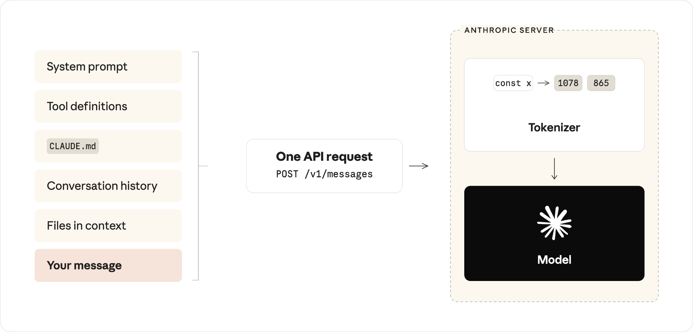
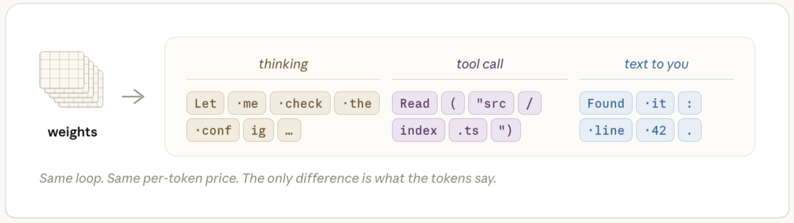

# Claude Code 中的模型选择与工作量级别

> 来源：Claude Blog · Anthropic
> 原文链接：[claude-model-and-effort-level-in-claude-code](https://claude.com/blog/claude-model-and-effort-level-in-claude-code)
> 发布日期：2026-07-07 · 作者：Lydia Hallie
> 译校：对照英文原文人工重译

---

**关键要点：**

- Claude 的模型选择决定的是那一组固定的权重，也就是模型的整体能力范围。虽然可以为模型提供上下文或对其加以引导，但模型的整体知识库与能力是预先确定的。
- 工作量级别不只是“思考时间”。它控制的是 Claude 在你的请求上整体做多少工作，包括读取的文件数、使用的工具数，以及在向你反馈之前会走多少步。
- 对更常规的任务选择较小的模型，对更复杂或模糊的任务选择较大的模型。从每个模型的默认工作量级别开始，并把它当作一种基于工作类型的通用偏好来调优，而不是逐任务决策。
- 如果 Claude 拥有所有相关上下文、明显努力尝试过，却仍然出错，那就是选择更强能力模型的信号。如果 Claude 是因为跳过了某个文件、没有运行测试，或半途放弃重构而出错，那就选择更高的工作量级别。

Claude Code 给了你两个看起来都能“让答案更好”的设置：模型设置和工作量级别。你可能会预期，像 Claude Fable 5 这样更大的模型能比 Claude Sonnet 给出更聪明的输出，而更高的工作量级别意味着 Claude 在回答之前思考得更久。

第一个假设是准确的。根据行业标准的基准测试，我们最大的模型能力更强。

但工作量级别不只是“思考时间”。工作量级别控制的是 Claude 在你的请求上整体做多少工作。这确实包括模型思考多久，但还包括：

- 它会读取多少个文件；
- 它会做多少验证；以及
- 在一个多步任务中，它在向你反馈之前会推进到什么程度。

在更高的工作量级别下，Claude 会采取更多此类行动（例如读取文件、运行测试、反复核查）之后，才会回到你这里。在更低的工作量级别下，它宁可向你要更多上下文，也不愿自己花令牌去搞清楚。

## **模型选择的工作原理**

当你按下回车键时，Claude Code 会把你的消息与系统提示词、工具定义、你的 CLAUDE.md、对话历史，以及上下文中的任何文件组合在一起。所有这些都会作为一个请求发送到 API。

Claude Code 的所有内容都被打包进一个 API 请求中。在服务器上，文本在抵达模型之前就被分词化。

不过，模型永远不会把它当作纯文本来看。服务器上发生的第一件事是**分词化（tokenization）**；文本被切分成片段，每个片段都被映射到模型训练所用的固定词表中一个整数。const 可能映射到 1978，await 可能映射到 4293。从这一刻起，你的提示词就变成了一个整数数组。

分词器将文本切分为多个片段，并将每个片段映射到固定词表中的一个整数。上排中的每个块都成为它的令牌 ID（下排）；图中所示的 ID 仅用于说明。

模型的工作是接收这个数组，并预测下一个出现的令牌。它通过为词表中的每个令牌计算一个*概率*，并从头部选取来完成这件事。在 `const x = await` 之后，训练有素的模型会给 `fetch` 很高的概率（非常可能），而给 `banana` 接近零的概率（根本不可能）。

模型的预测是它词表中每个令牌的概率。最有把握的猜测与一个无关猜测之间的差距是巨大的。

把你的输入令牌变成这些概率的，是**权重**（也称为*参数*）。它们是组织成大型矩阵的数十亿个数字。为了预测一个令牌，模型让你的输入流过这些矩阵（一长串矩阵乘法），并在最后读取概率。权重就是模型“知道”的一切所在。

**每个模型的权重都是在训练期间设定的，而当你发送请求时，它们是只读的。** 你的提示词、你的 CLAUDE.md，或你的上下文中，没有任何东西会改变它们。（如果你碰到过“推理（inference）”这个词，它全部的含义就是：训练完成后使用模型，权重是固定的。）

你的提示词输入进去，概率出来。中间的权重不会变化。

Claude 所了解的关于 TypeScript、流行框架、地道的 Go，或任何其他通用编程知识，都在训练时编码进了这些权重里。

你的提示词和上下文仍然可以*引导*预测（把你真实的代码摆在 Claude 面前就是*引导*，而且效果很好），但它们本身并不会给权重增加任何东西。

如果某个库在模型训练时还不存在，它就不在权重里。你可以把文档放进上下文，Claude 也会使用它们，但那是*引导*，而不是*教导*。Claude 的响应只会受那一次请求的影响；底层模型并没有保留这些信息。

所以，当 Claude 自信地调用一个并不存在的 API（产生幻觉）时，那是权重在生成一段*看起来*符合训练模式的令牌序列，而不是一次失败的查找。

那么，更换模型究竟做了什么？它交换的是处理你请求的**哪一组冻结的权重**。

模型不会一次性生成完整的答案。它预测一个令牌，把它追加到序列中，然后再次运行整个计算来获取下一个。一个 200 令牌的响应，就是 200 次独立的权重前向传递。这个循环就是你大部分等待时间和输出成本的来源。

序列在每一步只增长一个令牌。模型每次都会重新读取整个数组，以预测接下来会发生什么。

所以，**模型设置**决定*哪组权重*来处理你的请求，它还决定了每个输出令牌的成本。

它并不决定会生成多少令牌。对于相同的提示词，这个数字可能因 Claude 决定做多少工作而有很大差异。

这正是**工作量级别**所控制的：Claude 决定为每个回合做*多少工作*。

## **Claude Code 的工作量级别如何运作**

当 Claude Code 执行任务时，它生成的令牌分为以下几类：

- **思考**：你在动作之前和之间看到的推理。
- **工具调用**：命名某个工具（如 Read 或 Edit）及其参数的结构化块，然后由 Claude Code 解析并执行。
- **给你的文本**：计划、进度更新，以及最后的总结。

这些都是来自同一个循环的普通输出令牌，以相同的费率计费。例如，思考令牌的生成方式与其他输出令牌完全相同，并且在那一回合的剩余时间里都留在上下文中。

当 Claude 继续编写代码时，它更早的推理就像它读取过的文件一样，成为输入的一部分。

Claude 的所有输出都是令牌。思考、工具调用和给你的文本都来自同一个循环。

工作量级别是如何改变这一切的？工作量级别作为请求的一部分，与你的提示词一起被发送给模型。模型经过训练，理解在每个工作量级别下该如何表现，而那种学到的行为被烘焙进了冻结的权重里。

当你的请求抵达时，工作量级别是模型要响应的又一个输入，就像它响应你的提示词文本一样。这为 Claude 的行为设定了基调：在认为任务完成之前，它需要做到多彻底、多确定。

**这在每个回合都会被考量**，并导致生成更多令牌，以产出更高置信度的答案。

相同的提示词，两种不同的工作量级别。高努力路径会生成大约 7 倍的令牌，以达到更高置信度的答案。

在较高的工作量级别下，Claude 通常从创建一份计划开始，而工作量级别会影响该计划的深度与广度。不过，计划并非冻结不动。当 Claude 收到其行动的结果时，它会更新已取得的进展，以及它对累计结果有多确定。

所以，当一个三步假设调试计划的第一步找到了 bug 时，“调查假设 2 和 3”可能就不再是必要的动作了。Claude 通常会明确地说：“第一次检查就找到了，所以剩下的检查没必要了”，然后向前跳。当任务列表在运行中被修改时，你会在 Claude Code 中看到这种情况发生。

Claude 在更高的工作量级别下会更倾向于仔细核查额外的假设或验证正确性，但它通常不会人为地给简单任务增加更高的用量。事实上，我们的团队在模型训练期间会密切关注“过度思考”，因为它会降低效率。

## **选择工作量级别**

我们的指导是：**对大多数任务，你应该使用模型的默认工作量级别**。默认值就是 Claude 会根据大多数人愿意在任务上花费的额度来扩展其令牌用量的那个级别。

把工作量级别当作一个手动覆盖项，用来调节 Claude 工作强度和时长。当你基于所在领域或工作类型，对彻底性或速度有强烈偏好时，再刻意地去选择它。把它更多地视为一种通用偏好，而不是逐任务的决策。

有一个可能有助于你决策的实用观察，来自[Claude Opus 4.8 的发布](https://www.anthropic.com/news/claude-opus-4-8)：在我们的测试中，我们发现，当你使用 Opus 4.8 的默认工作量设置时，相比对相同任务使用 Opus 4.7 的默认工作量设置，它能在大致相同的令牌数下产出更好的结果。

## **当 Claude 出错时该改什么**

当 Claude 出错时，你的第一反应不应该是去调旋钮，而是去检查你提供的上下文。你的提示词是不是太模糊了？Claude 是否连接到了正确的工具？是否配备了合适的技能？

如果你在一项*不该*需要更高工作量级别的任务上加大了努力，修复通常在上游——在你的上下文、你的 CLAUDE.md，或任务的界定方式里。

但假设你已经提供了清晰的上下文，而 Claude 仍然出错，那么你要问自己的问题是：它是没有*努力*得够，还是没有*知道*得够？

两个问题，一个回退方案。用这个启发式方法来选择起点，而不是当作硬性规则。

### **模型：问题太难了**

当问题确实很难时，选择更大的模型。例如晦涩的 bug、不熟悉的领域，或架构决策等这类问题。在较小的模型无论如何自信地出错、无论你给多少上下文都没用的情况下，更大的模型会很有帮助。

较大的模型也更善于处理歧义，而具体的、指导执行的指令，则是较小的模型取得成功更好的配方。

当工作已经变成例行公事时，选择较小的模型。例如你可以精确描述的编辑、机械性的改动，或关于上下文中已有代码的问题。没有理由为任务并不需要的能力付费。

如果 Claude 拥有所有相关上下文、明确尝试过，却仍然出错，那就是选择更大模型的信号。如果你已经在用较大的模型，而工作已经例行公事了一段时间，那么降一档会提升速度，通常不会影响输出质量，同时降低成本。

### **努力：Claude 不够努力**

如果 Claude 是因为跳过了文件、没运行测试、或没有仔细核查自己的工作而出错，请选择更高的工作量级别。这一点在你选择的工作量级别低于模型默认值时最为相关。

Fable 与 Opus 与 Sonnet：专精者、专家与多面手

我喜欢用这样一种方式来理解这两个设置之间的关系：Fable 是一位专精者，见过几乎没有人见过的难题；Opus 是专家；而 Sonnet 是一位非常出色的多面手。工作量级别决定的是它们中的任何一个会在你的任务上花多少时间。

**低努力下的 Opus** 就像和一位对你的这类问题有深厚经验的专家聊上五分钟。他们带来了你的代码库里任何地方都没有的知识：他们以前见过的模式、他们知道要检查的坑，那种只有解决过很多类似问题才会得到的东西。但只给他们五分钟，意味着是对你的代码快速浏览，而非仔细研读。

**高努力下的 Sonnet** 就像把整个下午交给一位非常出色的多面手。他们会读遍所有东西，运行各种东西，仔细核查自己的工作，并最终彻底理解*你具体的代码*。他们较少带来的，是那种“我以前 exactly 见过这个”的认出感。

**即便在低努力下的 Fable**，也是那位专精者瞥了一眼所有人都卡住的问题，却仍然发现了别人发现不了的东西。这种认出感正是你付出最多代价换来的，因此值得为真正需要它的任务保留它。

这些都不是普遍更好的。模型设置大致是*能力有多强*；工作量级别设置大致是*有多彻底*。大多数真实任务都需要两者兼而有之。

## **工作量级别、模型与令牌消耗**

那么，模型选择、工作量级别和令牌消耗是如何相互作用的？这取决于任务。

在相同工作量级别的常规工作上，两种模型通常都能做对。较大的模型消耗更多令牌，还有额外的验证步骤，且每个令牌的价格更高。这就是为什么在常规阶段改用较小的模型，能在不损失质量的前提下省下真金白银。

曲线仅用于说明目的，所展示的是单个足够简单、两种模型都能快速完成的任务。它们不代表真实的基准数据。

对于更困难、多步的工作，等式就不同了。较小的模型不得不 grind 到自身能力的极限，burn 掉大量迭代，而较大的模型能以更少的步骤达到相同的质量标杆。

你为较大的模型支付的每个令牌价格更高，但在那些真正能拉伸较小模型的任务上，每个任务的总成本反而可能更低。此外，更重要的是，即便在最高工作量设置下，较大的模型也能完成较小的模型无法完成的任务。

这一点在 Fable 上最为明显。在长程、多步的工作中，它领先得最远。在我们的测试中，它完成了 Opus 和 Sonnet 在任何工作量级别下都够不到的任务。它的每个令牌成本也最高，这是把它留給真正需要它的工作的另一个原因。

曲线仅用于说明目的，展示的是单个足以拉伸模型的任务。它们不代表真实的基准数据。

上图中的关键点是：工作量级别决定了 Claude **愿意沿着曲线走**多远，但这并不意味 Claude **需要走**那么远才能完成任务。

另一个细微差别是：工作量级别决定令牌消耗的形状，但并不限制它。系统中唯一的硬上限是 [max_tokens](https://platform.claude.com/docs/en/build-with-claude/extended-thinking#max-tokens-and-context-window-size-with-extended-thinking)，它在触及时会截断进行到一半的响应。这是一个生硬的工具，主要与 API 开发者相关。更柔和的控制，例如[任务预算](https://platform.claude.com/docs/en/build-with-claude/task-budgets#task-budgets-are-advisory-not-enforced)，或是在你的提示词中要求 Claude 保持简短，是更有用的工具。它们作为模型训练所遵循的指引——如果它接近上限，会寻求完成任务，而不是撞上墙壁。

## **从默认开始，再动用旋钮**

大多数时候，你都不应该去想这两个设置。当结果不达标时，问一句：“Claude 是知道得不够，还是努力得不够？”然后根据需要去调整。

*本文由 Claude Code 团队的技术人员 Lydia Hallie 撰写。*
