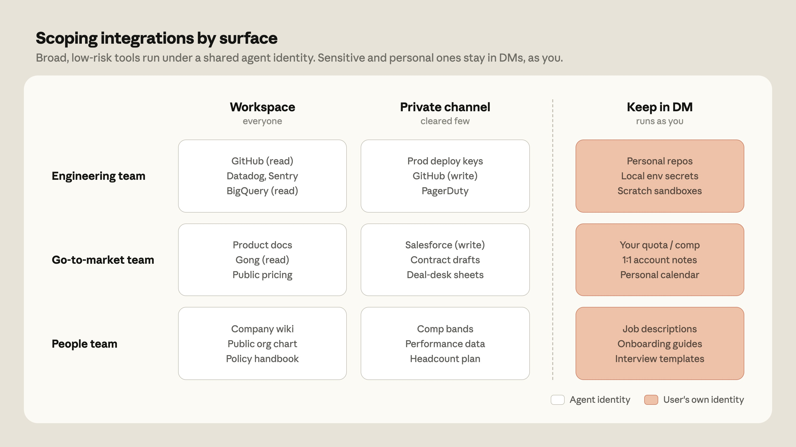

# 智能体标签中的智能体身份：用于自主、团队范围 AI 的新访问权限模型

> 来源：Claude Blog · Anthropic
> 原文链接：[agent-identity-access-model](https://claude.com/blog/agent-identity-access-model)
> 发布日期：2026-06-24
> 译校：对照英文原文人工重译

---

要让一个 AI 智能体在人类-智能体团队中发挥最佳作用，它需要和人类一样的工具、文档和上下文。

在「单人游戏」式 AI 体验（一个人和一位助手聊天）里，这很简单：你连上自己的账户，智能体代表你行事。但在「多人游戏」式 AI 体验，比如 [Claude 标签](http://anthropic.com/news/introducing-claude-tag) 中，Claude 坐在一个共享频道里，和许多人同时在一起，它调动的是属于*工作空间*的工具和上下文，而不是任何单个个人。

为了让多人游戏体验跑起来，Claude 需要为这些工具拥有自己的账户——由管理员设置、并绑定到工作区。我们把这种访问模型称为***智能体身份***。

在这篇文章里，我们解释智能体身份如何运作、它如何把权限从「每用户」转移到「每频道」，以及你该如何在自己的工作区里把它界定得好。

[视频：智能体身份：Claude 标签的新访问模型](https://www.youtube.com/embed/JhipXUs1Y98)

## 为什么「充当用户」会失效

当你把 AI 当个人助理用时，你可以连接 Google Drive、GitHub、日历等平台，并让模型用*你的*访问权限去读写它们。

这个模型对 Claude 标签行不通，原因有二：

- **智能体自主权在增强。** 一个 AI 智能体能可靠独立完成的人物长度，大约[每四个月翻一番](https://www.anthropic.com/institute/recursive-self-improvement)。智能体现在会自行安排任务、留到日后处理，并在请求者早已登出很久之后才响应事件。当用户设定好「在特定情境下触发行动」的例程时，智能体基本上就能自主工作了。
- **多人团队。** Claude 标签把 Claude 放在团队本就在工作的共享空间里——比如，三名工程师和一名 PM 一起调试的频道。但当不止一个人掌舵时，该适用谁的权限？没有一个「永远正确」的单人选。这让管理员得以独立于涉事人员，去定义智能体在 Slack 里能做什么，并对 Slack 里的所作所为留下清晰的追踪。

### Claude 以自身身份行动

在启用 Claude 标签的频道里，Claude 不是代表某个单一用户行事。它在自己触及的每个系统里都有自己的账户：它作为 Claude 应用在 Slack 里发帖，作为 Claude GitHub 应用开启拉取请求，并在管理员配置的服务账户下查询你的数据仓库。

而且，由于不存在个人用户的凭据，共享频道绝不会变成潜入某人私人文档的侧门。

### 继承权限

在智能体身份模型里，管理员在工作区层级定义一个身份（Claude 随处可用的连接与技能基线集），每个频道默认继承它。然后，在合理处，他们可以在频道层级覆盖它——例如，授予工程频道访问 GitHub 和数据仓库的权限，或把某个 CRM 连接限制在某一个专用频道内。

除了凭据，管理员还定义：

- **仓库访问：** Claude 可以读写哪些仓库。
- **连接器：** Claude 用来完成工作的工具和 API 密钥。在整个组织中，不同的 API 密钥可以以不同的权限级别连到同一个服务（例如，Claude 可能在通用频道里获得只读的数据仓库访问权，而在数据团队的私有频道里获得写入权）。
- **技能与插件：** Claude 为提升专项任务表现而动态加载的指令、脚本和资源文件夹。
- **常驻指令：** 每个频道的自定义说明与上下文。

因为这个模型围绕不同的 Claude 身份运转，撤销该身份，就会结束 Claude 在使用该身份的任何地方的所有访问。这比在数十个用户账户里逐个审计单个智能体操作，要省心得多。

## 智能体身份模型如何运作

智能体身份把「这个用户能做什么？」的问题，替换成了「这个智能体在这个隔间里能做什么？」。这不同于按用户的访问控制列表：它意味着，如果一个频道的配置文件授予了 Claude 某项权限，那么一个本身没有直接访问该仓库的频道成员，也可以让 Claude 去读这个仓库。

这很不寻常，但我们相信，这是通往一个能适配自主、多人游戏式智能体的访问模型的必要一步。下面，我们勾勒出该怎么去设定这些边界。

### 身份边界如何运作

Claude 标签为每个私有频道创建独立的身份；工作区里的公共频道则共享一个工作区层级的身份。Claude 在法律频道里的身份，无法访问未被授予该频道的代码；它在工程频道里的身份，也无法读取未被授予该频道的法律文档。内存与访问都尊重这些边界：Claude 在私有频道里学到的东西，绝不会出现在更广阔的工作空间里。

身份属于频道，所以默认情况下频道里的任何人都可以 @ 唤 Claude，而管理员可以把每个频道的配置文件，收窄到权限最低的成员。在企业版套餐中，基于角色的访问控制让管理员能更进一步，决定哪些成员可以调用 Claude——于是频道既能管住智能体能触及什么，也能管住谁能发出请求。

### 对工具和上下文的广泛默认访问

团队如何在 Claude 标签里界定 Claude 的工具访问范围：广泛、低风险的集成，在智能体身份下的共享频道中运行；而个人或团队专用的工具，则留在私信（DM）里、以用户身份运行。

在 Anthropic 内部运行 Claude 标签的过程中，我们发现它的价值是和工具、上下文的访问相乘的。每一个被连接的系统，都让其他系统更有用——因为 Claude 能把它们之间的上下文结合起来：从 Slack 拉一条讨论串、从 Drive 拉一份文档、从跟踪器拉一张工单、从数据仓库拉一次查询，汇成一个单一工具提供不了的答案。

把 Claude 用得最充分的团队，是那些从一开始就越权授予、再根据组织的管理偏好往回收的团队。智能体身份给管理员足够宽广的范围，让 Claude 能开展有用的跨系统工作；边界又足够牢固，使得访问永远不会跑到未被授权的地方。我们的建议是：先在几个频道里铺一份基线配置文件，去读审计轨迹，然后在工作确有理由支撑的地方扩展访问——每次只 deliberate 地授权一处。

对于需要更细粒度的组织，管理员可以在特定频道里禁用 Claude 标签。管理员也可以施加基于角色的访问控制（RBAC），把 Claude 标签的访问限制在特定用户上。

### 直接消息

在 Claude 标签里，直接消息（DM）的运作方式与共享频道不同。DM 跑在用户个人的 claude.ai 账户上——用他们自己的连接器、凭据，以及结果上的署名。这让 DM 成为处理那些「不该存在于频道里」的任务和工具的好地方，比如邮件草稿，或只有你才有许可证的软件。

### 安全与审计

当管理员把某个连接加进频道的配置文件时，凭据会被独立存储、并映射到该频道的身份，然后在请求时注入到网络边界处。任何发往管理员未允许主机的出站流量，都会被彻底阻断。在审计方面，用智能体凭据发起的每一次例程、内存写入和网络调用，都会被记录；而且由于 Claude 是在自己的服务账户下行动的，这些操作也会落进每个被连接系统各自的日志里。

## 接下来是什么

智能体身份是 Claude 标签访问模型的基石。未来，我们计划加强 Claude 标签的安全产品，包括即时凭据授予（让用户能在当下批准某一项敏感操作，而无需永久扩大智能体的范围），以及为许可结构更复杂的组织提供身份感知的覆盖层。这会在智能体的范围之上，再加一层用户级的检查——于是 Claude 只有在「频道配置文件」和「请求用户自身权限」双双允许时，才会行动。

像 Claude 标签这样的产品，把 AI 从单人游戏带向多人游戏，让长时间运行、基于团队的工作成为可能。智能体身份确保 Claude 对工具的访问既宽泛到能发挥作用，又收窄到能在企业规模上保持安全。

[**了解更多**](https://www.claude.com/tag) **关于 Claude 标签。**

*本文由 Claude Code 团队技术人员 Noah Zweben 撰写。*
