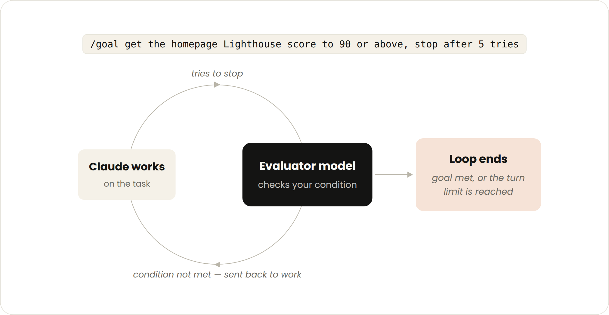

# 循环工程：循环入门

> 来源：Claude Blog · Anthropic
> 原文链接：[getting-started-with-loops](https://claude.com/blog/getting-started-with-loops)
> 发布日期：2026-06-30 · 作者：Delba de Oliveira、Michael Segner
> 译校：对照英文原文人工重译

---

了解 Claude Code 团队如何定义智能体循环，并获取从回合制循环，进阶到基于目标、基于时间与主动循环——以及各自适用时机的实用指南。

## 循环入门

最近关于"循环工程"，或者说"设计循环"而非"向你的编码智能体索取提示词"的讨论很多。如果你在 X 上花点时间想弄清循环究竟是什么，会遇到五花八门的答案。

在 Claude Code 团队，我们把 **循环定义为：智能体重复执行工作周期，直到满足某个停止条件**。我们根据以下几点对循环做了几类划分：

- 它们如何被触发
- 它们如何停止
- 使用了哪个 Claude Code 原语
- 每类最适合什么类型的任务

我们将介绍主要的循环类型、各自的适用时机，以及在管理 token 用量的同时如何维系代码质量。并非所有任务都需要复杂循环；从最简单的方案起步，有选择地使用这些模式。

## 回合制循环


- **触发于**：用户提示词。
- **停止标准**：Claude 判断任务已完成，或需要额外上下文。
- **最适合用于：** 不属于常规流程或时间表的较短任务。
- **管理使用方式：** 编写具体的提示词，并用技能改进验证、减少回合数。

你发出的每个提示词都会启动一个手动循环，由你指挥每一个回合。Claude 收集上下文、采取行动、检查自己的工作、按需重复，然后做出响应。我们称之为"智能体式循环"（agentic loop）。

例如，让 Claude 创建一个点赞按钮。它读取你的代码、做出改动、运行测试，然后交还一个它 *相信* 能用的东西。接着你手动检查成果，并写下下一个提示词。

你可以把手动步骤编码进 SKILL.md，让 Claude 能够端到端地检查更多自身工作，从而改进验证这一步。（关于在此类自动化中如何在技能、钩子与子代理之间做选择，请参阅我们[驾驭 Claude Code](https://claude.com/blog/steering-claude-code-skills-hooks-rules-subagents-and-more) 的指南。）

这应当包括能允许 Claude *看见*、*测量* 或与结果 *互动* 的工具或连接器。检查越量化，Claude 就越容易自我验证。

举例来说，你可以在 SKILL.md 中这样指定：

```plaintext
--- 
name: verify-frontend-change 
description: Verify any UI change end-to-end before declaring it done. 
--- 

# Verifying frontend changes 
Never report a UI change as complete based on a successful edit alone. Verify it the way a human reviewer would: 

1. Start the dev server and open the edited page in the browser. 

2. Interact with the change directly. For a new control (button, input, toggle): click it, confirm the expected state change, and screenshot before/after. 

3. Check the browser console: zero new errors or warnings. 

4. Use the Chrome Devtools MCP, run a performance trace and audit Core Web Vitals.

If any step fails, fix the issue and rerun from step 1 — do not hand back partially verified work.
```

## 基于目标的循环（/goal）



- **触发于**：实时中的手动提示词。
- **停止标准**：达到目标，或达到最大回合数。
- **最适合用于：** 具有可验证退出标准的任务。
- **管理使用方式：** 设定具体的完成标准与明确的回合上限，例如"尝试 5 次后停止"。

有时，单回合并不够，尤其是更复杂的任务。智能体能够迭代时，表现会更好。你可以用 /goal 定义"完成"的样貌，从而延长 Claude 保持迭代的时长。

一旦你定义了成功标准，Claude 就不必去判断什么是"足够好"、并提前结束循环。每当 Claude 试图停下，一个评估模型都会检查你的条件，把它打发回去继续工作，直到目标达成，或达到你设定的回合数。

这正是像"通过的测试数量"或"跨过某个分数阈值"这类确定性标准如此有效的原因。

例如：

```plaintext
/goal get the homepage Lighthouse score to 90 or above, stop after 5 tries.
```

## 基于时间的循环（/loop 与 /schedule）

- **触发于**：指定的时间间隔。
- **停止标准**：你取消它，或工作已完成（PR 合并、队列清空）。
- **最适合用于：** 重复性工作，或需要与外部环境 / 系统对接的场景。
- **管理使用方式：** 设置更长的间隔，或基于事件而非时间做出反应。

有些智能体式工作是反复出现的：任务不变，只有输入在变。例如，每天早上汇总 Slack 消息。另一些工作则依赖外部系统，而与之对接的一个简单办法，就是按固定间隔检查它、并对发生的变化做出反应。比如，一个 PR 可能收到代码审查意见，或未能通过 CI。

针对这些，你可以在 Claude 以 `/loop` 运行时触发，它会按一定时间间隔重新运行提示词。例如：

```plaintext
/loop 5m check my PR, address review comments, and fix failing CI
```

`/loop` 运行在你的电脑上，所以一旦你把它关掉，它就会停止。你可以通过 `/schedule` 创建一个例程（routine），把循环搬到云端。

## 主动循环


- **触发于**：某个事件或时间表，且无实时在场的人员。
- **停止标准**：每个任务在达成目标时退出；例程本身则一直运行，直到你把它关掉。
- **最适合用于：** 明确定义的工作所形成的重复流：缺陷报告、问题分类、迁移、依赖升级等。
- **管理使用方式：** 将例程路由到更小、更快的模型，并用能力最强的模型来做判断性调用。

上面的这些原语，再加上 Claude Code 的其他特性，如 **自动模式（auto mode）** 与 **动态工作流（dynamic workflows）**（研究预览），可以被组合成一个用于长时间运行工作的循环。

例如，要处理涌入的反馈，你可以使用：

1. **`/schedule`**（研究预览）运行一个检查新报告的例程
2. **`/goal`** 定义"完成"的样貌，并用 **技能（skills）** 记录如何验证它
3. **动态工作流（dynamic workflows）** 协调智能体对每个报告做分类、修复并复查修复结果
4. **自动模式（auto mode）** 让例程无需停下来请求许可即可运行

把它们组合起来，一个提示词可能长这样：

```plaintext
/schedule every hour: check #project-feedback for bug reports. /goal: don't stop until every report found this run is triaged, actioned, and responded to. When fixing a bug, use a workflow to explore three solutions in parallel worktrees and have a judge adversarially review them.
```

## 维系代码质量

一个循环的输出质量，取决于其周围的系统。设计系统时：

- **保持代码库本身干净**：Claude 会遵循代码库中既有的模式与约定。
- **给 Claude 一个验证自身工作的方法**：用 [技能](https://code.claude.com/docs/en/skills) 把"对你和团队而言什么算好"编码下来。
- **让文档易于触达：** 框架与库的文档里有着最新的最佳实践。
- **用第二个智能体做代码审查**：带着新鲜上下文的审查者偏见更少，也不易受主智能体推理的影响。你可以使用内置的 `/code-review` 技能，或面向 GitHub 的 [代码审查](https://code.claude.com/docs/en/code-review)。写代码的循环，需要检查代码的循环——参见 [Anthropic 如何守护其 AI 原生的 SDLC](https://claude.com/blog/how-anthropic-secures-its-ai-native-software-development-lifecycle)。

当单个结果未达标准时，不要止步于修复这一个问题，试着把它编码进系统，让未来的所有迭代都因此受益。

## 管理 token 用量

要管理 token 用量，循环应当边界清晰：

- **为任务选对原语与模型：** 较小的任务不需要多个智能体或循环；有些任务可以用更便宜、更快的模型。
- **定义清晰的完成与停止标准：** 具体说明"完成"的样貌，好让 Claude 更快抵达答案（但别快过头）。
- **大规模运行前先做试点：** 动态工作流可能一次性派生出数百个智能体；先在一小片工作上测出用量。
- **用脚本处理确定性工作**：跑一个脚本比一步步推理更便宜。例如，一个 PDF 技能可以附带一个填表脚本，让 Claude 每次运行它，而不是重新推导代码。
- **别把例程跑得比你需要的更频繁：** 让间隔匹配你所监控事物的变化频率
- **回顾用量：** `/usage` 命令会按技能、子代理与 MCP 拆解近期用量；不带参数的 `/goal` 会显示迄今为止的回合数与 token 用量；`/workflows` 显示每个智能体的 token 用量，且你可以随时停止某个智能体。

你在 [模型与努力水平](https://claude.com/blog/claude-model-and-effort-level-in-claude-code) 上的选择，是对循环成本影响最大的杠杆之一。

## 上手开始

总结一下：

| 循环 | 你交出什么 | 适用时机 | 使用 |
| --- | --- | --- | --- |
| 回合制 | 检查 | 你正在探索或做决策 | 自定义验证技能 |
| 基于目标 | 停止条件 | 你知道"完成"长什么样 | `/goal` |
| 基于时间 | 触发器 | 工作在项目之外按日程发生 | `/loop`、`/schedule` |
| 主动 | 提示词 | 工作重复且定义明确 | 以上全部，外加动态工作流 |

要开始使用循环，先看看你已经做着的工作。挑一个你成为瓶颈的任务，问问自己能交出去的是哪一块：你能写出验证检查吗？目标足够清晰吗？工作是按日程送上门来的吗？

一旦有了想法，就跑起这个循环，观察结果——比如它在哪里卡住、或哪里越了界——并且不要害怕对它迭代。

想了解更多，请阅读 Claude Code 文档中关于 [并行运行智能体](https://code.claude.com/docs/en/agents) 的页面，以及 [循环](https://code.claude.com/docs/en/goal)、[日程](https://code.claude.com/docs/en/routines)、[目标](https://code.claude.com/docs/en/goal)、[动态工作流](https://code.claude.com/docs/en/workflows#orchestrate-subagents-at-scale-with-dynamic-workflows) 等页面。若想让你的检查在多次会话间可复现，请参阅 [用技能在 Claude Code 中构建验证循环](https://claude.com/blog/building-verification-loops-in-claude-code-with-skills)。

*本文由 Delba de Oliveira 与 Michael Segner 撰写。*
