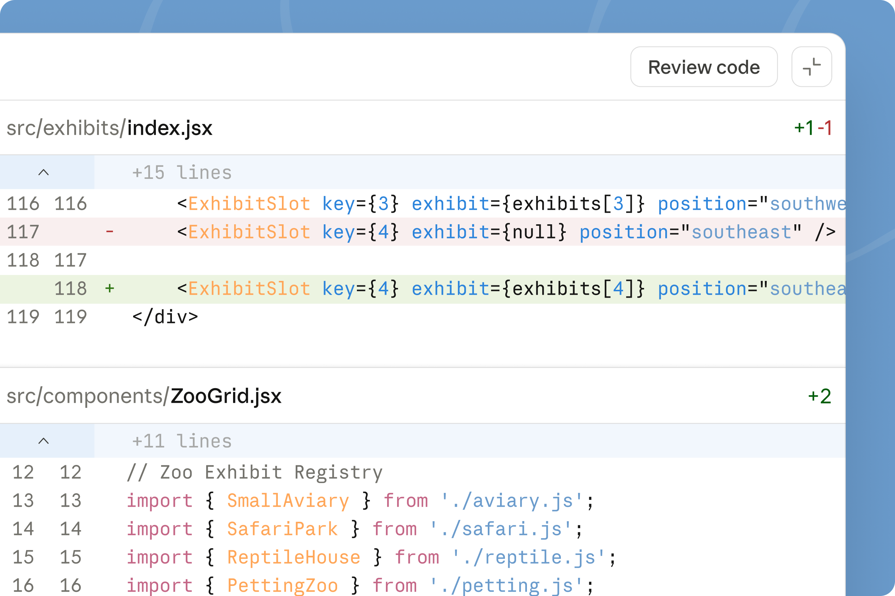

# 在桌面上将自动预览、审阅和合并功能引入 Claude Code

> 发布日期：2026-02-20 · [原文链接](https://claude.com/blog/preview-review-and-merge-with-claude-code) · 机器翻译，仅供学习。

今天，我们发布了 Claude Code 改进，让您可以预览正在运行的应用程序、自动审查代码、自动修复和合并 PR，以及在桌面、移动设备和 CLI 之间无缝切换。这些更新共同帮助您花更少的时间在代码的繁琐工作上，而将更多的时间花在您喜欢的部分上。

## **编写代码并查看其运行**

桌面上的 Claude Code 现在可以启动开发服务器并直接在桌面界面中预览正在运行的应用程序。 Claude 查看 Web 应用程序 UI、读取控制台日志、捕获错误并不断迭代，因此您不必切换到浏览器并向 Claude 手动描述您所看到的内容。您还可以在预览中选择视觉元素，并将反馈直接传递给 Claude 进行迭代。

[视频：在桌面上预览 Claude Code 中正在运行的应用程序](https://www.youtube.com/embed/UCD7Hnx_THQ)

## **在推送之前检查代码**

一旦您的更改看起来正确，请要求 Claude 使用新的“审核代码”按钮进行审核。 Claude 检查您的本地差异并直接在桌面差异视图中留下评论，突出显示错误，提出建议并发现内联的潜在问题。

在任何东西离开您的机器之前，您会立即获得第二双眼睛来发现明显的问题，并且您可以要求 Claude 解决内联注释并进行更改。

## **无需离开应用程序即可监控 PR**

对于 GitHub 上托管的代码，您还可以直接在桌面应用程序中监控拉取请求状态。打开 PR 后，Claude Code 将在后台使用 GitHub CLI 跟踪其状态，包括 CI 检查通过和失败。

您还可以启用自动修复，以便 Claude 自动尝试修复它检测到的任何 CI 故障。如果启用自动合并，一旦所有检查通过，Claude 也会尝试合并 PR。

您可以在 Claude Code 会话中处理一项任务并打开 PR，然后继续执行新任务。在后台，Claude Code 将监视原始任务的 PR，并尝试修复 CI 故障，以便在您切换回该任务时 PR 已准备好合并（或自动合并）。

## **从上次停下的地方继续**

现在，会话会随着您一起移动。当您从 CLI 中的 Claude Code 启动会话时，运行 /desktop 将完整会话上下文带入桌面应用程序。

您还可以使用“在网络上继续使用 Claude Code”按钮将本地桌面应用程序会话移至云。在桌面应用程序上启动任务，然后使用 Claude 移动应用程序从网络或手机上获取该任务。

## **开始使用**

这些更新现在可供所有用户使用。更新或下载 [Claude Code 在桌面上](https://claude.com/download) 开始吧。探索 [文档](https://code.claude.com/docs/en/desktop) 了解更多。
