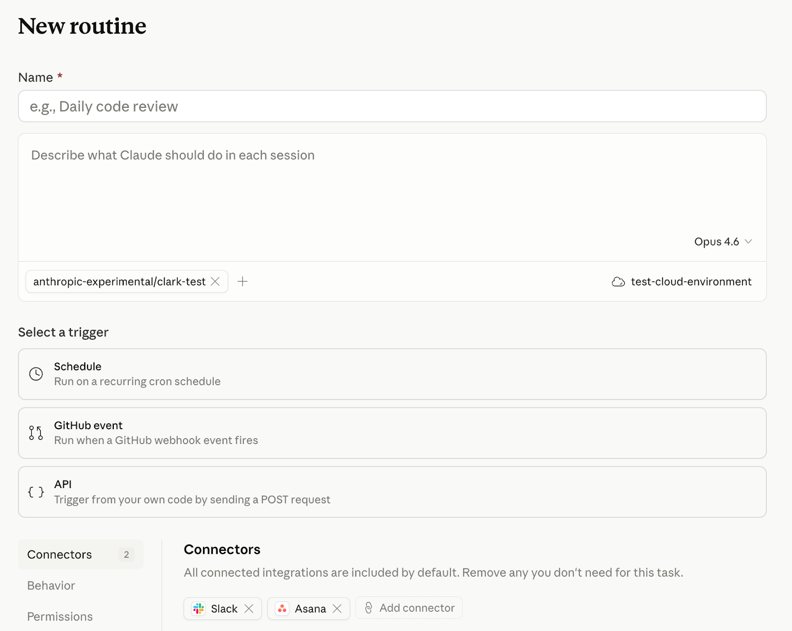

# 引入Claude Code中的例程

> 发布日期：2026-04-14 · [原文链接](https://claude.com/blog/introducing-routines-in-claude-code) · 机器翻译，仅供学习。

今天，我们在研究预览中介绍 Claude Code 中的例程。例程是您配置一次的 Claude Code 自动化（包括提示词、存储库和连接器），然后根据 API 调用或响应事件按计划运行。例程运行于 [Claude Code 的网络基础设施](https://code.claude.com/docs/en/claude-code-on-the-web)，所以一切都取决于您的笔记本电脑是否打开。

开发人员已经使用 Claude Code 来自动化软件开发周期，但到目前为止，他们只能管理 cron 作业、基础设施和其他工具，例如 MCP 服务器本身。例程附带了对您的存储库和您的 [连接器](https://claude.com/connectors)，这样您就可以打包自动化并将其设置为按计划或触发器运行。

## 它是如何运作的



### 预定的例行公事

给 Claude Code 一个提示词和一个节奏（每小时、每晚或每周），它就会按该时间表运行：

```
Every night at 2am: pull the top bug from Linear, attempt a fix, and open a draft PR.
```

如果您正在使用 [/时间表](https://code.claude.com/docs/en/scheduled-tasks#compare-scheduling-options) 在 CLI 中，这些任务现在是计划例程。

### API例程

您还可以配置由 API 调用触发的例程。每个例程都有自己的端点和身份验证令牌。 POST 一条消息，返回一个会话 URL。将 Claude Code 连接到您的警报、部署挂钩、内部工具 - 任何您可以发出 HTTP 请求的地方：

```
Read the alert payload, find the owning service, and post a triage summary to #oncall with a proposed first step.
```

如果您要在 Claude Platform 上构建云托管的智能体，而不是自动化 Claude Code， [Claude Managed Agents 中的计划部署](https://claude.com/blog/whats-new-in-claude-managed-agents) 为您自己的智能体提供相同的按计划运行行为。

### Webhook 例程，以 GitHub 开头

订阅例程以自动启动以响应 GitHub 存储库事件。 Claude 将为每个与您的过滤器匹配的 PR 创建一个新会话并运行您的例程。

```
Please flag PRs that touch the /auth-provider module. Any changes to this module need to be summarized and posted to #auth-changes.
```

Claude 为每个 PR 打开一个会话，并将继续将该 PR 的更新提供给会话，因此它可以解决评论和 CI 失败等后续问题。

我们计划将来扩展基于 Webhook 的例程以从更多事件源触发。

## 正在建设哪些团队

早期用户创建例程时出现了一些常见模式：

### 预定的例行公事

- 待办事项管理：每晚对新问题进行分类、标记、分配并将摘要发布到 Slack
- 文档漂移：每周扫描合并的 PR，标记引用已更改 API 的文档，并打开更新 PR

### API例程

- 部署验证：您的 CD 管道在每次部署后发布，Claude 对新构建运行烟雾检查，扫描错误日志以进行回归，并向发布通道发布是否通过
- 警报分类：将 Datadog 指向例程的端点，Claude 提取跟踪，将其与最近的部署关联起来，并在待命打开页面之前等待草稿修复
- 反馈解决方案：文档反馈小部件或内部仪表板发布报告，Claude 针对存储库在上下文中打开一个会话，并起草更改

### GitHub例程

- 库端口：合并到 Python SDK 的每个 PR 都会触发一个例程，将更改移植到并行 Go SDK，并打开匹配的 PR
- 定制代码审查：在 PR 打开时，运行团队自己的安全性和性能检查表，在人工审查员查看之前留下内联评论

## 开始使用

今天，Pro、Max、Team 和 Enterprise 计划的 Claude Code 用户可以使用例程 [网络上的 Claude Code](https://code.claude.com/docs/en/claude-code-on-the-web#who-can-use-claude-code-on-the-web) 已启用。前往 [Claude.ai/代码](http://claude.ai/code) 创建您的第一个例程，或在 CLI 中键入 /schedule。

例程以与交互式会话相同的方式减少订阅使用限制。此外，例程还有每日限制：Pro 用户每天最多可以运行 5 个例程，Max 用户每天最多可以运行 15 个例程，Team 和 Enterprise 用户每天最多可以运行 25 个例程。您可以通过额外的使用来运行超出这些限制的额外例程。 [请参阅文档](http://code.claude.com/docs/en/routines) 了解更多信息。
