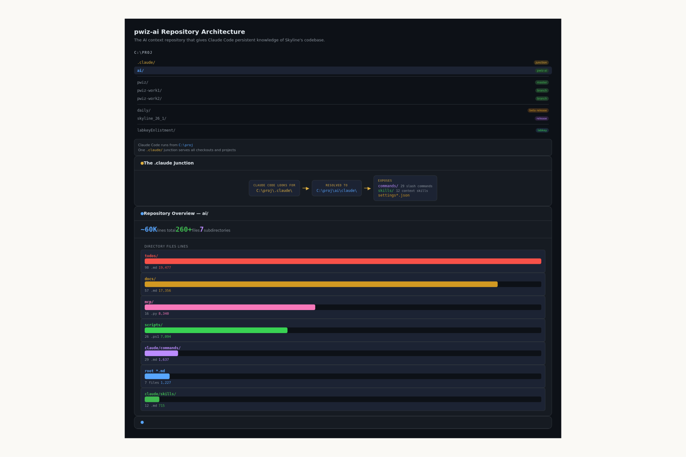

# 像新开发者一样入职 Claude Code：17 年开发的经验教训

> 发布日期：2026-04-28 · [原文链接](https://claude.com/blog/onboarding-claude-code-like-a-new-developer-lessons-from-17-years-of-development) · 机器翻译，仅供学习。

[天际线](https://skyline.ms/home/software/Skyline/wiki-page.view?name=team)是由华盛顿大学 MacCoss 实验室的主要开发人员 Brendan MacLean 维护的开源蛋白质分析软件，自 2008 年以来一直在积极开发。Skyline 帮助研究人员检测和量化血浆和组织等物质中的蛋白质，这对于生物标志物发现、疾病研究和药物开发至关重要。 MacCoss Lab 代码库包含 700,000 多行 C# 代码，由一个运行 200,000 多个夜间自动化测试的小团队维护了 17 年。

*在 Blender 中创建的西雅图天际线 3D 插图，代表华盛顿大学 MacCoss 实验室的所在地，自 2008 年以来，Brendan MacLean 和他的团队一直在该实验室开发和维护 Skyline。Claude 帮助 Brendan 在背面添加了 Claude 徽标。图片由 MacCoss 实验室提供。*

近三十年来，布伦丹一直是 Skyline 的结缔组织，带领数十名本科生、研究生和博士后加入实验室。\*

随着开发人员的加入和离开，代码库吸收了他们的贡献。到 2024 年，它承担起了长期项目的通常负担。随着开发商的移交，某些地区已经变得不可触及。

经过数十年对实验室成员的培训，布伦丹知道如何让研究人员了解实验室庞大的代码库。他没想到的是，同样的方法应用于 AI 工具，将使 Skyline 的代码库再次变得易于管理。

## 同样的入职问题，不同类型的开发人员

Brendan 怀疑现代 AI 编码工具能否像专为这种语言和环境构建的工具那样理解 C# 行。

在浏览器中使用 Claude.ai 进行的早期实验证实了这一模式。他描述一个问题，获得响应，然后将整个 C# 文件复制回他的项目中，从而将范围限制在他可以描述的包含问题中，而无需参考项目代码。

“一旦变化变得更加渐进，事情就变得非常费力，”布伦丹说。

每次与 Claude.ai 的对话都感觉像是从头开始，因为它不了解 Skyline 是什么、它的组件如何相关、或者 17 年的开发已经建立了什么。

这与布伦丹在新开发人员入职时所面临的经历相同，这给了他一个想法。

“我可以像对待实习开发人员一样将 Claude 到 Claude Code 引入到我的大型项目中：通过足够的解释来实现成功的有限项目，并为下一次迭代提供改进的环境，”Brendan 说。

他将所有 AI 上下文移至其自己的存储库中， [普维兹人工智能](https://github.com/ProteoWizard/pwiz-ai)，与代码库分开，因此它适用于所有分支和时间点。的 `CLAUDE.md` 根目录下的文件处理环境设置并将 Claude 指向相关文档：将其视为“基础知识”，而不是专业知识本身。

专业知识存在于 [技能，](https://agentskills.io/home) 用于提供智能体功能和专业知识的开放格式。他的 `debugging` 例如，该技能旨在将 Claude 从他所谓的“猜测和测试”模式中拉出来，在尝试任何修复之前将其推向根本原因分析。技能可以手动或自动触发；布伦丹用明确的条件调整了他最关键的那些—— `debugging` 技能描述为“在调查错误、故障或意外行为时始终加载”。

*pwiz-ai 存储库结构，显示上下文、技能和 MCP 集成如何连接到 Skyline 的代码库。图片由 MacCoss 实验室提供。*

建立上下文后，教授 Claude 调试代码库的细节的开销变得明显不那么陡峭。 Claude 已经知道代码的作用。互动是从理解开始，而不是从零开始。

“看起来一个主要问题——‘Claude 无法真正了解我的大型项目’——变得越来越清晰：上下文只是另一个需要维护和发展的工件，”Brendan 说。

## 减少技术债务并加速发展

在 Skyline 中构建文件视图面板（一个显示所有文档相关文件的新界面，具有文件系统监控和拖放组织功能）的为期一年的项目在拥有该面板的开发人员离开后一直未能完成。 Brendan 用 Claude Code 拾取了它。

两周后，它完成了，所有最终提交均由 Claude 共同撰写。

布伦丹说：“之前的努力通常都会被放弃。”在学术实验室中，开发人员经常轮换——研究生完成学位，博士后继续前进，实习生在夏末离开。在过去，任何正在进行的工作都会永远被搁置。

三年前，在失去维护 Skyline 夜间测试管理模块的开发人员后，Brendan 停止向该模块添加功能。该模块采用 Java 编码，作为 LabKey Server 科学数据门户网站的一部分。最近，在一位熟练的 LabKey 开发人员使用 Claude Code 创建设置文档后，Brendan 花了不到一天的时间添加了他多年来想要的功能，并使用他过去只雇用设计师制作的 CSS 更新了页面布局。

新的基础设施随之而来。

Skyline 的 2,000 多个教程图像的屏幕截图复制现在完全自动化且几乎 100% 可复制，并使用 Claude Code 进行扩展以添加仅差异视图和像素更改放大，以及由 Claude 用 C# 编写的 MCP 服务器，以便它可以“查看”这些差异。 Claude Code 每天早上生成一份每日摘要，显示从 Skyline 的夜间测试基础设施中提取的测试失败、异常和开放支持线程，这些线程会在 Brendan 坐下来工作之前到达他的收件箱中。

Claude 还用 Python 编写了 MCP 服务器，以实现此功能，从 LabKey 服务器上的三个独立的关系数据流、团队电子邮件以及 GitHub 上带有发布标签的代码中提取数据。

*由 Claude Code 自动生成的每日摘要电子邮件，从 Skyline 的夜间测试基础设施中提取。图片由 MacCoss 实验室提供。*

Brendan 的开发人员现在几乎不自己编写代码，主要是指导 Claude Code，并使用该工具自动生成自动化脚本和 MCP 实现。例如，实验室中一位对智能体式编码工具持怀疑态度的开发人员构建并发布了一个新的绘图扩展（用于可视化离子淌度数据的流动图窗格），并将其归功于 Claude Code。

*流动图窗格是用 Claude Code 构建的，可将离子淌度数据与质谱结果一起可视化。图片由 MacCoss 实验室提供。*

“我看到几乎每个人都在尝试有趣的新功能，而他们可能觉得这些功能太深埋在其他工作中而无法尝试，”布伦丹说。

## 为处理遗留代码库的开发人员提供建议

基于 17 年的开发人员入职经验以及一年多来对 Claude Code 应用相同方法的经验，以下是 Brendan 将告诉从事遗留代码库工作的开发人员的话。

**上下文是你最好的朋友**

Claude 生成的待办事项列表和计划不会跨会话持续存在。 [背景](https://www.anthropic.com/engineering/effective-context-engineering-for-ai-agents) 是持续存在的，并且必须刻意维护。这是大多数开发人员都会跳过的部分，也是大多数开发人员成功停滞不前的原因。

“要明白，如果不记录‘上下文’，Claude 就无法学习。不要指望魔法，”布伦丹说。 “投资于构建和维护上下文层。并像对待任何其他项目工件一样对待它：对其进行版本控制、扩展它、维护它。”

Brendan 将 AI 上下文保留在单独的存储库中，因为它的增长速度与代码不同，并且适用于所有分支和时间点 - 将其保留在代码存储库中已成为限制。将上下文保存在同一个存储库中是一个有效的替代方案；重要的是它的版本控制、维护以及在需要时可用。

**投资建立你的技能库**

使用 [技能](https://claude.ai/skills) 对任何 Claude 实例都可以加载的领域知识进行编码。 Brendan 的技能遵循“参考而非嵌入”原则：每个技能都指向一个中央文档知识库，而不是重复内容，从而使它们保持轻量级且易于维护。

他最常用的包括：`skyline-development`使 Claude 适应项目及其文档的技能；一个 `version-control`编码特定于项目的提交和 PR 约定的技能；和一个`debugging`旨在将 Claude 拉出“猜测和测试”模式的技能，在尝试任何修复之前将其推向根本原因分析。

**当数据访问很关键时，使用 MCP 集成**
构建 [MCP 集成](https://anthropic.com/engineering/mcp) 其中 Claude 需要访问真实数据：测试结果、异常报告、支持线程。

对于开源项目，构建和维护上下文层具有特别重要的意义。没有入职预算，没有超出记录的机构记忆，也不能保证任何贡献者明年仍然会存在。上下文一旦建立，就可供每个贡献者使用，并在项目的整个生命周期中持续存在，这是人类机构知识从未做到过的。的 `pwiz-ai` 存储库本身就是一个开源工件——属于项目的上下文，而不是任何一个贡献者，并且比构建它的每个人都更长久。

## 十七年的入职，一个结论

您不会向新员工提供 700,000 行代码库并期望第一天就得到结果。你会为他们找到一个包含的项目，引导他们完成它，并随着他们理解的增长而扩大他们的范围。

正如 Brendan 了解到的，您使用 Claude 构建的上下文的工作方式相同。

一旦对代码库有了足够的了解，工程师就可以跨分支和时间点工作。 Claude，只要有足够的背景和方向，也可以做到同样的事情。

*\*Dario Amodei，Anthropic 联合创始人，曾是 MacCoss 实验室成员。*
