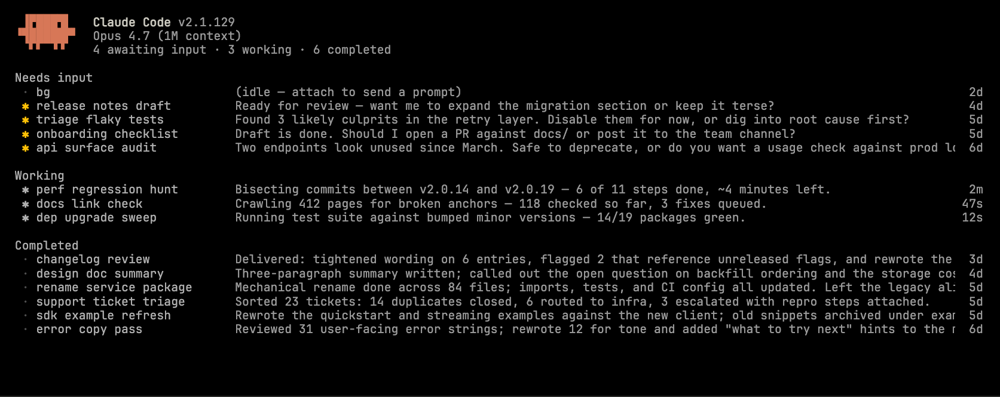
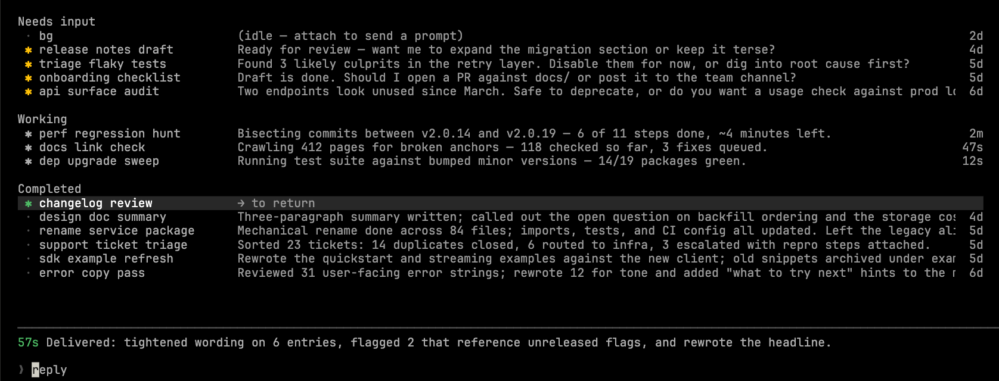

# 智能体在 Claude Code 中查看

> 发布日期：2026-05-11 · [原文链接](https://claude.com/blog/agent-view-in-claude-code) · 机器翻译，仅供学习。

今天，我们在 Claude Code 中引入智能体视图：一个管理所有 Claude Code 会话的地方。

之前并行运行智能体时，您可能必须管理多个终端选项卡、一个 tmux 网格以及一个超载的心理分类帐，其中包含您接下来需要处理的问题。

通过 Claude Code 中的智能体视图，您可以启动新的智能体，将它们发送到后台，并仅在 Claude 需要您时跳入。一目了然地看到哪些智能体正在等待您、哪些仍在工作、哪些已完成，因此您可以轻松地同时引导多个智能体。

[视频：介绍 Claude Code 中的智能体视图](https://www.youtube.com/embed/-INveHwbRz4)

## 它是如何运作的

智能体视图改进了 CLI 中的 Claude Code 会话的可视化和交互。

### 立即查看所有内容

在任何会话或运行中按向左箭头 `claude agents` 从终端打开智能体视图。每行显示会话、是否需要您的输入、上次响应的内容以及您上次与之交互的时间。

### 不离开即可查看并回复

选择一个会话来查看最后一个回合。如果会话正在等待决定，请内联回答，会话就会恢复。按 Enter 键直接附加到您想要浏览完整记录的会话。

### 背景任何东西

最后，用户可以使用任何现有会话并将其添加到智能体视图中 `/bg` 或者使用完全跳过前台 `claude --bg [task]` 启动新的会话。

## 开发人员如何使用智能体视图

我们从早期用户那里看到了一些模式：

- **扩展并发会话数：** 一次发送多个想法，每个想法都可以与一项技能配对，然后返回准备审查的拉取请求列表。
- **管理长时间运行的智能体：** PR 保姆、仪表板更新程序和其他循环作业会在列表中显示其下一次运行时间。
- **在不同的会话之间导航：** 当您处于会话中间时，按向左箭头，开始相关任务或快速代码库问题，然后向右箭头回到您正在做的事情。 Peek 落地后会显示答案。
- **查看运送的物品：** 每行的状态指示器加上 peek 中的标题可以轻松扫描哪些会话产生了 PR。

## 开始使用

智能体视图现已作为 Pro、Max、Team、Enterprise 和 Claude API 计划的研究预览版提供。通过运行选择加入 `claude agents`。适用通常的费率限制。请参阅 [文档](https://code.claude.com/docs/en/agent-view) 了解更多信息。
