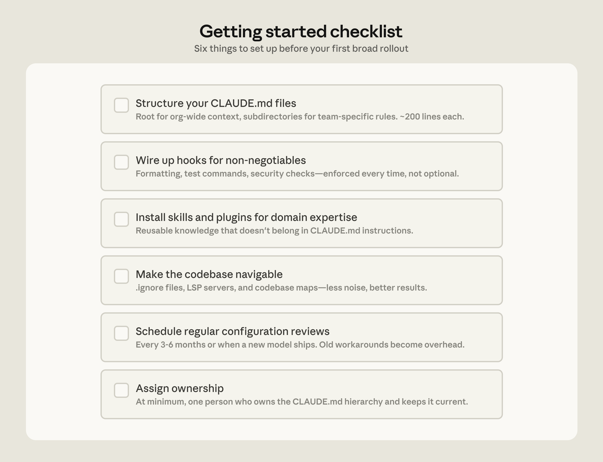

# Claude Code 如何在大型代码库中工作：最佳实践和从哪里开始

> 发布日期：2026-05-14 · [原文链接](https://claude.com/blog/how-claude-code-works-in-large-codebases-best-practices-and-where-to-start) · 机器翻译，仅供学习。

Claude Code 正在生产环境中运行，包括数百万行单一存储库、数十年历史的遗留系统、跨越数十个存储库的分布式架构以及拥有数千名开发人员的组织。这些环境带来了更小、更简单的代码库所没有的挑战，无论是每个子目录中不同的构建命令还是分布在没有共享根的文件夹中的遗留代码。

本文介绍了我们观察到的导致 Claude Code 成功大规模采用的模式。我们使用“大型代码库”来指代广泛的部署：具有数百万行的单一存储库、数十年构建的遗留系统、跨独立存储库的数十个微服务，或上述的任意组合。这还包括在团队并不总是与 ZX​​QTERM0033QXZ 编码工具关联的语言上运行的代码库，例如 C、C++、C#、Java、PHP。 （在这些情况下，Claude Code 的表现比大多数团队预期的要好，特别是在最近发布的模型中。）虽然每个大型代码库部署都是由其特定的版本控制、团队结构和积累的约定决定的，但这里的模式可以在它们之间进行概括，对于考虑采用 Claude Code 的团队来说，这是一个很好的起点。

## Claude Code 如何导航大型代码库

Claude Code 以软件工程师的方式导航代码库：它遍历文件系统、读取文件、使用 grep 准确查找所需内容，并跟踪代码库中的引用。它在开发人员的计算机上本地运行，不需要构建、维护或上传到服务器的代码库索引。

由 RAG 驱动的 AI 编码工具的工作原理是嵌入整个代码库并在查询时检索相关块。在大规模情况下，这些系统可能会失败，因为嵌入管道无法跟上活跃的工程团队的步伐。当开发人员查询索引时，它会反映几周、几天甚至几小时前存在的代码库。然后，检索返回团队两周前重命名的函数，或引用在上一次冲刺中删除的模块，但没有迹象表明其中任何一个都已过时。

智能体式搜索避免了这些故障模式。当数千名工程师提交新代码时，无需维护嵌入管道或集中索引。每个开发人员的实例都在实时代码库中运行。

但该方法有一个权衡：当 Claude 有足够的起始上下文来知道在哪里查找时，它效果最好。这意味着 Claude 导航的质量取决于代码库的设置情况、Claude.md 文件和技能的分层上下文。如果您要求它在十亿行代码库中查找模糊模式的所有实例，那么您将在工作开始之前达到上下文窗口限制。投资于代码库设置的团队会看到更好的结果。

## 安全带与模型一样重要

关于 Claude Code 最常见的误解之一是，其功能仅由所使用的模型定义。团队重点关注模型的基准测试及其在测试任务中的表现。实际上，围绕模型构建的生态系统（线束）决定了 Claude Code 的性能如何优于单独的模型。

该工具由五个扩展点构建而成：Claude.md 文件、挂钩、技能、插件和 MCP 服务器，每个扩展点提供不同的功能。团队构建它们的顺序很重要，因为每一层都建立在之前的基础上。 LSP 集成和子代理这两项附加功能使设置更加完善。下面，我们解释每个组件和功能的作用：

[**Claude.md**](https://code.claude.com/docs/en/memory) **文件优先**。这些是 Claude 在每个会话开始时自动读取的上下文文件：用于全局的根文件，用于本地约定的子目录文件。他们为 Claude 提供了做好任何事情所需的代码库知识。因为无论任务如何，它们都会在每个会话中加载，因此让它们专注于广泛适用的内容将防止它们成为性能的拖累。

[**挂钩**](https://code.claude.com/docs/en/hooks-guide) **使设置自我改进**。大多数团队将钩子视为防止 Claude 做错事的脚本，但它们更有价值的用途是持续改进。停止钩子可以反映会话期间发生的情况，并在上下文新鲜时建议 Claude.md 更新。启动挂钩可以动态加载特定于团队的上下文，因此每个开发人员都可以为其模块进行正确的设置，而无需手动配置。对于诸如 linting 和格式化之类的自动检查，挂钩会确定性地强制执行规则，并产生比依赖 Claude 来记住指令更一致的结果。

[**技能**](https://code.claude.com/docs/en/skills) **按需提供正确的专业知识，而不会使每次会议都臃肿。** 在具有数十种任务类型的大型代码库中，并非每个会话都需要提供所有专业知识。技能可以通过以下方式解决这个问题 [渐进式披露](https://platform.claude.com/docs/en/agents-and-tools/agent-skills/best-practices)，卸载专门的工作流程和领域知识，否则它们会竞争上下文空间，并且仅在任务需要时才加载它们。例如，当 Claude 评估代码是否存在漏洞时，会加载安全审查技能；而当进行代码更改和需要更新文档时，会加载文档处理技能。

技能还可以限定在特定路径，因此它们仅在代码库的相关部分激活。拥有支付服务的团队可以将其部署技能绑定到该目录，因此当有人在 monorepo 中的其他地方工作时，它永远不会自动加载。

[**插件**](https://code.claude.com/docs/en/plugins) **分发有效的内容。** 大型代码库面临的一项挑战是 *好* 设置可以保持部落风格。插件将技能、挂钩和 MCP 配置捆绑到单个可安装包中，因此当新工程师在第一天安装该插件时，他们将立即拥有与已经使用 Claude 的人员相同的上下文和功能。插件更新可以通过以下方式分发到整个组织： [托管市场](https://support.claude.com/en/articles/13837433-manage-claude-cowork-plugins-for-your-organization).

例如，我们合作的一家大型零售组织构建了一项将 Claude 连接到其内部分析平台的技能，以便业务分析师可以在不离开工作流程的情况下提取绩效数据。在广泛推广到业务之前，他们将其作为插件分发。

**语言服务器协议 (LSP) 集成为 Claude 提供了与开发人员在 IDE 中相同的导航。** 大多数大型代码库 IDE 已经运行了 LSP，支持“转到定义”和“查找所有引用”。将其呈现给 Claude 可以为其提供符号级精度：它可以跟踪对其定义的函数调用、跨文件跟踪引用以及区分不同语言中的同名函数。如果没有它，Claude 会在文本上进行模式匹配，并且可能会出现错误的符号。我们合作的一家企业软件公司在 Claude Code 推出之前在整个组织范围内部署了 LSP 集成，特别是为了使 C 和 C++ 导航大规模可靠。对于多语言代码库来说，这是价值最高的投资之一。

**MCP 服务器扩展了一切。** MCP 服务器是 Claude 连接到其无法访问的内部工具、数据源和 API 的方式。最先进的团队构建了 MCP 服务器，将结构化搜索公开为 Claude 可以直接调用的工具。其他人将 Claude 连接到内部文档、票务系统或分析平台。

[**子代理**](https://code.claude.com/docs/en/sub-agents) **将探索与编辑分开。** 子代理是一个独立的 Claude 实例，具有自己的上下文窗口，该窗口接受任务、完成工作并仅将最终结果返回给父代理。一旦该工具就位，一些团队就会启动一个只读子代理来映射子系统并将结果写入文件，然后对智能体进行主编辑并了解完整情况。

*Claude Code的扩展层一览。*

下表总结了每个组件的功能、加载时间以及我们在每个组件中看到的最常见错误：

| 组件 | 它是什么 | 当它加载时 | 最适合 | 常见的困惑 |
| --- | --- | --- | --- | --- |
| Claude.md | 上下文文件 Claude 自动读取 | 每节课 | 特定于项目的约定、代码库知识 | 将其用于属于某项技能的可重用专业知识 |
| 挂钩 | 关键时刻运行的脚本 | 由事件触发 | 自动化一致的行为，捕捉会话学习 | 使用提示词来执行应该自动运行的事情 |
| 技能 | 针对特定任务类型的打包说明 | 按需、相关时 | 跨会议和项目可重复使用的专业知识 | 将所有内容加载到 Claude.md 中 |
| 插件 | 捆绑技能、挂钩、MCP 配置 | 配置后始终可用 | 在整个组织中分发工作设置 | 让良好的设置保持部落性 |
| 语言服务器协议 (LSP)\* | 通过特定于语言的服务器提供实时代码智能 | 配置后始终可用 | 类型语言中的符号级导航和自动错误检测 | 假设它是自动的 |
| MCP 服务器 | 与外部工具和数据的连接 | 配置后始终可用 | 为 Claude 提供对其无法访问的内部工具的访问权限 | 在基础工作开始之前构建 MCP 连接 |
| 子代理\* | 针对特定任务的单独 Claude 实例 | 调用时 | 将探索与编辑分开，并行工作 | 在同一会话中运行探索和编辑 |
| \*LSP是通过插件层访问的。子代理是一种委派功能，而不是配置的扩展点。 | | | | |

## 成功部署的三种配置模式

如何为大型代码库配置 Claude Code 在很大程度上取决于该代码库的结构。尽管如此，我们观察到的部署中始终出现了三种模式。

### 使代码库可大规模导航

Claude 在大型代码库中提供帮助的能力受到其找到正确上下文的能力的限制。加载到每个会话中的上下文过多会降低性能，而上下文过少则导致 Claude 盲目导航。最有效的部署是预先投资以使代码库易于 Claude 阅读。一些模式始终如一地出现：

- **保持 Claude.md 文件精简且分层。** Claude 在代码库中移动时会附加加载它们：根文件用于全局，子目录文件用于本地约定。根文件应该只是指针和关键问题；其他一切都变成了噪音。
- **在子目录中初始化，而不是在存储库根目录中初始化。** 当 Claude 的范围限定为与任务实际相关的代码库部分时，效果最佳。在 monorepos 中，这可能感觉违反直觉，因为工具通常假定 root 访问权限，但 Claude 自动遍历目录树并加载沿途找到的每个 Claude.md 文件，因此根级别上下文永远不会丢失。
- **每个子目录的范围测试和 lint 命令。** 当 Claude 更改一项服务时运行全套服务会导致超时并浪费不相关输出的上下文。子目录级别的 Claude.md 文件应指定适用于代码库该部分的命令。这对于面向服务的代码库非常有效，其中每个目录都有自己的测试和构建命令。在具有深度跨目录依赖关系的编译语言 monorepos 中，每个子目录的范围很难实现，并且可能需要特定于项目的构建配置。
- **使用 `.`**`ignore` **文件以排除生成的文件、构建工件和第三方代码。** 承诺 `permissions.deny` 规则在 `.claude/settings.json` 意味着排除是版本控制的，因此团队中的每个开发人员都可以获得相同的降噪效果，而无需自行配置。在某些代码库中，生成的文件本身就是开发工作的主题。使用代码生成器的开发人员可以在本地设置中覆盖项目级排除，而不会影响团队的其他成员。
- **当目录结构不起作用时构建代码库映射。** 对于代码未合并在传统目录结构中的组织，存储库根目录中的轻量级 Markdown 文件列出了每个顶级文件夹，并包含其中内容的一行描述，为 Claude 提供了一个可以在打开文件之前扫描的目录。对于具有数百个顶级文件夹的代码库，这种分层方法效果最好：根文件仅描述最高级别的结构，子目录 Claude.md 文件提供下一个级别的详细信息，当 Claude 在树中移动时按需加载。对于更简单的情况，@-提及 Claude 应引用的特定文件或目录可以完成相同的工作。
- **运行 LSP 服务器，以便 Claude 按符号搜索，而不是按字符串搜索。** Grep 在大型代码库中查找常见函数名称会返回数千个匹配项，并且 Claude 会刻录上下文打开文件以找出重要的项。 LSP 仅返回指向同一符号的引用，因此过滤发生在 Claude 读取任何内容之前。设置此功能需要安装 [代码智能插件](https://code.claude.com/docs/en/discover-plugins#code-intelligence) 对于您的语言和相应的语言服务器二进制文件； Claude Code 文档涵盖了可用的插件和故障排除。

**一个警告**：在某些边缘情况下，即使是分层的 Claude.md 方法也会崩溃，例如具有数十万个文件夹和数百万个文件的代码库，或者非 git 版本控制的遗留系统。我们将在本系列的未来几期中解决他们的挑战。对于遗产遗产，请参阅 AI 的情况 [*打破 COBOL 现代化的成本障碍*](https://claude.com/blog/how-ai-helps-break-cost-barrier-cobol-modernization).

### 随着模型智能的发展，积极维护 Claude.md 文件

随着模型的发展，为当前模型编写的说明可以适用于未来的说明。当下一个模型发布时，引导 Claude 通过它过去挣扎的模式的 Claude.md 文件可能变得不必要或受到积极限制。例如，告诉 Claude 将每个重构分解为单个文件更改的 Claude.md 规则可能有助于早期的模型保持在正轨上，但会阻止较新的规则进行其处理良好的协调跨文件编辑。

一旦这些限制不再存在，为补偿特定模型限制而构建的技能和挂钩，无论是在模型的推理中还是在 Claude Code 自己的工具中，都会成为开销。例如，一旦 Claude Code 添加了本机 Perforce 模式，拦截文件写入以在 Perforce 代码库中强制进行 p4 编辑的挂钩就变得多余。

团队应该期望每三到六个月进行一次有意义的配置审查，但每当性能感觉在主要模型发布后趋于稳定时，也值得进行一次。

### 分配 Claude Code 管理和采用的所有权

技术配置本身并不能推动采用。做对了的组织也对组织层进行了投资。

传播最快的部署在广泛访问之前需要专门的基础设施投资。一个小团队，有时甚至只有一个人，连接了工具，因此 Claude 在开发人员第一次接触它时就已经适合开发人员工作流程。在一家公司，几位工程师构建了一套插件和 MCP，并在第一天就可用。另一方面，专注于管理 AI 编码工具的整个团队在推出开始之前就已准备好基础设施。在这两种情况下，开发人员的第一次体验都是富有成效的而不是令人沮丧的，并且采用从那里开始传播。

如今从事这项工作的团队往往依赖于开发人员经验或开发人员生产力，这通常是负责新工程师入职和构建开发人员工具的职能。智能体经理是多个组织中的一个新兴角色：专门负责管理 Claude Code 生态系统的混合 PM/工程师职能。对于没有专门团队的组织，最低可行版本是 DRI：一个人拥有 Claude Code 配置的所有权，有权调用设置、权限策略、插件市场和 Claude.md 约定，并有责任使它们保持最新状态。

自下而上的采用会产生热情，但如果没有人集中有效的内容，就会支离破碎。您需要让个人或团队组装并传播正确的 Claude Code 约定（例如标准化的 Claude.md 层次结构或一组精选的技能和插件）。如果没有这项工作，知识将停留在部落状态，采用也将趋于稳定。

在大型组织中，尤其是受监管行业中的组织，治理问题很早就出现了，例如：谁控制哪些技能和插件可用，如何防止数千名工程师独立重建相同的东西，如何确保 AI 生成的代码与人工生成的代码经过相同的审查流程？为了尽早解决这些问题，我们建议从一组已定义的批准技能、所需的代码审查流程和有限的初始访问权限开始，并随着信心的建立而扩展。

我们观察到，通过将工程、信息安全和治理代表聚集在一起，共同定义需求并构建部署路线图，尽早建立跨职能工作组的组织的部署最为顺利。

## 将这些模式应用到您的组织中

Claude Code 是围绕传统的软件工程环境设计的，其中工程师是主要的代码库贡献者，存储库使用 Git，代码遵循标准目录结构。大多数大型代码库都适合这种模式，但非传统设置（例如具有大型二进制资产的游戏引擎、具有非常规版本控制的环境或为代码库做出贡献的非工程师）需要额外的配置工作。我们的指南假设采用传统设置，并且我们描述的模式已在许多客户中发挥作用。  任何剩余的复杂性都需要根据您的代码库、工具和组织进行判断。这就是 Anthropic 的应用 AI 团队直接与工程团队合作，将这些模式转化为您组织的特定要求。

*开始使用* [*Claude Code 企业版*](https://claude.com/product/claude-code/enterprise)*.*

‍

***致谢：*** *特别感谢 Anthropic 的 Applied AI 团队的 Alon Krifcher、Charmaine Lee、Chris Concannon、Harsh Patel、Henrique Savelli、Jason Schwartz、Jonah Dueck 和 Kirby Kohlmorgen 分享了大规模部署 Claude Code 的经验，并感谢 Zoox 的 Amit Navindgi 对本文提供反馈。*

‍
