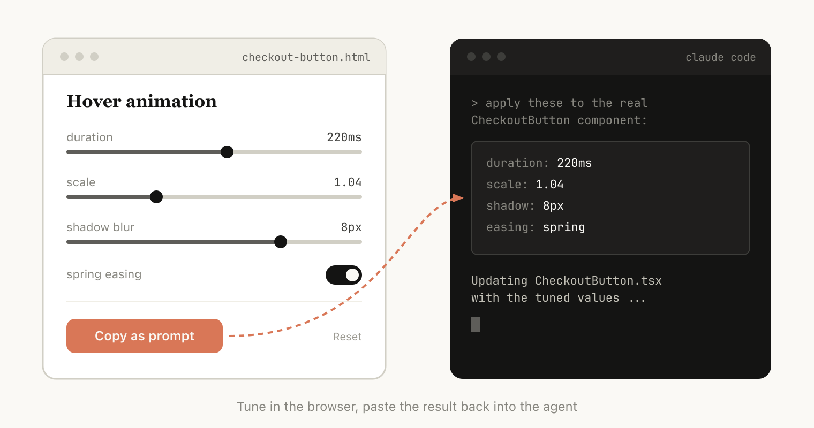
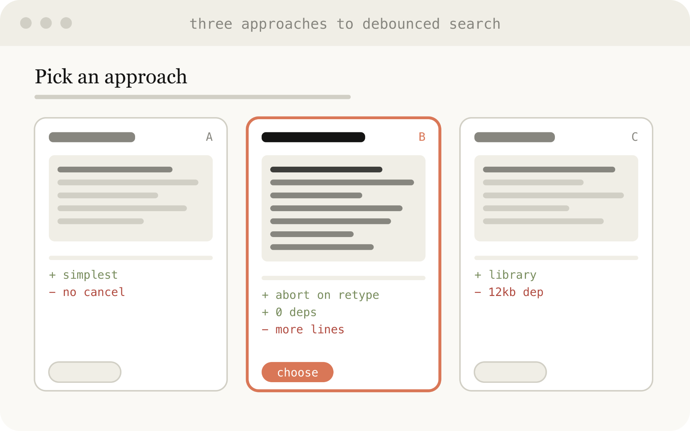

# 使用Claude Code：HTML的不合理有效性

> 发布日期：2026-05-20 · [原文链接](https://claude.com/blog/using-claude-code-the-unreasonable-effectiveness-of-html) · 机器翻译，仅供学习。

# 为什么使用 HTML？

有一些因素使得 HTML 比 Markdown 更适合我现在使用 Claude Code 所做的工作，包括需要或需要执行的任务：

## 信息密度

与 Markdown 相比，HTML 可以传达更丰富的信息。当然，它可以执行简单的文档结构，例如标题和格式设置，但它也可以表示各种其他信息，例如：

- 使用表格的表格数据
- 使用 CSS 设计数据
- SVG 插图
- 带有脚本标签的代码片段
- 使用 HTML 元素与 javascript + CSS 进行交互
- 使用 SVG 和 HTML 的工作流程
- 使用绝对位置和画布的空间数据
- 使用图像标签的图像

在我看来，Claude 可以读取的几乎所有信息都不能用 HTML 有效地表示。这使得模型成为向您传达深入信息并供您查看的高效方式。

我发现，如果无法做到这一点，模型可能会在 Markdown 中做更多低效的事情，比如 ASCII 图表，或者我最喜欢的，用 unicode 字符估计颜色。

‍

## 视觉清晰度和易读性

‍

由于Claude能够处理更复杂的工作，它也能够编写越来越大的规格和计划。我发现我实际上不会阅读超过 100 行的 Markdown 文件，而且我当然无法让组织中的其他人阅读它。

但 HTML 文档更容易阅读，因为 Claude 可以直观地组织结构，非常适合使用选项卡、插图和链接进行导航。它甚至可以响应移动设备，因此您可以根据您的外形尺寸以不同的方式阅读它。

## 轻松共享

Markdown 文件相当难以共享，因为大多数浏览器本身无法很好地呈现它们。您经常需要将它们添加为电子邮件或消息的附件。

只要上传 HTML 文件，您就可以轻松共享链接。您的同事可以在任何地方打开它并轻松引用它。

如果你的规范、报告或 PR 文章是 HTML 格式的，那么有人真正阅读的机会就会更高。

## 双向互动

‍

HTML 还可以让您 [与文档交互](https://x.com/trq212/status/2017024445244924382);例如，您可能想要要求它添加滑块或旋钮来调整设计，或者允许您调整算法中的不同选项以查看会发生什么。您还可以要求它让您将这些更改复制到提示词中，然后粘贴回 Claude Code 中。

当有用时，这可以让您为您正在处理的特定问题创建单独的编辑环境。

## 数据摄取

使用 Claude Code 而不是 Claude.ai 或 Claude Design 来制作 HTML 文件的最大原因之一是 Claude Code 可以摄取的所有上下文。例如，在撰写本文时，我要求 Claude Code 通读我的代码文件夹并找到我生成的所有 HTML 文件，对它们进行分组和分类，然后制作一个包含代表每种类型的图表的 HTML 文件。您在本文中看到的图表是其直接结果。

除了文件系统之外，Claude Code 还可以使用您的 MCP（例如 Slack、Linear 等）、网络浏览器（Chrome 中的 Claude）以及 git 历史记录来查找其他上下文。

# 开始使用

值得注意的是：您不需要做太多事情就可以让 Claude 生成这样的 HTML。您可以简单地将提示词它改为“*制作一个 HTML 文件*“或”*制作一个 HTML 工件*”。最重要的是知道您想要该工件做什么以及如何使用它。随着时间的推移，围绕重复模式建立技能可能是有意义的，但从头开始提示是了解它如何在不同用例中工作的好方法。

## 使用案例

为了使这种方法更加具体，以下是一些 [示例用例](https://thariqs.github.io/html-effectiveness/) 我认为使用 HTML 文件比 Markdown 更有意义。您还可以关注这些用例的 GitHub 图库， [这里](https://github.com/anthropics/html-effectiveness).

### 规格、规划和探索

HTML 是 Claude 深入研究问题的丰富画布。当我开始解决一个问题而不是一个简单的 Markdown 计划时，我希望制作一个 HTML 文件网络。例如，我可能会先要求 Claude Code 集思广益，并对不同的选项进行一些探索。然后我会要求它扩展为一个，也许制作模型或类型接口的示例。最后，当我感觉良好时，我会要求它写一个实施计划。当我对计划感到满意时，我将创建一个新会话并传递所有这些文件以供其实施。

验证时，我还会要求验证智能体读入文件，它将提供有关所需内容的更广泛的上下文。

‍

**示例提示词：**

- *我不确定引导屏幕的方向。生成 6 种截然不同的方法（不同的布局、色调和密度），并将它们作为单个 HTML 文件放在网格中，以便我可以并排比较它们。给每一个标签贴上它所做的权衡。*
- *在 HTML 文件中创建一个完整的实施计划，确保制作一些模型、显示数据流并添加我可能想要查看的重要代码片段。使其易于阅读和消化。*

**将此用于：**

- 探索在代码中实现某些内容的其他方法
- 同时尝试多种视觉设计

### 代码审查和理解

Markdown 文件中的代码可能很难阅读，但使用 HTML，我们可以呈现差异、注释、流程图和模块。  使用 HTML 来理解智能体编写的代码、审核代码或向审核您的代码的人员解释 PR。

‍

**示例提示词：**

*通过创建描述该 PR 的 HTML 工件来帮助我查看该 PR。我对流/背压逻辑不太熟悉，所以重点关注它。使用内联边距注释、按严重性划分的颜色代码结果以及传达概念所需的任何其他内容来渲染实际差异。*

**将此用于：**

- 创建公关
- 审查 PR
- 理解代码中的主题

### 设计和原型

Claude 设计基于 HTML，因为 HTML即使您的最终表面不是 HTML，它在设计上也具有令人难以置信的表现力。 Claude 可以用 HTML 绘制设计草图，然后用您选择的语言编写，无论是 React、Swift 等。

您还可以对交互进行原型设计，例如动画、动作等。考虑要求 Claude 制作滑块、旋钮等，以准确调整您想要的内容。

‍

**示例提示词：**

我想制作一个新的结帐按钮的原型，单击它时会播放动画，然后快速变成紫色。创建一个包含多个滑块和选项的 HTML 文件，以便我在该动画上尝试不同的选项，给我一个复制按钮来复制效果良好的参数。

**将此用于：**

- 创建设计系统工件
- 调整部件
- 可视化组件库
- 动画原型制作

### 报告、研究和学习

Claude Code 在综合多个数据源的信息并将其转换为可读的报告方面非常有效。您可以提示词Claude 搜索您的 Slack、您的代码库、git 历史记录或互联网，并使用它来生成易于阅读的报告。

您可以将其组装为长 HTML 文档、交互式解释器甚至幻灯片/演示文稿的形式。要求 Claude 使用 SVG 绘制图表以帮助可视化。

**示例提示词：**

*我不明白我们的速率限制器实际上是如何工作的。阅读相关代码并生成一个 HTML 解释页面：令牌桶流程图、带注释的 3-4 个关键代码片段以及底部的“陷阱”部分。优化它以供阅读一次的人使用。*

**将此用于：**

- 撰写特征摘要
- 生成解释器
- 起草每周状态报告
- 创建事件报告
- 制作 SVG 插图、流程图和技术图表，

### 自定义编辑界面

有时很难纯粹在文本框中描述您想要的内容。对于这个用例，我经常会要求 Claude 为我正在处理的事情构建一个一次性编辑器：不是一个产品，也不是一个可重用的工具，而是一个专门为这一数据构建的 HTML 文件。

诀窍总是以导出结束：“复制为 JSON”或“复制为提示词”按钮，将我在 UI 中所做的任何操作转回我可以粘贴到 Claude Code 或提交到文件的内容。你留在循环中，但循环变得更加紧密。

**示例提示词：**

- *我需要重新调整这 30 张线性票的优先级。制作一个 HTML 文件，将每张票证作为可拖动的卡片，跨“现在”/“下一步”/“稍后”/“剪切”列。根据您的最佳猜测对它们进行预先排序。添加一个“复制为 Markdown”按钮，该按钮可导出最终排序，并为每个存储桶提供一行基本原理。*
- *这是我们的功能标志配置。为其构建一个基于表单的编辑器，按区域对标志进行分组，显示它们之间的依赖关系，如果我启用先决条件已关闭的标志，则会警告我。添加一个“复制差异”按钮，该按钮只提供更改后的键。*
- *我正在调整这个系统提示词。制作并排编辑器：左侧可编辑提示词，突出显示变量槽，右侧三个示例输入可实时重新渲染填充的模板。添加字符/令牌计数器和复制按钮。*

**将此用于：**

- 重新排序、分类或存储任何内容（票据、测试用例、反馈）
- 编辑结构化配置（功能标志、环境变量、带约束的 JSON/YAML）
- 通过实时预览调整提示词、模板或副本
- 管理数据集 — 批准/拒绝行、标记示例、导出选择
- 注释文档、记录或差异并导出注释
- 选择难以用文本表达的值：颜色、缓动曲线、裁剪区域、cron 计划、正则表达式

### 常见问题

以下是我在 Claude Code 中使用 HTML 时最常被问到的问题，以及我所养成的实用的日常习惯：

**是不是效率比较低？**

虽然 Markdown 通常使用较少的标记，但我发现 HTML 的表现力增加以及我阅读它的可能性更高意味着我获得了更好的整体输出。在 Opus 4.7 中使用 1MM 上下文窗口时，令牌使用量的增加在上下文窗口中并不明显。

**你现在什么时候使用 Markdown？**

老实说，我已经停止在几乎所有事情上完全使用 Markdown，但我可能远远支持 HTML 最大化。

**这就是你取代计划的方式吗？**

我发现我倾向于为计划的不同部分/阶段使用一些不同的 HTML 文件，而不是单一的计划。例如，我可能会用 HTML 制定一个实施计划，然后制作另一个文件来探索 UI，最后制作一个列出每个设计的 HTML 组件。我倾向于保留这些文件作为将来的参考，以及用于验证。

## 随时了解 Claude 的动态

以上所有内容是说我使用 HTML 而不是 Markdown 的真正原因是它让我感觉更了解 Claude。随着 Claude 承担更多任务，我注意到我对计划的阅读不那么仔细了，我想要一种方法来保持参与它的选择，而不是只是把它们交给他们。 HTML 原来就是这样。我现在比以前更有感觉了。”

开始使用 [Claude Code](https://code.claude.com/docs/en/quickstart).

*本文由技术人员 Thariq Shihipar 撰写，表达了他对使用 Claude Code HTML 文件的个人意见和喜爱*.

‍
