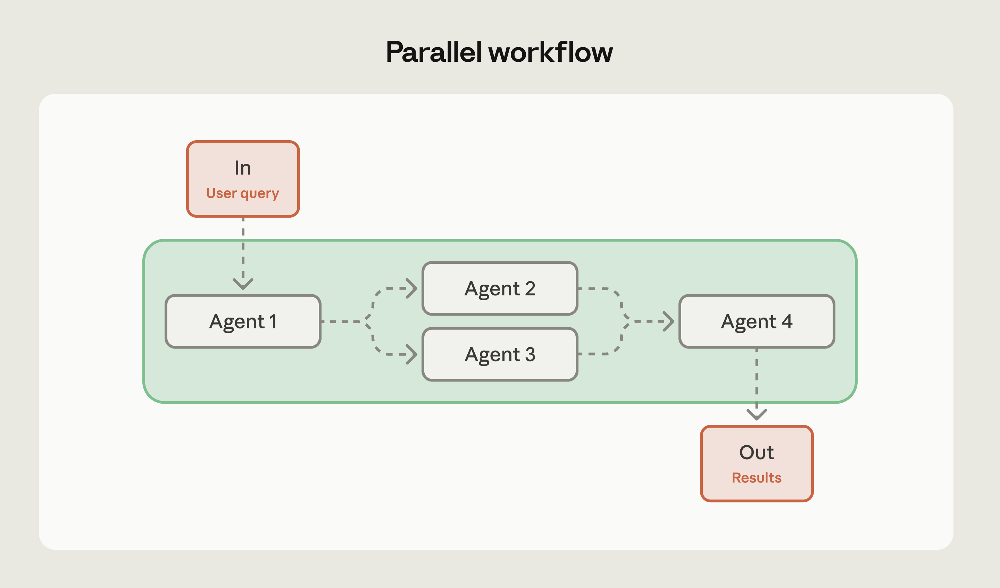

# AI智能体的常见工作流程模式 — 以及何时使用它们

> 发布日期：2026-03-05 · [原文链接](https://claude.com/blog/common-workflow-patterns-for-ai-agents-and-when-to-use-them) · 机器翻译，仅供学习。

[AI智能体](https://www.anthropic.com/research/building-effective-agents) 自主做出决策，而工作流程是您为这种自主性带来结构的方式。他们建立了执行模式，将智能体的功能引导到需要协调步骤、可预测结果和精心安排时间的复杂问题上。

当您需要多个智能体一起工作时，真正的决定是哪种模式适合您的问题。

我们与数十个团队合作构建了 AI智能体，在生产中，三种模式涵盖了绝大多数用例：顺序、并行和评估器优化器。

每一种方法都解决不同的问题，选择错误的方法会导致延迟、令牌或可靠性方面的损失。本文对这三者进行了分解，并提供了关于何时适合以及如何组合它们的指导。

## **工作流程和智能体如何协同工作**

如果您管理过团队，那么您已经了解工作流程。

想象一下制造装配线：每个工作站都有一名熟练工人就其特定任务做出决策，但整体流程是提前设计的 - 即使各个步骤涉及路由或重试等动态决策。

智能体工作流程的运行方式相同。

### **了解工作流程与自主智能体**

工作流程不会取代智能体自主权；它们决定了智能体的应用地点和方式。

**完全自主的智能体决定一切**：使用哪些工具、执行任务的顺序以及何时停止。

**工作流程提供结构**：它建立总体流程，定义检查点，并为智能体在每个步骤中的操作方式设置边界，同时仍然允许在这些边界内进行动态行为。

工作流程中的每个步骤仍然可以利用智能体的推理和工具使用，但整体编排遵循定义的路径。工作流程模式为您提供每个步骤中的智能体智能，以及贯穿整个任务的可预测流程。

## **智能体工作流程模式**

在生产中，我们最常看到三种工作流程模式。将它们视为构建块而不是严格的模板 - 随着需求的发展，您通常会组合或嵌套它们：

1. **顺序工作流程** - 用于按固定顺序执行任务
2. **并行工作流程** — 用于同时在智能体上运行独立任务
3. **评估器-优化器工作流程** - 对于需要迭代细化的输出

每种工作流类型都解决特定的问题，并在复杂性、成本和性能方面进行明确的权衡。

|  | 它解决的问题 | 何时使用 | 权衡 | 效益 |
| --- | --- | --- | --- | --- |
| **顺序** | 任务具有依赖性：步骤 B 需要步骤 A 的输出 | 多阶段流程、数据管道、草稿-审核-完善周期 | 增加延迟（每一步都会等待上一步） | 可以通过让每个智能体专注于一件事来提高准确性 |
| **并行** | 任务是独立的，但一次执行一个任务很慢 | 多维度评估、代码审查、文档分析 | 成本更高（多个并发 API 调用）并且需要聚合策略 | 可以加快工程团队的完成速度并分离关注点 |
| **评估优化器** | 初稿质量不够好 | 技术文档、客户沟通、根据特定标准生成代码 | 增加令牌使用量并增加迭代时间 | 可以通过结构化反馈循环产生更好的输出 |

‍
从解决您的问题的最简单的模式开始。默认为顺序。当延迟成为瓶颈并且任务是独立的时，请转向并行，并且仅当您可以衡量质量改进时才添加评估器优化器循环。

### **顺序工作流程**

顺序工作流按预定顺序执行任务。

智能体在每个阶段处理输入、做出决策、根据需要调用工具，然后将结果传递到下一阶段。结果是一个清晰的操作链，其中输出线性地流经系统。

**何时使用：** 当任务自然分解为具有明确依赖性的不同阶段时，顺序工作流程 Excel。通过将每个智能体集中在特定的子任务上，而不是尝试一次处理所有事情，您可以用一些延迟来换取更高的准确性。

当存在以下情况时，请使用顺序工作流程：

- 多阶段过程，其中每个步骤都取决于先前的输出
- 数据转换管道，每个阶段都会增加特定的价值
- 由于固有依赖性而无法并行化的任务
- 迭代改进周期，如草稿-审查-完善周期

**何时避免：** 当单个智能体可以有效处理整个任务时，或者当智能体需要协作而不是按顺序移交工作时，跳过顺序工作流程。如果您在任务不自然地适合该结构的情况下强制执行顺序步骤，则会增加不必要的复杂性。

**示例：** 当每个步骤涉及真正不同的工作时，顺序工作流程效果很好：

- 生成营销文案，然后将其翻译成多种语言，或者从文档中提取数据，根据模式对其进行验证，然后将其加载到数据库中
- 内容审核管道也按顺序运行良好：提取内容、对其进行分类、应用审核规则，然后进行适当的路由

**专业提示：** 首先尝试将您的管道作为单个智能体，其中步骤只是提示词的一部分。如果这足够好，那么您就已经解决了问题，而没有增加任何复杂性。仅当单个智能体无法可靠处理时才拆分为多步骤工作流程。

### **并行工作流程**

并行工作流程将独立任务分配给同时执行的多个智能体。您不必等待一个智能体完成后再开始下一个，而是一次运行多个智能体并合并它们的结果。

当任务彼此不依赖时，此模式可以提高速度。

该方法类似于分布式系统的扇出/扇入模式。您将相同或相关的工作发送到多个智能体，每个智能体独立处理，然后聚合或综合它们的输出。

智能体不会将工作交给彼此 - 它们自主运行并产生有助于整体任务的结果。

**何时使用：** 当您可以将工作划分为受益于同时处理的独立子任务时，或者当您需要对同一问题进行多个视角时，并行化就有意义。它还可以实现关注点分离：不同的工程师可以独立拥有和优化各个智能体，而他们的工作不会相互干扰。对于复杂的任务，使用单独的 AI 调用处理每项考虑因素通常比尝试在一个调用中兼顾所有内容要好。

考虑并行工作流程：

- 不同的智能体处理不同方面的分段方法（例如一个处理查询，而另一个则筛选安全问题）
- 每个智能体评估不同质量维度的评估场景
- 多个智能体分析相同内容并汇总他们的评估的投票模式

**何时避免：** 当智能体需要累积上下文或必须以彼此的工作为基础时，请勿使用并行工作流程。当 API 配额等资源限制导致并发处理效率低下时，或者当您缺乏处理来自不同智能体的矛盾结果的明确策略时，请跳过此模式。如果结果聚合变得过于复杂或降低输出质量，则并行化不值得。

**示例：** 并行工作流程适用于：

- 自动评估（每个智能体检查不同的质量指标）或代码审查（多个智能体检查不同的漏洞类别）
- 文档分析是另一个强大的用例：并行提取关键主题、情感分析和事实验证，然后结合见解

**专业提示：** 在实施并行智能体之前设计您的聚合策略。你会获得多数票吗？平均置信度得分？遵循最专业的智能体？制定清晰的综合结果计划可以防止您收集相互冲突的输出而无法解决它们。

### **评估器-优化器工作流程**

评估器-优化器工作流程在迭代循环中将两个智能体配对：一个生成内容，另一个根据特定标准对其进行评估，然后生成器根据该反馈进行优化。这将持续下去，直到输出满足您的质量阈值或达到最大迭代次数。

关键的见解是生成和评估是不同的认知任务。将它们分开可以让每个智能体专门化——生成器专注于生成内容，评估器专注于应用一致的质量标准。

**何时使用：** 当您拥有 AI 评估者可以一致应用的清晰、可测量的质量标准，并且首次尝试和最终质量之间的差距足以证明额外的令牌和延迟是合理的时，此模式就会起作用。

考虑评估器-优化器工作流程：

- 具有特定要求的代码生成（安全标准、性能基准、风格指南）
- 专业沟通，语气和精确度至关重要
- 初稿质量始终达不到要求的任何情况

**何时避免：** 当第一次尝试的质量已经满足您的需求时，请跳过评估器-优化器工作流程 - 您将在不必要的迭代中燃烧代币。不要将此模式用于需要立即响应的实时应用程序、基本分类等简单的例行任务，或者当评估标准对于 AI 评估器来说过于主观而无法一致应用时。如果存在确定性工具（例如代码样式的 linter），请改用它们。当资源限制超过质量改进时，也要避免这种模式。

**示例：** 评估器-优化器工作流程适用于：

- 生成 API 文档（生成器编写文档，评估器根据代码库检查完整性、清晰度和准确性）
- 创建客户沟通（生成者起草电子邮件，评估者评估语气和政策合规性）
- 生成 SQL 查询（生成器编写查询，评估器检查效率和安全问题）

**专业提示：** 在开始迭代之前设置明确的停止标准。定义最大迭代次数和特定的质量阈值。如果没有这些护栏，您最终可能会陷入昂贵的循环，评估器不断发现小问题，生成器不断调整，但在停止迭代之前质量就处于稳定状态。知道什么时候足够好。

## **选择正确的工作流程模式**

正确的工作流程模式取决于您的任务结构、质量要求和资源限制。

在选择模式之前，请先尝试将任务作为单个智能体调用。如果这符合您的质量标准，那么您就完成了。如果没有，请找出它的不足之处——这会告诉你要采用哪种模式。

这里有几个问题可以帮助您做出决定：

- 单个智能体能否有效地处理此任务？如果是，则根本不要使用工作流程。
- 该任务是否具有明确的顺序依赖性？使用顺序工作流程。
- 子任务可以独立且同时处理吗？更快完成是否有帮助？考虑并行工作流程。
- 通过迭代细化，质量是否能得到有意义的提高？考虑评估器优化器模式。

选择模式后，请考虑：

- **故障处理：** 定义每个步骤的后备行为和重试逻辑。
- **延迟和成本限制：** 这些决定了您可以运行多少个智能体以及您可以承受多少次迭代。
- **衡量改进：** 使用单个智能体设置基线，以便您可以判断工作流程是否真正有帮助。

**组合模式：** 这些模式并不相互排斥。您可以根据复杂性的需要嵌套它们。

- 评估者-优化器工作流程可以使用并行评估，其中多个评估者同时评估不同的质量维度。
- 顺序工作流可能包括某些阶段的并行处理，其中在进入下一步之前会发生多个独立操作。

关键是将模式复杂性与实际需求相匹配。不要添加并行处理，因为您可以在并发执行提供明显好处时添加它。不要实现评估器优化器循环，除非它们以您可以测量的方式提高输出质量。

## **深思熟虑地改进您的工作流程**

我们最好的建议：从最简单、有效的模式开始。如果顺序工作流程处理您的用例，请不要添加并行化。如果首次尝试的质量足够好，请跳过评估器-优化器循环。

随着需求的变化，这三种模式为您提供了清晰的升级路径。顺序工作流程可以在瓶颈阶段合并并行处理。当质量标准收紧时，智能体式方法可以添加评估，并且由于这些模式是模块化的，因此您不需要完全重写。

有关实施指南、详细示例和高级模式（包括混合方法），请查看我们的完整白皮书： [*构建有效的 AI智能体：架构模式和实现框架*](https://resources.anthropic.com/ty-building-effective-ai-agents).

‍

*建立在* [*Claude开发者平台*](https://claude.com/platform/api) *今天。*
