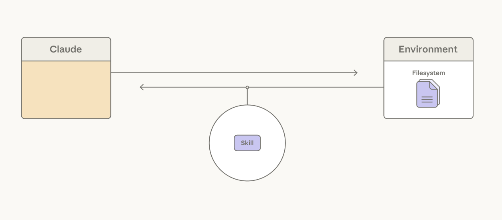

# 智能体线束设计：利用 Claude 智能的 3 种模式

> 发布日期：2026-04-02 · [原文链接](https://claude.com/blog/harnessing-claudes-intelligence) · 机器翻译，仅供学习。

Anthropic 的联合创始人之一 Chris Olah， [说](https://www.darioamodei.com/post/the-urgency-of-interpretability) 像 Claude 这样的生成式 AI 系统的增长速度超过了它们的构建速度。研究人员设定了指导生长的条件，但出现的确切结构或能力并不总是可预测的。

这给使用 Claude 进行构建带来了挑战： [智能体利用编码假设](https://www.anthropic.com/engineering/harness-design-long-running-apps) 关于 Claude 自己不能做什么，但随着 Claude 变得更有能力，这些假设变得陈旧。

智能体线束是围绕模型的软件支架：循环、工具、上下文管理和护栏，将原始智能转化为工作智能体。 [智能体线束设计](https://claude.com/blog/harnessing-claudes-intelligence) 是决定什么属于该脚手架的做法，以及随着模型的改进，你可以取出什么。

在本文中，我们分享了团队在构建与 Claude 不断发展的智能同步、同时平衡延迟和成本的应用程序时应使用的三种模式：使用已知的内容、询问可以停止执行的操作以及仔细设置智能体工具的边界。

### **1. 依靠模型，而不是安全带：使用 Claude 所知道的**

我们建议使用 Claude 熟悉的工具构建应用程序。

2024 年底，Claude 3.5 Sonnet 在 SWE 基准验证上达到 49%，然后 [最先进的](https://www.anthropic.com/engineering/swe-bench-sonnet)——只有一个 [bash工具](https://platform.claude.com/docs/en/agents-and-tools/tool-use/bash-tool) 和一个 [文本编辑器工具](https://platform.claude.com/docs/en/agents-and-tools/tool-use/text-editor-tool) 用于查看、创建和编辑文件。 Claude Code 是以这些相同的工具为基础的。 [重击](https://platform.claude.com/docs/en/agents-and-tools/tool-use/bash-tool) 不是为构建智能体而设计的，但它是 Claude 的工具 *知道* 如何使用并随着时间的推移变得更好使用。


*Claude模型版本的 SWE-bench Verified 基准测试得分突显了其演变。*

我们已经看到 Claude 将这些通用工具组合成解决不同问题的模式。例如， [智能体技能](https://agentskills.io/home), [程序化工具调用](https://platform.claude.com/docs/en/agents-and-tools/tool-use/programmatic-tool-calling), 和 [记忆工具](https://platform.claude.com/docs/en/agents-and-tools/tool-use/memory-tool) 都是由 bash 和文本编辑器工具构建的。


*编程工具调用、技能和内存是我们的 bash 和文本编辑器工具的组成部分。*

### **2. 脱下你的智能体安全带：询问你可以停止做什么**

[智能体利用编码假设](https://www.anthropic.com/engineering/harness-design-long-running-apps) 关于 Claude 自己无法做到的事情。随着 Claude 的能力越来越强，这些假设应该得到检验。

**让Claude编排自己的行动**

一个常见的假设是每个工具结果都应该通过 Claude 回流 [上下文窗口](https://platform.claude.com/docs/en/build-with-claude/context-windows) 告知下一步行动。如果仅需要将令牌传递给下一个工具，或者如果 Claude 仅关心输出的一小部分，则处理工具生成的令牌结果可能会很慢、成本高昂且不必要。


*Claude 调用工具，这些工具在环境中执行。*

考虑读取一个大表来推理单个列：整个表都在上下文中，并且 Claude 为不需要的每一行支付令牌成本。可以在工具设计中解决这个问题，使用 [硬编码过滤器](https://platform.claude.com/docs/en/about-claude/models/migration-guide#additional-recommended-changes)。但这并没有解决智能体线束正在制造的事实 *编排决策* Claude 更适合制作。

给予 Claude [代码执行](https://platform.claude.com/docs/en/agents-and-tools/tool-use/code-execution-tool) 工具（例如， [bash工具](https://platform.claude.com/docs/en/agents-and-tools/tool-use/bash-tool) 或 [特定于语言的 REPL](https://platform.claude.com/docs/en/agents-and-tools/tool-use/code-execution-tool)）解决了这个问题：它允许 Claude 编写代码来表达工具调用及其之间的逻辑。 Claude 不是由线束决定将每个工具调用结果作为令牌进行处理，而是决定将哪些结果传递、过滤或通过管道传输到下一个调用，而无需接触上下文窗口。只有代码执行的输出到达Claude的上下文窗口。


*Claude 可以编写表达工具调用及其之间逻辑的代码。*

编排决策从线束转移到模型。由于代码是 Claude 编排动作的通用方式，因此强大的编码模型也是强大的 *一般* 智能体。 Claude表现强劲 [关于非编码评估](https://claude.com/blog/improved-web-search-with-dynamic-filtering) 使用这种模式：在 BrowseComp 上， [基准](https://arxiv.org/abs/2504.12516) 该测试测试了智能体浏览网页的能力，使 Opus 4.6 能够过滤自己的工具输出，从而将准确率从 45.3% 提高到 61.6%。

**让 Claude 管理自己的上下文**

特定于任务的上下文引导 Claude 使用 bash 和文本编辑器工具等通用工具。一个常见的假设是 [系统提示词](https://platform.claude.com/docs/en/release-notes/system-prompts) 应根据特定任务的说明手工制作。问题在于，使用指令预加载提示词无法在许多任务中扩展：添加的每个令牌都会耗尽 [Claude的注意力预算](https://www.anthropic.com/engineering/effective-context-engineering-for-ai-agents) 用很少使用的指令来预加载上下文是一种浪费。

赋予 Claude 访问能力 [技能](https://platform.claude.com/docs/en/agents-and-tools/agent-skills/overview) 解决了这个问题：每个技能的 YAML frontmatter 是预加载到上下文窗口中的简短描述，提供技能内容的概述。如果任务需要，可以通过 Claude 调用读取文件工具来逐步公开完整的技能。



*Claude 可以使用技能逐步揭示与任务相关的上下文。*

虽然技能使 Claude 可以自由地组装自己的上下文窗口， [上下文编辑](https://platform.claude.com/docs/en/build-with-claude/context-editing) 恰恰相反，它提供了一种方法来选择性地删除已经过时或不相关的上下文，例如旧的工具结果或思维障碍。

与 [分代理](https://code.claude.com/docs/en/sub-agents)，Claude 越来越擅长了解何时分叉到新的上下文窗口以隔离特定任务的工作。 [与 Opus 4.6](https://www-cdn.anthropic.com/0dd865075ad3132672ee0ab40b05a53f14cf5288.pdf)，与最佳单智能体运行相比，生成子代理的能力将 BrowseComp 上的结果提高了 2.8%。

**让 Claude 保留自己的上下文**

长时间运行智能体可以超出单个的限制 [上下文窗口](https://platform.claude.com/docs/en/build-with-claude/context-windows)。一个常见的假设是，内存系统应该依赖于模型周围的检索基础设施。我们的大部分工作都集中在为 Claude 提供简单的方法 *为自己选择* 坚持什么内容。

例如， [压实](https://platform.claude.com/docs/en/build-with-claude/compaction) 让 Claude 总结其过去的背景，以保持长期任务的连续性。在多个版本中，Claude 在选择要记住的内容方面做得更好。 [在浏览器上](https://www-cdn.anthropic.com/14e4fb01875d2a69f646fa5e574dea2b1c0ff7b5.pdf)，例如，智能体式搜索任务，Sonnet 4.5 保持稳定在 43%，无论我们给它的压缩预算是多少。然而，在相同的设置下，Opus 4.5 扩展至 68%，Opus 4.6 达到 84%。

一个 [内存文件夹](https://platform.claude.com/docs/en/agents-and-tools/tool-use/memory-tool) 是另一种方法，允许 Claude 将上下文写入文件，然后根据需要读取它们。我们已经看到 Claude 使用它进行智能体式搜索。在 BrowseComp-Plus 上，为 Sonnet 4.5 提供一个内存文件夹 [准确率从 60.4% 提升至 67.2%](https://www-cdn.anthropic.com/bf10f64990cfda0ba858290be7b8cc6317685f47.pdf).


*Claude 可以将上下文保存到内存文件夹中。*

[长期游戏](https://www.youtube.com/watch?v=CXhYDOvgpuU)，例如 Pokémon，是 Claude 改进的使用内存文件夹的能力的一个例子。 Sonnet 3.5 将记忆视为记录，写下非玩家角色 (NPC) 所说的内容，而不是重要的内容。走了 14,000 步后，它有 31 个文件，其中包括两个关于毛毛虫神奇宝贝的几乎重复的文件，并且仍然位于第二个城镇：

```
caterpie_weedle_info:
- Caterpie and Weedle are both caterpillar Pokémon.
- Caterpie is a caterpillar Pokémon that does not have poison.
- Weedle is a caterpillar Pokémon that does have poison.
- This information is crucial for future encounters and battles.
- If our Pokémon get poisoned, we should seek healing at a Pokémon
  Center as soon as possible.
```

后来模型写了战术笔记。 Opus 4.6，在相同的步数下，有 10 个文件组织成目录，三个健身房徽章，以及一个从其自身失败中提取的学习文件：

```
/gameplay/learnings.md:
- Bellsprout Sleep+Wrap combo: KO FAST with BITE before Sleep
  Powder lands. Don't let it set up!
- Gen 1 Bag Limit: 20 items max. Toss unneeded TMs before dungeons.
- Spin tile mazes: Different entry y-positions lead to DIFFERENT
  destinations. Try ALL entries and chain through multiple pockets.
- B1F y=16 wall CONFIRMED SOLID at ALL x=9-28 (step 14557)
```

### **3. 在安全带设计中仔细设定界限**

智能体线束提供围绕 Claude 的结构，以增强用户体验、成本或安全性。

**设计上下文以最大化缓存命中率**

的 [消息 API](https://platform.claude.com/docs/en/build-with-claude/working-with-messages) 是无国籍的。 Claude 看不到之前回合的对话历史记录。这意味着智能体线束需要在每个回合中将新的上下文与所有过去的操作、工具描述和 Claude 的说明一起打包。

提示词可根据设置进行缓存 [断点](https://platform.claude.com/docs/en/build-with-claude/prompt-caching)。换句话说，Claude API 将上下文写入缓存，直到断点为止，并检查上下文是否与任何先前的缓存条目匹配。

由于缓存了令牌 [是成本的10%](https://platform.claude.com/docs/en/about-claude/pricing) 对于基本输入标记，以下是智能体工具中的一些原则，有助于最大限度地提高缓存命中率：

| 原理 | 描述 |
| --- | --- |
| 静态在前，动态在后 | 订单要求以稳定的内容（系统提示词、工具）为先。 |
| 更新消息 | 附加一个 `<system-reminder>` 在消息中而不是编辑提示词。 |
| 不要更改模型 | 避免在会话期间切换模型。缓存是模型特定的；切换会破坏它们。如果您需要更便宜的模型，请使用子代理。 |
| 小心管理工具 | 工具位于缓存的前缀中。添加或删除一项都会使其失效。对于动态发现，请使用 **工具搜索**，它会在不破坏缓存的情况下进行追加。 |
| 更新断点 | 对于多轮应用程序（例如，智能体），请将断点移至最新消息以保持缓存最新。使用 **自动缓存** 为此。 |

**使用声明性工具实现用户体验、可观察性或安全边界**

Claude 不一定知道应用程序的安全边界或 UX 表面。 Claude 发出工具调用，由线束处理。 bash 工具为 Claude 提供了广泛的编程杠杆来执行操作，但它只为工具提供了一个命令字符串 - 每个操作的形状相同。将操作提升到专用工具可为工具提供特定于操作的挂钩，其中包含可以拦截、门控、渲染或审核的类型化参数。

需要安全边界的操作自然适合使用专用工具。可逆性通常是一个很好的标准，并且难以逆转的操作（例如外部 API 调用）可以通过用户确认进行门控。编写类似的工具 `edit` 可以包含陈旧性检查，以便 Claude 不会覆盖自上次读取以来已更改的文件。


*专用工具可用于基于安全性、用户体验或可观察性考虑的操作。*

当需要向用户呈现操作时，工具也很有用。例如，它们可以呈现为模式，以向用户清楚地显示问题，为用户提供多个选项，或阻止智能体循环，直到用户提供反馈。

最后，工具对于可观察性很有用。当操作是类型化工具时，工具会获取可以记录、跟踪和重放的结构化参数。

应不断重新评估将行动推广为工具的决定。例如，Claude Code 的 [自动模式](https://www.anthropic.com/engineering/claude-code-auto-mode) （发布时处于研究模式）围绕 bash 工具提供了安全边界：它有第二个 Claude 读取命令字符串并判断它是否安全。这个图案可以 *限制* 需要专用工具，并且只应用于用户信任总体方向的任务。 专用工具仍然可以在某些高风险行动中占据一席之地。

### 智能体线束设计的未来

Claude的智能前沿始终在变化。关于 Claude 不能做什么的假设需要随着其功能的每一步变化而重新测试。

我们看到这种模式不断重演。在一个 [我们为长期任务而构建的智能体](https://www.anthropic.com/engineering/harness-design-long-running-apps)，Sonnet 4.5 会因为感知到上下文限制而提前结束。我们添加了重置来清除上下文窗口，以解决这种“上下文焦虑”。在 Opus 4.5 中，这种行为消失了。我们为补偿而构建的上下文重置已成为智能体安全带中的沉重负担。

消除这种沉重负担很重要 [因为它可能会成为瓶颈](http://www.incompleteideas.net/IncIdeas/BitterLesson.html) Claude的性能。随着时间的推移，我们的应用程序中的结构或边界应该根据以下问题进行修剪： *我可以停止做什么？*

*要使用此处讨论的所有工具和模式，请查看* [*我们的 Claude-api 技能*](https://github.com/anthropics/skills/tree/main/skills/claude-api)*.*

### 致谢

由 Claude Platform 团队技术人员 Lance Martin 撰写。特别感谢 Thariq Shihipar、Barry Zhu、Mike Lambert、David Hershey 和Dailiang Li 对所涉及主题的有益讨论。感谢 Lydia Hallie、Lexi Ross、Katelyn Lesse、Andy Schumeister、Rebecca Hiscott、Jake Eaton、Pedram Navid 和 Molly Vorwerck 的编辑审查和反馈。
