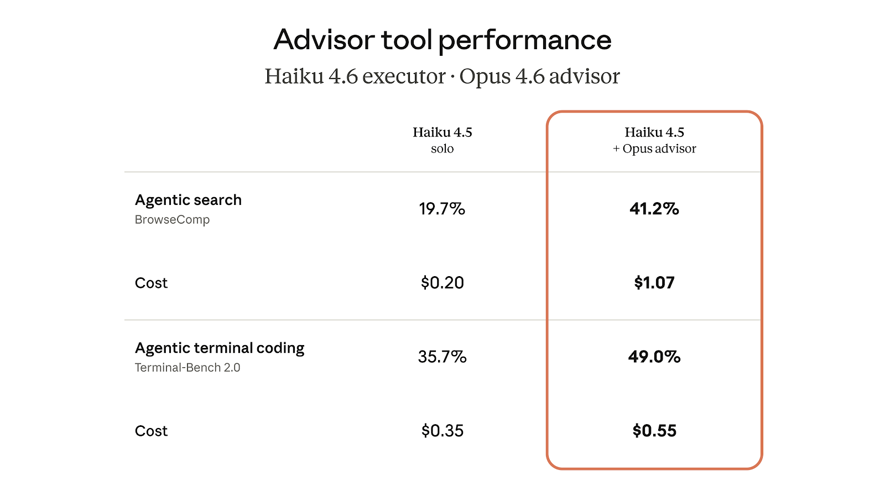

# 顾问策略：给予智能体智力提升

> 发布日期：2026-04-09 · [原文链接](https://claude.com/blog/the-advisor-strategy) · 机器翻译，仅供学习。

想要更好地平衡智能和成本的开发人员已经集中在我们所说的顾问策略上：将 Opus 作为顾问，与 Sonnet 或 Haiku 作为执行者配对。这为您的智能体带来接近 Opus 级别的智能，同时保持成本接近 Sonnet 级别。

今天，我们在 Claude Platform 上引入顾问工具，使顾问策略成为 API 调用中的一行更改。

## 通过顾问策略构建具有成本效益的智能体


通过顾问策略，Sonnet 或 Haiku 作为执行器端到端运行任务，调用工具、读取结果并迭代解决方案。当执行者做出无法合理解决的决定时，它会作为顾问向 Opus 寻求指导。 Opus 访问共享上下文并返回计划、更正或停止信号，然后执行器恢复。顾问从不调用工具或生成面向用户的输出，仅向执行者提供指导。

这反转了常见的子智能体模式，其中较大的协调器模型分解工作并将其委托给较小的工作器模型。在顾问策略中，更小、更具成本效益的模型驱动和升级，无需分解、工作池或编排逻辑。前沿级推理仅在执行器需要时才适用，其余运行仍保持执行器级成本。

在我们的评估中，以 Opus 为顾问的 Sonnet 显示了 2.7 个百分点的增长 [SWE-bench 多语言](https://www.swebench.com/multilingual.html)1 相比单独的 Sonnet，同时将每个智能体式任务的成本降低了 11.9%。


## **顾问工具**

我们将顾问策略引入我们的 API [**顾问工具**](https://platform.claude.com/docs/en/agents-and-tools/tool-use/advisor-tool)，一个服务器端工具，Sonnet 和 Haiku 知道在需要特定任务的指导或帮助时调用。

在我们的评估中，Sonnet 与 Opus 顾问一起提高了 BrowseComp 的分数2 和终端工作台 2.03 基准测试，同时每项任务的成本低于单独的 Sonnet。


该顾问策略还与 Haiku 作为执行者一起工作。在 BrowseComp 上，Haiku 与 Opus 顾问的得分为 41.2%，是其单独得分 19.7% 的两倍多。带有 Opus Advisor 的 Haiku 在分数上比 Sonnet 单独落后 29%，但每项任务的成本降低 85%。该顾问程序相对于单独的 Haiku 增加了成本，但综合价格仍然只是 Sonnet 成本的一小部分，这使其成为需要智能和成本平衡的大批量任务的强大选择。



声明Advisor\_20260301 在您的消息 API 请求中，并且模型切换发生在单个 /v1/messages 请求内 - 无需额外的往返或上下文管理。执行器模型决定何时调用它。当它发生时，我们将策划的上下文路由到顾问模型，返回计划，并且执行器在同一请求中继续执行所有操作。

```
response = client.messages.create(
    model="claude-sonnet-4-6",  # executor
    tools=[
        {
            "type": "advisor_20260301",
            "name": "advisor",
            "model": "claude-opus-4-6",
            "max_uses": 3,
        },
        # ... your other tools
    ],
    messages=[...]
)

# Advisor tokens reported separately
# in the usage block.
```

**定价**。顾问代币按照顾问模型的费率计费；执行者代币按照执行者模型的费率计费。由于顾问程序仅生成一个简短的计划（通常为 400-700 个文本标记），而执行程序以较低的速率处理完整输出，因此总体成本远低于端到端运行顾问程序模型。  **内置成本控制。** 设置 max\_uses 以限制每个请求的 Advisor 调用。顾问代币在使用块中单独报告，以便您可以跟踪每层的支出。

**与您现有的工具一起使用。** 顾问工具只是您的消息 API 请求中的另一个条目。您的智能体可以 [搜索网络](https://platform.claude.com/docs/en/agents-and-tools/tool-use/web-search-tool), [执行代码](https://platform.claude.com/docs/en/agents-and-tools/tool-use/code-execution-tool)，并在同一循环中查阅 Opus。
