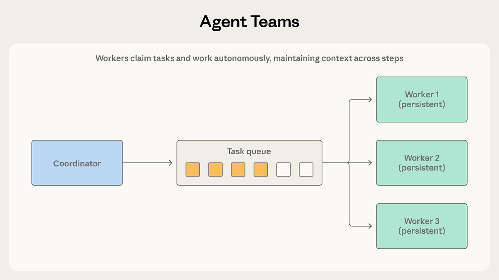
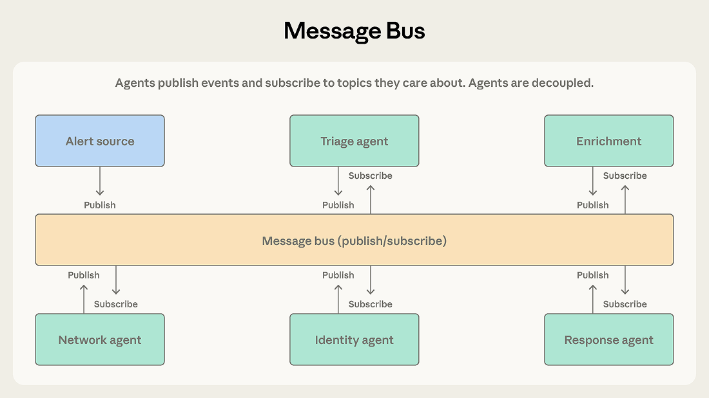
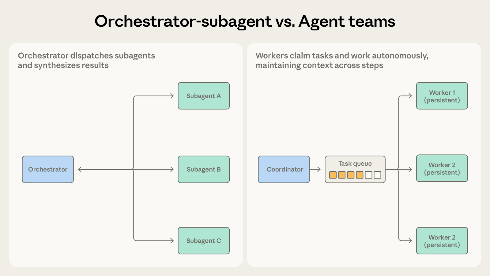

# 多智能体协调模式：五种方法以及何时使用它们

> 发布日期：2026-04-10 · [原文链接](https://claude.com/blog/multi-agent-coordination-patterns) · 机器翻译，仅供学习。

在之前的文章中，我们探讨了何时多个智能体系统提供价值以及何时单个智能体是更好的选择。这篇文章适用于已经做出决定、现在需要决定哪种协调模式适合他们的问题的团队。

我们已经看到团队根据听起来复杂的模式而不是适合当前问题的模式来选择模式。我们建议从最简单的可行模式开始，观察它在哪里遇到困难，然后从那里发展。这篇文章研究了五种模式的机制和局限性：

- **生成器验证器**，对于具有明确评估标准的质量关键输出
- **协调器子代理**，用于具有有界子任务的清晰任务分解
- **智能体团队**，用于并行、独立、长时间运行的子任务
- **消息总线**，适用于具有不断增长的智能体生态系统的事件驱动管道
- **共享状态**，用于智能体以彼此的发现为基础的协作工作

## 模式 1：生成器-验证器

这是最简单的多智能体模式，也是部署最多的模式之一。我们在上一篇文章中将其作为验证子代理模式引入，在这里我们使用更广泛的生成器-验证器框架，因为生成器不需要是协调器。

### 它是如何运作的

‍

生成器接收任务并产生初始输出，并将其传递给验证器进行评估。验证者检查输出是否满足所需标准，并接受其完整或拒绝并提供反馈。如果被拒绝，该反馈将被发送回生成器，生成器使用它来生成修改后的尝试。这个循环一直持续到验证者接受输出或者达到最大迭代次数。

### 效果好的地方

考虑一个支持系统，该系统可以生成对客户票证的电子邮件响应。生成器使用产品文档和票证上下文生成初始响应。验证者根据知识库检查准确性，根据品牌指南评估基调，并确认响应解决了提出的每个问题。失败的检查返回给生成器，并提供反馈，指出确切的问题，例如错误归因于错误定价层的功能或未得到答复的票证问题。

当输出质量至关重要并且可以明确评估标准时，请使用此模式。它对于代码生成（一个智能体编写代码，另一个编写并运行测试）、事实检查、基于标题的评分、合规性验证以及任何错误输出成本超过额外生成周期的领域非常有效。

### 挣扎的地方

验证者的好坏取决于其标准。验证者只被告知检查输出是否良好，没有进一步的标准，将对发电机的输出进行橡皮图章。团队最常失败的原因是在没有定义验证含义的情况下实施循环，这造成了没有实质内容的质量控制的错觉。 （我们在上一篇文章中讨论了这个早期胜利的问题。）

该模式还假设生成和验证是可分离的技能。如果评估一种创造性方法与生成一种创造性方法一样困难，那么验证者可能无法可靠地发现问题。

最后，迭代循环可能会停止。如果生成器无法处理验证者的反馈，系统就会振荡而不收敛。带有回退策略的最大迭代限制（升级到人类，返回带有警告的最佳尝试）可以防止这成为无限循环。

## 模式 2：Orchestrator-子代理

层次结构定义了这种模式。一名智能体充当团队领导，负责计划工作、委派任务并综合结果。子代理处理特定职责并进行报告。

### 它是如何运作的

领导智能体收到任务并确定如何处理它。它可以直接处理一些子任务，同时将其他子任务分派给子代理。子代理完成其工作并返回结果，协调器将其合成为最终输出。

[Claude Code](https://code.claude.com/docs/en/overview) 使用这种模式。主要的智能体编写代码、编辑文件并运行命令本身，当需要搜索大型代码库或调查独立问题时在后台调度子代理，以便在结果流回时工作继续进行。每个子代理在自己的上下文窗口中运行并返回经过提炼的结果。这使得编排器的上下文集中在主要任务上，同时进行探索。

### 效果好的地方

考虑一个自动代码审查系统。当拉取请求到达时，系统需要检查安全漏洞、验证测试覆盖率、评估代码风格并评估架构一致性。每项检查都是不同的，需要不同的上下文，并产生清晰的输出。协调器将每项检查分派给专门的子代理，收集结果并综合统一的审查。

当任务分解清晰并且子任务具有最小的相互依赖性时，请使用此模式。协调者对总体目标保持一致的看法，而子代理则专注于特定职责。

### 挣扎的地方

协调器成为信息瓶颈。当子代理发现与另一个子代理的工作相关的内容时，该信息必须通过协调器传回。如果安全子代理发现影响架构子代理分析的身份验证缺陷，则编排器必须识别这种依赖性并适当地路由信息。经过几次这样的交接后，关键细节常常会丢失或被总结掉。

顺序执行也限制了吞吐量。除非显式并行化，否则子代理会依次运行，这意味着系统会产生多个智能体令牌成本，而不会带来速度优势。

## 模式3：智能体团队

当工作分解为可以长时间独立进行的并行子任务时，协调器子代理可能会受到不必要的限制。

### 它是如何运作的

协调器生成多个工作进程智能体作为独立进程。队友从共享队列中领取任务，跨多个步骤自主处理任务，并发出完成信号。

与 Orchestrator-Subagent 的区别在于工作人员持久性。协调器为一个有界子任务生成一个子代理，子代理在返回结果后终止。队友在许多任务中保持活力，积累背景和领域专业知识，随着时间的推移提高他们的表现。协调员分配工作并收集结果，但不会在任务之间重置工作人员。

### 效果好的地方

考虑将大型代码库从一个框架迁移到另一个框架。团队成员可以使用自己的依赖项、测试套件和部署配置独立迁移每个服务。协调员将每个服务分配给一名队友，每个队友自主地完成迁移：依赖项更新、代码更改、测试修复、验证。协调器收集已完成的迁移并在整个系统中运行集成测试。

当子任务是独立的并且从持续的多步骤工作中受益时，请使用此模式。每个队友都会建立有关其领域的上下文，而不是每次调度都从头开始。

### 挣扎的地方

独立性是关键要求。与编排器子代理不同，编排器可以在子代理和路由信息之间进行调解，而团队成员自主操作并且无法轻松共享中间结果。如果一个团队成员的工作影响了另一个团队成员的工作，那么双方都不会意识到，他们的输出可能会发生冲突。

完成检测也更加困难。由于队友在不同的时间内自主工作，协调员必须处理部分完成的情况，其中一名队友在两分钟内完成，而另一名队友则需要二十分钟。

共享资源使这两个问题变得更加复杂。当多个团队成员操作相同的代码库、数据库或文件系统时，两个团队成员可能会编辑同一文件或进行不兼容的更改。该模式需要仔细的任务划分和冲突解决机制。

## 模式4：消息总线

随着智能体数量的增加和交互模式变得复杂，直接协调变得难以管理。消息总线引入了共享通信层，智能体在其中发布和订阅事件。

### 它是如何运作的

智能体通过两个原语进行交互：发布和订阅。智能体订阅自己关心的主题，路由器下发匹配的消息。具有新功能的新型智能体可以开始接收相关工作，而无需重新连接现有连接。

### 效果好的地方

安全运营自动化系统展示了这种模式的优势所在。警报来自多个来源，分类智能体按严重性和类型对每个来源进行分类，将高严重性网络警报路由到网络调查智能体，将凭证相关警报路由到身份分析智能体。每个调查智能体都可以发布上下文收集智能体满足的丰富请求。调查结果流向响应协调智能体，由其确定适当的操作。

此管道适合消息总线，因为事件从一个阶段流向下一阶段，团队可以随着威胁类别的发展添加新的智能体类型，并且团队可以独立开发和部署智能体。

将此模式用于事件驱动的管道，其中工作流从事件而不是预定序列中出现，并且智能体生态系统可能会增长。

### 挣扎的地方

事件驱动通信的灵活性使得跟踪变得更加困难。当警报触发跨越五个智能体的一系列事件时，了解发生的情况需要仔细记录和关联。调试比遵循编排器的顺序决策更困难。

路由准确性也至关重要。如果路由器错误分类或丢弃事件，系统会默默地失败，不进行任何处理，但永远不会崩溃。基于 LLM 的路由器提供语义灵活性，但引入了自己的故障模式。

## 模式 5：共享状态

先前模式中的协调者、团队领导和消息路由器都集中管理信息流。共享状态通过让智能体通过所有人都可以直接读写的持久存储进行协调来消除中介。

### 它是如何运作的

智能体自主操作，读取和写入共享数据库、文件系统或文档。没有中央协调员。智能体检查商店中的相关信息，根据发现的信息采取行动，并将结果写回。工作通常在初始化步骤向存储中播种问题或数据集时开始，并在满足终止条件时结束：时间限制、收敛阈值或确定存储包含足够答案的指定智能体。

### 效果好的地方

考虑一个研究综合系统，其中多个智能体调查复杂问题的不同方面。一个探索学术文献，另一个分析行业报告，第三个检查专利申请，第四个监视新闻报道。每个智能体的的调查结果都可以为其他人的调查提供信息。学术文献智能体可能会发现一位关键研究人员，其公司智能体应该更仔细地研究。

通过共享状态，发现的结果会直接进入商店。业界智能体可以立即看到学术智能体的的发现，而无需等待协调员路由信息。智能体以彼此的工作为基础，共享商店成为一个不断发展的知识库。

共享状态还消除了协调器作为单点故障的情况。如果任何一个智能体停止，其他的继续读写。在编排器和消息总线系统中，协调器或路由器故障会导致一切停止。

### 挣扎的地方

如果没有明确的协调，智能体可能会重复工作或采取相互矛盾的方法。两个智能体可能会独立调查同一线索。智能体交互产生系统行为，而不是自上而下的设计，这使得结果更难以预测。

更难的故障模式是反应循环。例如，智能体A 写入一个结果，智能体B 读取它并写入后续结果，智能体A 查看后续结果并做出响应。系统会不断在不收敛的工作上燃烧代币。重复工作和并发写入具有已知的工程修复（锁定、版本控制、分区）。反应式循环是一个行为问题，需要一流的终止条件：时间预算、收敛阈值（N 个循环没有新发现）或指定的智能体，其工作是决定存储何时包含足够的答案。将终止视为事后想法的系统往往会无限循环或在一个智能体的上下文填满时任意停止。

## 模式之间的选择和演变

正确的模式取决于系统的一些结构性问题。在我们之前的文章中，我们主张以上下文为中心的分解，即根据每个智能体需要的上下文而不是它所做的工作类型来划分工作。这个原则也适用于此。这些模式的不同之处在于管理上下文边界和信息流的方式。

### Orchestrator-子代理与智能体团队

两者都涉及协调员向其他智能体派遣工作。问题是工作人员需要维持他们的环境多长时间。

- **选择 Orchestrator-子代理** 当子任务简短、重点突出并产生明确的输出时。代码审查系统在这里运行良好，因为每次检查都会运行分析、生成报告并在单个有界调用内返回。子代理不需要跨多个周期携带上下文。
- **选择智能体团队** 当子任务受益于持续的、多步骤的工作时。代码库迁移适合这里，因为每个团队成员都真正熟悉其分配的服务：依赖关系图、测试模式、部署配置。累积的上下文以一次性调度无法复制的方式提高了性能。

当子代理需要跨调用保留状态时，智能体团队更适合。

### Orchestrator-子代理与消息总线

两者都可以处理多步骤工作流程。问题是工作流程结构的可预测性如何。

- **选择 Orchestrator-子代理** 当预先知道步骤顺序时。代码审查系统遵循固定的流程：接收 PR、运行检查、综合结果。
- **选择消息总线** 当工作流程从事件中出现时，可能会根据发现的内容而有所不同。安全操作系统无法预测什么警报将到达或它们需要什么调查路径。可能会出现需要新处理的新警报类型。消息总线通过将事件路由到有能力的智能体而不是遵循预定的顺序来适应这种变化。

随着条件逻辑在编排器中累积以处理越来越多的情况，消息总线使路由变得明确且可扩展。

### 智能体团队与共享状态

两者都涉及智能体自主工作。问题是智能体是否需要对方的调查结果。

- **选择智能体团队** 当智能体在不交互的单独分区上工作时。代码库迁移适合这里，因为每个团队成员都会处理其服务，而协调员最后会合并结果。
- **选择共享状态** 当智能体的工作是协作的时，结果应该在他们之间实时流动。研究综合系统是一个更好的匹配，因为关键研究人员的学术智能体的发现立即与行业智能体的调查相关。

一旦团队成员需要相互沟通而不仅仅是共享最终结果，共享状态会让这变得更加自然。

### 消息总线与共享状态

两者都支持复杂的多智能体协调。问题是工作是作为离散事件流动还是累积成共享知识库。

- **选择消息总线** 当智能体对管道中的事件做出反应时。安全操作系统逐步处理警报，每个事件在完成之前都会触发下一个事件。该模式能够有效地将事件路由到有能力的智能体。
- **选择共享状态** 当智能体建立在随着时间的推移积累的发现之上时。研究综合系统不断收集知识。智能体反复回到商店，看看其他人的发现并调整他们的调查。

消息总线仍然有一个路由器，这意味着中央组件决定事件的去向。共享状态是去中心化的。如果消除单点故障是首要任务，那么共享状态可以更全面地实现这一点。

如果消息总线系统中的智能体发布事件来共享发现而不是触发操作，则共享状态更适合。

## 开始使用

生产系统经常组合模式。常见的混合方式使用 Orchestrator-subagent 来实现整个工作流程，并为协作繁重的子任务提供共享状态。另一种方法使用消息总线进行事件路由，并由智能体团队式工作人员处理每种事件类型。这些模式是构建块，而不是相互排斥的选择。

下表总结了每种模式何时适用。

| 情况 | 图案 |
| --- | --- |
| 质量关键的输出，明确的评估标准 | 生成器验证器 |
| 任务分解清晰，子任务有界 | Orchestrator-子代理 |
| 并行工作负载，独立的长时间运行的子任务 | 智能体团队 |
| 事件驱动的管道，不断发展的智能体生态系统 | 消息总线 |
| 合作研究，智能体分享发现 | 共享状态 |
| 不需要单点故障 | 共享状态 |

对于大多数用例，我们建议从 Orchestrator-subagent 开始。它以最少的协调开销处理最广泛的问题。观察它的困境，然后随着特定需求变得清晰而向其他模式发展。

‍*在接下来的文章中，我们将通过生产实现和案例研究深入研究每种模式。有关多智能体系统何时值得投资的背景信息，请参阅* [*构建多智能体系统：何时以及如何使用它们*](https://claude.com/blog/building-multi-agent-systems-when-and-how-to-use-them)*.*

## **致谢**

由 Cara Phillips 撰写，Eugene Yan、Jiri De Jonghe、Samuel Weller 和 Erik S.
