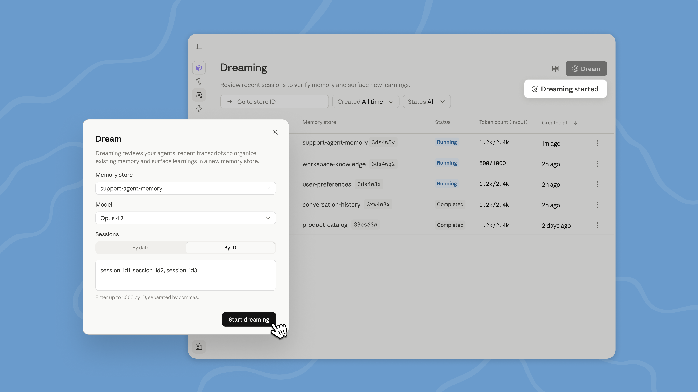

# Claude Managed Agents 中的新增功能：梦想、结果和多代理编排

> 发布日期：2026-05-19 · [原文链接](https://claude.com/blog/new-in-claude-managed-agents) · 机器翻译，仅供学习。

今天我们将开启梦想之旅 [Claude Managed Agents](https://claude.com/blog/claude-managed-agents) 作为研究预览。梦想延伸 [记忆](https://claude.com/blog/claude-managed-agents-memory) 通过回顾过去的课程来寻找模式并帮助智能体自我改进。我们还为使用托管智能体进行构建的开发人员提供结果、多代理编排和 Webhook。总之，这些更新使智能体更有能力以最少的转向处理复杂的任务。

## **用梦想打造自我提升智能体**

[做梦](https://platform.claude.com/docs/en/managed-agents/dreams) 是 Claude Managed Agents 中的一个预定进程，用于审查智能体会话和内存存储、提取模式并整理内存，以便智能体随着时间的推移而改进。你可以决定你想要多少控制权：梦可以自动更新记忆，或者你可以在改变发生之前检查它们。

梦想表面的模式是单个智能体自己无法看到的，包括重复出现的错误、智能体聚合的工作流程以及整个团队共享的偏好。它还会重组记忆，使其在进化过程中保持高信号。这对于长时间运行的工作和多代理编排特别有用。

记忆和梦想共同构成了一个强大的记忆系统，用于自我完善智能体。内存让每个智能体捕捉它学到的东西 *因为它有效*。梦想可以提炼记忆 *会话之间*，在智能体中提取共享的知识并保持更新。

Dreaming 可在 Claude Platform 上的托管智能体中使用；开发商可以 [在此请求访问权限](https://claude.com/form/claude-managed-agents).

## **结果：定义智能体工作的质量标准**

与 [结果](https://platform.claude.com/docs/en/managed-agents/define-outcomes)，您写了一个标题来描述成功是什么样子，并且智能体致力于实现它。单独的评分器在其自己的上下文窗口中根据您的标准评估输出，因此它不受智能体的推理的影响。当出现问题时，评分者会查明需要更改的内容，然后智能体会再次通过。

当智能体知道什么是“好”时，他们就会尽最大努力工作。例如，结构框架、表示标准或需要满足的一组要求。有了结果，智能体就可以根据该条检查他们的工作并自我纠正，直到输出足够好，而无需人工审查每次尝试。

结果对于需要关注细节和详尽覆盖的任务特别有用。它还适用于主观质量，例如文案是否与品牌声音匹配或设计是否遵循视觉准则。在测试中，与标准提示循环相比，结果将任务成功率提高了 10 个百分点，其中在最难的问题上收益最大。结果还提高了文件生成质量，在我们的内部基准测试中，docx 任务成功率提高了 8.4%，pptx 任务成功率提高了 10.1%。

您现在还可以定义结果，让智能体运行，并收到通知 [网络钩子](http://platform.claude.com/docs/en/managed-agents/webhooks) 当它完成时。

## **多代理编排：使用多个智能体处理复杂任务**

当单个智能体的工作太多而无法做好时， [多代理编排](https://platform.claude.com/docs/en/managed-agents/multi-agent) 让领导智能体将工作分解为多个部分，并将每个部分委托给拥有自己的模型、提示词和工具的专家。例如，领导智能体可以运行调查，而子代理则通过部署历史记录、错误日志、指标和支持票证展开调查。

这些专家在共享文件系统上并行工作，并为领先的智能体的整体环境做出贡献。领导智能体可以在工作流程中与其他智能体一起检查，因为事件是持久的，并且每个智能体都会记住它所做的事情。您还可以追踪其中的每一步 [Claude 控制台](https://platform.claude.com/)：智能体做了什么、按什么顺序以及原因，使您可以全面了解任务是如何委派和执行的。

## **正在建设哪些团队**

团队正在使用梦想、成果和多代理编排来交付智能体，以验证自己的工作、跨会话学习并并行化复杂的工作：

- [哈维](https://www.harvey.ai/) 使用托管智能体来协调复杂的法律工作，例如长格式起草和文档创建。通过做梦，他们的智能体会记住他们在会话之间学到的东西，包括文件类型解决方法和特定于工具的模式。他们的测试完成率提高了约 6 倍。
- Netflix 的平台团队构建了一个分析智能体，可以处理来自不同来源的数百个构建的日志。对于影响数千个应用程序的更改，重要的是找到其中许多应用程序中重复出现的问题。多代理编排让智能体可以并行分析批次，并仅显示值得采取行动的模式。
- [螺旋](http://writewithspiral.com/) by Every 正在使用多代理编排和结果来支持其新 API 和 CLI 背后的写作智能体。引线智能体运行于 [Haiku](https://www.anthropic.com/claude/haiku)：它会处理传入的请求，在需要时提出快速的后续问题，然后将起草工作委托给运行在 [Opus](https://www.anthropic.com/claude/opus)。当用户请求多个草稿时，子代理会并行运行。写作质量是 Spiral 的核心价值，因此他们用结果来强化它。每份草稿均根据 Every 的编辑原则和用户声音的评分标准进行评分，两者均来自记忆。仅返回符合标准的草稿。
- [智慧文档](https://www.wisedocs.ai/blogs/building-managed-agents-for-document-verification) 在托管智能体上构建了文档质量检查智能体，使用结果根据内部指南对每个审核进行评分。现在，审核运行速度提高了 50%，同时与团队的标准保持一致。
