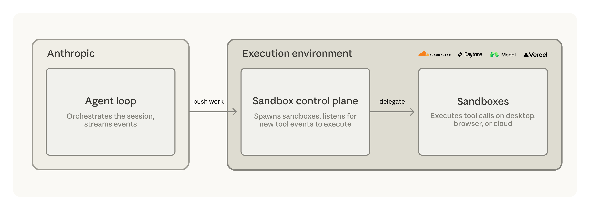

# Claude Managed Agents 中的新增功能：自托管沙箱和 MCP 隧道

> 发布日期：2026-05-19 · [原文链接](https://claude.com/blog/claude-managed-agents-updates) · 机器翻译，仅供学习。

从今天开始， [Claude Managed Agents](https://claude.com/blog/claude-managed-agents) 可以在您控制的沙箱中运行并连接到您的私有模型上下文协议 (MCP) 服务器。智能体执行工具的沙箱及其所到达的服务都在您的企业既定边界内、在您的安全和运行时控制下运行。

沙箱在您自己的基础设施上运行，或者与托管提供商一起运行，例如 [云耀](https://developers.cloudflare.com/sandbox/claude-managed-agents/), [代托纳](https://www.daytona.io/docs/en/guides/claude/claude-managed-agents), [莫代尔](https://github.com/modal-labs/claude-managed-agents-modal-sandbox/tree/main), 或 [韦尔塞尔](https://vercel.com/kb/guide/run-claude-managed-agent-tools-with-vercel-sandbox) 为您处理计算和隔离。

在 Claude Platform 上， [自托管沙箱](https://platform.claude.com/docs/en/managed-agents/self-hosted-sandboxes) 在公共测试版和研究预览中的 MCP 隧道中可用（[请求访问](https://claude.com/form/claude-managed-agents)).

## **`Self-hosted sandboxes: keep agent execution within your perimeter`**

自托管沙箱允许 Claude 托管智能体在您控制的基础设施上或通过托管沙箱提供商执行工具。代码执行、敏感文件、包、服务和数据保留在您的企业范围内，受您的安全和运行时控制。

通过自托管沙箱，您可以将敏感文件、包和服务保存在您自己的基础设施中或托管沙箱提供商处。的 [智能体循环](https://www.anthropic.com/engineering/managed-agents) 处理编排、上下文管理和错误恢复的功能保留在 Anthropic 的基础设施上，而工具执行则转移到您自己的配置环境中。

在您的边界内，网络策略、审核日志记录和安全工具已经就位，并且文件和存储库不会离开。您还可以控制计算：资源大小调整和运行时映像由您自行设置，因此运行计算量大的工作（例如长时间构建或映像生成）的智能体可以获得任务所需的 CPU、内存和容量。

## **选择您的沙盒客户端**

带上您想要的任何沙箱客户端，或者从我们支持的提供商之一开始：

- [**云耀**](https://developers.cloudflare.com/sandbox/claude-managed-agents/) 使用 microVM 和轻量级隔离大规模运行沙箱。通过零信任秘密注入、可自定义的代理来审核、重新路由或修改出口，以及通过 Cloudflare 网络连接到内部服务的能力，出站网络请求由您控制。 [**幅度**](https://amplitude.com/blog/design-agent) 正在托管智能体和 Cloudflare 上构建 Design智能体，这是一种用于品牌生产 UI 和营销设计的内部工具，以实现更严格的可观察性和控制。
- [**代托纳**](https://www.daytona.io/docs/en/guides/claude/claude-managed-agents) 沙箱是完全可组合的计算机，长期运行且有状态。相同的原语运行快速突发或运行数小时的智能体。当会话通过 SSH 或经过身份验证的预览 URL 运行时，沙箱保持可访问状态，或者可以暂停和恢复并保留完整状态。 [**克莱的**](http://clay.com/)GTM 工程智能体、Sculptor 可在托管智能体和 Daytona 上自主构建、测试和监控工作流程。
- [**莫代尔**](https://modal.com/blog/introducing-claude-managed-agents-with-modal-sandboxes) 是专为 AI 工作负载构建的云平台，其中沙箱与 Modal 的功能、存储和网络原语共享相同的基础，为您提供构建生产 AI 系统所需的一切。 Modal 的自定义容器运行时可在任何图像上提供亚秒级启动，可扩展到数十万个并发沙箱，并按需提供 CPU 和 GPU 资源。
- [**韦尔塞尔**](https://vercel.com/kb/guide/run-claude-managed-agent-tools-with-vercel-sandbox)沙箱结合了虚拟机安全性、VPC 对等互连，并以毫秒级启动时间带来您自己的云。托管智能体处理模型、工具和会话状​​态，而 Vercel Sandbox 防火墙在网络边界注入凭据，因此它们永远不会进入沙箱。 [**罗戈**](https://rogo.ai/)是一个用于机构金融的 AI 平台，正在托管智能体和 Vercel Sandbox 上构建分析师智能体，以安全地处理其专有数据。

## **MCP 隧道：连接到专用网络内的服务**

[MCP 隧道](http://platform.claude.com/docs/en/agents-and-tools/mcp-tunnels/overview) 将 Claude Managed Agents 连接到专用网络内的模型上下文协议 (MCP) 服务器，而不将其暴露于公共互联网。内部数据库、私有 API、知识库和票务系统成为您的智能体可以调用的工具。您部署的轻量级网关会创建单个出站连接，没有入站防火墙规则，没有公共端点，并且流量进行端到端加密。

受管智能体和消息 API 支持 MCP 隧道。 MCP 隧道是通过工作区设置进行管理的 [Claude 控制台](https://platform.claude.com/) 由组织管理员。

