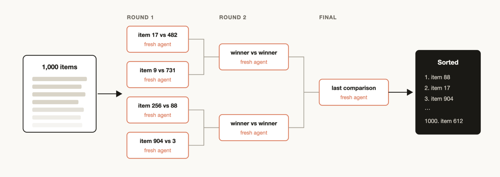
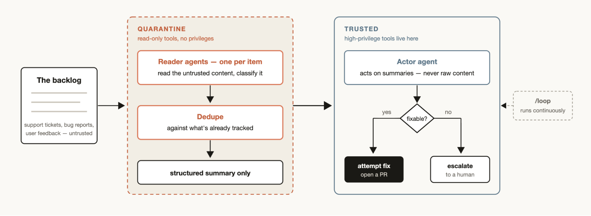

# 适用于每项任务的工具：Claude Code 中的动态工作流程

> 发布日期：2026-06-02 · [原文链接](https://claude.com/blog/a-harness-for-every-task-dynamic-workflows-in-claude-code) · 机器翻译，仅供学习。

上周我们发布了 [动态工作流程](https://code.claude.com/docs/en/workflows) 在 Claude Code 中。 Claude 现在可以编写自己的  [马具](https://code.claude.com/docs/en/glossary#agentic-harness) 即时、针对手头的任务定制。

虽然默认的 Claude Code 线束是为编码而构建的，但它对于许多其他类型的任务也很有用，因为事实证明，许多任务类似于编码任务。但对于某些类别的任务，我们必须在 Claude Code 之上构建自定义线束才能实现峰值性能，例如 [研究](https://support.claude.com/en/articles/11088861-using-research-on-claude), [安全分析](https://support.claude.com/en/articles/11932705-automated-security-reviews-in-claude-code), [智能体团队](https://code.claude.com/docs/en/agent-teams), 或 [代码审查](https://code.claude.com/docs/en/code-review).

工作流程允许您动态创建基于 Claude Code 构建的线束，使 Claude 能够更原生地解决所有这些问题。您还可以与其他人共享和重用这些工作流程。

在本文中，我将介绍我最初的工作流程经验和学习内容，以便您可以充分利用。请记住，最佳实践仍在发展中：动态工作流程通常使用更多令牌，最适合复杂、高价值的任务。

## 示例提示词

在深入探讨技术细节之前，我想从几个示例提示词开始，让您思考工作流程的可能性：

“这个测试可能在 50 次运行中有 1 次失败。建立一个工作流程来重现它。形成有关比赛的相互竞争的理论，直到一种理论经得起证据考验才停止。”

“使用工作流程，检查我最近的 50 个会话，并从它们中找出我不断做出的修正，并将重复出现的修正变成 `CLAUDE.md` 规则”

“使用工作流程来挖掘过去六个月 Slack 中的#incidents，并找到没有人提交罚单的重复出现的根本原因。”

“采用我的商业计划并运行一个工作流程，其中不同的智能体将其与投资者、客户和竞争对手的观点分开。”

“这是一个包含 80 份简历的文件夹，使用工作流程对后端角色进行排名，并仔细检查前十名。使用 AskUserQuestion 工具作为标题来面试我。”

“我需要为这个 CLI 工具命名。使用工作流程集思广益一堆选项，并举办锦标赛以选出前 3 个选项。”

“使用工作流程将我们的用户模型重命名为到处帐户。”

“仔细阅读我的博客文章草稿，并使用工作流程验证针对代码库的每项技术声明，我不想发布任何错误的内容。”

## 动态工作流程如何运作

动态工作流程执行一个带有一些特殊函数的 JavaScript 文件，这些函数有助于生成和协调 [分代理](https://code.claude.com/docs/en/sub-agents):

动态工作流程还包括标准 JavaScript 函数，例如 JSON、Math 和 Array，以帮助处理数据。

了解动态工作流可以决定智能体使用哪个模型以及子代理是否在自己的工作树中运行，从而允许 Claude 选择所需的智能级别和隔离，这一点特别有用。

如果工作流被中断，例如由于用户操作或退出终端，恢复会话将允许工作流从中断处继续。

## 为什么采用动态工作流程

当您要求默认的 Claude Code 线束执行任务时，它需要在同一上下文窗口中计划和执行。对于许多编码任务来说，这是非常有效的，但它可能会在长时间运行、大规模并行、高度结构化和/或对抗性任务中崩溃。

这是因为 Claude 在单个上下文窗口中处理复杂任务的时间越长，它就越容易受到一些特定故障模式的影响：

- **智能体式懒惰** 指 Claude 在完成特别复杂的多部分任务之前停止并在部分进度后声明工作已完成的情况，例如解决安全审查中 50 项中的 35 项。
- **自我偏好偏见** 指的是 Claude 倾向于偏爱自己的结果或发现，尤其是当被要求根据某个标题来验证或判断它们时。
- **目标漂移** 指的是在许多回合中逐渐失去对原始目标的保真度，尤其是在压缩之后。每个汇总步骤都是有损的，并且诸如边缘情况要求或“不执行 X”约束之类的细节可能会丢失。

创建工作流程有助于通过编排单独的 Claude 子代理及其自己的上下文窗口和集中、孤立的目标来解决这些问题。

## 动态与静态工作流程

您之前可能已使用 Claude Agent SDK 创建了静态工作流程或 `claude -p` 将 Claude Code 的多个实例协调在一起。

但由于静态工作流程需要适用于所有边缘情况，因此它们通常更通用。与 [Claude Opus 4.8](https://www.anthropic.com/news/claude-opus-4-8) 和动态工作流程，Claude 现在足够智能，可以为您的用例编写定制的线束。

## 使用动态工作流程时的有用模式

您只需要求 Claude 制作一个动态工作流程，或使用触发词“即可开始使用动态工作流程”`ultracode`”以确保 Claude Code 创建工作流程。

但是，建立一个关于动态工作流程如何工作的心理模型将帮助您了解何时使用它们以及如何通过提示词推动 Claude。

在构建工作流程时，Claude 可能会使用和组合一些常见模式：

### 分类和行动

使用分类器智能体来决定任务类型，然后根据任务路由到不同的智能体或行为。或者，在最后使用分类器来确定输出。

### 扇出和合成

将任务拆分为许多较小的步骤，在每个步骤上运行智能体，然后综合这些结果。当存在大量较小的步骤时，或者当每个步骤受益于其自己的干净上下文窗口时，这特别有用，因此它们不会干扰或交叉污染。综合步骤是一个障碍 - 它等待所有扇出智能体，然后将它们的结构化输出合并为一个结果。

### 对抗性验证

对于每个生成的智能体，运行单独生成的智能体，以根据标题或标准进行对抗性验证其输出。

### 生成和过滤

生成关于某个主题的大量想法，然后通过标题或验证对其进行过滤，删除重复项并仅返回最高质量、经过测试的想法。

### 锦标赛

不要划分工作，而是让智能体进行竞争。生成 N 个智能体，每个智能体都使用不同的方法尝试相同的任务。提示词或模型然后使用评判智能体以成对方式评判结果，直到产生获胜者。

### 循环直到完成

对于工作量未知的任务，循环生成智能体直到满足停止条件（没有新发现，或日志中不再有错误），而不是固定的传递次数。

## 使用案例

创造性地思考何时以及如何要求 Claude Code 制定动态工作流程。我发现工作流程有时对于非技术工作更有用。

### 迁移和重构

[包子](https://bun.com/) 使用工作流程从 Zig 重写为 Rust。您可以阅读有关如何完成此操作的更多信息 [Jared 的 X 话题](https://x.com/jarredsumner/status/2060050578026189172).

关键是将任务分解为一系列需要操作的步骤，例如调用站点、失败的测试、模块等。为工作树中的每个修复分派一个子代理来进行修复，然后让另一个智能体进行对抗性审查，并将它们合并。考虑告诉智能体不要使用资源密集型命令，以便您可以最大限度地并行化，而不会耗尽计算机上的资源。

### 深入研究

我们发表了深入的研究技能（`/deep-research`）在使用动态工作流程的 Claude Code 内。具体来说，它分散网络搜索、获取来源、对抗性地验证他们的主张，并综合引用的报告。

但您可能不仅仅为了网络搜索而进行此类研究。例如，要求 Claude 根据 Slack 中的上下文编译状态报告，或者通过深入探索代码库来研究功能的工作原理。

### 深度验证

另一方面，如果您有一份报告，您想要检查并获取其引用的每个事实声明，您可能需要生成一个工作流程，其中有一个智能体识别所有事实声明，然后派出一个子代理来详细检查每个事实声明。您还可以验证智能体检查源子代理以确保其源是高质量的。

### 排序

您可能有一个项目列表，您希望根据您认为 Claude Code 擅长评估的某些定性测量进行排序，例如：按错误严重性排序的支持票证。但是，如果您尝试在一个提示词中对 1000 多行进行排序，质量就会下降并且不适合上下文。相反，运行锦标赛、成对比较智能体的管道（比较判断比绝对评分更可靠）或并行进行桶排名然后合并。每个比较都是它自己的智能体，因此确定性循环保留括号，并且只有运行顺序保留在上下文中。

### 记忆力和规则遵守

如果您发现 Claude 错过或难以处理一组特定的规则，即使将其放入 `CLAUDE.mds`，创建一个工作流，其中包含必须由验证者智能体检查的规则列表 - 每个规则一个验证者。创建一个怀疑论者角色子代理来审查规则以确保它们符合规定将有助于避免太多误报。

反向方向也有效：挖掘您最近的会话和代码审查评论以查找您不断进行的更正，将它们与并行的智能体聚类，对抗性地验证每个候选者（这条规则会阻止真正的错误吗？），然后将幸存者提炼回一个 `CLAUDE.md`.

### 根本原因调查

当您提出几个独立的假设并测试它们时，调试效果最好，但如果您仅使用一个上下文窗口，Claude 可能会遇到自偏好偏差

工作流程可以通过旋转智能体从不相交的证据生成假设来从结构上防止这种情况。例如，将智能体分别用于日志、文件和数据。然后，每个假设都可以面对一组验证者和反驳者。

这不仅仅适用于代码。工作流程可用于销售（为什么三月份的销售额下降？）、数据工程（为什么该管道失败？）或任何事后分析练习。

### 大规模分类

每个团队都有一个支持队列、错误报告或其他一些人类无法完全处理的积压工作。

分类工作流程对每个项目进行分类，根据已跟踪的内容进行重复数据删除，然后采取行动。这可能意味着尝试修复或升级给人类用户。

分类工作流程的一个有用模式是隔离。这涉及禁止读取不受信任的公共内容的智能体采取高权限操作，而这些操作由负责对信息采取行动的智能体来完成。

将分类工作流程与 /loop 配对，让 Claude 连续执行此操作。

### 探索与品味

在探索解决方案的不同方法时，工作流程非常有用，特别是当它是基于品味的时，例如设计或命名，并且会从标题中受益。

尝试要求 Claude 探索一系列解决方案，并给出评论智能体一个关于什么是好的解决方案的标题。当审核智能体感觉已满足标准时，任务完成。解决方案也可以通过基于标题的锦标赛来订购或选择。

### 埃瓦尔斯

您可以对特定任务运行轻量级评估，方法是在工作树中分离出单独的智能体，然后分离出比较智能体以根据评分标准对特定输出进行比较和评分。例如，根据特定标准评估并完善您创建的技能。

### 模型与智能路由

创建一个根据您的任务调整的分类器智能体，以决定使用哪个模型。当您的任务涉及许多工具调用时，这会很有帮助，并且在执行之前进行研究可以确定最适合该作业的模型。

例如，“解释 auth 模块如何工作”任务的最佳模型取决于 auth 模块中有多少文件以及代码库的形状。分类器智能体可以执行此研究，然后根据任务的预期复杂性路由到 Sonnet 或 Opus。

## 何时不使用动态工作流程

工作流程是新的。虽然在许多用例中它会产生巨大的结果，但并不是每个任务都需要它们，并且最终可能会使用更多的令牌。

最好创造性地使用工作流程以前所未有的方式推动 Claude Code。对于常规编码任务，请尝试问问自己：它真的需要更多计算吗？例如，大多数传统编码任务不需要由 5 名审阅者组成的小组。

同样的判断也适用于架构层的上一层： [多个智能体与单个智能体](https://claude.com/blog/building-multi-agent-systems-when-and-how-to-use-them) 决策遵循类似的逻辑——并行性和专业化必须赢得协调成本。

## 构建动态工作流程的技巧

### 提示

使用我们上面描述的特定技术进行详细提示，为动态工作流程创建最佳结果。

工作流程不仅仅适用于大型任务。您可以提示词和模型使用“快速工作流程”。例如，您可以对假设进行快速的对抗性审查。

### 结合与 `/goal` 和 `/loop`

当使用可重复的工作流程（例如分类、研究或验证）时，请将它们与 `/loop` 定期运行，/goal 设置硬性完成要求。

### 代币使用预算

您可以为动态工作流设置显式令牌使用预算，以限制任务使用的令牌数量。您可以使用提示词预算，例如：“使用 10k 代币”，这将设置上限。

### 保存和共享动态工作流程

您可以通过在工作流程菜单中按“s”来保存工作流程。您可以检查这些 `~/.claude/workflows` 或通过技能分配它们。

要通过技能共享它们，请将 JavaScript 工作流程文件放入技能和文件夹中，并在 [技能.MD](http://skill.md)。为了获得更大的灵活性，您可能希望提示词Claude 将技能中的工作流视为模板，而不是需要逐字运行的脚本。

## 探索的新起点

工作流程是扩展 Claude Code 的一种有用的新方法。我鼓励您将它们视为探索使用 Claude 帮助完成任务的新方法的起点。如何最好地使用它们还有很多东西有待探索。让我知道你发现了什么。

*有关安全带的首要原则，请参阅我们的三个* [*线束设计模式*](https://claude.com/blog/harnessing-claudes-intelligence) *用于使用 Claude 进行构建。*

*本文由 Anthropic 的技术人员 Thariq Shihipar 和 Sid Bidasaria 撰写，他们从事 Claude Code 的工作。*
