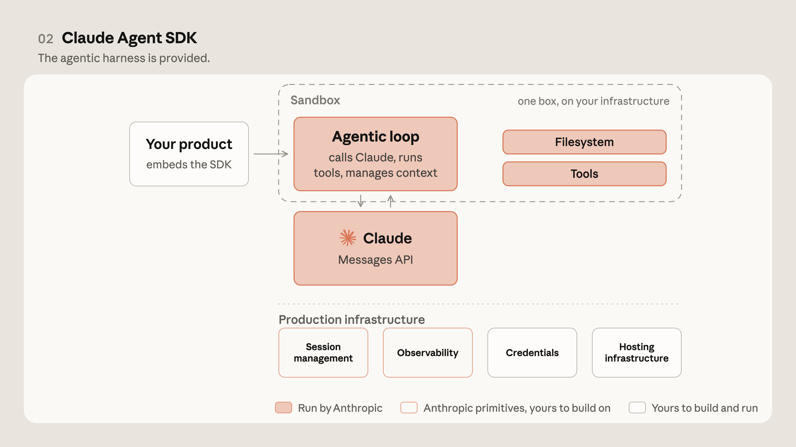
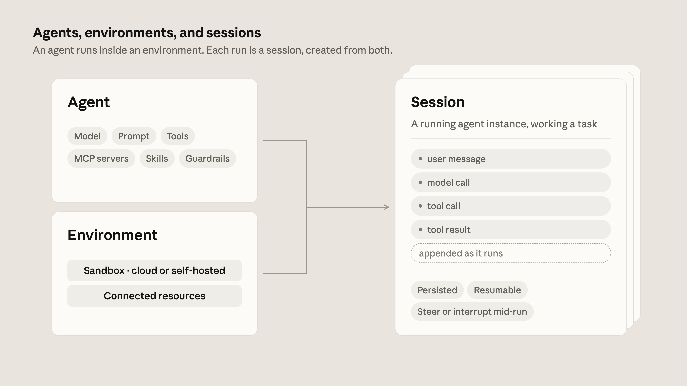
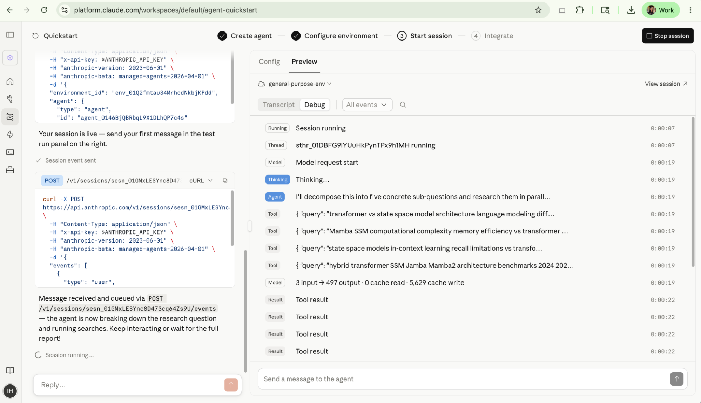
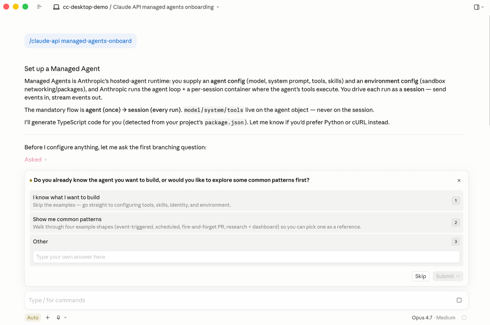

# 智能体式表面的演变：使用 Claude Managed Agents 进行构建

> 发布日期：2026-06-10 · [原文链接](https://claude.com/blog/building-with-claude-managed-agents) · 机器翻译，仅供学习。

[视频：构建智能体式基础设施的未来](https://www.youtube.com/embed/ksfm6jeTg3Q)

将智能体投入生产需要的不仅仅是一个好的提示词。智能体需要在某个地方运行它编写的代码、访问数据的凭据、可观察的会话以及可随使用情况扩展的基础设施。在 Applied AI 团队中，我们在 Claude 上构建产品、研究和客户的交叉点，我们反复看到相同的模式：基础设施是将原型与生产智能体区分开来的因素。团队常常在安全、状态管理、许可和工具调整方面浪费开发周期。

[Claude Managed Agents](https://platform.claude.com/docs/en/managed-agents/overview)，我们用于构建和部署生产级智能体的可组合 API 套件，将针对性能进行调整的智能体线束与生产基础设施配对，使团队能够在几天而不是几个月的时间内从原型到发布。在这篇文章中，我们将介绍 Anthropic 的智能体式构建块的演变、我们构建 Claude Managed Agents 的原因，以及团队如何在当今的生产中使用它。

## **改进智能体架构**

当我们在 2023 年向开发者开放 Claude 时，API 故意简单：代币输入，代币输出。您发送了提示词，Claude 返回了完成信息，并且您构建了线束和底层基础设施。

多年来，API 不断变得更加丰富，但底层的合同从未改变：一个请求，一个模型回合，您的应用程序决定接下来会发生什么。在很长一段时间里，这就足够了。总结文档、对支持请求进行分类、重写一段文本——这些工作只需一个回合即可轻松完成。

然而，随着时间的推移，人们想要移交的任务不再合适。  他们希望 Claude 能够全程执行任务，查找内容，采取行动，看看发生了什么变化，并决定下一步做什么。他们希望它能够运行 *在* 他们的工作已在其上运行的系统，例如代码库、内部 wiki 或票务系统。

使用 API，将 Claude 转换为智能体意味着构建您自己的循环：询问模型要做什么，运行该工具，反馈结果，然后重复。您负责构建和部署智能体脚手架，随着模型的发展，该脚手架可能需要调整。对于需要完全定制的智能体，这种方法很有意义。对于更可预测且不太复杂的智能体式工作负载，随着模型和产品的发展优化线束变得乏味。

[Claude Code](https://code.claude.com/docs/en/overview)，我们于 2025 年推出的智能体式编码工具，可让 Claude 直接与您的代码库交互，包含我们自己的该工具版本：循环、工具执行、子代理、上下文管理和丰富的功能，使其成为有效的智能体。开发人员自然希望在各个领域为自己的智能体提供类似的线束机械。

为了使团队能够在 Claude Code 线束之上构建智能体，我们发布了 [Claude Agent SDK](https://code.claude.com/docs/en/agent-sdk/overview)。 Claude Agent SDK 为开发人员提供了在运行 Claude Code 的同一台机器上构建自己的智能体的工具，而不是维护自己开发的循环。对于很多团队来说，这就是智能体变得实用的时候：该线束到达时已经针对 Claude 进行了基础设施原语的调整，并且它像 Claude Code 一样不断改进。

不过，即使有了线束，在生产环境中部署智能体也可能具有挑战性，原因如下：

- **托管和扩展。** 智能体在哪里运行，对于一个多小时的任务，进程可以保持活动状态多长时间，以及当使用量增长时如何扩展它？
- **会话管理。** 智能体的的历史和进展在哪里？跑步能否在中断后顺利恢复并不受阻碍？你能回去检查一下之前的会议发生了什么吗？
- **文件系统管理。** 做真正的工作意味着产生工件：编辑代码、编写文件、构建输出。智能体在哪里获取要操作的工作空间，以及运行之间该工作空间会发生什么？
- **执行隔离。** Claude 编写的代码必须在某个地方执行。如果错误的话，爆炸半径是多少？在生产中您真正信任的边界是多少？
- **凭据。** 智能体需要访问您的系统。它如何获得这种访问权限而不将专有信息暴露给它生成的代码？
- **可观察性。** 当智能体自主工作一个小时并做出一些令人惊讶的事情时，您能重建它所采取的每一步吗？

对于智能体SDK，上述生产基础设施的许多元素都是通过 Claude Code 的机器提供的。智能体获得一个真正的文件系统来工作，会话状态保留在本地或外部存储上，并且可通过 OpenTelemetry 将可观察性导出到您已经运行的任何监视堆栈中。

然而，随着团队越来越多地构建从本地开发转向生产的智能体，他们需要一种通过托管基础设施大规模部署它们的方法。随着模型及其周边工具变得更加先进——运行时间更长、执行更多代码、接触更多系统并采取更多操作——扩展、安全性和沙箱变得更具挑战性。

其中几个障碍源于常见的架构选择：智能体线束经常运行 *在同一个容器内* 作为它工作的文件系统。在 Claude 思考之前，容器必须启动（支付启动成本），智能体以及代码执行就位于您的凭据旁边，当容器终止时，运行也会随之终止。

托管智能体通过以下方式解决了这些问题 [将大脑与双手脱钩](https://www.anthropic.com/engineering/managed-agents)。调用 Claude 的工具与执行代码的沙箱分开运行，而会话（每个模型调用、工具调用和结果的仅附加日志）将两者连接起来。 Claude 可以在任何容器存在之前开始推理，沙箱远离您的凭据，并且可以随时从其会话重建整个运行。

## **何时以及为何使用 Claude Managed Agents**

使用托管智能体进行构建时，用户定义任务、工具和护栏，Anthropic 在我们的基础设施上运行智能体并处理下面的智能体式循环：如何为智能体提供一个执行环境来调用工具，如何在出现故障时恢复，多智能体编排等等。

当安全带不能与模型智能一起发展时， [智能体发生故障](https://www.anthropic.com/engineering/harness-design-long-running-apps)。在 Claude Sonnet 4.5 上，智能体会在上下文接近结束时急于完成，缩短工作时间，而不是使用它留下的空间 - 这种模式称为“上下文焦虑”。我们的解决方案是向线束添加上下文重置，并假设 Claude 需要帮助在极限附近保持连贯性。该假设在下一个模型中不再存在。在 Claude Opus 4.5 上，该行为消失了，我们添加的重置只是开销。

对于大多数组织来说，维护线束是一项开销，无法使他们的产品脱颖而出。必须针对某些模型行为调整安全带；压缩、工具执行和缓存等原语在 Claude 上的工作方式与其他模型上的工作方式不同。借助 Claude Managed Agents，该安全带与模型一起发展，使团队能够专注于使智能体与众不同： **上下文管理和领域专业知识。**

为了使开发人员能够配置构建有效的智能体所需的上下文和工具，托管智能体围绕三个主要资源构建：智能体、环境和会话。安 *智能体* 是一个配置：一个模型，一个提示词，一套工具，以及它们周围的护栏。安 *环境* 是智能体运行的执行上下文：沙盒容器、其网络规则以及预安装在其中的包，托管在我们的云或您控制的基础设施上。每次运行都是一个 *会议*，它将智能体与环境配对并获得自己的隔离沙箱实例。会话会保留完整的事件历史记录、沙箱状态并在服务器端输出，因此长时间运行的工作可以暂停、干净地恢复，并在事后逐步跟踪。借助托管智能体，您可以定义一次智能体和环境，然后随着工作负载的增长针对相同的配置运行多个会话。

## **在托管智能体上构建生产和规模**

在应用材料公司的 AI 中，我们看到智能体从原型到生产，无论是在 Anthropic 内部还是在我们客户的系统中，跨越编码、财务、支持、法律和十几个其他领域。这让我们清楚地了解演示与生产就绪的智能体的区别以及团队经常陷入困境的地方。

下面，我们分享了构建 Claude Managed Agents 等托管服务的最常见原因：

**1. 凭证不进入沙箱。** 当所有内容在一个容器中运行时，Claude 生成的代码就位于您的凭据旁边，因此提示词注入可能会导致模型通过说服模型读取其自己的环境来泄漏令牌。我们可以通过在同一个容器内设置强大的护栏来防止这种情况的发生，但解耦架构可以通过将凭据完全保留在沙箱之外来实现更安全的方法。 MCP、CLI 和 GitHub 存储库等工具的令牌位于单独的保管库中，代理仅根据需要获取并解密它们。托管智能体提供 [避难所](https://platform.claude.com/docs/en/managed-agents/vaults) 开箱即用地处理凭证，因此您无需运行自己的秘密存储、在每次调用时传输令牌或丢失智能体代表哪个最终用户的跟踪。 Vault 凭证在存储前受到信封加密的保护，检索时需要签名的请求令牌进行验证。

**2. 通过消除沙箱开销来降低延迟。** 延迟是许多企业团队最关心的指标，因为用户在等待 Claude 响应时会敏锐地感觉到。如果没有托管智能体架构，则必须为每个会话启动一个容器，即使是智能体只需思考而从不运行工具的会话。该设置时间被浪费了，用户感觉这是第一次响应之前的延迟。借助托管智能体，Claude 在环境并行旋转时立即开始推理，并且从不运行工具的会话完全跳过容器。这意味着用户无需等待容器启动即可看到第一个令牌，并且在智能体需要运行某些内容时环境已准备就绪。在我们的测试中，在中值情况下 (p50)，首次标记时间缩短了约 60%，在最慢情况下 (p95) 则缩短了 90% 以上。

**3. 可靠、持久的会话，支持会话管理、可观察性和内存。** 托管智能体考虑的不是请求/响应，而是 *事件。* 会话是持续的事件流：每个模型调用、工具调用和结果都附加到运行智能体的进程外部的日志中。通过这种架构，您可以在智能体工作时获得事件流的实时更新，并且可以稍后恢复任何会话，无需管理数据库或保存点。除非您删除会话，否则交互之间的历史记录将被保留，并且当会话空闲时，其容器会被设置检查点，以便您可以从其暂停的位置干净地恢复。因为整个运行已经是事件的记录，所以可观察性和内存随之而来：Claude 开发者控制台提供了智能体会话的本机可视化时间轴视图，以及允许您深入检查任何记录的调试体验。托管智能体还具有“记忆”和“梦想”等功能，这些功能也使用此会话持久性。 [做梦](https://platform.claude.com/docs/en/managed-agents/dreams) 是一个预定的过程，用于检查您的智能体会话和记忆存储、提取模式并整理记忆，以便您的智能体随着时间的推移而改进。 Dreaming 优化了会话之间的内存，以便通过读取持久会话日志来改进重复出现的错误和用户偏好。

**4. Anthropic 托管或自托管云容器的灵活性。** 默认情况下，使用托管智能体，您可以将编排和工具执行委托给 Anthropic 托管云容器。这使得托管和扩展变得简单容易，提供更快的生产路径。由于托管智能体中的大脑与双手分离，因此双手可以位于任何地方，包括在虚拟私有云 (VPC) 内。因此，我们还提供 [自托管沙箱](https://platform.claude.com/docs/en/managed-agents/self-hosted-sandboxes) 对于想要控制工具执行的团队来说，智能体的代码、文件系统和网络出口永远不会离开他们的环境。我们还提供 [MCP 隧道](https://platform.claude.com/docs/en/agents-and-tools/mcp-tunnels/overview)，它允许您将 Claude 连接到在专用网络内运行的模型上下文协议 (MCP) 服务器。所以自托管沙箱控制 *智能体的代码执行的位置*，和MCP隧道控制 *Anthropic 如何到达网络中的 MCP 服务器*，使您能够准确控制边界内的内容。

*Claude Managed Agents 的内置可观察性控制台记录每个事件，因此您可以清理时间线、打开任何步骤并读取其原始负载。*

除了这些功能之外，其他功能还包括让智能体根据标题、多代理编排、权限策略和 Webhooks 对自己的工作进行评分的结果。了解更多 [这里](https://platform.claude.com/docs/en/managed-agents/overview).

### **客户今天如何在托管智能体上进行构建**

各行业的客户已将生产中的智能体与 Claude Managed Agents 一起发货。以下是一些示例：

- [概念](https://claude.com/customers/notion) 在托管智能体上运行其自定义智能体：团队直接从任务板将工作分配给 Claude，Claude 获取每个任务的文档、会议记录和连接数据，完成的代码、演示文稿和站点返回工作区以供审核。数十个任务并行运行，他们的团队描述了一个早期原型，将大约十二个小时的工作变成了二十分钟。
- [乐天](https://claude.com/customers/rakuten) 使用托管智能体向产品、销售、营销和财务领域的专家智能体提供服务，每个服务都在大约一周内上线。
- [哨兵](https://claude.com/customers/sentry) 将其 Seer 调试智能体与 Claude智能体配对，后者编写补丁并打开 PR，由单个工程师在数周而不是数月内构建。
- [体式](https://claude.com/blog/claude-managed-agents) 构建了 AI Teammates，可以在项目中拾取任务，并且 [阿特拉斯](https://claude.com/blog/claude-managed-agents) 将开发人员智能体放入 Jira 工作流程中。

## **Claude Managed Agents 入门**

我们构建了托管智能体，以便尽可能轻松地通过 Claude Code 和 Claude 开发者控制台启动智能体 [平台.Claude.com](http://platform.claude.com)。例如，控制台的快速入门可让您从智能体模板开始，或用简单语言描述智能体，然后将其转换为可立即投入生产的智能体，您可以在几分钟内保护和部署。

*platform.Claude.com 上的智能体快速入门：从模板开始或描述您想要构建的内容。*

*几个步骤之后：智能体已创建，环境已配置，并且会话已上线。控制台会实时传输运行情况。*

在 Claude Code 中， [/Claude-api 技能](https://platform.claude.com/docs/en/agents-and-tools/agent-skills/claude-api-skill) 默认情况下提供，并为 Claude 提供在 Claude Managed Agents 上构建应用程序的详细的、最新的参考材料。我们强烈建议您利用它来获得设置托管智能体应用程序的最佳实践。首先运行 /Claude-api Managed-智能体-onboard 进行面试驱动的演练，从头开始设置新的托管智能体。

## **楼宇管理的未来智能体**

当团队分享他们使用托管智能体构建的内容时，我们发现他们过去花在生产基础设施上的时间现在都花在了智能体的差异化上：管理上下文并为用户定制体验。现在，当新的模型出现时，您可以更新智能体来使用它，重新运行评估并交付改进，而无需触及底层架构。

我们很高兴看到您所构建的内容。

[***开始使用***](https://platform.claude.com/docs/en/managed-agents/overview) ***与 Claude Managed Agents。***

*本文由 Anthropic 应用 AI 团队的技术人员 Gagan Bhat 和 Isabella He 撰写。他们要感谢 Hema Thanki、Jess Yan 和 Molly Vorwerck 的贡献。*
