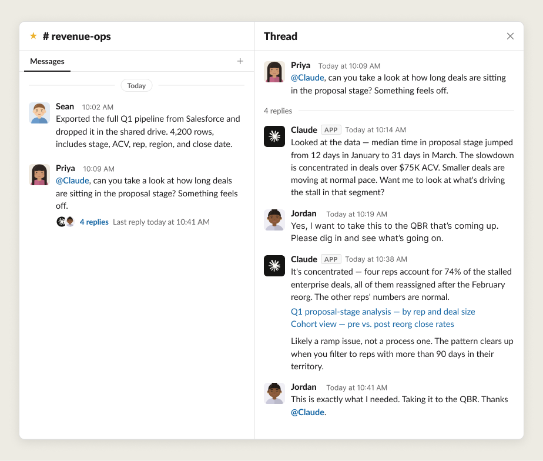

# 打造高效的人力-智能体团队

> 发布日期：2026-06-24 · [原文链接](https://claude.com/blog/building-effective-human-agent-teams) · 机器翻译，仅供学习。

使用 AI 过去意味着一个人与单个聊天窗口交互。随着时间的推移，AI 处理复杂、长时间运行的工作（例如编码、研究和财务分析）的能力越来越强。至此，我们看到了许多使用 AI 的新方法——从终端和 IDE 到电子表格和演示文稿——但这项工作在很大程度上仍然是一种“单人”体验：一个人与一个智能体一起完成单独的任务。

随着工具的发布，这种情况正在改变 [Claude 标签](https://www.anthropic.com/news/introducing-claude-tag)。现在，人类和智能体可以在同一个工作空间中一起工作，协作实现团队共享的目标。现在的工作看起来更像是 *多人游戏*，由人类团队制定策略，并由 Claude 执行工作。

这涉及到一些新的工作方式。在 Anthropic，过去几个月我们一直在测试人类智能体团队取得成功所需的技术。在本文中，我们将解释什么是多人游戏智能体，以及我们在构建它们时学到的经验教训。

## **什么是多人游戏智能体？**

“多人游戏智能体”是我们在这里指代 AI模型的方式，它可以同时与许多不同的人一起工作。就像普通的智能体一样，它们有自己的 [记忆](https://platform.claude.com/docs/en/managed-agents/memory) 和 [技能](https://www.anthropic.com/engineering/equipping-agents-for-the-real-world-with-agent-skills)。但在其他方面，它们却截然不同。他们有自己的 [凭证](https://www.anthropic.com/engineering/managed-agents) 他们住在有工作的地方。在 Anthropic，这是 Slack 等团队协作工具的内部。

以下是人类智能体团队在 Slack 中一起分析数据集的示例：

为了使智能体高效地参与团队渠道，他们需要特定的能力：

- [**持久的记忆，**](https://platform.claude.com/docs/en/managed-agents/memory) 这样他们就可以记住目标并调整执行力以实现目标
- [**凭证与人类无关**](https://www.anthropic.com/engineering/managed-agents)**,** 这样他们就可以在安全、可预测的护栏内操作
- [**持续广泛地获取信息**](https://www.anthropic.com/engineering/effective-context-engineering-for-ai-agents)**,** 这样他们就可以了解组织如何运作，并采取行动执行任务以实现团队的目标

这些功能构成了智能体高效参与多人团队所需的技术基础。然而，制作人-智能体团队 *成功的* 需要的不仅仅是这些：团队还需要特定的工作方式和共享的规范。

## **第 1 课：在公共场合工作并提供智能体广泛的背景**

Anthropic 的团队主动、公开地共享信息。当智能体加入团队时尤其如此，因为智能体完全根据团队可搜索的文本构建理解：Slack、代码、文档和会议记录。私人消息、走廊对话和受限文档无法为智能体提供上下文。对于智能体，如果它没有被写下来并且无法访问，那么它就不存在。

我们不是决定一次向智能体一个文档或 Slack 通道提供哪些信息，而是使用明确定义的安全边界，该边界适用于整个 Slack 工作区以及会议记录和文档库。在安全边界内，上下文流向每个团队成员——无论是人类还是 AI。这不仅增加了智能体和人类可以访问的内容，还减少了对可以共享什么以及与谁共享的困惑。人类和智能体都发现很难驾驭每个项目共享的软边界： *这个频道应该是公共的还是私人的？我可以与那个人共享此文档吗？是否允许智能体查看该线程？* 少量清晰的工作区边界可以消除日常工作中的决策疲劳。

高度的透明度是有回报的。例如，可以读取团队会议决策的智能体不会建议取消优先级的任务或项目。智能体可以访问自己团队之外的产品规格，可以推荐为其他人成功的模式。由于智能体可以比人类更快地阅读大量文本，因此它们通常会显示人类可能会错过的相关工作。我们严重依赖智能体在繁忙、快速发展的行业中保持信息灵通并保持协调。

在 Anthropic，在公共场合工作是这样的：

- 在公司中选择一些安全边界，并创建与每个安全边界相匹配的工作区和文档共享设置
- 在组织内默认向公众开放新的沟通渠道，并确保决策每次都落实在渠道、文档和会议记录中
- 编写工件和会议记录，以便智能体可以找到它们，因为智能体现在是团队文档的主要使用者
- 确保 AI 能够访问完成工作所需的正确工具和信息

默认信息在内部公开可能需要文化转变。然而，有背景的人类智能体团队与没有背景的人类智能体团队之间的差异太明显，不容忽视。

当然，某些交互是敏感的，需要在单个人和 AI 之间保持私密。对于这些，使用 Claude 标签，您可以向 @Claude 发送直接消息，或者您可以使用现有的 [Claude.ai](http://claude.ai) 和 Claude Cowork 应用程序。这些工具使 Claude 通过您的个人 MCP 连接器访问私人信息，并且知道您的对话以及与智能体共享的内容将保持私密。

## **第 2 课：每个人和智能体都获得明确的角色，并使用适合该工作的工具**

Human-智能体团队共享一份名单、一套工件和一个工作空间。智能体有自己的 [凭证](https://www.anthropic.com/engineering/how-we-contain-claude), [技能](https://www.anthropic.com/engineering/equipping-agents-for-the-real-world-with-agent-skills)和工具访问。不同的智能体还扮演着不同的角色：例如，一个人可能负责项目的数据分析，另一个人将持有并执行设计标准，第三个人将负责研究综合。

当项目开始时，人类与智能体聊天，以确定要分配哪些角色，以及人类和智能体将如何合作。

一旦人类和智能体的工作明确，智能体可能会启动其他智能体，以确保智能体具有正确的内存和适当的访问权限来处理特定任务。重要的是，他们需要访问完成工作所需的所有工具：处理数据分析的工具可能需要访问 BigQuery，而执行 QA 的工具可能需要访问 Playwright MCP。

明确定义的角色和职责使人类智能体团队能够取得成功。人类经常在与智能体相同的线程中工作，但它们承担着只有人类才能承担的角色。这确保了一切协同工作，并将人类判断应用于最重要的决策。如果没有明确的角色，人们最终会在旁边运行大量的个人人工智能，重复工作并破坏团队的环境。指标跟踪是一种常见情况：多人游戏智能体可以完成一次工作，让每个人都看到相同的数字。

在 Anthropic，在人类智能体团队中明确定义的角色如下所示：

- 商定的任务集：团队成员及其智能体就谁做什么达成一致
- 人类和智能体在相同的共享线程中工作，因此任何人都可以从任何人离开的地方继续
- 人类和智能体可以使用正确的工具来完成各自的工作
- 智能体的角色和范围的描述

*Claude智能体负责代码库的日常维护、分类反馈、规划、编写代码、审查更改和报告状态。每个人都有明确的任务并按自己的时间表工作；人们设定目标并审查产出。*

Anthropic 的工程团队开始创建花名册，以帮助编纂人员和智能体角色，因为这使他们的工作变得更加容易和具体。一些早期对他们来说很有吸引力的事情：

- 特定角色还可以帮助人们轻松跟踪任务的责任所在，无论是单个任务还是整个团队的职责
- 写作 [技能档案](https://platform.claude.com/docs/en/agents-and-tools/agent-skills/overview) 定义特定的智能体的角色有助于简化专业化，并允许公司内的人员快速站立于相同类型的其他智能体
- 当项目变得更加复杂时，团队添加了新的智能体以专注于新领域。例如，他们添加了一个发布管理器智能体来处理新的软件发布。

这些方法让人类智能体团队的心理智能体随着智能体数量的增长而扩展。

## **第3课：设置北极星，让智能体更加积极主动**

尽管 Anthropic 中的一些智能体只是完成分配的任务，但最重要的是主动建议新项目和工作流程。当一个已经为其智能体提供丰富背景和明确角色的团队添加另一个指南：北极星时，通常会发生这种情况。

北极星是雄心勃勃、影响广泛的目标，可以帮助团队决定哪些任务和工作流程是正确的。在Anthropic，人们总是设定北极星，将其扎根于企业的使命和目标。

一旦北极星以书面形式清晰表达出来，人们就会与团队中的智能体分享。然后，重要的是，人类选择智能体应该主动建议新的工作流来帮助实现这一长期目标。 （团队中的每个智能体不太可能都具备主动建议工作成功的必备技能和信任。）

例如，一个以“让产品入门更有帮助”为目标的内部工具团队看到智能体主动建议对入门流程错误消息进行副本修订。这些变化在接下来的一周显着提高了入职成功率。

在 Anthropic，设置北极星如下所示：

- 让人类讨论、辩论并记录其人类智能体团队的雄心勃勃的北极星目标 - 该目标植根于公司的使命和业务目标
- 与团队中的智能体共享北极星，并明确指定哪些智能体可以主动推荐新的工作流
- 在日历上保护高保真人类时间，会议现在集中于最重要的工作

清晰的北极星为智能体提供了一致的工作方向和积极支持团队工作的有意义的机会。

## **第 4 课：随着时间的推移建立信任**

Anthropic 的团队根据所展示的可靠性按比例授予智能体自主权，然后有意扩展它。工程师们已经成功地在他们的团队中派遣了智能体来独立处理 500 个错误修复，但事情肯定不是这样开始的。

当新同事加入团队时，需要时间来评估他们的能力并制定强大的工作程序。通常需要多个反馈周期才能将有关如何最好地完成任务的所有隐性信息具体化。智能体也是如此。用户必须尝试给智能体分配许多不同的任务，以便他们能够了解智能体的能力、如何清楚地描述目标、它需要哪些技能文件，以及提示词最适合引发所需的行为。随着模型的变化和改进，重新测试任务也很重要。提示词可能需要重新措辞，而过去有用的护栏可能会限制更聪明的模型追求更具创意的解决方案。

值得注意的是，我们发现最好的长期运行的智能体有许多不同的方法可以在人类查看其工作之前验证其工作。当然，代码有测试，但大多数其他工作也可以得到验证。例如，技术文档可以应用标题和风格指南。当人类设定标准并确保分配给智能体的所有工作都可以得到审查时，质量就会保持高水平并且不会偏离初衷。单独地，与人类一样，让一个智能体完成任务的工作和另一个智能体检查第一个智能体的工作的工作通常会有所帮助。这通常被称为 [“Doer-Verifier”智能体安全带](https://www.anthropic.com/engineering/harness-design-long-running-apps).

在 Anthropic，随着时间的推移与智能体建立信任看起来如下：

- 从一开始就手动审查智能体工作，以审查质量、提供反馈并设计任务验证清单
- 作为任务的一部分，告诉智能体使用“验证器”智能体检查其工作
- 将反思融入到循环中，并要求智能体回顾自己的失误，以便工作随着时间的推移而改进
- 跟踪每个智能体已获得自主权的任务类型，并在多次成功后扩大每种任务类型的范围

Anthropic 的一位工程领导者组建了一个新团队，该团队有大量积压工作。为了解决这个问题，他邀请了一些人和一些智能体来帮助他整理积压的工作并优先考虑最重要的事情。团队中的一组智能体通读待办事项中的所有项目，确定是否有人正在处理这些项目，并为任何无主的项目分配复杂性分数。另一组从列表中读取，过滤到中低复杂度的项目，并创建代码更改。一开始，人类审查了智能体做出的每一个决定，并标记了任何需要人类输入的决定。然后，人类教会智能体直接向人类展示这些决策，确保具有艰难权衡的决策始终有人类参与其中。

每周，领导和他的团队都会要求智能体编写一份周报，其中包括“教训和失误”，以便智能体能够记录错误并避免将来再次犯同样的错误。随着时间的推移，领导者能够对其智能体进行越来越复杂的代码更改，并花更少的时间指导智能体的日常任务。

一旦智能体变得更加独立，领导者就会指导他们将人类注意力视为稀缺资源：一次性批量回答问题，重复关键上下文以让人们快速跟上进度，并限制每个人同时看到的事物数量。

帮助智能体进行良好的沟通可确保他们保持帮助和有效。有些人的团队中有智能体，其唯一角色是决定如何批量处理和提升人类团队成员最重要的通信。其他人则围绕智能体每天应该完成多少工作设置了护栏，以便人们能够有意义地参与工作。这样的护栏确保人类保持对他们重要的技能，并且需要人类审查的项目数量保持可持续。

## **要问的问题**

当您为智能体团队奠定基础时，请考虑以下问题：

1. 智能体和人类需要的所有信息和访问权限都是公开的且可广泛搜索吗？
2. 你能写下你的团队的名单（人类和智能体），并说出每个成员拥有什么吗？
3. 团队中的每个人和智能体是否都可以使用正确的工具来执行其工作？
4. 您是否有针对人类和智能体的准则或测试来验证关键工作产品？
5. 您的团队是否有一个清晰的北极星可供每个人参考？

## **前进**

这些模式都不是新的——至少对人类来说不是。强大的北极星、明确的角色、强大的文档、共同的质量标准以及从错误中学习的空间是我们几十年来所熟知的健康团队习惯。智能体只是让不要跳过它们变得更加重要。

从智能体中获得最大收益的团队是最有意应用这些基础知识的团队。

**致谢**

本文由 Anthropic 教育团队成员 Kristen Swanson 撰写。她要感谢 Matt Bell、Erik Olesund、Hasnain Lakhani、Shale Craig、Nolan Caudill、Mike Schiraldi、Aleks Todorova 和 Molly Vorwerck 对本文的贡献。

*使用开始构建多人游戏智能体* [*智能体团队*](https://code.claude.com/docs/en/agent-teams) *在 Claude Code 中或使用* [*Claude 标签*](https://support.claude.com/en/articles/15594475-what-is-claude-tag)*.*
