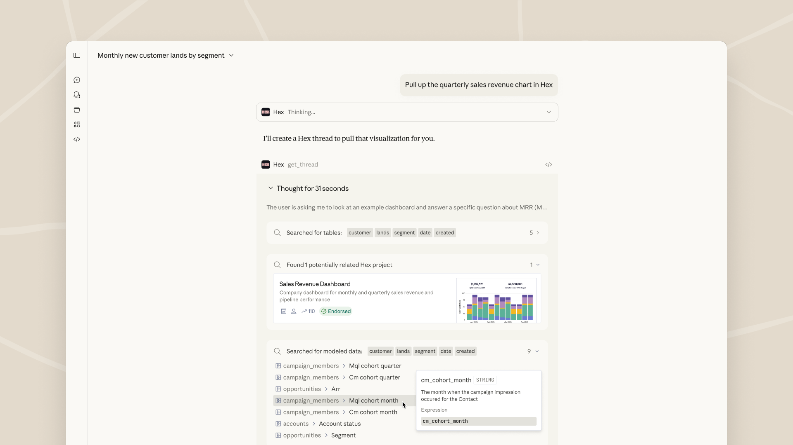

# 您最喜欢的工作工具现在是 Claude 内的交互式连接器

> 发布日期：2026-01-26 · [原文链接](https://claude.com/blog/interactive-tools-in-claude) · 机器翻译，仅供学习。

从今天开始，我们将通过 MCP 应用程序为 Claude 带来交互式连接器。您可以打开Claude中的工具并与之交互。在 Asana 中构建和更新项目时间表。在格式化预览中起草、编辑和发送 Slack 消息。在 Figma 中将想法可视化为图表 - 无需切换选项卡。

[视频：您的工具现在可以在 Claude 中进行交互](https://www.youtube.com/embed/bluAmTHoEow)

Claude 已连接到您的工具并代表您采取操作。现在，借助 MCP 应用程序，这些工具在对话中显示为交互式连接器，因此您可以实时查看正在发生的情况并进行协作。

您现在可以直接在 Claude 中执行以下操作：

- [幅度](https://claude.com/connectors/amplitude) – 构建分析图表，然后探索趋势并交互式调整参数以发现隐藏的见解。
- ‍[体式](https://claude.com/connectors/asana) – 将聊天转化为您的团队可以在 Asana 中查看和执行的项目、任务和时间表。
- [盒子](https://claude.com/connectors/box) - 搜索文件、内联预览文档，然后提取见解并提出有关内容的问题。

[视频：使用 Box + Claude 搜索文件并提取见解](https://www.youtube.com/embed/wjCUO-5lVhk)

- [帆布](https://claude.com/connectors/canva)- 创建演示大纲，然后实时定制品牌和设计，以生成可供客户使用的演示文稿。
- [粘土](https://claude.com/connectors/clay) - 研究公司，通过电子邮件和电话信息查找联系人，提取公司规模和资金等数据，然后直接在对话中起草个性化的推广活动。

[视频：Clay + Claude 的研究前景和工艺推广](https://www.youtube.com/embed/pWcxmn4xjtw)

- [菲格玛](https://claude.com/connectors/figma) –提示词将文本和图像转换为流程图、甘特图或 FigJam 中的其他可视化图表。
- [十六进制](https://claude.com/connectors/hex) - 提出数据问题并获得包含交互式图表、表格和引文的完整答案。

- [星期一网](https://claude.com/connectors/monday) - 管理您的工作、运行项目、更新看板、智能分配任务并通过见解可视化进度。
- [Slack](https://claude.com/connectors/slack) （来自 Salesforce） – 搜索和检索 Slack 对话的上下文，生成消息草稿，按照您的方式格式化它们，并在发布之前进行审查。

即将推出： **销售人员** - 通过 Agentforce 360 将企业环境引入 Claude，使团队能够通过单个互联界面进行推理、协作和行动。

## **MCP 应用程序：基于开放标准构建**‍

底层技术建立在 [模型上下文协议 (MCP)](https://modelcontextprotocol.io/docs/getting-started/intro)，用于将工具连接到 AI 应用程序的开放标准。 MCP Apps 是 MCP 的新扩展，它允许任何 MCP 服务器在任何支持的 AI 产品（而不仅仅是 Claude）中提供具有丰富用户界面的交互式连接器。

我们开源了 MCP，为生态系统提供了一种将工具连接到 AI 的通用方法。现在，我们正在进一步扩展 MCP，以便开发人员可以在其之上构建交互式 UI，无论用户身在何处。

了解更多请查看公告 [MCP 应用程序 - 第一个官方 MCP 扩展](https://blog.modelcontextprotocol.io/posts/2026-01-26-mcp-apps).

## **开始使用**

立即开始在 Claude 中使用交互式连接器（MCP 应用程序）。前往 [Claude.ai/目录](http://claude.ai/directory) 并连接到“特色”部分下的应用程序以开始使用。 Claude 在移动、网络和桌面上提供免费、Pro、Max、Team、Enterprise 计划。现在也可在 [Claude Cowork](http://claude.com/product/cowork).**‍**
