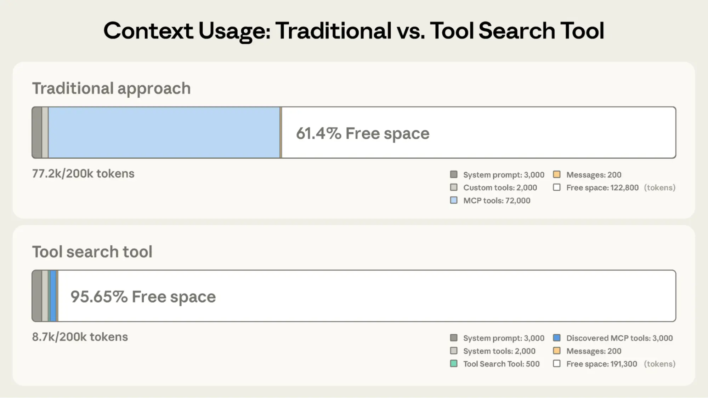

# 使用 MCP 构建可到达生产系统的智能体

> 发布日期：2026-04-22 · [原文链接](https://claude.com/blog/building-agents-that-reach-production-systems-with-mcp) · 机器翻译，仅供学习。

智能体的有用性取决于它们能够到达的系统。团队倾向于采用三种方法将其连接到外部系统：直接 API 调用、CLI 和 MCP。这篇文章列出了每种方法的适合位置、为什么生产智能体倾向于落在 MCP 上，以及有效构建这些集成的模式。

## 将智能体连接到外部系统

我们通常看到将智能体连接到外部系统的三种路径：直接 API 调用、CLI 和 MCP。每个都在某个地方有意义，具体取决于您正在构建的内容。关键区别在于智能体和服务之间是否存在公共层，以及该层到达的程度。

### 直接拨打 API

智能体直接调用您的 API - 通过编写在代码执行沙箱内发出 HTTP 请求的代码，或通过通用函数调用工具。这是大多数团队开始的地方，对于一个智能体与一项服务通信，或者少量不需要跨智能体平台重用的集成来说，它工作得很好。

挑战开始大规模出现。由于智能体和服务之间没有公共层，每个智能体服务对都成为具有自己的身份验证处理、工具描述和边缘情况的定制集成，即 M×N 集成问题。

### 命令行界面 (CLI)

智能体在 shell 中运行命令行工具。这是快速、轻量级的，并且依赖于预先存在的工具。它非常适合本地环境和沙盒容器——任何有文件系统和 shell 的地方。这提供了一个公共层，但很薄。

CLI 在到达不公开容器的移动、Web 或云托管平台时遇到了硬性限制，并且身份验证由 CLI 自己的机制（通常是磁盘上的凭证文件）处理。这最适合本地环境中快速、宽松的集成。

### 模型上下文协议 (MCP)

MCP 提供公共层作为协议。智能体连接到一个服务器，该服务器公开您的系统功能，并具有标准化的身份验证、发现和丰富的语义。一台远程服务器可以在任何部署环境中到达任何兼容的客户端（Claude、ChatGPT、Cursor、VS Code 等）。

它需要更多的前期投资。回报是集成是可移植的，并提供功能丰富的智能体集成所需的语义。

## 生产智能体在云端运行

生产智能体越来越多地在云端运行，因此它们可以连续扩展和运营。他们需要访问的系统也是云托管的：您的数据所在、工作被跟踪以及基础设施运行的地方。通常这些系统是远程的并且需要经过身份验证，其中 MCP 提供公共层。 当这些系统位于专用网络而不是公共互联网上时， [MCP Claude Managed Agents 中的隧道](https://claude.com/blog/claude-managed-agents-updates) 通过仅出站连接将智能体连接到它们 - 不需要公开端口或公共端点。

我们已经在采用中看到了这一点。的 [MCP SDK](https://modelcontextprotocol.io/docs/sdk) 最近每月下载量超过 3 亿次，高于年初的 1 亿次，在企业和流行的智能体式平台上得到了广泛采用。每天有数百万人使用 MCP 和 Claude，该协议支撑着我们最近发布的大部分内容，包括 [Claude Cowork](https://claude.com/product/cowork), [Claude Managed Agents](https://claude.com/blog/claude-managed-agents), 和 [Claude Code 中的频道](https://code.claude.com/docs/en/channels).
‍
随着 MCP 继续支持生产智能体式系统，我们正在分享构建这些集成的模式：从构建高级服务器到上下文高效的客户端，以及技能补充协议的地方。

## 构建有效的 MCP 服务器

我们有超过 200 台 MCP 服务器 [目录](https://claude.ai/directory/connectors)，每天有数百万人使用。通过与基于该协议的企业和开发人员密切合作，我们发现了一些设计模式，这些模式决定了智能体使用服务器的可靠性。

### 构建远程服务器以实现最大范围

远程服务器为您提供分发 - 它是跨 Web、移动和云托管智能体运行的唯一配置，并且是每个主要客户端都经过优化以使用的配置。构建远程服务器，以便智能体可以在任何运行的地方使用您的系统。

### 围绕意图而不是端点对工具进行分组

更少、描述良好的工具始终优于详尽的 API 镜像。不要将 API 包装到 MCP 服务器中，围绕意图进行一对一的分组工具，这样智能体可以通过几次调用完成任务，而不是将许多基元拼接在一起。单个 create\_issue\_from\_thread 工具胜过 get\_thread + parse\_messages + create\_issue + link\_attachment。参见 [为智能体编写有效的工具](https://www.anthropic.com/engineering/writing-tools-for-agents) 了解有关完整模式的更多信息。

### 当表面很大时进行代码编排设计

如果您的服务需要数百个不同的操作，例如 Cloudflare、AWS 或 Kubernetes，则意图分组的工具集可能无法涵盖它。相反，公开一个接受代码的瘦工具表面：智能体编写一个简短的脚本，您的服务器在针对您的 API 的沙箱中运行它，并且仅返回结果。 [Cloudflare 的 MCP 服务器](https://github.com/cloudflare/mcp) 是参考示例——两个工具（搜索和执行）覆盖约 1K 令牌中的约 2,500 个端点。

### 在有帮助的地方提供丰富的语义

[MCP 应用程序](https://modelcontextprotocol.io/extensions/apps/overview) 是第一个官方协议扩展，允许工具返回交互式界面，例如图表、表单或仪表板，所有这些都在聊天界面中内联呈现。与仅返回文本的服务器相比，搭载 MCP 应用程序的服务器往往具有更高的采用率和保留率。使用它可以在重要的时刻将产品的 UI 呈现在智能体或最终用户面前 - Claude.ai、Claude Cowork 和许多其他顶级 AI 工具都支持该扩展。

[视频：MCP Claude 中的应用程序](https://www.youtube.com/embed/bluAmTHoEow)

‍[启发](https://modelcontextprotocol.io/specification/2025-11-25/client/elicitation) 让您的服务器暂停中间工具调用以要求用户输入。 [表格模式](https://modelcontextprotocol.io/specification/2025-11-25/client/elicitation#form-mode-elicitation-requests) 发送一个简单的模式，客户端呈现一个本机表单——用它来请求丢失的参数、确认破坏性操作或消除选项的歧义。 [网址模式](https://modelcontextprotocol.io/specification/2025-11-25/client/elicitation#url-mode-elicitation-requests) 将用户交给浏览器——用它来完成下游 OAuth、付款或收集任何不应传输 MCP 客户端的凭证。两者都让用户保持在流程中，而不是将他们发送到设置页面。广泛支持表单模式； Claude Code 支持 URL 模式，更多客户端正在开发中。

### 依靠标准化身份验证

标准化身份验证使 MCP 对于云托管的智能体来说非常实用。如果您的服务器需要 OAuth，则最新的 [MCP 规格](https://modelcontextprotocol.io/specification/2025-11-25) 支持 [CIMD](https://modelcontextprotocol.io/specification/2025-11-25/basic/authorization#client-id-metadata-documents) （客户端 ID 元数据文档）用于客户端注册 — 它为用户提供快速的首次身份验证流程，并减少意外的重新身份验证提示词。这是我们推荐的身份验证方法，MCP SDK、Claude.ai 和 Claude Code 支持该功能，并且正在整个行业广泛采用。

用户授权后，下一个问题是云托管的智能体如何在运行时保存和重用这些令牌。 [避难所](https://platform.claude.com/docs/en/managed-agents/vaults#mcp-oauth-credential) 在 [Claude Managed Agents](https://platform.claude.com/docs/en/managed-agents/overview) 涵盖了这一点：注册用户的 OAuth 令牌一次，在会话创建时通过 ID 引用保管库，平台将正确的凭据注入每个 MCP 连接并代表您刷新它们 - 无需构建秘密存储，每次调用无需传递令牌。

## 使 MCP 客户端更加上下文高效

MCP 标准化了 AI智能体([*客户*](https://modelcontextprotocol.io/docs/develop/build-client#python)）连接并使用他们需要的工具和数据源（[*服务器*](https://modelcontextprotocol.io/docs/develop/build-server)）。服务器安全地公开一系列功能，而客户端则编排它们并管理上下文。如果您正在构建 MCP 客户端，请使用渐进披露模式使其上下文高效。

### 通过工具搜索按需加载工具定义

[工具搜索](https://platform.claude.com/docs/en/agents-and-tools/tool-use/tool-search-tool) 推迟将所有工具加载到上下文中，而不是预先加载它们。这允许智能体在运行时搜索目录，并在需要时拉入相关工具。在我们的 [测试](https://www.anthropic.com/engineering/advanced-tool-use)，工具搜索往往会减少 85% 以上的工具定义标记，同时保持较高的选择准确性。

通过工具搜索减少上下文使用。来源： [高级工具使用](https://www.anthropic.com/engineering/advanced-tool-use)

### 通过编程工具调用处理工具结果代码

[编程工具调用](https://www.anthropic.com/engineering/code-execution-with-mcp) 处理工具会生成代码执行沙箱，而不是将它们原始返回到模型。这使得智能体在代码中的调用之间循环、过滤和聚合，只有最终输出到达上下文。在我们的测试中，这大约减少了令牌使用量 [37%](https://platform.claude.com/docs/en/agents-and-tools/tool-use/programmatic-tool-calling) 复杂的多步骤工作流程。

这些模式一起自然地跨多个服务器组合：更精简的上下文、更少的往返、更快的响应。参见 [*高级工具使用*](https://www.anthropic.com/engineering/advanced-tool-use) 进行全面细分。

## 将 MCP 服务器与技能配对

[技能与MCP是互补的](https://claude.com/blog/skills-explained)。 MCP 使智能体能够访问外部系统的工具和数据，而技能则教授智能体的程序知识 *如何* 使用这些工具来完成实际工作。最强大的智能体可以同时使用这两种技术，并且技能使 MCP 服务器的扩展能力超出了少数连接的范围。有两种组合它们的一般模式：

### 将技能和 MCP 服务器捆绑为插件

[插件](https://code.claude.com/docs/en/plugins-reference#plugin-components-reference) Claude 的 Claude 是一种有用的抽象，允许开发人员以一种易于使用的分发方法捆绑技能、MCP 服务器、挂钩、LSP 服务器和专用子代理。使用这种方法是以最小的摩擦统一多个上下文提供者的最佳方式。

将 MCP 服务器与技能相结合，使 Claude 的行为更像领域专家。通过 MCP 获取您的工具，并为 Claude 提供端到端编排工作流程的技能。看看我们的 [数据插件](https://claude.ai/directory/plugins/data%40knowledge-work-plugins) 以 Cowork 为例，它包含 10 个技能和 8 个 MCP 服务器，适用于 Snowflake、Databricks、BigQuery、Hex 等应用程序。

与MCP结合技能。来源： [通过技能和 MCP 服务器扩展 Claude 的功能](https://claude.com/blog/extending-claude-capabilities-with-skills-mcp-servers)

### 从 MCP 服务器分发技能

提供商随其 MCP 服务器发布技能的情况越来越普遍，因此智能体既获得了原始功能，又获得了良好使用它们的固执己见的剧本。 [帆布](https://claude.com/connectors/atlassian), [概念](https://claude.com/connectors/notion), [哨兵](https://claude.com/connectors/sentry)，今天还有更多人在 Claude 中执行此操作，在我们的连接器旁边列出了技能 [网页目录](https://claude.com/connectors).

为了使这种配对在每个客户端之间都可移植，MCP 社区正在积极开发一种 [延伸](https://github.com/modelcontextprotocol/experimental-ext-skills) 用于直接从服务器提供技能。这样，客户端就会自动继承相关的专业知识，并使用它所依赖的 API 进行版本化。我们预计随着扩展的稳定，这种模式将得到广泛采用。

## 复合层

我们打开了三个用于将智能体连接到外部系统的路径。实际上，成熟的集成将提供所有三个：作为基础的 API、用于本地优先环境的 CLI 以及用于基于云的智能体的 MCP。

随着生产智能体迁移到云端，MCP 成为关键层，并且是复合层。如今，远程服务器可以通过协议处理身份验证、交互性和丰富的语义，到达任何部署环境中的每个兼容客户端。随着越来越多的客户端采用该规范以及越来越多的扩展，同一台服务器的功能将变得更加强大，而无需您发布任何新内容。

构建集成时，如果您的目标是让云中的生产智能体到达您的系统，请构建 MCP 服务器并使用上述模式使其变得出色。基于 MCP 构建的每个集成都增强了生态系统：需要单独解决的边缘案例更少，需要维护的定制集成更少。

### 致谢

感谢 Den Delimarsky、David Soria Parra、Henry Shi、Felix Rieseberg、Conor Kelly、Molly Vorwerck、Andy Schumeister、Kevin Garcia、Amie Rotherham、Matt Samuels、Angela Jiang、Katelyn Lesse、AJ Rebeiro 和 Jess Yan感谢他们对此博客的贡献。
