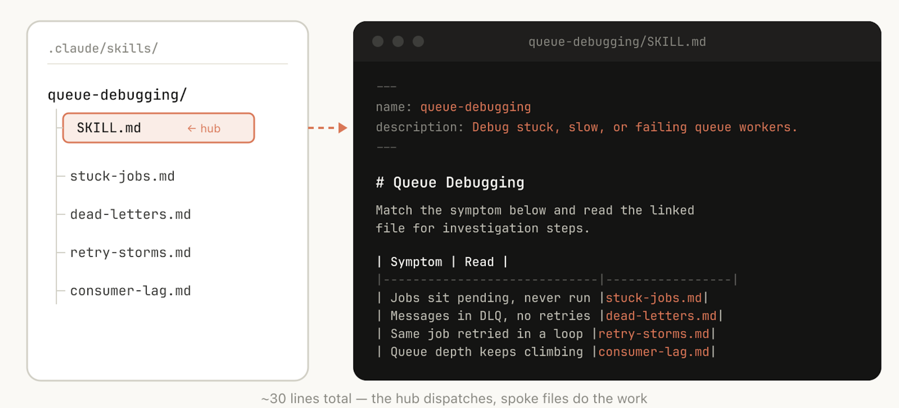
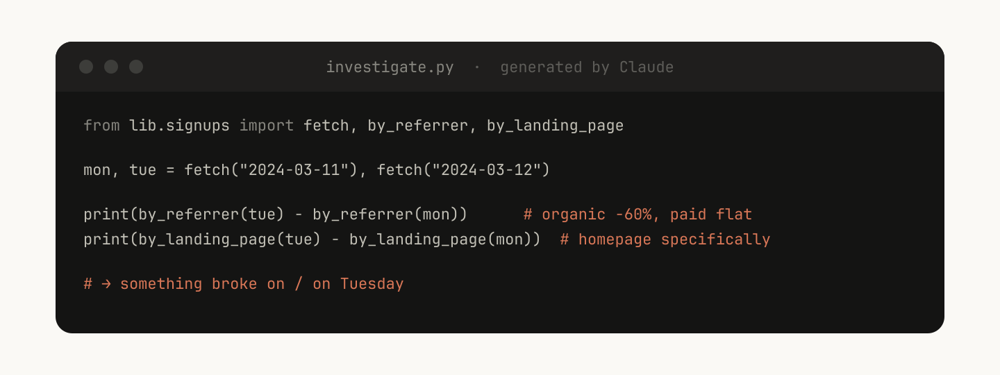

# 构建 Claude Code 的经验教训：我们如何使用技能

> 发布日期：2026-06-03 · [原文链接](https://claude.com/blog/lessons-from-building-claude-code-how-we-use-skills) · 机器翻译，仅供学习。

## 技能类型

在对 Anthropic 的所有内部技能进行分类后，我们注意到它们分为九类。最好的技能可以完美地融入其中；那些试图做太多事情的人跨越了几个并混淆了智能体。这不是一个明确的列表，但它是一个有用的框架，可用于识别您自己的技能库中的差距。

Claude Code 团队对我们的内部技能进行了分类，发现它们可以分为九个不同的类别。

### **1. 库和API参考**

这些技能解释了如何正确使用库、CLI 或 SDK。它们可能既适用于内部库，也可能适用于 Claude Code 有时难以处理的通用库。这些技能通常包括一个参考代码片段文件夹和一个在编写脚本时要避免的 Claude 陷阱列表。

示例包括：

- `billing-lib` — 您的内部计费库：边缘情况、脚枪等。
- `internal-platform-cli` — 内部 CLI 包装器的每个子命令以及有关何时使用它们的示例。
- `sandbox-proxy` — 配置您组织的出口网关以进行开发工作：哪些主机可访问、如何调试“连接被拒绝”错误、如何添加白名单条目。

### **2、产品验证**

这些技能描述了如何测试或验证代码是否正常工作。它们通常与 playwright、tmux 或其他外部工具配合使用进行验证。

验证技能对 Claude 内部的输出质量产生了最可衡量的影响。让工程师花一周的时间来提高您的验证技能是值得的。

考虑一些技术，例如让 Claude 录制其输出的视频，以便您可以准确地看到它测试的内容，或者在每个步骤中对状态强制执行编程断言。这些通常是通过在技能中包含各种脚本来完成的。

示例包括：

- `signup-flow-driver` — 在无头浏览器中运行注册 → 电子邮件验证 → 登录，并在每个步骤中使用断言状态的钩子
- `checkout-verifier` — 使用 Stripe 测试卡驱动结帐 UI，验证发票实际上处于正确状态
- `tmux-cli-driver` — 用于交互式 CLI 测试，您要验证的内容需要 TTY

### **3. 数据获取与分析**

这些技能与您的数据和监控堆栈相关。这些技能可能包括使用凭据、特定仪表板 ID 等获取数据的库，以及有关常见工作流程或获取数据的方法的说明。

示例包括：

- `funnel-query` —“我参加哪些活动来查看注册 → 激活 → 付费”加上实际具有规范 user\_id 的表
- `cohort-compare` — 比较两个群组的保留或转化，标记统计上显着的增量，链接到细分定义
- `grafana` — 数据源 UID、集群名称、问题 → 仪表板查找表
- `datadog` — 字段引用（@request\_id 与trace\_id）、服务列表、指标前缀约定

### **4. 业务流程和团队自动化**

这些技能可以将重复的工作流程自动化为一个命令。这些技能通常是相当简单的指令，但可能对其他技能或 MCP 具有更复杂的依赖性。对于这些技能，将以前的结果保存在日志文件中可以帮助模型保持一致并反映以前的工作流程执行情况。

示例包括：

- `standup-post` — 聚合您的票务跟踪器、GitHub 活动和之前的 Slack → 格式化的站立，仅增量
- `create-<ticket-system>-ticket` — 强制实施架构（有效枚举值、必填字段）以及创建后工作流程（ping 审阅者、Slack 中的链接）
- `weekly-recap` — 合并 PR + 封闭票据 + 部署 → 格式化回顾帖

### **5. 代码脚手架和模板**

这些技能可以为代码库中的特定功能生成框架样板。您可以将这些技能与可编写的脚本结合起来。当您的脚手架具有无法完全由代码覆盖的自然语言要求时，它们特别有用。

示例包括：

- `new-<framework>-workflow` - 使用您的注释构建新的服务/工作流程/处理程序
- `new-migration` — 您的迁移文件模板以及常见问题
- `create-app` — 新的内部应用程序，带有您的身份验证、日志记录和预连接的部署配置

### **6. 代码质量和审查**

这些技能可以增强组织内部的代码质量并帮助审查代码。这些可以包括确定性脚本或工具以实现最大的稳健性。您可能希望作为挂钩的一部分或在 GitHub 操作内部自动运行这些技能。

- `adversarial-review` — 产生一个新的子代理来进行批评、实施修复、迭代，直到发现变得挑剔
- `code-style` — 强制执行代码风格，特别是 Claude 默认情况下做得不好的风格。
- `testing-practices` — 有关如何编写测试以及测试内容的说明。

### **7. CI/CD 和部署**

这些技能可以帮助您在代码库中获取、推送和部署代码。这些技能可以参考其他技能来收集数据。

示例包括：

- `babysit-pr` — 监控 PR → 重试不稳定的 CI → 解决合并冲突 → 启用自动合并
- `deploy-<service>` — 构建 → 冒烟测试 → 逐步流量推出并比较错误率 → 回归自动回滚
- `cherry-pick-prod` — 孤立的工作树 → 精选 → 冲突解决 → 使用模板进行 PR

### **8. 操作手册**

这些技能可以获取症状（例如 Slack 线程、警报或错误签名）、进行多工具调查并生成结构化报告。

示例包括：

- `<service>-debugging` — 映射症状 → 工具 → 最高流量服务的查询模式
- `oncall-runner` — 获取警报 → 检查常见嫌疑点 → 格式化结果
- `log-correlator` — 给定请求 ID，从可能接触过它的每个系统中提取匹配的日志

### **9. 基础设施运营**

这些是执行日常维护和操作程序的技能，其中一些涉及受益于护栏的破坏性行为。这些使工程师能够更轻松地遵循关键操作中的最佳实践。

示例包括：

- `<resource>-orphans` — 查找孤立的 pod/卷 → 发布到 Slack → 浸泡期 → 用户确认 → 级联清理
- `dependency-management` — 您组织的依赖性审批工作流程
- `cost-investigation` —“为什么我们的存储/出口账单激增”与特定的存储桶和查询模式

## 制作技巧小贴士

一旦你决定了制作的技巧，你该如何写呢？这些是 Claude Code 团队的一些制作技能的最佳实践、提示和技巧

### 不要说出显而易见的事情

Claude 已经知道如何编码并可以读取您的代码库。重申 Claude 默认情况下执行的操作的技能会添加上下文，但不会增加价值。如果您要发布的技能主要与知识有关，请重点关注使 Claude 脱离正常思维方式的信息。

的 [前端设计技巧](https://github.com/anthropics/skills/blob/main/skills/frontend-design/SKILL.md) 就是一个很好的例子；它是由 Anthropic 的工程师通过与客户迭代改进 Claude 的设计品味而构建的，避免了 Inter 字体和紫色渐变等经典图案。

### 建立一个陷阱部分

任何技能中最重要的内容就是“陷阱”部分。这些部分应该根据 Claude 在使用您的技能时遇到的常见故障点构建。理想情况下，您将随着时间的推移更新您的技能以捕获这些陷阱。

例如：

“的 `subscriptions` 表只能追加。您想要的行是版本最高的行，而不是最新的行 `created_at`”。 “这个领域被称为 `@request_id` 在 API 网关中和 `trace_id` 在计费服务中。它们是相同的值。” “即使 Stripe webhook 没有实际处理，Staging 也会返回 200。检查 `payment_events` 为了真实的状态。”

### 使用文件系统和渐进式披露

SKILL.md 文件指向其他几个文件 Claude 可以在特定情况下参考。例如，如果作业处于待处理状态，则它应该引用 卡住的作业.md。

正如我们之前所说，技能是一个文件夹，而不仅仅是一个 Markdown 文件。您应该将整个文件系统视为上下文工程和渐进公开的一种形式。告诉 Claude 您的技能中有哪些文件，它会在适当的时候读取它们。

渐进式披露的最简单形式是指向其他 Markdown 文件以供 Claude 使用。例如，您可以将详细的函数签名和使用示例拆分为 `references/api.md`.

另一个例子：如果你的最终输出是一个 markdown 文件，你可能会在其中包含一个模板文件 `assets/` 复制和使用。

您可以拥有参考文献、脚本、示例等文件夹，这有助于 Claude 更有效地工作。

### 避免铁路运输 Claude

Claude 通常会尝试遵循您的说明，并且由于技能可重复使用，因此您需要小心不要在说明中过于具体。为 Claude 提供其所需的信息，但赋予其适应情况的灵活性。

例如：

### 仔细考虑设置

如果配置中未包含 Slack 通道，则上述技能将写入到用户提示词。

某些技能可能需要根据用户的上下文进行设置。例如，如果您正在制作一项技能，将您的站立演讲发布到 Slack，您可能希望 Claude 询问将其发布到哪个 Slack 频道。

执行此操作的一个好模式是将这些设置信息存储在技能目录中的 config.json 文件中，如上面的示例。如果未设置配置，智能体可以向用户询问信息。

如果您希望智能体呈现结构化的多项选择问题，您可以指示 Claude 使用 AskUserQuestion 工具。

### 为模型编写描述，而不是为人类编写描述

当 Claude Code 启动会话时，它会构建每个可用技能及其描述的列表。此列表是 Claude 扫描的内容，以决定“是否有适合此请求的技能？”这意味着描述字段不是摘要，而是何时触发该技能的描述。

在描述中包含技能的触发因素（例如“保姆”）会很有帮助。

‍

### 帮助Claude记住

此文本日志文件可帮助 Claude 记住过去的事件，例如查看 Sarah 的授权 PR。

有些技能可以通过在其中存储数据来包括某种形式的记忆。您可以将数据存储在任何简单的数据中，例如仅附加文本日志文件或 JSON 文件，或者复杂的 SQLite 数据库。

例如，一个 `standup-post` Skill 可能会在其编写的每一篇文章中保留一个 Standups.log，这意味着下次运行它时，Claude 会读取自己的历史记录，并可以知道自昨天以来发生了什么变化。

您可以使用环境变量 `${CLAUDE_PLUGIN_DATA}` 要获得可以存储数据的稳定目录，请在此处阅读技能中的更多持久数据： <https://code.claude.com/docs/en/plugins-reference#persistent-data-directory>.

### 存储脚本并生成代码

您可以为 Claude 提供的最强大的工具之一就是代码。提供 Claude 脚本和库让 Claude 轮流进行组合，决定下一步做什么，而不是重建样板。

例如，在你的 `data-science` 您可能拥有一个函数库来从事件源获取数据。为了让 Claude 进行复杂的分析，您可以为其提供一组辅助函数，如下所示：

然后，Claude 可以动态生成脚本来编写此功能，以便对提示词进行更高级的分析，例如“星期二发生了什么？”

### 使用按需挂钩

技能可以包括仅在调用技能时激活的挂钩，并且仅在会话持续时间内持续。将其用于您不想一直运行但有时非常有用的更固执己见的挂钩。

例如：

- `/`**`careful`**— 通过 Bash 上的 PreToolUse 匹配器阻止 rm -rf、DROP TABLE、强制推送、kubectl 删除。只有当你知道自己正在触摸产品时，你才需要这个——让它一直开着会让你发疯。
- `/`**`freeze`** — 阻止任何不在特定目录中的编辑/写入。在调试过程中很有用：“我想添加日志，但我总是不小心‘修复’不相关的代码。”

## 分配技能

技能的最大好处之一是您可以与团队的其他成员分享它们。

您可能想通过两种方式与他人分享技能：

- 将您的技能检查到您的存储库中（在 `./.claude/skills`)
- 做一个 **插件** 并拥有一个 Claude Code 插件市场，用户可以在其中上传和安装插件（了解更多信息 [文档](https://code.claude.com/docs/en/plugin-marketplaces) 在这里）

对于在相对较少的存储库中工作的较小团队，将您的技能检查到存储库中效果很好。但签入的每项技能也会为模型的上下文添加一点内容。随着您的扩展，内部插件市场允许您分发技能并让您的团队决定安装哪些技能，以及包括设置流程。

## 管理技能市场

您如何决定哪些技能进入市场？人们如何提交它们？

在Anthropic，我们没有一个集中的团队来做决定；相反，我们尝试有机地找到最有用的技能。如果某人有一项技能希望人们尝试，他们可以将其上传到 GitHub 中的沙箱文件夹，并在 Slack 或其他论坛中引导人们找到它。

一旦一项技能受到关注（这由技能所有者决定），他们就可以发布 PR 将其推向市场。

## 作曲技巧

您可能想要拥有相互依赖的技能。例如，您可能拥有用于上传文件的文件上传技能，以及用于生成 CSV 并上传的 CSV 生成技能。这种依赖性管理尚未原生内置于市场或技能中，但您可以通过名称引用其他技能，并且模型将在安装它们后调用它们。

## 测量技巧

为了了解技能的使用情况，我们使用 PreToolUse 挂钩来记录公司内的技能使用情况（[示例代码在这里](https://gist.github.com/ThariqS/24defad423d701746e23dc19aace4de5)）。这意味着我们可以找到受欢迎的技能或与我们的预期相比不太触发的技能。

## 开始使用

技能最佳实践仍在不断发展。我们大多数最好的技能都是从几行代码和一个陷阱开始的，然后变得更好，因为随着 Claude 遇到新的边缘情况，人们不断添加它们。

了解技能的最好方法是开始、尝试并看看什么对你有用。

- 退房 [我们的技能文档](https://code.claude.com/docs/en/skills)
- [查找可定制的示例技能](https://github.com/anthropics/skills)

*本文由 Anthropic 的技术人员 Thariq Shihipar 撰写，负责 Claude Code 的工作。*
