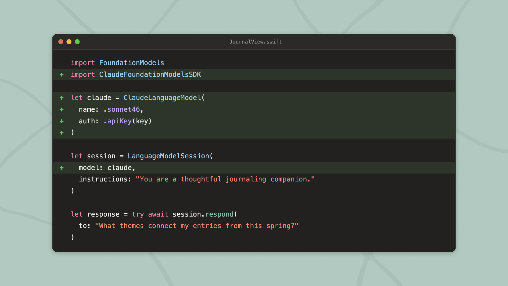
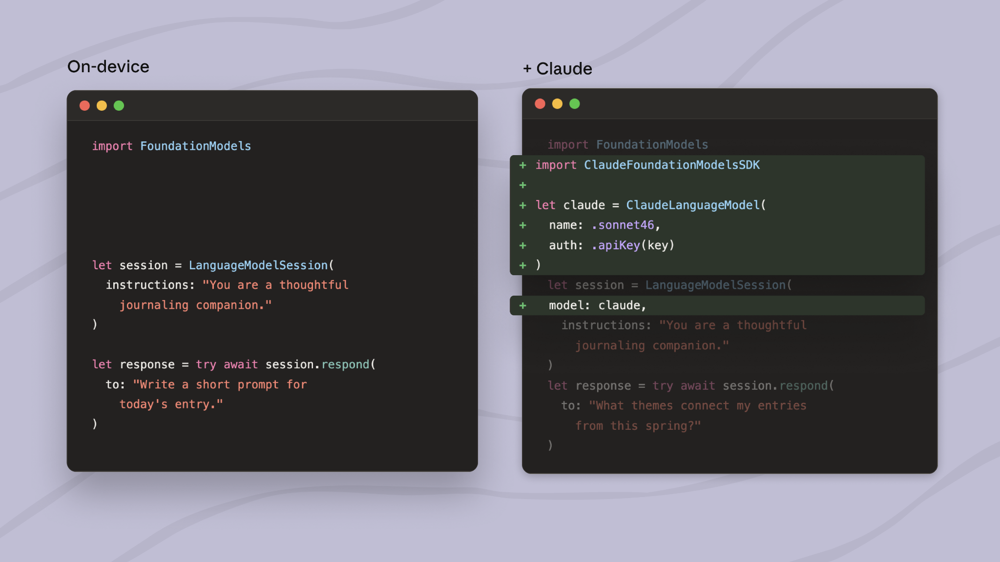

# 在 Foundation模型框架中使用 Claude 为 Apple 平台构建智能应用程序

> 发布日期：2026-06-08 · [原文链接](https://claude.com/blog/claude-for-foundation-models) · 机器翻译，仅供学习。

今天，我们通过新的 Swift 包发布了对 Claude 的 Foundation模型框架支持，让 Apple 开发人员可以使用 Apple 的 Foundation模型框架来调用 Claude 来实现更复杂的工作流程。

Apple 的 Foundation模型框架使开发人员能够从 Swift 本地使用模型。它非常易于使用，只需三行代码即可通过引导生成返回类型化的 Swift 值。开发人员可以使用它来利用 Apple 设备上的模型来执行快速的本地任务，例如摘要或提取。

当请求需要多步推理、代码生成等时，开发人员现在可以使用 Apple 的 Foundation模型框架将其移交给 Claude。 Claude还可以在网络上搜索当前信息并执行代码进行数据分析。将 Claude 的响应流回同一视图。

由于 Apple 的框架从 @Generable 注释返回类型化的 Swift 值，因此开发人员使用干净的输入而不是原始用户文本进行 Claude API 调用。

## 这解锁了什么

Foundation模型框架已经为一系列智能设备功能提供支持——显示个性化提示词的日记应用程序、总结合同的文档应用程序、解释学生级别概念的学习应用程序。添加 Claude 扩展了每个模式。

日记应用程序可以在设备上生成每日提示词，然后要求 Claude 查找跨月份条目的线程。学习应用程序可以在设备上定义术语，然后当学生跟进“为什么这对我们涵盖的其他内容很重要？”时将其移交给 Claude。

这对用户来说是一种体验，每一步都有正确的模型支持。

## 开始使用

Foundation模型框架的 Claude 支持将于明天推出，并可通过 Apple 的 Foundation模型框架在 iOS 27、iPadOS 27、macOS 27、visionOS 27 和 watch OS 27 上运行。将其添加到您的项目，使用 Anthropic 登录API 密钥，并将来自 Apple 设备上的键入输出传递到 Claude 请求中 - 该包处理流、工具调用和返回到 SwiftUI 视图的结构化响应。
