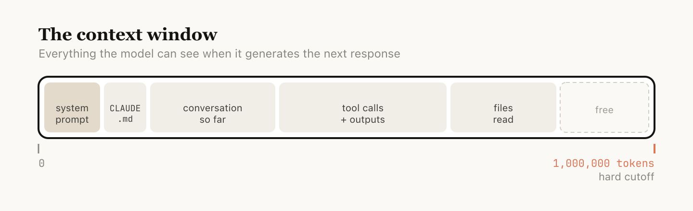
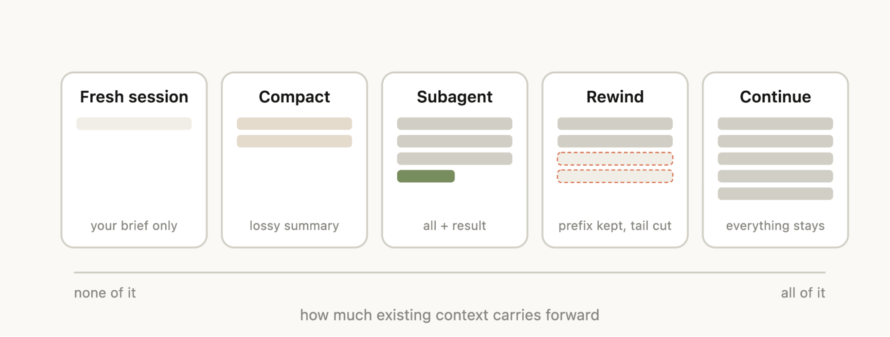
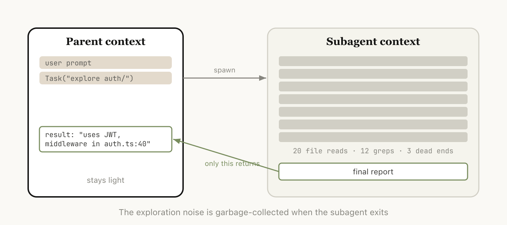

# 使用Claude Code：会话管理和1M上下文

> 发布日期：2026-04-15 · [原文链接](https://claude.com/blog/using-claude-code-session-management-and-1m-context) · 机器翻译，仅供学习。

我们发布了 **`/usage`**，一个新的斜杠命令可帮助您了解 Claude Code 的用法。这一功能是通过与客户的多次对话得知的。

在这些通话中一次又一次出现的问题是，用户管理会话的方式存在很大差异，尤其是我们对 Claude Code 中的 100 万个上下文进行了新更新。

您只使用在终端中保持打开状态的一个会话还是两个会话？您是否会以每个提示词开始一个新会话？你什么时候使用 [紧凑型](https://platform.claude.com/docs/en/build-with-claude/compaction)、倒带或 [分代理](https://code.claude.com/docs/en/sub-agents)？是什么导致了糟糕的压缩或糟糕的会话？

这里有大量令人惊讶的细节，可以真正塑造您的体验 [Claude Code](https://code.claude.com/docs/en/overview) 几乎所有的都来自 [管理您的上下文窗口](https://code.claude.com/docs/en/how-claude-code-works).

## **关于上下文、压缩和上下文腐烂的快速入门**

上下文窗口是模型在生成下一个响应时可以立即“看到”的所有内容。它包括您的系统提示词、到目前为止的对话、每个工具调用及其输出以及已读取的每个文件。 Claude Code 具有一百万个令牌的上下文窗口。

不幸的是，使用上下文会对性能产生轻微影响，这通常称为上下文腐烂。上下文腐烂是指随着上下文的增长，模型性能会下降，因为注意力分散在更多的标记上，而较旧的、不相关的内容开始分散当前任务的注意力。

上下文窗口是一个硬截止，因此当您接近上下文窗口末尾时，您一直在处理的任务会自动总结为较小的描述，并且模型在新的上下文窗口中继续工作。我们称之为压缩。您也可以自己触发压缩。

## **每个转弯都是一个分支点**

假设您刚刚要求 Claude 做某事并且已经完成 - 您现在已经获得了上下文中的一些信息（工具调用、工具输出、您的指令），并且您对于下一步要做什么有数量惊人的选项：

- **继续** — 在同一会话中发送另一条消息
- **`/rewind` （退出退出）** — 跳回上一条消息并从那里重试
- **`/clear`** - 开始一个新的会话，通常是从你刚刚学到的内容中提取的摘要
- **紧凑型** — 总结到目前为止的会议并继续总结
- **子代理** — 将下一个工作块委托给具有自己干净上下文的智能体，并且仅将其结果拉回

虽然最自然的做法就是继续，但还有其他四个选项可以帮助您管理环境。

## **何时开始新会话**

您什么时候保持长时间运行的会话而不是开始新的会话？我们的一般经验法则是，当您开始一项新任务时，您还应该开始一个新会话。

虽然 1M 上下文窗口意味着您现在可以更可靠地执行更长的任务，例如从头开始构建全栈应用程序，但可能会发生上下文腐烂。

有时，您可能会执行一些相关任务，其中某些上下文仍然是必要的，但并非总是如此。例如，为您刚刚实现的功能编写文档。虽然您可以启动新会话，但 Claude 必须重新读取您刚刚实现的文件，这会更慢且更昂贵。

## **倒带而不是纠正**

在 Claude Code 中，双击 Esc（或运行 `/rewind`）让您跳回任何先前的消息并从那里重新输入提示词。该点之后的消息将从上下文中删除。

倒带通常是更好的纠正方法。例如，Claude 读取五个文件，尝试一种方法，但不起作用。您的直觉可能是输入“这不起作用，请尝试 X”。但更好的做法可能是倒回到文件读取之后，并用您学到的内容重新提示词。 “不要使用方法 A，foo 模块不会公开这一点 - 直接使用 B。”

您还可以使用 *“从这里总结”* 或 `/rewind` 斜线命令让 Claude 总结其学习内容并创建一条切换消息，有点像 Claude 未来的自我向前一个迭代发送的消息，尝试了一些东西但没有成功。

## **压缩与启动新会话**

一旦会话时间变长，您有两种方法可以摆脱无关的上下文： `/compact` 或 `/clear` （并重新开始）。他们感觉相似，但行为却截然不同。

**紧凑型** 要求模型总结到目前为止的对话，然后用该摘要替换历史记录。它是有损的，但您不必自己编写任何内容，并且 Claude 可能会更彻底地包含重要的学习内容或文件。您还可以通过传递指令来控制它（`/compact focus on the auth refactor, drop the test debugging`).

与 `/clear`*你* 写下重要的事情（“我们正在重构身份验证中间件，约束是 X，重要的文件是 A 和 B，我们已经排除了方法 Y”）并开始清理。这需要更多工作，但生成的上下文是您认为相关的内容。

## **是什么原因导致自动紧凑型汽车出现故障？**

如果您运行大量长时间运行的会话，您可能会注意到有时压缩可能特别糟糕。在这种情况下，我们经常发现，当模型无法预测您的工作进展方向时，可能会发生错误的压缩。

在上面的示例中，autocompact 在长时间的调试会话后触发并总结调查，您的下一条消息是“现在修复我们在 bar.ts 中看到的其他警告”。

但由于会议的重点是调试，其他警告可能已从摘要中删除。

这是特别困难的，因为由于上下文腐烂，模型在压缩时处于最不智能的点。  有了一百万个上下文，您就有更多时间主动 /compact 描述您想要做什么。

## **子代理和新的上下文窗口**

[子代理](https://claude.com/blog/subagents-in-claude-code) 当您事先知道一大块工作将产生大量您不再需要的中间输出时，这种方法往往会发挥良好的作用。

当 Claude 通过智能体工具生成子代理时，该子代理将获得自己的新上下文窗口。它可以根据需要完成尽可能多的工作，然后综合其结果，以便只有最终报告返回给父级。

我们在Anthropic使用的心理测试： *我是否需要再次使用该工具输出，或者只是结论？*

虽然 Claude Code 将自动调用子代理，但您可能希望告诉它显式执行此操作。例如，您可能想告诉它：

- “启动子代理以根据以下规范文件验证这项工作的结果”
- “分拆一个子代理来阅读其他代码库并总结它如何实现身份验证流程，然后以相同的方式自己实现它”
- “分拆一个子代理，根据我的 git 更改编写有关此功能的文档”

**把它放在一起**

为了帮助您选择要使用的上下文管理功能，我们整理了这张有用的表格，概述了常见情况、需要使用什么工具以及原因。

| 情况 | 考虑达到 | 为什么 |
| --- | --- | --- |
| 相同的任务，上下文仍然相关 | 继续 | 窗户里的一切仍然是承重的；不花钱重建它。 |
| Claude走错了路 | 快退（`double-Esc`) | 保留有用的文件读取，放弃失败的尝试，用你学到的东西重新提示词。 |
| 任务正在进行中，但会话因过时的调试/探索而变得臃肿 | `/compact <hint>` | 省力； Claude 决定重要的事情。如果需要，请按照说明进行驾驶。 |
| 开始一项真正的新任务 | `/clear` | 零腐烂；您可以准确控制接下来的内容。 |
| 下一步将生成大量输出，您只需要从中得出结论（代码库搜索、验证、文档编写） | 子代理 | 中间的工具噪音留在孩子的环境中；只有结果返回。 |

我们期待看到您构建的内容。

‍

*开始使用* [*Claude Code*](https://code.claude.com/docs/en/overview) *今天。*

***关于作者：*** *Thariq Shihipar 是 Anthropic 的技术人员，负责 Claude Code 的工作。*

‍
