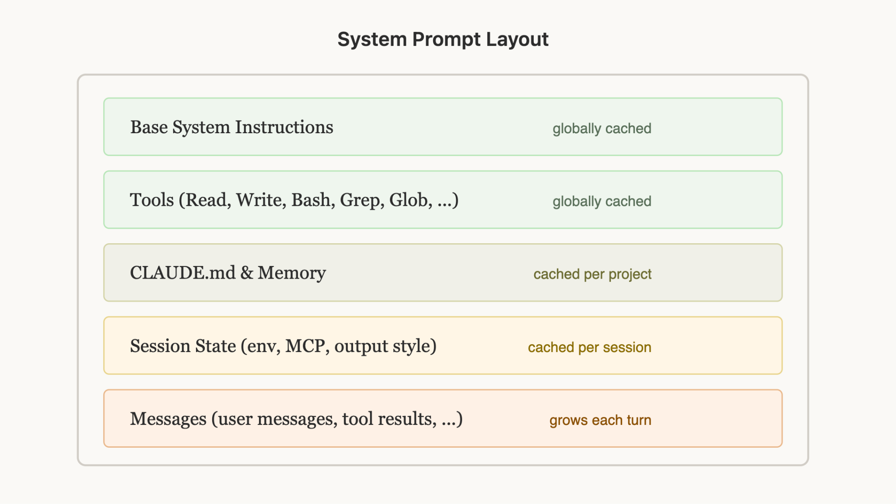

# 构建 Claude Code 的经验教训：提示词缓存就是一切

> 发布日期：2026-04-30 · [原文链接](https://claude.com/blog/lessons-from-building-claude-code-prompt-caching-is-everything) · 机器翻译，仅供学习。

工程界常说“缓存统治着我周围的一切”，同样的规则也适用于智能体。

长期运行的智能体式产品（如 Claude Code）通过以下方式变得可行： [**提示词缓存**](https://x.com/RLanceMartin/status/2024573404888911886) 这使我们能够重用之前往返的计算，并显着减少延迟和成本。

在 Claude Code，我们围绕提示词缓存构建整个线束。高提示词缓存命中率可以降低成本，并帮助我们为订阅计划创建更宽松的速率限制，因此我们会针对提示词缓存命中率运行警报，并在命中率太低时声明 SEV。

这些是我们从大规模优化提示词缓存中学到的（通常是不直观的）经验教训。

## **布置提示词以进行缓存**

Claude Code 的系统提示词的组织结构使得稳定的片段保持缓存，只有对话本身轮流增长。

提示词缓存通过前缀匹配来工作——API 缓存从请求开始到每个请求的所有内容。 `cache_control` 断点。这意味着您放置内容的顺序非常重要，您希望尽可能多的请求共享一个前缀。

如何构造提示词对输出质量也很重要，而不仅仅是缓存命中 — [提示词工程基础](https://claude.com/blog/best-practices-for-prompt-engineering) 是学科的另一半。

最好的方法是先静态内容，最后动态内容。对于 Claude Code ，这看起来像：

1. **静态系统提示词** & 工具（全局缓存）
2. **Claude.md** （缓存在项目内）
3. **会话上下文** （在会话中缓存）
4. **对话消息**

通过这种方式，我们可以最大化共享缓存命中的会话数量。

但这种方法可能出人意料地脆弱。我们之前出于多种原因打破了这种顺序，包括：在静态系统提示词中放置深度时间戳、非确定性地打乱工具顺序定义以及更新工具参数（例如，智能体工具可以调用智能体的参数）。

## **使用消息进行更新**

有时，您放入提示词中的信息可能会过时，例如，如果您有时间或用户更改了文件。更新提示词可能很诱人，但这会导致缓存未命中，并且最终可能对用户来说代价相当昂贵。

考虑是否可以在下一轮通过智能体的中的消息传递此信息。在 Claude Code 中，我们在下一条用户消息或工具结果中添加 <system-reminder> 标记，其中包含模型的更新信息，这有助于保留缓存。

## **不要在会话中更改模型**

提示词缓存是模型所独有的，这可能会使提示词缓存的数学计算变得非常不直观。

例如，如果您在与 Opus 的对话中花费了 100k 令牌，并且想问一个相当容易回答的问题，那么切换到 Haiku 实际上比 Opus 答案更昂贵，因为我们需要为 Haiku 重建提示词缓存。

如果您需要切换模型，最好的方法是使用子代理；扩展上面的示例，您可以部署一个子代理提示词Opus 来准备“移交”消息到另一个模型需要完成的任务。我们经常使用 Claude Code 的 Explore智能体来执行此操作，它使用 Haiku。

## **切勿在会话中添加或删除工具**

在对话过程中更改工具集是人们破坏提示词缓存的最常见方法之一。这看起来很直观——您应该只提供您认为它现在需要的模型工具。但由于工具是缓存前缀的一部分，因此添加或删除工具会使整个对话的缓存失效。

**使用计划模式围绕缓存进行设计**

[计划模式](https://code.claude.com/docs/en/common-workflows) 是围绕缓存约束设计功能的一个很好的例子。直观的方法是：当用户进入计划模式时，将工具集交换为仅包含只读工具，但这会破坏缓存。

相反，我们保留 *全部* 始终在请求中使用 EnterPlanMode 和 ExitPlanMode 作为工具本身。当用户打开计划模式时，智能体会收到一条系统消息，解释其处于计划模式以及说明内容：探索代码库，不要编辑文件，并在计划完成时调用 ExitPlanMode。工具定义永远不会改变。

这有一个额外的好处：因为 EnterPlanMode 是模型可以调用自身的工具，所以它可以在检测到硬问题时自动进入计划模式，而不会中断任何缓存。

**使用工具搜索来推迟而不是删除**

同样的原则也适用于我们的 [工具 搜索工具](https://platform.claude.com/docs/en/agents-and-tools/tool-use/tool-search-tool)。 Claude Code 可以加载数十个 MCP 工具，并且在每个请求中包含所有这些工具的成本很高，但在会话中删除它们会破坏缓存。

我们的解决方案： `defer_loading`。我们没有删除工具，而是发送轻量级存根（只是工具名称，以及 `defer_loading: true`），模型可以在需要时通过工具搜索“发现”。仅当模型选择完整的工具架构时才会加载它们。这使缓存的前缀保持稳定，因为相同的存根始终以相同的顺序存在。

您还可以使用 [工具 搜索工具](https://platform.claude.com/docs/en/agents-and-tools/tool-use/tool-search-tool) 通过我们的 API 来简化这一点。

## **压缩而不破坏缓存**

当上下文窗口填满时，Claude Code 分叉一个缓存的调用来总结对话，然后用摘要代替原始消息继续。

[压实](https://platform.claude.com/docs/en/build-with-claude/compaction) 当你跑出上下文窗口时会发生什么。我们总结了迄今为止的对话，并根据该总结继续举行新的会议。

压缩与提示词缓存的交互方式很容易出错。要压缩对话，您必须将完整对话发送到模型，以便它可以编写摘要。最简单的方法是使用自己的系统提示词（类似于“总结这一点”）进行单独的 API 调用，并且不附加任何工具，但这正是成本陷阱所在。提示词缓存仅当请求的前缀从一开始就与已缓存的内容逐字节匹配时适用。您的主要对话被缓存在一套系统提示词和工具集下；摘要调用使用不同的系统提示词并且没有工具，因此前缀在第一个标记处出现分歧，并且没有任何缓存适用。您最终需要为您发送的整个对话支付完整的、未缓存的输入速率——并且对话越长（即，您一开始需要的压缩越多），一次调用的成本就越高。

**解决方案：缓存安全分叉**

当我们运行压缩时，我们使用 *完全相同* 系统提示词、用户上下文、系统上下文和工具定义作为父对话。我们在父级的对话消息前面添加，然后在末尾附加压缩提示词作为新用户消息。

从 API 的角度来看，此请求看起来与父级的最后一个请求几乎相同 - 相同的前缀、相同的工具、相同的历史记录 - 因此缓存的前缀被重用。唯一的新令牌是压缩提示词本身。

然而，这确实意味着我们需要保存一个“压缩缓冲区”，以便我们在上下文窗口中有足够的空间来包含压缩消息和摘要输出标记。

压缩很棘手，但幸运的是，您不需要自己学习这些课程 - 根据我们从我们构建的 Claude Code 中学到的知识 [压实](https://platform.claude.com/docs/en/build-with-claude/compaction#prompt-caching) 直接进入 API，这样您就可以在自己的应用程序中应用这些模式。

## **经验教训**

以下是我们在构建智能体时发现的一些对于优化提示词缓存有用的模式：

1. **提示词缓存是前缀匹配。** 前缀中任何位置的任何更改都会使其后面的所有内容无效。围绕这个约束设计整个系统。如果排序正确，大部分缓存都是免费的。
2. **使用消息代替系统提示词更改**。您可能想编辑系统提示词来执行诸如进入计划模式、更改日期等操作，但实际上最好在对话期间将这些插入到消息中。
3. **不要在对话中更改工具或模型。** 使用工具进行模型状态转换（如计划模式）而不是更改工具集。推迟工具加载而不是删除工具。
4. **像监控正常运行时间一样监控缓存命中率。** 我们会对缓存中断发出警报并将其视为事件。缓存未命中率几个百分点就会极大地影响成本和延迟。
5. **Fork 操作需要共享父级的前缀。** 如果您需要运行辅助计算（压缩、汇总、技能执行），请使用相同的缓存安全参数，以便在父级前缀上获得缓存命中。

Claude Code 从第一天起就围绕提示词缓存构建；为了在构建智能体时获得最佳结果，我们建议您也这样做。

[*开始使用*](https://code.claude.com/docs/en/overview) *今天与 Claude Code 一起。*

*本文由 Claude Code 团队技术人员 Thariq Shihipar 撰写。*

‍
