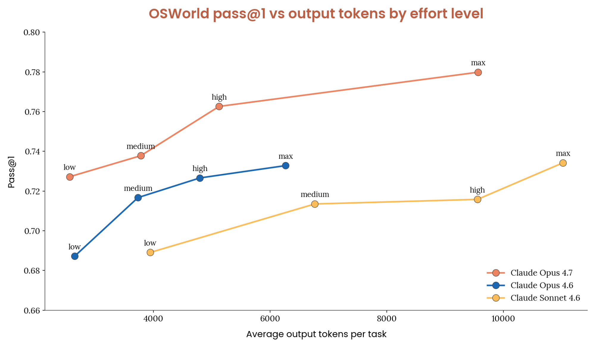
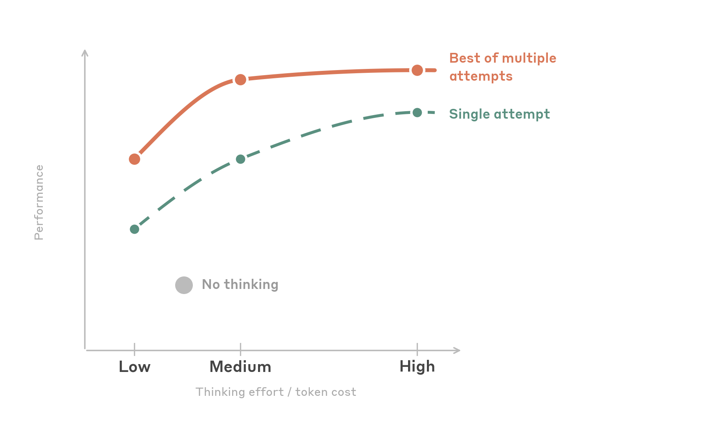

# 使用 Claude 的计算机和浏览器的最佳实践

> 发布日期：2026-05-13 · [原文链接](https://claude.com/blog/best-practices-for-computer-and-browser-use-with-claude) · 机器翻译，仅供学习。

Claude 的 [最新模型](https://www.anthropic.com/news/claude-sonnet-4-6) 代表了计算机和浏览器使用能力的重大进步。由于这些功能，LLM 现在能够为日益复杂的智能体式系统提供支持，从而为实际工作提供支持，例如跨多种不同技术构建软件应用程序和自动化工作流程。

在这篇博文中，我们分享了在计算机和浏览器中使用 Claude 的最佳实践，从简单的配置更改到更高级的集成模式。我们希望这篇文章对您开始将 Claude 的计算机和浏览器使用功能集成到您的产品中有所帮助。我们还发布了一个新的 [演示实施](https://github.com/anthropics/claude-quickstarts/tree/main/computer-use-best-practices) 它封装了其中一些最佳实践，并提供了可用于在 Claude 的计算机使用功能之上进行开发的附加工具。

*请注意，除非另有说明，这些建议适用于 Claude 4.6 系列（Opus 4.6、Sonnet 4.6、Haiku 4.5）和 Claude Opus 4.7。如果 4.6 系列和 Opus 4.7 之间的指导不同，我们将其称为内联。我们的研究结果基于内部实验，未来可能会随着新的模型和技术的出现而更新。*

# **入门：分辨率和缩放比例**

点击准确性是任何计算机使用集成的基础。如果点击没有到达应有的位置，下游就不起作用：表单无法填写，按钮无法按下，工作流程也会失败。影响最大的优化也是最简单的优化之一：在将屏幕截图发送到 API 之前预先缩小屏幕截图的尺寸。

## **确保适当的缩放**

当您将屏幕截图发送到 Claude 的计算机使用 API 时，模型会看到它并返回您指定的 display\_width\_px / display\_height\_px 坐标空间中的单击坐标。但有一个重要的限制：API 对图像大小有内部处理限制。超过这些限制的图像在模型看到它们之前会被缩小，这意味着模型会根据图像的降级版本进行单击，而您的线束期望坐标与原始分辨率对齐。

对于我们的 Claude 4.6模型系列，API 的限制为：

- **最大长边**：1568 像素
- **最大总像素**： 1.15 兆像素
- 图像超过 **要么** 限制在内部缩小

我们的Opus 4.7模型支持更高分辨率。限制是：

- **最大长边**：2576 像素
- **最大总像素**： 3.75 兆像素
- 图像超过 **要么** 限制在内部缩小

当坐标空间与模型的感知图像不匹配时，模型的预测点击会出现在与其实际看到的图像不同的显示比例上。这是高分辨率下点击不准确的主要原因。解决方法很简单：在将屏幕截图发送到 API 之前，始终缩小屏幕截图以适应这些限制。当图像超出限制时，我们始终观察到准确性显着下降，而这一单一更改比几乎任何其他优化都更有价值。

## **推荐分辨率**

**从 1280x720 开始。** 对于大多数用例来说，这是安全、实用的默认设置。它使用了大约 80% 的像素预算，很好地保持在长边和总像素限制内，并且是模型在训练期间看到的标准分辨率。它适用于现代 Web UI 和传统桌面应用程序。

**如果您使用的是 Opus 4.7，我们建议从 1080p 开始**，因为这带来了超过 720p 的有意义的质量提升，并在令牌使用和性能之间提供了良好的平衡。

**对于想要最大化模型接收的视觉信息的开发人员**，我们还推荐“最大 API 拟合”方法：根据源的原始长宽比计算每个图像的最佳分辨率：

```
import math

# 1568 for 4.6 family, 2576 for Opus 4.7
MAX_LONG_EDGE = 1568

# 1.15MP for 4.6 family, 3.75MP for Opus 4.7
MAX_PIXELS = 1_150_000

def compute_max_api_fit(native_w, native_h):
    """Compute the largest resolution that fits API limits
    while preserving aspect ratio."""
    aspect = native_w / native_h

    # Compute max dimensions from pixel budget
    h_from_pixels = math.sqrt(MAX_PIXELS / aspect)
    w_from_pixels = h_from_pixels * aspect

    # Apply long edge constraint
    if native_w >= native_h:
        w = min(w_from_pixels, MAX_LONG_EDGE)
        h = w / aspect
    else:
        h = min(h_from_pixels, MAX_LONG_EDGE)
        w = h * aspect

    # Never upscale beyond native
    w = min(w, native_w)
    h = min(h, native_h)

    return int(w), int(h)
```

这种方法稍微复杂一些，但可以避免纵横比失真，并使用每个图像可用的完整像素预算。相对于固定 1280x720 的精度改进不大，但它是一种简单的实现，可以避免将 16:9 源强制转换为 4:3 显示分辨率时出现的失真。

**应避免的决议：**

- **原始分辨率（未缩放）**：除非您的源图像恰好低于分辨率限制，否则发送原始分辨率屏幕截图是导致点击准确性差的最常见原因。
- **分辨率极低（低于 960x540）**：对于低分辨率图像，模型会丢失太多细节，无法准确识别小 UI 元素。
- **如果在 MacOS 上：**  浏览器使用的一个常见问题是，MacOS 上的屏幕截图通常是以 2 的设备像素比捕获的，这意味着您最终得到的图像可能是屏幕坐标分辨率的 2 倍。
- **如果您使用的是 4.6 系列，请避免使用 1920x1080 及以上版本：** 这些超出了像素限制，并将被悄悄缩小。 Opus 4.7 的上限更高（3.75 MP），因此 1080p 和 1440p 在预算范围内；仍然避免在不缩小尺寸的情况下使用原生 4K。

## **坐标缩放**

当您在发送屏幕截图之前调整屏幕截图大小时，模型将返回您指定的显示分辨率中的单击坐标。在执行单击之前，您必须将它们缩放回实际的屏幕分辨率：

```
# Your screen is screen_w x screen_h
# You sent a screenshot resized to display_w x display_h
scale_x = screen_w / display_w
scale_y = screen_h / display_h

screen_x = int(api_returned_x * scale_x)
screen_y = int(api_returned_y * scale_y)
```

这很简单但很重要，因为如果你忘记缩放或 `display_width_px` / `display_height_px` 与您发送的图像的实际尺寸不匹配，每次点击都会一致偏移

## **消息数组中的内容排序**

构建消息内容数组时，放置文本指令 *之前* 图像，如下面的代码片段所示。这让模型在处理屏幕截图时知道它在寻找什么，从而提高了点击准确性。

```
# RECOMMENDED — text instruction first, then screenshot:
content = [
    {"type": "text", "text": "Click on the Submit button"},
    {"type": "image", "source": {"type": "base64", "media_type": "image/png", "data": screenshot_b64}},
]

# NOT RECOMMENDED — image first, then text:
content = [
    {"type": "image", "source": {"type": "base64", "media_type": "image/png", "data": screenshot_b64}},
    {"type": "text", "text": "Click on the Submit button"},
]
```

## **诊断点击问题**

如果点击未达到目标，通常可以归结为以下原因之一：

| 症状 | 可能的原因 | 试试这个 |
| --- | --- | --- |
| 咔嗒声始终向一个方向偏移 | - `display_width_px` / `display_height_px` 与发送的实际图像尺寸不符 - 屏幕截图超出了 API 限制，正在悄然缩小 - 内容排序是图像优先而不是文本优先 | - 确保显示尺寸与您调整大小的屏幕截图完全匹配，而不是您的原始分辨率 - 预缩小至 1280x720 或使用 `compute_max_api_fit` - 将文本指令移动到内容数组中的图像之前 |
| 点击大致落在正确的区域，但未击中目标 | - 目标非常小（复选框、图标、切换） - 源图像的分辨率非常高 (4K+)，并且在缩小过程中细节丢失 - 强制使用非原生宽高比导致的宽高比失真 | - 启用 `enable_zoom: True` 对于密集的 UI - 在缩小尺寸之前以较低的 DPI 进行捕获或裁剪到相关的屏幕区域 - 调整大小时保留源纵横比 |
| 模型完全点击了错误的元素 | - 指令不明确（当存在多个类似提交的按钮时“单击提交”） - 目标附近视觉上相似的元素 - UI 对于单个指令而言过于复杂 | - 使用更具体的提示词和位置上下文（“单击表单右下角的蓝色提交按钮”） - 将复杂的交互分解为更小的步骤 - 提供有关页面布局的附加上下文 |
| 整体准确性较差 | - 发送的屏幕截图超出了 API 限制 - 源图像来自具有极高压缩比的高分辨率显示器 (4K+) - 分辨率太低，丢失关键细节 | - 预先缩小所有屏幕截图以适应限制 - 对于 4.6 系列上的 4K+ 信号源，Sonnet 比 Opus 4.6 更能适应大幅缩减。在 Opus 4.7 上，这一差距很大程度上缩小了，使用 4.7 像素预算（高达 3.75 MP），因此首先需要减少缩放。 - 尝试 1280x720 作为基准；如果损耗太大，请使用 `compute_max_api_fit` |

## **模型单击任务的选择**

根据我们的内部测试，Claude Sonnet 4.6 的点击机械精度更高（更好的空间精度，更少的未遂事件），而 Claude Opus 4.6 则带来更强的推理能力。当源图像需要大量缩小尺寸时，Sonnet 4.6 也更加稳健。

Opus 4.7缩小了这一差距：通过测试，我们发现其点击精度与Sonnet 4.6大致相当，并且其更高分辨率的预算首先减少了所需的缩小量，当您想要Opus级别的推理与强大的点击精度搭配时，它是一个不错的选择。

对于大多数任务，我们建议从 Sonnet 4.6 开始，它提供了点击准确性、推理和成本的最佳平衡。当您想要更强的推理时，特别是在使用高分辨率源图像时，请选择 Opus 4.7。当延迟是优先考虑的时候，Haiku 4.5 仍然是一个很好的选择。高级工作流程仍可能受益于协调器 + 子智能体模式，其中推理模型处理规划和决策，而 Sonnet 或 Haiku 执行机械点击步骤。

## **处理小目标**

随着目标变小，点击精度会降低。大中型 UI 元素（按钮、输入字段和标准菜单项）在安全区内的所有分辨率下都是可靠的。挑战在于小型和微小的目标，例如复选框、系统托盘图标、下拉箭头、小切换开关和树视图展开/折叠按钮。

如果您的应用程序涉及频繁点击小目标，请考虑以下策略：

**对密集的 UI 使用缩放。** Claude 4.6 和 4.7模型支持缩放功能，使模型在单击之前以更高分辨率检查特定屏幕区域。在您的中启用它 [工具配置](https://platform.claude.com/docs/en/agents-and-tools/tool-use/computer-use-tool):

```
{
    "type": "computer_20251124",
    "name": "computer",
    "display_width_px": 1280,
    "display_height_px": 720,
    "enable_zoom": True
}
```

**让目标更大。** 如果您控制 UI 自动化，则增加点击目标的大小（即使是适度增加）也会对可靠性产生不成比例的影响。这可能意味着使用较低的系统 DPI、放大浏览器或调整 UI 缩放设置。

**对微小目标使用键盘替代品。** 对于非常小的元素（例如系统托盘图标或微小的复选框），键盘快捷键或基于选项卡的导航可能比单击更可靠。如果您的工作流程允许，提示模型对特定步骤使用键盘交互可以提高成功率。

**考虑源图像分辨率。** 4K+ 显示器的屏幕截图被压缩到 720p 会丢失大量细节（例如，3840x2160 原始分辨率下的 16 像素复选框在 1280x720 显示分辨率下变为大约 5 像素，这使得目标变得更小，因此更难以命中）。如果您使用的是非常高分辨率的显示器，请考虑使用 Opus 4.7，它的分辨率限制比以前的模型更高。如果使用 4.6模型，请考虑以较低的 DPI 进行捕获，使用显示缩放来放大 UI 元素，或者将屏幕截图聚焦在屏幕的相关部分而不是整个显示上。由于这些模型用更少的像素表示更多的信息，我们观察到随着源图像比例的增加，性能会下降，这意味着需要更多的压缩。

## **我们测试过的方法没有帮助**

我们使用几种流行的优化技术进行了内部评估实验，但没有发现这些方法有一致的提升，尽管结果可能会根据具体情况而有所不同：

- **将图像分解为更小的图块**：将屏幕截图分割为象限或区域并单独发送它们并不能提高点击准确性。
- **用坐标覆盖网格图案**：在屏幕截图中添加视觉坐标网格来帮助模型定位目标并没有产生可靠的收益。
- **调整大小算法选择**：PIL LANCZOS、sips 和其他常见的调整大小算法产生相同的结果。使用对你的堆栈来说方便的任何东西。

## **检查故障**

如果模型在尝试上述修复后出现不可预测的行为，请记录完整的记录并将预测的点击覆盖在源屏幕截图上，以了解模型实际看到和决定的内容。

有些失败根本与点击准确性无关。例如，某些下拉菜单可能会调用浏览器视口无法捕获的系统级 UI -模型似乎无法完成任务，但它根本看不到需要与之交互的菜单。在此类情况下，模型应依赖替代方法，例如 JavaScript 执行、键盘导航或直接文档对象模型(DOM) 操作，而不是单击。

## **快速参考**

*如何缩放和准备图像以供计算机使用*

```
import math
from PIL import Image
import base64
import io

# 1568 for 4.6 family, 2576 for Opus 4.7
MAX_LONG_EDGE = 1568

# 1.15MP for 4.6 family, 3.75MP for Opus 4.7
MAX_PIXELS = 1_150_000

def prepare_screenshot(screenshot: Image.Image, native_w: int, native_h: int) -> tuple[str, int, int]:
    """Resize a screenshot to fit API limits and return base64 + display dimensions."""

    # Option A: Fixed 720p (simple, reliable)
    display_w, display_h = 1280, 720

    # Option B: Max API fit (maximizes fidelity)
    # display_w, display_h = compute_max_api_fit(native_w, native_h)

    resized = screenshot.resize((display_w, display_h), Image.LANCZOS)

    buffer = io.BytesIO()
    resized.save(buffer, format="PNG")
    b64 = base64.standard_b64encode(buffer.getvalue()).decode()

    return b64, display_w, display_h

def scale_coordinates(api_x: int, api_y: int, display_w: int, display_h: int,
                      screen_w: int, screen_h: int) -> tuple[int, int]:
    """Scale API-returned coordinates back to native screen space."""
    screen_x = int(api_x * (screen_w / display_w))
    screen_y = int(api_y * (screen_h / display_h))
    return screen_x, screen_y

def compute_max_api_fit(native_w: int, native_h: int) -> tuple[int, int]:
    """Compute the largest resolution that fits API limits while preserving aspect ratio."""
    aspect = native_w / native_h
    h_from_pixels = math.sqrt(MAX_PIXELS / aspect)
    w_from_pixels = h_from_pixels * aspect

    if native_w >= native_h:
        w = min(w_from_pixels, MAX_LONG_EDGE)
        h = w / aspect
    else:
        h = min(h_from_pixels, MAX_LONG_EDGE)
        w = h * aspect

    w = min(w, native_w)
    h = min(h, native_h)
    return int(w), int(h)
```

**用途：**

```
import anthropic
from PIL import Image

client = anthropic.Anthropic()

# Capture screenshot (your method here)
screenshot = Image.open("screenshot.png")
native_w, native_h = screenshot.size

# Prepare for API
b64, display_w, display_h = prepare_screenshot(screenshot, native_w, native_h)

# Send to Claude — text before image
response = client.beta.messages.create(
    model="claude-sonnet-4-6",
    max_tokens=4096,
    betas=["computer-use-2025-11-24"],
    messages=[{
        "role": "user",
        "content": [
            {"type": "text", "text": "Click on the Submit button"},
            {"type": "image", "source": {"type": "base64", "media_type": "image/png", "data": b64}},
        ]
    }],
    tools=[{
        "type": "computer_20251124",
        "name": "computer",
        "display_width_px": display_w,
        "display_height_px": display_h,
    }],
)

# Scale coordinates back for execution
api_x, api_y = extract_click_coords(response)  # your parsing logic
screen_x, screen_y = scale_coordinates(api_x, api_y, display_w, display_h, native_w, native_h)
```

# **调整计算机使用的思维能力**

Claude最新模型支持 [适应性思维](https://platform.claude.com/docs/en/build-with-claude/adaptive-thinking)，该设置让 Claude 决定在行动之前通过中间步骤进行多少推理。自适应思维无需手动设置思维代币预算，而是让 Claude 根据每个请求的复杂性动态确定何时以及使用多少扩展思维。对于计算机使用，这意味着 Claude 可以思考屏幕上看到的内容，规划多步骤交互，并在点击或击键之前进行自我纠正。

通过自适应思维，Claude的思维深度通过思维参数进行控制，努力程度为：低、中、高、x高（Opus 4.7）和最大。更多的思考意味着每个行动有更多的推理，但也意味着更多的输出令牌、更高的延迟和更高的成本。

自然的问题：根据模型，多少思考对于计算机使用来说是最佳的？

## **Claude Opus 4.7**

我们测试了跨桌面应用程序、浏览器和多应用程序工作流程的一套端到端 UI 自动化任务的每个思维努力级别。



**Opus 4.7 的性能优于 4.6 系列。** 在 OSWorld Verified 基准测试中，我们发现 Opus 在同等代币使用和工作量设置下优于所有 4.6 系列模型。 Opus 4.7 在低工作量上的得分类似于 Sonnet 4.6 在最大上的得分，同时每个任务使用大约 1/10 的令牌。对于困难的任务，Opus 4.7 是显而易见的选择。

**努力 `high`** 在使用大约一半的输出令牌的情况下实现了接近最高的任务成功率 `max`。与 Opus 4.6 相比，低、中、高都使用大致相同数量的代币，同时提高了 OSWorld 的分数。在我们的内部测试中，Maxeffort 使用了更多的代币并提供了最好的分数。下表概述了我们关于何时使用每个思考努力级别的建议。

### **努力水平的建议**

| 场景 | 思考努力 | 为什么 |
| --- | --- | --- |
| 大多数用例的默认值 | `high` | Opus 4.7 最适合困难任务。使用 high 将为模型提供足够的推理来规划复杂的多步骤交互，而不会显着增加令牌的使用。 |
| 高通量/成本敏感 | `low` | 降低令牌使用量，同时提供 Opus 4.6 的高工作量和最大工作量设置之间的质量。 |
| 简单、定义明确的工作流程/最快 | 建议尝试Sonnet 4.6 | 如果低延迟是最高优先级，则使用。适合 UI 一致且工作流程已知的短期、可预测任务。 |
| 复杂的一次性任务 | `max` | 当任务极具挑战性并且您需要一次尝试就做好时使用。 |

## **Claude 4.6模型**

我们测试了跨桌面应用程序、浏览器和多应用程序工作流程的一套端到端 UI 自动化任务的每个思维努力级别。



有两种模式很突出：

‍**中等努力是最佳选择。** 将工作量设置为中等可实现接近最高的任务成功率，同时使用大约一半的高输出标记。超过中等水平后，性能有些趋于稳定。值得注意的是，当重试任务时，中和高会收敛到相同的成功率。这意味着高强度的努力可能会帮助模型在第一次尝试时就完成一项艰巨的任务，但经过多次尝试，介质可能会以较低的成本可靠地完成任务。

**一点点思考就能大有帮助。** 低努力是一个令人惊讶的强大选择。它实际上使用 *更少* 总输出令牌比完全禁用思考（模型犯的错误更少，需要更少的重试周期），同时匹配或稍微超过无思考的准确性。这使其成为成本敏感、高吞吐量工作负载的最佳选择。下表概述了我们的努力建议。

### **努力水平的建议**

| 场景 | 思考努力 | 为什么 |
| --- | --- | --- |
| 大多数用例的默认值 | `medium` | 最佳的准确性成本比。为模型提供足够的推理来规划多步骤交互，而无需过度思考。通过重试，可以以一半的令牌成本获得高性能。 |
| 高通量/成本敏感 | `low` | 比不思考更准确，但由于错误和重试较少，令牌使用率较低。 |
| 简单、定义明确的工作流程/最快 | 思维障碍 | 如果低延迟是最高优先级，则使用。适合 UI 一致且工作流程已知的短期、可预测任务。 |
| 复杂的一次性任务 | `high` | 当任务具有挑战性并且您需要在第一次尝试时就做好它时使用。如果您的系统支持重试，中等可能会达到相同的最终成功率。 |

我们不推荐 `max` 计算机使用的努力。在我们的测试中，它没有提供比 `high` 同时进一步增加产出代币成本。 UI 任务主要是感知性的，而不是深刻的逻辑性，额外的推理预算没有被使用或导致过度思考。请记住，此建议将随着模型的发展而改变。

## **中等设置工作量级别的示例配置**

```
import anthropic

client = anthropic.Anthropic()

response = client.beta.messages.create(
    model="claude-sonnet-4-6",
    max_tokens=16000,
    betas=["computer-use-2025-11-24"],
    thinking={"type": "adaptive"},
    output_config={"effort": "medium"},
    messages=[...],
    tools=[
        {
            "type": "computer_20251124",
            "name": "computer",
            "display_width_px": 1280,
            "display_height_px": 720,
        }
    ],
)
```

## **为什么更多的思考并不总是有帮助**

UI 自动化任务与编码或数学问题根本不同。大多数计算机使用行为都是感性和机械性的：识别正确的元素，点击正确的位置，而不是深刻的逻辑。当模型需要执行以下操作时，思考最有帮助：

- 在开始之前规划一个多步骤顺序（例如，“我需要打开“设置”，导航到“隐私”，然后禁用跟踪”）
- 从意外的 UI 状态中恢复（例如，出现意外的对话框）
- 屏幕内容和任务说明之间的交叉引用信息
- 使用专业软件完成具有挑战性的项目

# **提高安全性：利用提示词注射分级机**

*本节介绍提示词注入保护，如果您使用我们的官方计算机使用工具标头，则默认提供免费的注入保护。但是，如果您有兴趣在自定义计算机或浏览器使用工具上启用此功能，请填写我们的* [*提示词注射分级机兴趣表。*](https://docs.google.com/forms/d/e/1FAIpQLSfXj6rXC-SUQEYHCLabwUe5JuYiYyJ29Ja-KP7EhLIPlyz0tw/viewform?usp=dialog)

计算机使用智能体设计与不受信任的内容进行交互。 Claude 处理的每个屏幕截图、网页或应用程序 UI 都可能包含对抗性指令，包括隐藏文本、操纵图像、欺骗性 UI 元素或试图劫持智能体的行为的社会工程尝试。此攻击面与您控制输入的典型 API 集成有根本不同。使用计算机时，模型的输入是开放互联网以及智能体正在导航的任何软件。

随着计算机使用智能体的能力变得更强、部署更广泛，提示词注入成为相应更严重的风险。可以操纵可以单击、键入和导航的智能体来执行实际操作，例如填写表单、下载文件或导航到恶意 URL。建立针对这些攻击的强大防御对于任何生产部署都至关重要。

## **我们如何处理提示词注入防御**

我们已经详细写了我们的 [提示词注入防御方法](https://www.anthropic.com/research/prompt-injection-defenses) 供浏览器和计算机使用。我们的防御策略在多个层面上运作：

**训练时的稳健性。** 我们使用强化学习将提示词注入阻力直接构建到 Claude 的功能中。在训练过程中，Claude 会接触到嵌入在模拟网页和应用程序 UI 中的注入内容，并在正确识别并拒绝遵循恶意指令时获得奖励。这意味着 Claude 的第一道防线是模型本身，因为它已经学会区分合法的用户指令和任务执行期间遇到的对抗性内容。

**实时分类器。** 我们运行探针扫描进入 Claude 上下文窗口的内容并标记潜在的提示词注入尝试。这些探测器可检测多种形式的对抗性命令，例如隐藏在页面内容中的文本、嵌入图像中的指令以及旨在欺骗智能体的欺骗性 UI 元素，然后在识别出攻击时调整 Claude 的行为。

**连续红队。** 我们的安全研究人员不断探索这些防御措施，并参与外部对抗性评估，以衡量针对不断发展的攻击技术的稳健性。

自最初的计算机使用研究预览以来，我们继续在所有三个层面上进行大量投资。每一代新的模型都包含更强大的训练时防御和更强大的分类器，并且我们扩大了红队评估的攻击技术范围。

## **使用Claude的内置分类器**

当您使用Claude的 [官方电脑使用工具](https://docs.anthropic.com/en/docs/agents-and-tools/computer-use) 通过 API，提示词注入分类器会根据每个请求自动运行。这些分类器与主模型推理并行运行，增加的额外延迟大约为零，并且不会给您的请求带来额外成本。

您无需进行任何配置即可启用此保护。使用官方的时候默认是开启的 `computer_20251124` 工具类型。分类器评估屏幕截图和其他内容以查找提示词注入的迹象，并相应地影响 Claude 的响应。

```
# Classifiers run automatically when using the official CU tool — no extra config needed
tools = [
    {
        "type": "computer_20251124",
        "name": "computer",
        "display_width_px": 1280,
        "display_height_px": 720,
    }
]
```

## **如果您没有使用官方的计算机使用工具**

许多开发人员使用自定义工具定义而不是官方工具定义来构建计算机使用集成 `computer_20251124` 工具类型，例如定义自己的截图和点击工具。如果这描述了您的设置，则上述内置分类器当前不会根据您的请求运行。

我们正在积极探索如何将提示词注入保护扩展到这些自定义实现。如果您正在构建计算机使用或浏览器使用集成而无需官方工具类型，并且对提示词注入分类器感兴趣， [填写此意向表](https://docs.google.com/forms/d/e/1FAIpQLSfXj6rXC-SUQEYHCLabwUe5JuYiYyJ29Ja-KP7EhLIPlyz0tw/viewform?usp=dialog) 当此功能可用时，我们将跟进。

## **无论分类器使用如何，最佳实践**

分类器只是一层防御，而不是完整的解决方案。我们建议对任何计算机使用部署采取以下做法：

**对高风险行动实施人机参与。** 在执行不可逆转的操作（例如提交表单、购买、发送消息或修改数据）之前，让智能体暂停并请求用户确认。无论分类器性能如何，这是针对提示词注入的最有效的缓解措施。

**确定智能体的权限范围。** 限制智能体的功能。如果您的工作流程不需要文件下载，请不要授予智能体下载文件的访问权限。如果不需要发送电子邮件，请不要授予其访问电子邮件客户端的权限。减少成功注射的爆炸半径与防止注射本身同样重要。

**监视并记录智能体操作。** 记录智能体执行的完整操作序列，包括每个步骤的屏幕截图。这使您可以检测异常行为，审核出现问题时发生的情况，并建立反馈循环以随着时间的推移提高系统的稳健性。

**将所有网络内容视为不可信。** 设计您的智能体的系统提示词以清楚区分用户的指令和任务执行期间遇到的内容。提醒模型在网页、电子邮件或应用程序 UI 中找到的文本不是来自用户，不应被视为指令。

# **计算机使用的上下文管理**

使用智能体组装电脑时，截图积累速度很快。每个动作都会生成一个新图像，每个图像大约消耗 1,000-1,800 个令牌，具体取决于分辨率。考虑到系统提示词、工具定义和文本内容后，200k 的上下文窗口可以填满不到 100 个屏幕截图。

良好地管理此上下文有两个目标：1）保持代币总数有限；2）保持提示词缓存有效，这样您就不会重复为同一前缀支付全价。我们发现这很有效 [上下文管理](https://www.anthropic.com/engineering/effective-context-engineering-for-ai-agents) 与几乎任何其他优化相比，对长时间运行的智能体成本和延迟的影响更大。本节涵盖了清晰组合的三个层：放置缓存断点、在不破坏缓存的情况下修剪旧屏幕截图以及在修剪不够时总结历史记录。

## **放置缓存断点**

提示词缓存仅当断点落在跨回合重复出现的内容上时才有帮助。 API 总共支持四个缓存断点。将所有四个断点放在一个稳定的前缀（系统提示词，工具定义）上会浪费它们，因为该前缀已经被击中一次并且永远不会失效，因此一个断点就足够了。其他三个最好花在最近的历史上，其中无效风险最高，而且在长时间的会话中节省的费用会增加。

我们推荐：

- **系统提示词或跟踪工具定义上的一个断点。** 此前缀在会话中很少更改。
- **最新工具结果最多可添加三个断点**，推进每个回合并清除上一个迭代的断点，这样就不会超出四个断点的限制。

在最近的位置上分布断点可以让你优雅地降级。如果您最近的断点无效，例如通过图像修剪、压缩或工具定义更改，早期的断点仍然可能命中，并且您仍然需要支付全部输入成本的 10%，而不是 100%。

*缓存控制和设置断点示例：*

```
def set_trailing_cache_control(messages, max_breakpoints=3):
    """Place up to `max_breakpoints` ephemeral cache_control markers on the
    most recent tool_result blocks, after clearing any existing markers."""
    for msg in messages:
        for block in msg.get("content", []):
            if isinstance(block, dict):
                block.pop("cache_control", None)

    placed = 0
    for msg in reversed(messages):
        for block in reversed(msg.get("content", [])):
            if placed >= max_breakpoints:
                return
            if isinstance(block, dict) and block.get("type") == "tool_result":
                block["cache_control"] = {"type": "ephemeral"}
                placed += 1
```

## **方法 1：滚动缓冲区（缓存感知）**

限制令牌计数的最简单方法是仅保留 N 个最近的屏幕截图并删除其余的。在每次 API 调用之前，遍历消息数组并用短占位符替换旧图像块（例如，显示“[图像省略]”的文本块）。

这种模式的简单版本是在屏幕截图过期时一次删除一个屏幕截图，这会在每一轮中更改前缀并使提示词缓存不断失效。这就是滚动缓冲区因破坏缓存而闻名的原因。解决方法是批量修剪，以便前缀一次在几个回合中保持字节相同，然后失效一次，然后再次保持稳定。

我们测试过的具体模式是：

1. 以全分辨率保存最新的 keep\_n 屏幕截图。
2. 一旦屏幕截图总数超过 keep\_n + 间隔，请在一次传递中用占位符替换最早的间隔屏幕截图。
3. 在修剪事件之间，消息数组在各个轮次中是字节相同的，因此您的缓存断点会不断命中。

合理的默认值从：keep\_n = 3，interval = 25 开始。这些是可调的，较高的间隔意味着更少的修剪事件（更好的缓存效率），但上下文中全分辨率屏幕截图的尾部更大（更多标记）。测量代表性轨迹上的缓存命中率和总输入令牌并进行调整。

*在保留缓存断点的同时修剪以前的屏幕截图的示例：*

```
def prune_old_screenshots(messages, keep_n=3, interval=25):
    """Replace older screenshots with text placeholders in batches.
    Only prunes when the total count exceeds keep_n + interval, so the
    message prefix stays byte-stable for `interval` turns between prunes."""
    image_positions = [
        (msg_idx, block_idx)
        for msg_idx, msg in enumerate(messages)
        for block_idx, block in enumerate(msg.get("content", []))
        if isinstance(block, dict) and block.get("type") == "image"
    ]
    if len(image_positions) <= keep_n + interval:
        return messages

    to_prune = image_positions[:-keep_n][-interval:]
    for msg_idx, block_idx in to_prune:
        messages[msg_idx]["content"][block_idx] = {
            "type": "text",
            "text": "[Image omitted]",
        }
    return messages
```

滚动缓冲区仍然有一个真正的限制：缓冲区之外的任何内容都会消失。原始说明、智能体已经尝试过的内容以及它在任务中的位置都随着修剪的屏幕截图而消失。对于短期任务（大约 50 个操作以下），这很好。对于更长的时间，请将其与压缩结合起来。

## **方法2：基于LLM的压缩**

不要默默地丢弃旧图像，而是在丢弃之前总结完整的对话。摘要保留了发生的事情、用户请求的内容、已完成的内容以及从何处恢复。一些最近的屏幕截图保留在它旁边，以便智能体可以看到它当前正在查看的内容。

压缩和缓存感知滚动缓冲区是互补的。逐轮使用滚动缓冲区来保持代币增长可控；偶尔使用压缩来回收窗口的其余部分，而不会丢失早期的上下文。每个压缩事件在设计上都是缓存失效，因此您希望它很少发生，而不是每隔几轮发生一次。

### **总结提示词**

此示例提示词提供了一个支架，其中每个部分都针对特定的故障模式。提示词必须捕获智能体继续执行任务所需的所有内容，而无需重新读取原始对话，如下例所示：

```
COMPACT_PROMPT = """Your task is to create a detailed summary of this conversation that
will REPLACE the conversation history. The agent will continue working with only this
summary and a few recent screenshots as context.

CRITICAL: Preserve ALL user instructions verbatim. User instructions are the most
critical element. If they are lost, the agent will deviate from the task.

Before providing your summary, analyze the conversation in  tags:
1. Extract every user instruction, requirement, and constraint
2. Identify if this is a repeatable workflow (e.g., processing N items)
3. Chronologically trace what actions were taken and what happened

Your summary MUST include these sections:

1. USER INSTRUCTIONS:
   - Complete initial task definition (verbatim when possible)
   - ALL specific requirements and criteria
   - Every "DO NOT", "ALWAYS", "MUST" instruction
   - Any corrections or feedback that changed the approach

2. TASK TEMPLATE (if this is a repeatable workflow):
   - The pattern being repeated
   - Decision criteria for each iteration
   - Standard workflow steps
   - Example of one completed iteration

3. CONSTRAINTS AND RULES:
   - All user-specified rules and restrictions
   - Edge cases and exceptions discovered

4. ACTIONS TAKEN:
   - Pages visited and elements interacted with
   - Forms filled and buttons clicked

5. ERRORS AND FIXES:
   - What went wrong and how it was resolved
   - Approaches that failed (so they aren't retried)

6. PROGRESS TRACKING:
   - Items completed vs. remaining
   - Current position in the workflow

7. CURRENT STATE:
   - Current application, URL and domain (optional)
   - Important page state (logged in, form progress, etc.)

8. NEXT STEP:
   - Exactly what should be done next to continue
"""
```

在上面的提示词中， **用户说明** 防止任务漂移：没有它们，智能体在压缩后会出现偏差。 **任务模板** 捕获可重复模式，以便智能体可以在压缩后继续迭代，而无需从头开始重新导出工作流程。 **限制和规则** 保留任务之前设置或在任务期间发现的限制和边缘情况，因此智能体不会违反它知道要遵守的现有规则。 **采取的行动** 帮助跟踪过去的进度。  **错误和修复** 防止重试失败的方法（“我已经尝试单击“提交”；在选中“条款”复选框之前它不起作用”）。 **进度追踪** 防止重新启动和跳过项目。 **当前状态** & **下一步** 给出了一个明确的恢复入口点。

### **服务器端压缩（测试版）**

使用提示词最简单的方法是让 API 通过以下方式处理压缩 [服务器端压缩](https://docs.anthropic.com/en/docs/build-with-claude/compaction) （测试版）。将您的自定义摘要提示词作为 `instructions` 参数输入 `context_management`，当输入令牌超过触发阈值时，API 会自动汇总。的 `instructions` 参数完全替换了默认摘要提示词，因此上面的部分是模型将遵循的内容。套装 `pause_after_compaction` 附加压缩事件中的最新消息（包括屏幕截图）。

*使用自动压缩工具的示例：*

```
# Minimal — turn on autocompaction with API defaults
response = client.beta.messages.create(
    model="claude-opus-4-7",
    max_tokens=16000,
    betas=["compact-2026-01-12", "computer-use-2025-11-24"],
    context_management={"edits": [{"type": "compact_20260112"}]},
    messages=[...],
    tools=[...],
)

# Customized — set your own trigger threshold and summarization prompt
response = client.beta.messages.create(
    model="claude-opus-4-7",
    max_tokens=16000,
    betas=["compact-2026-01-12", "computer-use-2025-11-24"],
    context_management={
        "edits": [
            {
                "type": "compact_20260112",
                "trigger": {"type": "input_tokens", "value": 150_000},
                "instructions": COMPACT_PROMPT,
            }
        ]
    },
    messages=[...],
    tools=[...],
)
```

### **截断客户端以匹配服务器**

当 API 运行服务器端压缩时，它会替换其一侧的预压缩内容，但您的本地消息数组仍然保留完整的历史记录。如果您在后续的每个回合中继续发送完整的历史记录，您将为服务器不再需要的令牌付费，而且您的滚动缓冲区修剪器将在与服务器实际看到的不同的消息片上运行，这可能会破坏您上面小心维护的缓存稳定前缀。

修复方法是在客户端上镜像服务器的截断，如下面的代码片段所示。当响应报告发生压缩时，请在下一轮之前从本地消息数组中删除压缩标记之前的所有内容。这使客户端和服务器视图保持一致，并让滚动缓冲区保持正常工作。

```
def truncate_to_last_compaction(messages, response):
    """If the server compacted on this turn, drop pre-compaction messages
    locally so the next turn's cache prefix matches what the server sees."""
    context_mgmt = getattr(response, "context_management", None)
    if not context_mgmt or not context_mgmt.get("applied_edits"):
        return messages

    compaction = next(
        (e for e in context_mgmt["applied_edits"] if e["type"] == "compact"),
        None,
    )
    if compaction is None:
        return messages

    keep_from = compaction["message_index_after_compaction"]
    return messages[keep_from:]
```

## **客户端压缩**

如果您使用的模型不支持服务器端压缩，或者您想要完全控制，请使用相同的提示词实现压缩客户端。每次 API 调用后，检查响应使用字段中的输入令牌总数。当超过阈值（例如，上下文窗口的 90%）时，将对话发送到摘要器模型，其中 COMPACT\_PROMPT 作为系统提示词。将消息历史记录替换为摘要加上一些最近的屏幕截图，然后继续智能体循环。

## **把它放在一起**

对于长期运行的计算机来说，使用智能体的良好默认值如下所示：

- 稳定前缀上有一个缓存断点，尾随工具结果上有三个缓存断点，每一回合都会清除并重新放置。
- 缓存感知滚动缓冲区，keep\_n = 3，interval = 25，用占位符批量替换旧的屏幕截图。
- 服务器端压缩使用自定义提示词触发了大约 150k 个输入令牌，再加上客户端截断传递以保持两个视图对齐。

有了这三层，典型的长视野 CU 会话将在绝大多数回合中命中提示词缓存，将总输入令牌限制在上下文窗口以下，并通过压缩事件保留足够的历史记录，使智能体不会丢失任务跟踪。

# **改善计算机和浏览器使用的实验设置**

下面的模式是我们在实现中测试过的技术，这些技术显示出了前景，但还不是全面的建议。每一种方法都会权衡复杂性或成本，以换取特定类型工作负载的潜在提升。我们将它们包含在此处，以便您可以在自己的工作流程中尝试它们，但预计本节中的指南会快速发展。

## **批处理工具**

在更新的参考实现中，我们除了标准计算机和浏览器工具之外还公开了两个工具： `computer_batch` 和 `browser_batch`。每个都接受子操作列表并在单个工具调用中执行它们。例如，模型可以发出包含所有三个操作的一个 computer\_batch 调用，而不是单独的单击、键入和按键操作。

吸引力在于效率：具有 N 个机械动作的工作流程是单次往返，而不是 N 次往返，这在长期任务中有意义地减少挂钟时间和输出令牌支出。风险是复合错误，如果操作 2 取决于操作 1 更改的视觉状态，而操作 1 未命中，则批次的其余部分将根据过时的假设进行操作，并且智能体可能会发生漂移，而不会看到实际状态的屏幕截图。

当子操作是独立的并且不依赖于彼此的视觉结果（填写表单中的多个字段、链接键盘快捷键、滚动和单击已知目标）时，我们建议使用批处理工具。我们会在探索性导航、错误恢复序列或任何“如果操作 1 失败，我需要重新计划”为真实状态的工作流程中避免它们。

由于批处理工具是您自己的自定义定义，因此它们可以与标准计算机或浏览器工具完美地叠加。保持两者可用并让模型选择。

## **顾问工具（测试版）**

的 [顾问工具](https://platform.claude.com/docs/en/agents-and-tools/tool-use/advisor-tool) 将执行者模型与更高智能的顾问模型配对，执行者可以向中代咨询以获得战略指导。执行器运行循环，当它遇到需要更深入推理的东西时，它会调用顾问，接收计划或路线修正，然后继续。这发生在服务器端的单个请求内，您无需进行额外的往返。

特别是对于计算机使用而言，此模式在长期任务中最有用，其中大多数回合都是机械点击，但偶尔的计划时刻（选择要打开的选项卡、从意外模式中恢复、决定是否放弃策略）受益于 Opus 级推理。当大部分代币生成以执行者速率发生时，您将接近顾问单独的质量。

*启用顾问工具的示例：*

```
response = client.beta.messages.create(
    model="claude-sonnet-4-6",
    max_tokens=16000,
    betas=["advisor-tool-2026-03-01", "computer-use-2025-11-24"],
    tools=[
        {
            "type": "advisor_20260301",
            "name": "advisor",
            "model": "claude-opus-4-7",
        },
        {
            "type": "computer_20251124",
            "name": "computer",
            "display_width_px": 1280,
            "display_height_px": 720,
        },
    ],
    messages=[...],
)
```

顾问工具的有用控件包括：

- **`max_uses`:** 根据请求，上限顾问会致电。当您想要限制最坏情况的成本时很有帮助。
- **安全带上的全对话帽：** 顾问每次咨询的费用为 Opus 4.7 费率，因此在很长的会话中，您可能希望在使用一定次数后停止提供顾问。
- **顾问端缓存：** 在多方通话对话中，缓存顾问的前缀在大约三次咨询后就会得到回报。在参考实现中，我们默认使用 5 分钟的临时缓存。

有两件不明显的事情值得了解：顾问程序在没有工具和上下文管理的情况下运行，因此它无法代表您单击或浏览，它只返回文本建议。并且由于执行器模型并不总是记得顾问程序存在于长期任务中，因此请参阅下面的提醒推动部分。

## **清理孤立的顾问块**

当顾问工具启动时，执行器会发出一个 `server_tool_use` 名称为“advisor”的块，后跟一个 `advisor_tool_result` 阻止返回的内容。这些块与其他所有内容一起存在于您的消息数组中。

如果您稍后从工具阵列中删除顾问工具 - 因为您达到了会话范围上限、更改了配置或切换了模型- 那些之前的工具 `server_tool_use` / `advisor_tool_result` 块成为孤块。 API 将在下一个请求时返回 400，因为不再声明引用的工具。

修复方法是一个简单的预发送过程：每当顾问被禁用时，都会遍历消息历史记录并删除任何类型的内容块 `server_tool_use` （名称==“顾问”）和 `advisor_tool_result`.

*删除过时顾问块的示例：*

```
def strip_orphaned_advisor_blocks(messages):
    """Remove advisor server_tool_use / tool_result blocks from history.
    Call this before any request that doesn't include the advisor tool."""
    for msg in messages:
        content = msg.get("content")
        if not isinstance(content, list):
            continue
        msg["content"] = [
            block for block in content
            if not (
                isinstance(block, dict)
                and (
                    (block.get("type") == "server_tool_use"
                     and block.get("name") == "advisor")
                    or block.get("type") == "advisor_tool_result"
                )
            )
        ]
    return messages
```

## **定期提醒轻推**

在长时间会话中，执行器模型可能会忘记哪些工具可用或应该更喜欢哪些工具。两种简短的提醒模式对我们的测试有所帮助：

**批量提醒。** 如果你暴露 `computer_batch` 或 `browser_batch` 与标准工具一起，并在适合批处理时观察模型链接单操作调用，在下一个工具结果后附加一个简短的系统级微调：“记住您可以使用 `computer_batch` 当顺序操作不依赖于中间屏幕截图时，将它们组合到单个工具调用中。”目标是将模型拉回到批处理，而不指定确切的时间。

**顾问提醒。** 执行者很容易忘记顾问工具的存在，尤其是在多次没有调用它的情况下。如果会话时间超过 20 回合且没有顾问致电，请附加一个简短的提醒，表明顾问可以进行计划或修正路线。在参考实现中，我们使用 20 圈节奏并附加一行提示。

这两个推动都是轻触上下文注入，而不是系统提示词重写。每个附加需要花费几十个输入令牌。如果您的系统提示词已经很长或者您的缓存断点已精确放置，请权衡提升是否值得增加无效风险。

## **参考实现中的调试模式**

当出现问题并且您不确定问题出在您的线束、屏幕截图还是模型上时，在开始添加日志记录之前，值得使用参考实现中的三个辅助实用程序：

- **轨迹查看器（streamlit run browser/app.py）。** 加载记录的轨迹，让您逐步完成智能体的转弯，并提供屏幕截图、思考、工具调用和每步的使用情况。最适合回答“模型实际看到了什么，它决定了什么？”运行失败后。
- **工具调试面板（uvicorn debug.server:app --reload）**。一个小型 Web UI，可让您单独使用每个工具：截取屏幕截图、捕获单击坐标、键入、滚动、缩放。对于确认您的捕获管道和坐标缩放实际上正在产生您所期望的结果非常有用。
- **本地化游乐场 (uvicorn localize.server:app --reload --port 8001)**。上传任何图像并要求模型指向目标。以显示分辨率和原始分辨率将预测坐标渲染回图像上。这是诊断点击失误是否是调整大小错误、坐标缩放错误还是真正的模型错误的最快方法。当客户报告不良点击并且您想要单独重现故障时，这尤其有用。

这些都不是构建有效集成所必需的；当默认反馈循环（记录、重新运行、查看记录）不够快时，他们正在调试辅助工具。

## **提高可靠性：教学 Claude**

您可以直接向其显示正确的行为，而不是迭代文本提示词直到 Claude 获得正确的工作流程。记录您自己执行任务、捕获屏幕截图、操作以及可选的每一步语音旁白，然后在 Claude 执行相同工作流程时将演示作为上下文重播。录音成为Claude可以遵循的可重用规范，适应实时UI状态的差异。

我们在 Chrome 的 Claude 内部使用此模式（我们称之为“教学模式”），并在此处共享它，因为底层方法对于构建计算机使用或浏览器使用产品的任何人都广泛有用。它有两个方面的帮助：提高 Claude 大部分可以处理但偶尔会出错的工作流程的可靠性，以及解锁 Claude 无法仅通过文本提示词完成的全新工作流程。核心思想（捕获演示，将其作为上下文反馈）易于实现，并且可以很好地适应浏览器和桌面环境。

### **核心理念：展示，而非讲述**

传统的提示词工程要求用户用文字描述他们想要的内容，然后在 AI 误解时进行迭代。这种模式反转了：用户演示任务，而系统记录他们的操作、屏幕截图和（可选）语音旁白。在播放期间，Claude 接收完整的演示作为上下文，并遵循相同的步骤顺序，适应当前 UI 状态的任何差异。

关键的见解是回放并不是严格的重播。 Claude 以演示为指导，同时推理现场环境。如果按钮已移动或菜单已重新组织，Claude 可以在当前 UI 中找到等效元素，而不是盲目单击记录的坐标。

### **数据模型**

基本单位是“工作流程步骤”，即录制期间捕获的单个动作。每个步骤都捆绑了所做的事情、发生的位置以及屏幕的外观：

```
from dataclasses import dataclass, field
from typing import Literal, Optional

@dataclass
class WorkflowStep:
    action: Literal["click", "type", "navigate", "scroll", "select"]
    description: str                         # Human-readable, e.g. "Click the Submit button"
    timestamp: float
    selector: Optional[str] = None           # CSS selector or XPath
    coordinates: Optional[dict] = None       # {"x": int, "y": int}
    url: Optional[str] = None
    screenshot: Optional[str] = None         # Base64-encoded screenshot
    viewport_dimensions: Optional[dict] = None  # {"width": int, "height": int}
    speech_transcript: Optional[str] = None  # Voice narration, if captured
    value: Optional[str] = None              # For type actions

@dataclass
class SavedWorkflow:
    id: str
    name: str                                # e.g. "Submit expense report"
    steps: list[WorkflowStep] = field(default_factory=list)
    description: Optional[str] = None        # AI-generated summary of the workflow
    start_url: Optional[str] = None
    created_at: float = 0.0
    usage_count: int = 0
```

捕获选择器和坐标是有意为之的：选择器对于布局更改更加稳健，但坐标提供了当选择器中断时可以使用的视觉后备 Claude。存储视口尺寸，以便在播放环境与记录环境不同时可以缩放坐标。

### **录音：捕捉什么**

至少，捕获点击事件、键盘输入、导航更改以及每个操作的屏幕截图。对于每次点击，生成人类可读的描述（从 aria-labels、文本内容或通过快速 Claude 调用），并在点击位置使用视觉标记对屏幕截图进行注释：

```
def on_click(event):
    step = WorkflowStep(
        action="click",
        selector=generate_selector(event.target),
        coordinates={"x": event.client_x, "y": event.client_y},
        url=current_url(),
        description=generate_description(event.target),
        timestamp=now(),
        viewport_dimensions=get_viewport_size(),
    )
    # Annotate screenshot with a circle at the click position
    screenshot = capture_screenshot()
    step.screenshot = annotate_with_circle(screenshot, event.client_x, event.client_y)
    workflow_steps.append(step)
```

注释（单击位置处的彩色圆圈）有两个用途：帮助用户验证录制捕获的正确元素，并在播放期间准确显示 Claude 操作发生的位置。您的回放提示词应澄清这些标记是记录工件，而不是实时 UI 的一部分。

### **回放：构建提示词**

这是最重要的一块。当用户触发保存的工作流程时，您将构造一条发送给 Claude 的消息，其中包含三件事：用户的意图、解释演示格式的上下文块以及记录的屏幕截图。

上下文块告诉 Claude 如何解释带注释的屏幕截图以及如何在实时 UI 不同时进行调整：

```
def generate_playback_context(steps: list[WorkflowStep]) -> str:
    steps_description = "\n".join(
        f"Step {i+1}: {step.description}"
        for i, step in enumerate(steps)
    )

    return f"""<demonstration_context>
The user has recorded a demonstration showing how to perform this task.

RECORDED STEPS:
{steps_description}

ABOUT THE SCREENSHOTS:
- Each screenshot shows the screen state when an action was taken
- BLUE CIRCLES mark where the user clicked — these are recording annotations
- The blue highlighting is NOT part of the actual interface
- Your own screenshots will NOT have these markers

HOW TO USE THIS DEMONSTRATION:
1. Review all steps and screenshots to understand the complete workflow
2. Take your own screenshot to see the CURRENT page state
3. The blue highlights show which element to interact with — find it in your current view
4. Follow the same sequence of actions, adapting to any differences
5. If the UI has changed significantly, use judgment to find equivalent elements
</demonstration_context>"""
```

然后将完整消息与用户的提示词、上下文块以及每个步骤的屏幕截图组装为图像：

```
import anthropic

client = anthropic.Anthropic()

content = [
    {"type": "text", "text": user_prompt},
    {"type": "text", "text": generate_playback_context(workflow.steps)},
]

for i, step in enumerate(workflow.steps):
    if step.screenshot:
        content.append({"type": "text", "text": f"[Step {i+1}: {step.description}]"})
        content.append({
            "type": "image",
            "source": {"type": "base64", "media_type": "image/jpeg", "data": step.screenshot},
        })

response = client.beta.messages.create(
    model="claude-sonnet-4-6",
    max_tokens=4096,
    betas=["computer-use-2025-11-24"],
    messages=[{"role": "user", "content": content}],
    tools=[{
        "type": "computer_20251124",
        "name": "computer",
        "display_width_px": 1280,
        "display_height_px": 720,
    }],
)
```

### **播放模式**

并非每个工作流程都需要同等程度地遵守录制的演示。有些工作流程太长，消耗大量输入令牌，最终降低延迟并增加成本。考虑支持包含在上下文提示词中的严格性参数：

**严格：** 严格按照步骤进行；如果 UI 变化太大，请停止并报告。适合对合规性敏感的工作流程，其中确切的顺序很重要。

**自适应：** 使用演示作为指导，但要适应 UI 更改。这是大多数用例的最佳默认设置 - 它可以优雅地处理较小的布局变化、更新的按钮标签和重新组织的菜单。

‍**目标导向：** 关注最终结果；将记录的步骤视为提示而不是说明。当 UI 频繁更改但目标保持不变时非常有用。使用模型总结录制的演示，使用与下一节中描述的策略类似的策略，然后将该摘要传递给 CU模型。

### **示例：端到端费用报告工作流程**

以下是保存的工作流程在实践中的样子。该工作流程包含五个步骤：导航到费用表单、选择费用类型、从下拉列表中选择“旅行”、输入金额，然后单击“提交”。

```
expense_workflow = SavedWorkflow(
    id="wf_abc123",
    name="Submit Expense Report",
    start_url="https://expenses.company.com/new",
    steps=[
        WorkflowStep(
            action="navigate",
            url="https://expenses.company.com/new",
            description="Navigate to new expense form",
            timestamp=1700000000,
        ),
        WorkflowStep(
            action="click",
            selector="#expense-type-dropdown",
            coordinates={"x": 400, "y": 200},
            description="Click on expense type dropdown",
            timestamp=1700000001,
        ),
        WorkflowStep(
            action="click",
            selector="[data-value='travel']",
            coordinates={"x": 400, "y": 280},
            description='Select "Travel" expense type',
            timestamp=1700000002,
        ),
        WorkflowStep(
            action="type",
            selector="#amount-input",
            value="150.00",
            description="Enter expense amount",
            timestamp=1700000003,
        ),
        WorkflowStep(
            action="click",
            selector="#submit-expense-btn",
            coordinates={"x": 1150, "y": 420},
            description="Click the Submit button",
            speech_transcript="Now I'll click submit to send the report for approval",
            timestamp=1700000004,
        ),
    ],
)
```

当用户稍后说“提交我的团队午餐费用报告（85.50 美元）”时，播放服务会构建一个提示词，其中包含演示上下文、所有五个带注释的屏幕截图以及新请求中的特定值。 Claude 可以准确地看到点击位置、遵循的顺序，并调整数量和描述以匹配当前任务。如果由于输入令牌计数的原因，您的工作流程太长而无法实用，那么请考虑在将其用作示例之前首先压缩工作流程。有关管理上下文的提示，请参阅以下部分。

# **开始使用计算机和浏览器**

这些实践反映了我们目前对如何使计算机使用集成在生产中可靠的最佳理解。它们适用于 Claude 4.6模型系列和 Opus 4.7，并将随着新的模型和技术的出现而更新。

随着集成的成熟，最重要的模式将取决于您的特定环境、目标应用程序和可靠性要求。*‍*

*开始使用* [*计算机使用文档*](https://platform.claude.com/docs/en/agents-and-tools/tool-use/computer-use-tool)*，看看我们的新* [*演示实施*](https://github.com/anthropics/claude-quickstarts/tree/main/computer-use-best-practices) *这些最佳实践，或重新审视* [*原始计算机使用研究岗位*](https://www.anthropic.com/news/developing-computer-use) *了解这些功能是如何构建的以及它们的发展方向的背景。*

*致谢：本文和相应的演示由 Lucas Gonzalez 和 Luca Weihs 编写。作者要感谢 Molly Vorwerck、Javier Rando、Maya Nielan、Gabe Mulley 和 Brigit Brown 的贡献。*
