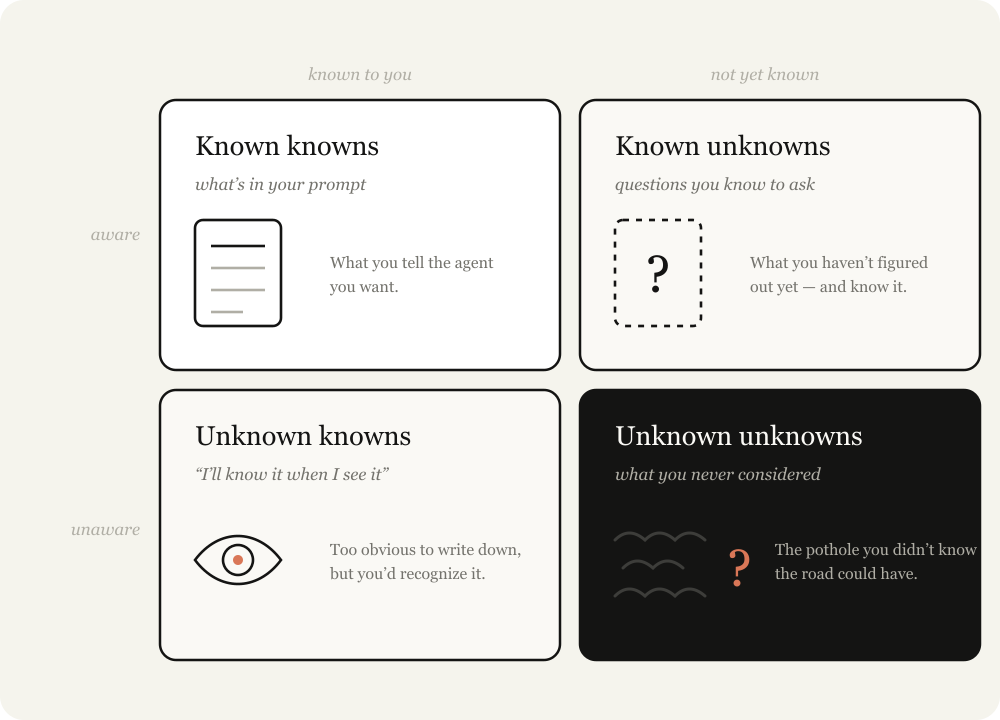

# Claude Fable 现场指南 5：寻找未知数

> 发布日期：2026-07-06 · [原文链接](https://claude.com/blog/a-field-guide-to-claude-fable-finding-your-unknowns) · 机器翻译，仅供学习。

## 了解你的未知数

你的未知数是什么？当我带着问题来到 Claude 时，我倾向于用 4 种方式将其分解：

- **已知已知：** 这基本上就是我的提示词中的内容。我该告诉智能体我想要什么？
- **已知的未知：** 有什么是我还没弄清楚，但我知道我还没有弄清楚的？
- **未知已知：** 有什么东西如此明显，我永远不会写下来，但如果我看到它就会认出它？
- **未知的未知：** 什么是我完全没有考虑到的？哪些知识是我不知道的？我知道某件事有多好吗？

最好的智能体式编码器的未知数相对较少。看着一个人喜欢 [鲍里斯](https://www.linkedin.com/in/bcherny) 或 [贾里德](https://www.linkedin.com/in/jarred-sumner-a8772425) 提示词，对我来说很明显他们知道自己想要什么。它们与代码库和模型行为深度同步。

但他们也假设未知数。在很多方面，减少和规划你的未知数是 **技能** 智能体式编码。但幸运的是，您可以通过使用 Claude 来提高这项技能。

## 帮助 Claude 帮助你

指导 Claude 是一种微妙的平衡。如果您太具体，Claude 将遵循您的指示，即使枢轴可能更合适。如果您太模糊，Claude 通常会根据行业最佳实践做出选择和假设，而这些选择和假设可能不适合您的任务。

当你不考虑未知因素时，你就会双双失败。你不知道什么时候道路会充满障碍，也不知道什么时候道路会畅通无阻，但你仍然希望Claude转向。

Claude可以帮助您更快地发现未知的事物。它可以非常快速地搜索您的代码库和互联网，并且它对普通主题的了解比您多得多。它还可以更快地从故障中迭代。

此过程中最重要的部分是为 Claude 提供有关您的起点的背景信息。例如，告诉它你在思考过程中处于什么位置；披露您对问题和代码库的经验；并让它像思想伙伴一样与您一起工作。

在本文中，我详细介绍了我用来发现这些未知数的一些模式，包括：

**实施前：**

- 盲点通行
- 头脑风暴和原型
- 采访
- 参考文献
- 实施方案

**实施过程中：**

- 实施说明

**实施后**

- 推介和解释者
- 测验

## 实施前

### 盲点通行证

开始工作时，您可以做的最有用的事情之一就是了解自己的盲点。例如，如果您正在代码库的新部分中编写功能，或者使用 Claude 来帮助您完成不熟悉的工作（例如迭代设计），那么您可能会遇到很多问题 **未知的未知数**.

你可能不知道该问什么问题，什么是好的，已经完成了哪些历史工作，或者要避免哪些坑洼。

在这些情况下，您可以请Claude帮助您找到未知的未知数并向您解释。我喜欢用字面意思“盲点通行”和“未知的未知”。提供有关您是谁以及您所了解的背景信息通常对于 Claude 了解开始与您合作的最佳方式很重要。

**示例提示词**:

- “我正在努力添加一个新的身份验证提供程序，但我对此代码库中的身份验证模块一无所知。您能做一个盲点传递来帮助我找出相关的未知未知数并帮助我提示词更好。”

- “我不知道什么是颜色分级，但我需要对这个视频进行分级。你能教我了解我对颜色分级的未知数，以便我能更好地提示词吗？”

### 头脑风暴和原型

当我在一个有很多人的地方工作时 **未知的已知**，涉及到我只有看到才知道定义的标准，我喜欢请 Claude 和我一起集思广益并制作原型。

在原型设计过程中尽早识别和表达未知的已知信息非常有价值，因为在实施过程中找出它们可能（相对）昂贵。功能或规范中的微小更改可能会导致代码中的实现截然不同，并且智能体恢复以前的更改可能会更加困难。

例如，您可能只想查看添加到框架的按钮的外观，而无需连接后端路由或在前端维护其他状态。

另一个例子是视觉设计，这对我来说是很难说清楚的东西，但当我看到它时我知道我想要什么。在这些情况下，我会要求针对工件提供几种设计方法。

我几乎每次编码会议都会以探索或头脑风暴阶段开始。这有助于我开始明确项目范围。 Claude 经常发现我可能会错过的高价值方法，有时甚至会只见树木不见森林。头脑风暴可以防止我将范围设定得太窄或太宽。

**示例提示词：**

- “我想要一个用于这些数据的仪表板，但我没有视觉品味，也不知道有什么可能。为我制作一个具有 4 个截然不同的设计方向的 HTML 页面，以便我可以对它们做出反应。”

- “在连接任何东西之前，创建一个 HTML 文件，用虚假数据模拟新的编辑器工具栏。我想在你接触真正的应用程序之前对布局做出反应。”

- “这是我遇到的棘手问题：用户在入职后流失。搜索代码库并集思广益 10 个我们可以干预的地方，从最便宜的到最雄心勃勃的。我会告诉你哪些能引起共鸣。”

### 采访

一旦我进行了足够的头脑风暴，我可能仍然有未知的情况。

在这种情况下，我要求 Claude 就任何未知或含糊之处采访我。当要求 Claude 采访您时，请尝试提供有关您问题的背景信息以指导其提问。

‍**示例提示词：**

- “每次询问我一个关于任何模棱两可的问题，优先考虑我的答案会改变架构的问题。”

### 参考文献

有时你无法详细描述你想要什么。例如，您可能不会这种语言，或者它可能太复杂以至于需要您相当长的时间。

在这种情况下，最好的方法是参考。虽然您可以包含图表、文档或图片，但绝对最好的参考是 *源代码*.

如果您有一个以某种方式实现某些内容的库或您真正喜欢的设计组件，只需将 Fable 指向该文件夹并告诉它要查找什么，即使它使用不同的语言。与屏幕截图等相比，这为 Claude 提供了更丰富的标记和结构细节。

**示例提示词：**

- “供应商/速率限制器中的这个 Rust 箱实现了我想要的确切退避行为。阅读它并在我们的 TypeScript API 客户端中重新实现相同的语义。”

### 实施计划

当我认为我已经准备好实施时，我倾向于要求 Claude 制定一个实施计划供我审查。该计划重点关注最有可能更改的部分，例如数据模型、类型界面或 UX 流程。这使得 Claude 能够显示我可能实际需要更改的内容。

**示例提示词：**

- “用 HTML 编写实施计划，但以我最有可能调整的决策为主导：数据模型更改、新类型界面以及任何面向用户的内容。将机械重构埋在底部，我在这方面相信你。”

## 实施期间

### 实施说明

一旦我对自己的计划感到满意，我就会创建一个新会话并将所有工件传递给提示词。这为 Claude 提供了一个全新的上下文窗口，但包含根据您的计划编译的所有信息。例如，我可能会传入一个规范文件和一个原型，并要求智能体来实现它。

但事实是，无论你做了多少计划，总会潜伏着未知的未知。智能体在工作过程中可能会发现，由于代码中发现的边缘情况，它需要采取不同的策略。

我要求 Claude Code 保留一个临时的“implementation-notes.md”（或 .html）文件，用于跟踪其所做的决策，以便我们可以为下一次尝试学习。

**示例提示词：**

- “保留一个implementation-notes.md 文件。如果您遇到迫使您偏离计划的边缘情况，请选择保守选项，将其记录在“偏差”下，然后继续。”

## 实施后

### 推介和解释者

交付产品最重要的部分之一是获得认可和批准。  在最终文档中构建推介和解释器工件有助于：

- 当审稿人从与您相同的未知数开始时加快理解
- 当专家希望看到您解释他们预期的未知数和常见故障点时，加快审批速度

**示例提示词：**

- “将原型、规范和实施说明打包成一个文档，我可以将其放入 Slack 以获得支持。以演示 GIF 开头。”

### 测验

经过长时间的工作，Claude 完成的工作可能比我想象的要多得多。阅读代码差异只能让我对发生的事情有一个简单的了解，因为大部分行为将取决于现有的代码路径。

在向我提供了一堆背景信息后，请 Claude 询问我有关更改的情况，这有助于我理解发生了什么。我只有在完美通过测验后才合并。

**示例提示词：**

- “我想确保我了解这次变更中发生的一切。给我一份关于变更的 HTML 报告，以便我阅读并理解上下文、直觉、所做的事情等，并在底部进行一个关于我必须通过的变更的测验。”

## 这是如何结合在一起的：启动 Fable

的 [Fable 的启动视频](https://x.com/ClaudeDevs/status/2064399512664526853) 使用 Claude Code 进行端到端编辑。这对我来说是一个新领域，我绝不是专家。

所以我从我所知道的开始。我知道Claude可以使用代码来编辑视频并转录它们，但我不确定它是否足够准确。然后我请 Claude 向我解释像 Whisper 这样的转录是如何工作的，以及我是否能够使用 ffmpeg 准确地剪掉诸如 ums 或大停顿之类的东西。

我希望 Claude 创建一个与我所说的话同步的 UI，但不确定是否可行，所以我要求 Claude 使用 Remotion 和转录来创建一个原型视频，看看它是否可行。

最后，视频本身看起来有点静音，我知道这是颜色分级的结果，但我并不真正知道颜色分级是什么。我的第一次尝试是尝试让 Claude 做一些变化来选择，但我意识到在颜色分级方面我不知道“好”是什么样子。因此，我请 Claude 教我有关颜色分级的知识，以发现我的未知数。

## 匹配地图和领土

模型获得的越好，通过正确的方法可以实现的目标就越多。当长期任务出错时，您可能需要花费更多时间来定义未知因素或创建实施计划，以便您和 Claude 能够适应它们。

每一次解释、头脑风暴、访谈、原型和参考资料都是一种廉价的方法，可以在修复问题变得昂贵之前找出你不知道的地方。

因此，通过询问 Claude 来帮助您找到未知数来开始您的下一个项目。

*本文作者：Thariq Shihipar，技术人员，Anthropic。*
