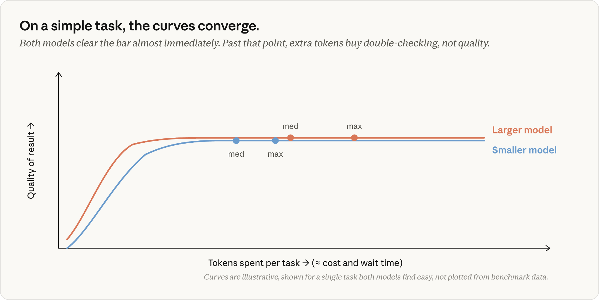

# 选择 Claude模型和 Claude Code 中的工作量级别

> 发布日期：2026-07-07 · [原文链接](https://claude.com/blog/claude-model-and-effort-level-in-claude-code) · 机器翻译，仅供学习。

## **模型选择的工作原理**

当您按 Enter 键时，Claude Code 会将您的消息与系统提示词、工具定义、Claude.md、对话历史记录以及上下文中的任何文件组合在一起。所有这些都作为一个请求发送到 API。

Claude Code 的所有内容都打包到一个 API 请求中。在服务器上，文本在到达模型之前就被标记化。

不过，模型永远不会将其视为纯文本。服务器上发生的第一件事是 **代币化**;文本被分成几个部分，每个部分都映射到模型训练所用的固定词汇表中的一个整数。 const 可能映射到 1978，await 可能映射到 4293。从这里开始，您的提示词是一个整数数组。

分词器将文本分割成多个片段，并将每个片段映射到固定词汇表中的整数。顶行中的每个块都成为其令牌 ID（底行）；显示的 ID 是说明性的。

模型的工作是获取该数组并预测接下来出现的标记。它通过计算a来做到这一点 *概率* 对于其词汇表中的每个标记并从顶部进行选择。在 const x = wait 之后，训练有素的模型在 fetch 上的概率很高（很有可能），而在 Banana 上的概率接近于零（根本不可能）。

模型的预测是其词汇表中每个标记的概率。最重要的猜测和不相关的猜测之间的差距是巨大的。

将您的输入标记转变为这些概率的是 **重量** （也称为 *参数*）。这些是组织成大型矩阵的数十亿个数字。为了预测一个标记，模型通过这些矩阵（一长串矩阵乘法）运行您的输入，并在最后读取概率。权重是模型“知道”的所有内容所在。

**每个模型的权重是在训练期间设置的，当您发送请求时，它们是只读的。** 您的提示词、Claude.md 或您的上下文中没有任何内容会改变它们。 （如果您遇到过推理这个词，这就是它的全部含义：训练完成后使用模型，权重固定。）

你的提示词输入，概率就出来了。中间的权重没有变化。

Claude 所了解的有关 TypeScript、流行框架、惯用的 Go 或任何其他一般编程知识的所有内容，都在训练时被编码到这些权重中。

您的提示词和上下文仍然可以 *驾驶* 预测（将您的真实代码放在 Claude 前面是 *转向*，而且效果非常好），但它们本身并没有给权重添加任何东西。

如果训练模型时库不存在，则它不在权重中。您可以将文档放在上下文中，Claude 将使用它们，但那就是 *转向*, 不 *教学*。 Claude 的响应只会受到该请求的影响；底层模型没有保留该信息。

因此，当 Claude 自信地调用不存在的 API 时（幻觉），权重会生成一个令牌序列： *看起来* 从训练模式来看是合理的，而不是失败的查找。

那么更改模型实际上有什么作用呢？它交换 **哪组冷冻重物** 处理您的请求。

模型不会立即生成完整的答案。它预测一个标记，将其附加到序列中，然后再次运行整个计算以获得下一个标记。 200 个令牌响应是 200 次单独的权重传递。这个循环是您大部分等待时间和输出成本的来源。

该序列每一步只增长一个标记。模型每次都会重新读取整个数组以预测接下来会发生什么。

所以 **模型设置** 决定 *哪个权重* 处理您的请求，它还决定每个输出令牌的成本。

它不决定生成多少代币。对于相同的提示词，该数字可能会有很大差异，具体取决于 Claude 决定执行多少工作。

这就是 **努力** **水平** 控制： *多少工作量* Claude 决定每回合做什么。

## **Claude Code 努力水平如何运作**

当 Claude Code 执行任务时，它生成的令牌分为以下几类：

- **思考**：您在操作之前和操作之间看到的推理。
- **工具调用**：结构化块命名读取或编辑等工具及其参数，然后 Claude Code 解析并执行。
- **发短信给你**：计划、进度更新、总结在最后。

这些都是来自同一循环的普通输出令牌，以相同的费率计费。例如，思考标记的生成方式与其他输出标记完全相同，并且在该回合的剩余时间内保持在上下文中。

当 Claude 继续编写代码时，其早期推理是输入的一部分，就像它读取的文件一样。

Claude 的所有输出都是代币。思考、工具调用和给您的文本都是从同一个循环中生成的。

努力如何改变这一切？工作量级别作为请求的一部分与您的提示词一起发送到模型。模型经过训练，可以了解每个努力级别的行为方式，并将学到的行为融入到冻结的权重中。

当您的请求到达时，努力级别是模型响应的又一个输入，与它响应您的提示词文本的方式相同。这设置了 Claude 的行为，以确定在考虑任务完成之前需要有多彻底和确定。

**每回合都会考虑这一点** 和导致更多的标记来产生更高置信度的答案。

相同的提示词，两个努力级别。高努力路径会生成大约 7 倍的令牌，以达到更高置信度的答案。

在较高的努力水平上，Claude 通常从创建计划开始，而努力水平会影响该计划的深度和广度。然而，该计划并未冻结。当 Claude 收到其操作的结果时，它会更新已取得的进度以及累积结果的确定性。

因此，当三假设调试计划的步骤 1 发现错误时，“调查假设 2 和 3”可能不再是必要的操作。 Claude 通常会明确地说，“第一次检查找到了它，因此不需要其余的检查”并向前跳。当任务列表在运行中修改时，您会在 Claude Code 中看到这种情况发生。

Claude 将更倾向于在更高的努力水平上仔细检查额外的假设或验证正确性，但它通常不会人为地增加更高努力水平的简单任务的使用量。事实上，我们的团队在模型培训期间密切关注“过度思考”，因为它会降低效率。

## **选择努力水平**

我们的指导是 **对于大多数任务，您应该使用模型的默认工作量级别**。默认值是 Claude 将根据大多数人愿意在任务上花费的金额来扩展其代币使用量的级别。

将努力视为手动覆盖，以衡量 Claude 的工作强度和时间。当您根据您的领域或工作类型对彻底性或速度有强烈偏好时，请谨慎选择它。将此更多地视为一般偏好，而不是逐个任务的决策。

一些实用的见解可能有助于指导您遵循 [推出Claude Opus 4.8](https://www.anthropic.com/news/claude-opus-4-8)：在我们的测试中，我们发现当您使用 Opus 4.8 的默认工作量设置时，与对相同任务使用 Opus 4.7 的默认工作量设置相比，对于相同数量的令牌，它会产生更好的结果。

## **Claude 出错时要更改什么**

当 Claude 出现问题时，您的第一反应不应该是调整旋钮，而是检查您提供的上下文。你的提示词是不是太模糊了？ Claude 是否连接到了正确的工具？具备合适的技能吗？

如果你在某项任务上加大努力 *不应该* 需要它时，修复通常位于上游，在您的上下文中，您的 Claude.md 或任务的范围。

但假设您已经提供了清晰的上下文，并且 Claude 仍然出现问题，那么要问自己的问题是：不是吗？ *尝试* 够难了，还是没有 *知道* 够了吗？

两个问题，一个后备。使用启发式方法来选择起点，而不是硬性规则。

### **模型：问题太难了**

当问题确实很困难时，选择更大的模型。例如，微妙的错误、不熟悉的领域或架构决策等问题。较大的模型对于较小的模型肯定是错误的情况很有帮助，无论您提供多少上下文。

较大的模型也能更好地处理歧义，而指导执行的特定指令是较小模型成功的更好秘诀。

当工作是例行公事时，选择较小的模型。例如，您可以精确描述编辑、机械更改或有关上下文中已有代码的问题。没有理由为任务不需要的功能付费。

如果 Claude 具有所有相关上下文并且明确尝试过但仍然出错，则这是选择更大模型的信号。如果您使用的是较大的模型，并且工作已经例行工作一段时间了，那么下降会提高速度，通常会降低成本，而不会影响输出的质量。

### **努力：Claude 不够努力**

如果 Claude 通过跳过文件、不运行测试或不仔细检查其工作而出错，请选择更高的工作级别。如果您选择的工作量级别低于模型默认值，则这一点最为相关。

Fable 与 Opus 与 Sonnet：专家、专家和通才

我喜欢思考这两个设置之间的关系：Fable 是一位专家，他看到的问题几乎没有其他人看到过，Opus 是专家，而 Sonnet 是一位非常优秀的多面手。努力程度决定了他们在你的任务上花费了多少时间。

**Opus 轻松省力** 就像与一位对像您这样的问题拥有丰富经验的专家进行五分钟交谈。他们带来了你的代码库中没有的知识：他们以前见过的模式，他们知道要检查的陷阱，只有解决很多类似问题才能得到的东西。但只要给他们五分钟就意味着快速阅读你的代码，而不是仔细阅读。

**Sonnet 高度努力** 就像给一位非常优秀的多面手提供了整个下午一样。他们会阅读所有内容，运行内容，仔细检查他们的工作，并最终理解 *你的具体代码* 彻底。他们带来的较少的是“我以前就见过这个”的认可。

**Fable，即使不费力气，** 是一位专家瞥见了其他人都陷入困境的问题，但仍然发现了其他人不会发现的事情。这种认可是您付出最多代价的，因此值得为真正需要它的任务保留它。

这些都不是普遍更好的。模型设置大致为 *多么有能力*;努力设置大致为 *多么彻底*。大多数实际任务都需要两者兼而有之。

## **努力量、模型和代币消耗**

那么模型选择、努力和代币消耗如何相互作用？这取决于任务。

在相同努力水平的日常工作中，模型通常都会做对。较大的模型消耗更多的代币，需要额外的验证步骤，每个代币的价格也更高。这就是为什么在日常伸展运动中使用较小的模型可以节省真正的金钱，而无需质量成本。

曲线仅用于说明目的，所显示的单个任务足够简单，可以通过模型快速完成。它们并不代表真实的基准数据。

对于更困难的、多步骤的工作，方程式是不同的。较小的模型必须达到其能力的极限，燃烧迭代，而较大的模型以更少的步骤达到相同的质量标准。

您为较大的模型支付的每个代币费用更高，但在真正扩展较小代币的任务上，每个任务的总成本可能会更低。此外，更重要的是，即使在最高工作量设置下，较大的模型也可以完成较小的模型无法完成的任务。

Fable 的情况最为明显。在长期、多步骤的工作中，它能发挥最大的作用。在我们的测试中，它完成了Opus和Sonnet在任何努力水平下都无法达到的任务。每个令牌的成本也是最高的，这是为需要它的工作而保存它的另一个原因。

曲线仅用于说明目的，针对足以拉伸模型的单个任务显示。它们并不代表真实的基准数据。

上图中的关键点是努力水平选择多远 Claude **愿意去旅行** 沿着曲线，但这并不意味着 Claude **需要出差** 到目前为止完成任务。

另一个细微差别是：努力决定了代币消费，但并不限制它。系统中唯一的硬上限是 [最大令牌数](https://platform.claude.com/docs/en/build-with-claude/extended-thinking#max-tokens-and-context-window-size-with-extended-thinking)，它会在命中时截断中流响应。这是一个生硬的工具，主要与 API 开发人员相关。更软的控制，例如 [任务预算](https://platform.claude.com/docs/en/build-with-claude/task-budgets#task-budgets-are-advisory-not-enforced) 或者要求 Claude 在您的提示词中保持简短，是更有用的工具。它们作为模型训练遵循的指导——如果它接近极限，它将寻求完成其任务，而不是撞到墙。

## **从默认设置开始，然后使用旋钮**

大多数时候，您不应该考虑这两种设置。当结果不合格时，问：“Claude 是否了解得不够，或者不够努力？”  并根据需要进行调整。

*本文由 Claude Code 团队技术人员 Lydia Hallie 撰写。*
