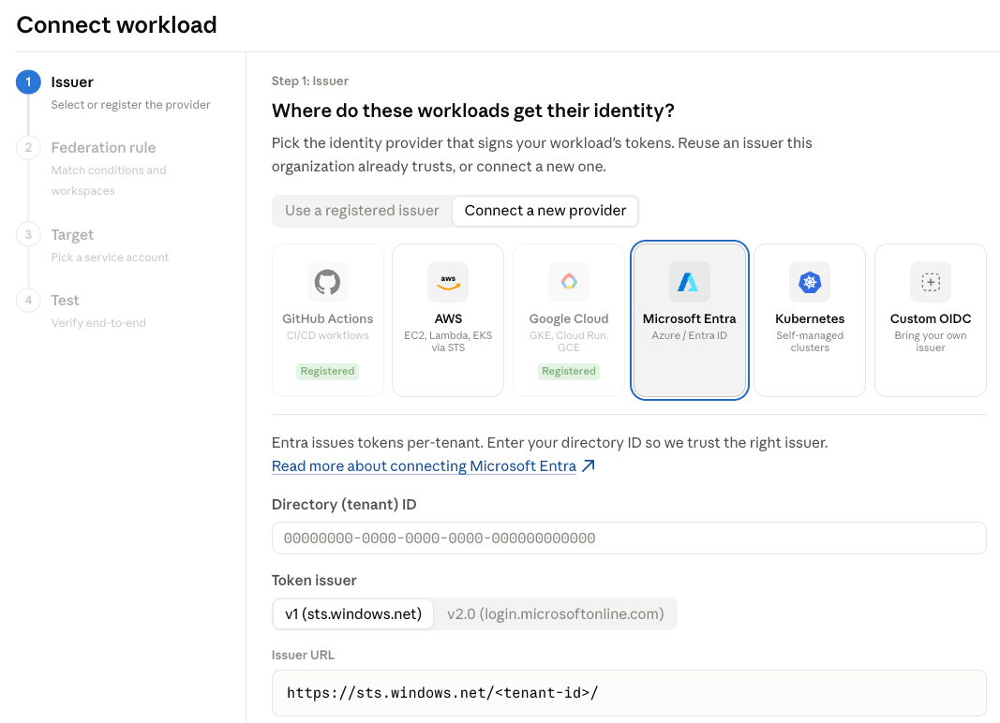

# 通过工作负载身份联合安全访问 Claude Platform

> 发布日期：2026-06-17 · [原文链接](https://claude.com/blog/workload-identity-federation) · 机器翻译，仅供学习。

工作负载身份联合 (WIF) 现已在 Claude Platform 上全面可用。 WIF 与任何符合 OIDC 标准的身份提供商兼容，并涵盖所有 Claude API 端点，包括通过我们的第一方 SDK 和 Claude Code 访问端点时。

使用 WIF 处理工作负载和 [蚂蚁授权登录](https://platform.claude.com/docs/en/cli-sdks-libraries/cli/quickstart#authentication) 对于交互式会话，开发人员在使用 Claude Platform 进行构建时无需处理静态 API 密钥。

## 工作负载联合身份验证的工作原理

WIF 将静态 API 密钥替换为在请求时颁发的短期、限定范围的凭据。无论您是运行 GitHub Actions 的两人初创公司还是具有详细凭证策略的企业，您现在都可以使用 Claude Platform 进行身份验证，就像使用堆栈的其余部分进行身份验证一样。

使用 WIF，无需创建、轮换或泄漏静态 Anthropic 凭证。工作负载使用其已有的身份进行身份验证：AWS IAM 角色、GCP 或 Kubernetes 服务帐户、Azure 托管身份、GitHub 操作令牌、Okta 或其他符合 OIDC 的提供商。

我们还将服务帐户引入了 Claude Platform，因此每个工作负载都可以拥有自己的身份、角色和审计跟踪，而不是共享的 API 密钥。首先，联合规则将外部身份绑定到服务帐户。然后，当工作负载请求访问时，Claude Platform 会验证工作负载的签名 OIDC 令牌，将其声明与您的联合规则进行匹配，并颁发受服务帐户角色限制的短期访问令牌。每次交换和请求都会在您的审核日志中针对该服务帐户进行记录。

## 在几分钟内设置您的第一个工作负载

的 [Claude 控制台](https://platform.claude.com/) 具有用于配置工作负载身份的指导设置流程。该设置会验证每个步骤，并以测试命令结束，以确认您的工作负载可以进行身份​​验证。

## 无需静态密钥即可运行您的整个组织

WIF 兼容 [管理员 API](https://platform.claude.com/docs/en/build-with-claude/administration-api) 用于组织管理。可以通过细粒度范围配置联合规则以实现最低权限访问。

对于大规模运营的组织来说，联合配置也是完全编程的。新的管理 API 端点允许您创建和更新颁发者、服务帐户和联合规则。
