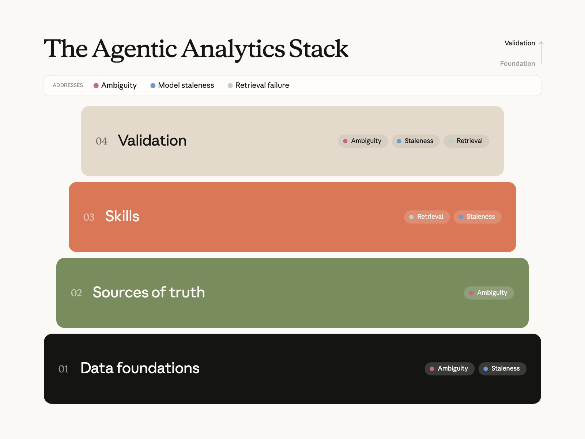
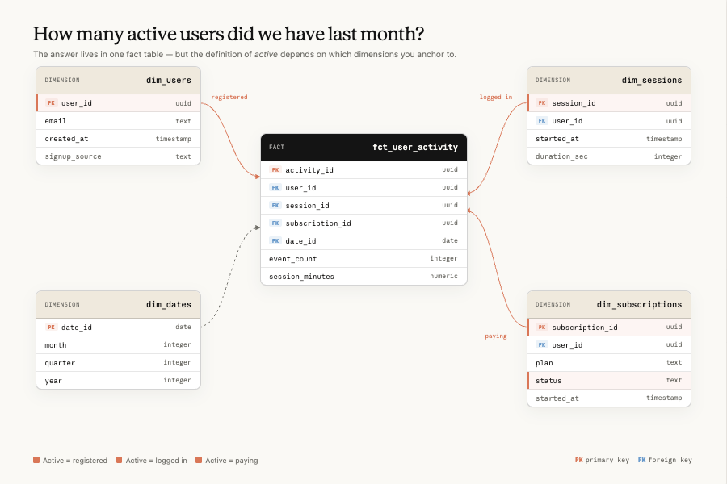

# Anthropic 如何通过 Claude 实现自助数据分析

> 发布日期：2026-06-03 · [原文链接](https://claude.com/blog/how-anthropic-enables-self-service-data-analytics-with-claude) · 机器翻译，仅供学习。

## **我们的智能体式分析堆栈**

在 Anthropic，我们最小化这三个错误的主要方法是通过我们的智能体式数据堆栈。每一层的存在主要是为了解决以下一个或多个问题：

1. **实体歧义**：数据基础和事实来源缩小了合理实体的空间，直到出现单一的受控答案。

2. **陈旧性**：维护和验证流程可以防止一切随着业务变化而腐烂。

3. **检索失败**：技能确保智能体可靠地找到并正确使用该答案。

在本节中，我们将讨论如何构建每一层。



### **数据基础**

确保分析智能体准确的最重要方面是通过强大的数据基础，其中包括数据仓库中的数据模型、转换、测试和表，以及描述它们的元数据。标准数据工程和数据质量实践，例如 [维度建模](https://en.wikipedia.org/wiki/Dimensional_modeling)、左移测试、关键管道的新鲜度和完整性检查仍然适用（我们不会重新考虑这些）。



维度建模等标准数据工程实践与以往一样重要。

改变的是，数据的最终用户模型不再是数据专家（例如数据科学家），而是智能体代表具有不同程度的数据专业知识或对底层基础设施的理解的用户。这种转变带来了挑战，因为结果不能仅仅因为最终用户不知道而要求用户验证潜在的正确性。

数据基础层主要针对模糊性：如果 *收入*例如，解析为一个受管理的数据集而不是四十个可能的候选数据集，那么在智能体进行搜索之前，问题基本上就消失了。这也是第一个过时防御所在的地方，因为定义规范模型的同一存储库是强制它们保持最新状态的自然位置。

我们发现一些做法效果特别好：

- **创建规范数据集**：到目前为止，最常见的失败是智能体无法将概念（“产品 X 的收入”）映射到单个正确的表、列和指标定义，通常是因为有多个看似合理的候选者，其实现略有不同。解决方案是更少、更严格管理的逻辑模型：策划一小组规范的、单一事实来源的数据集，这些数据集明确拥有、可供消费且可发现，然后积极弃用近乎重复的数据集。物理汇总和缓存对于成本和性能仍然很重要，但它们应该从规范的模型中机械地派生出来，而不是作为替代方案与它们并存。目标是当智能体搜索概念时，它会找到单个受控答案。
- **执行您的标准**：我们发现只有当规范的模型和度量定义由 *工装* （智能体在结构上首先路由到它们；更多内容见下文）， *CI* （绕过它们的更改无法通过审核），并且通过 *授权* （下游团队在治理层上构建或解释为什么不这样做）。否则，没有执行力的治理很快就会回到多个候选人的问题。
- **并置工件**：我们针对不断变化的数据模型和业务逻辑的主要防御措施是托管。几乎所有数据代码（即建模、语义层、参考文档、规范仪表板定义）都位于单个存储库中，并通过 CI 检查来保护跨层完整性。如果建模更改会破坏下游仪表板或使记录的指标无效，CI 会对其进行标记，并在同一 PR 中提供修复程序。 （我们将在 **技能** 部分如下。）
- **将元数据视为一流产品**：编码智能体表现良好，部分原因是代码库是 *清晰易读*：自述文件、类型签名、文档字符串等。您的仓库可以同样清晰，但前提是列和表描述、规范度量定义、粒度文档、有效值范围、沿袭、所有权和模型分层都以与转换本身相同的严格性进行维护。虽然不是新见解，但良好的治理提供了帮助智能体选择正确数据集的关键背景。

### **真理的来源**

如果数据基础是数据仓库本身，那么事实来源就是智能体用来导航的参考表面。该层减少了概念 <> 实体的模糊性，并将利益相关者问题中的“每周活跃用户”转变为数据模型中的特定受管实体。大致按照信任度降序排列：

- **语义层：** 编译的指标和维度定义。如果问题清晰地映射到定义的指标，则智能体会调用一个函数并获取一个数字，该数字与公司中每个其他表面生成的数字相同。我们的智能体是 *结构上需要* （通过技能指导）首先利用语义层（见附录）。我们尝试过的一个想法 *没有* 工作：通过 LLM 从原始表和查询日志自动生成指标定义来引导语义层。它产生了看似合理的定义，编码了我们试图消除的模糊性，并且与较小的人工管理层相比，我们的评估结果是净负的。因此我们建议生成 *文档* 与 Claude，但由人类拥有 *定义*.
- **谱系和变换图：** 当语义层不涵盖问题时，沿袭和表排名（基于引用数量）让智能体推理哪些上游模型提供了一个概念，哪些已弃用，哪些共享grain。这将“我不知道指标”转换为“我知道要从哪个管辖的模型进行聚合”。它也是我们所呈现的新鲜度和来源信号的支柱 **在线验证** 下面。
- **查询语料库：** 来自仪表板、笔记本和之前分析的历史 SQL。直观上，这应该是高价值的：它记录了已经正确回答的每个问题。 *在实践中，我们发现，为智能体提供对数千个先前查询的原始检索访问权限，准确性提高了不到一个点* （我们将在下面的后面部分详细介绍该消融）。非结构化检索无法将新问题映射到正确的先例。有效的方法是将语料库提炼成结构化的每个域参考文档和可重用的分析模式，其中描述 **技能**。将查询历史记录视为管理的原材料，而不是智能体直接读取的事实来源。
- **业务背景：** 大多数团队会跳过这一层，也是我们低估时间最长的一层。不了解您业务的智能体会回答用户的问题，但不会回答他们的意思。它不会知道“第二季度发布”指的是特定产品，两个团队对同一术语的定义不同，或者因为董事会会议在周四举行而提出问题。我们通过管道输入由索引文档、路线图、决策日志和我们的组织结构组成的公司知识图，以便智能体可以解析环境引用并提出更好的澄清问题。

这四种情况的常见故障模式与数据基础层的相同： **糟糕或陈旧的文档**。 Claude 对于缩小差距非常有用（起草列描述、根据查询模式提出指标文档、在 CI 中标记未记录的模型），但管理和所有权由人类管理。

在接下来的两节中，我们将讨论如何使这种所有权变得足够便宜以使其真正发生。

### **技能**

如果事实来源是智能体的 *陈述性的* 知识（即度量的含义）那么技能就是它 *程序性的* 知识：以什么顺序查阅哪些来源、如何浏览不明确的数据以及完成的分析是什么样的。

在 Claude Code 中， [技能](https://code.claude.com/docs/en/skills) 是智能体按需读取的 markdown 文件夹。在Anthropic，我们开发的技能具有巨大的附加价值。在我们的评估中，如果没有技能，Claude 准确回答分析问题的能力不会超过 21%。增加技能可以使这些数字总体上始终高于 95%，并且在某些领域通常达到 99% 左右。请参阅附录，了解我们用来创建大部分技能的骨架。

一些最佳实践：

**创建配对技能：** 一个 ***知识*** Skill 充当瘦顶级路由器，允许按需加载其他域详细信息。它说“首先尝试语义层，但如果没有覆盖，这里有大约 30 个该领域的参考文件，描述相关的表、列、连接和陷阱。”实际上，这个路由器是我们对检索失败的答案：它不是让智能体搜索百万个字段的仓库，而是在写入查询之前将空间缩小到几十个精选文件。的 ***运行手册*** 技能编码了高级分析师将遵循的过程：澄清问题，查找来源（通过知识技能），运行查询，然后通过对抗性审查子智能体循环结果。它还捆绑了十几个可重复使用的分析模式（保留曲线、速率分解、漏斗分析），这样常见的请求就不会每次都被重新发明。

**创建适当的参考文档**：为 LLM 检索而编写。我们的参考文档描述了表格（粒度、范围和排除）、陷阱机制（例如，“排除已知的免费电子邮件域，但保留 Anthropic.com 等自定义域”）和显式路由触发器（例如，“如果问题是关于实验提升……请勿用于原始事件计数”），而没有过时的规定配方。请参阅下面的我们用来创建参考文档的框架。

```
# [Domain] Tables

## Quick Reference
### Business Context — [what this domain means in plain words]
### Entity Grain — [what one row represents]
### Standard Hygiene Filter — [the filter every query in this domain applies]

## Dimensions
- [How the key dimensions are encoded, and how the same concept is named
  differently across tables]

## Key Tables
### [table_name]
- **Grain**: [...] · **Scope/exclusions**: [...]
- **Usage**: [when to use it, when NOT to, join keys, required filters]
[... one short section per governed table ...]

## Gotchas
- [The wrong-answer modes a senior analyst would warn you about]

## Best Practices / Common Query Patterns
- [Default choices, standard cuts, worked patterns where the exact query
  form is the hard part]

## Cross-References
- [Neighboring domain docs that own adjacent questions]
```

**将技能维护视为一等公民**：技能文档描述了每天都会变化的数据模型，因此如果没有积极维护，它们在几周内就会出错。在我们将此视为工程问题之前的一个多月里，我们发现离线准确率从发布时的约 95% 漂移到了约 65%。这意味着将技能降价文件与我们的转换模型放在同一存储库中，因此更改模型的 PR 与更新描述它的文档的 PR 相同。代码审查挂钩会标记任何不涉及技能文件的报告模型更改。我们大约 90% 的数据模型PR 现在包含相同差异中的技能更改。随着模型的改进和以前的故障模式不再适用，我们还定期修剪技能脚手架。

**在所有表面上打造一致、无缝的体验**: 一样的技能 *必须* 对 Slack、IDE、仪表板工具和独立智能体会话中的问题提供相同的答案。我们通过确保一个规范源（数据存储库）和技能更改自动同步来做到这一点。合并时，该技能会同步到插件市场（对于 IDE 用户）、云存储 blob（对于读取单个文件的托管应用程序），并直接作为 MCP 上的资源提供。我们还从一开始就通过避免硬编码的存储库路径和特定于表面的命名空间来设计可移植性。

### **验证**

最后，验证是如何找出三种故障模式中哪一种仍然存在泄漏的方法。

#### **线下评价**

我们看到的一个常见模式是，数据团队将建立复杂的分析环境，而无需任何流程来了解其分析的准确性智能体。

解决这一差距的一种方法是通过离线评估，这是简单的问题/答案对。您可以将离线评估视为类似于 ML模型的离线测试，因为它们不会告诉您在线智能体的性能，但它们确实可以让您很好地了解是否存在任何关键差距。

我们在 Anthropic 部署了两种离线评估。 **基于仪表板的评估** 由 Claude 自动生成（然后经过人工验证），涵盖最常见的利益相关者问题。 **长尾评估** 是我们提供 Claude 业务上下文（路线图、表格文档）并让它在域的其余部分生成合理问题的地方。每次利益相关者在线程中更正智能体时，我们也会不断收获，因为该更正是候选评估。

其他最佳实践包括：

- **锚定地面真相，使其不会漂移**：当基础数字发生变化时，针对实时数据编写的评估就会过时。将每个评估固定到快照日期，将其写入稳定的事实表，或者让评分者判断智能体的 *查询* 而不是它的数量。将套件连接到 CI 中，以便触及依赖项的 PR 重新运行受影响的评估。
- **像遥测一样存储结果，而不是像测试日志一样：** 每次运行都会出现在仓库表中，其中包含技能版本、git SHA、模型ID、每次断言通过/失败、令牌计数和挂钟。 “这个改变有帮助吗？”成为一个查询，您将获得时间序列来捕获单个 CI 运行无法捕获的缓慢回归。
- **每个域的 Gate 启动**：域所有者无法向其利益相关者宣布智能体，直到他们的评估集部分清除了某个阈值（我们最初使用约 90%）。它强制参考文档修复 *之前* 用户看到失败。
- **创建适当数量的评估**：您应该拥有的 eval 数量取决于业务领域的复杂性和底层数据的复杂性模型。通过跟踪离线准确性预测在线准确性的程度来进行校准：我们发现每个主题（例如“增长”）的收益递减，并且随着每一代新的模型的产生，上限都会下降。
- **离线评估准确度应约为 100%**;每个正确的答案也应该触及你的语义层（如果你有的话）。同样，这种准确性水平并不能告诉您您的系统不会产生错误的答案，只是表明没有明显的差距（假设​​您有适当的评估覆盖范围）。

#### **消融技术**

关于技能的每个结构决策（例如，公开哪些来源、子智能体是否会产生延迟、是否将两项技能合并为一项）都是通过固定我们的离线评估集来做出的。

我们只改变一个组件并比较通过率。每次运行只需要一个小时，并且替换了很多参数。该方法比任何单一结果更重要：

- **针对空结果进行设计。** 我们最有用的消融是消极消融。我们为智能体提供了对整个仪表板、转换和分析师笔记本 SQL（数千个文件）的直接 grep 访问权限。然后我们在笔录中验证它确实在每个答案之前阅读了它们。任一方向的精度变化均小于一个点。然后我们检查了明显的混淆：问题的答案实际上在语料库中吗？大约 80% 的情况下，是的。 “现在的答案”是否预示着“现在是正确的”？不，翻转率持平。信息就在那里，智能体看到了它，但它仍然没有使用它。那个实验告诉我们我们的瓶颈不是 *访问* 之前的工作，它是 *结构* （即将问题映射到正确的实体）。这一见解重新调整了数月的路线图。
- **以 PR 粒度进行消融。** 每个有意义的技能编辑都会在相关评估切片上运行之前/之后，并在 PR 描述中包含增量。它使“我改进了文档”保持诚实，并捕捉到了令人惊讶的常见情况，即善意的添加使事情变得更糟。
- **保留一份简短的清单，列出哪些不起作用。** 我们的两个：在某个点之上堆叠额外的文档细化轮次（我们连续进行了三个净负迭代：文档变得更长，而不是更好），并将对抗性审阅者更换为更便宜的模型以减少延迟（它失去了大部分准确性胜利，没有真正的加速）。负面结果的记录成本很低，并且会阻止下一个人重新进行相同的实验。

#### **在线验证**

最后一步是确保实际的在线系统性能尽可能准确。我们采取的一些步骤包括：

- **对抗性审查**：我们发现，使用 Claude 技能积极挑战潜在最终答案的所有基本假设，可以在我们的评估集中提高 6% 的准确性，但代价是增加 32% 的令牌和增加 72% 的延迟。
- **出处页脚：** 每个响应都带有一个页脚，其中包含它来自哪个源层（语义层>精选参考>原始表），基础数据的新鲜度以及谁拥有模型。它不会使答案更加正确，但它确实可以帮助消费者判断他们对答案的信任程度。 “原始表，新鲜度未知”页脚是在向上游转发之前需要验证的信号，它是我们针对静默故障采取的少数缓解措施之一。
- **数据质量检查**：您的智能体可能以适当的方式使用了正确的字段，但数据本身不正确。添加基本​​的数据质量检查以确保引用的字段是最新的、完整的并且没有异常通常是良好的卫生习惯。
- **被动监控：** 我们持续跟踪的两个生产信号是通过语义层解析的智能体查询的份额，以及使用纠正语言的响应的份额（“这是错误的表”，“您缺少欺诈过滤器”）。两者都提供每周审查的仪表板以及离线通过率。
- **主动修正收获**：关闭循环的部分。预定的智能体每隔几个小时扫描利益相关者渠道以查找类似的更正语言，起草对相关参考文档的一行修复，并打开标记为域所有者的 PR。修复路径故意很无聊——编辑 Markdown 文件、合并、自动同步——因此域所有者不会在这项任务上花费太多时间。相同的修正反馈到离线评估集中。

这些都没有完全捕获的故障模式是 **沉默的** 一。答案是错误的，但看起来似乎有道理，并且没有异议地使用。我们的缓解措施包括出处页脚、对任何与领导力相关的内容进行明确的人工签核，以及对每个领域的顶级 KPI 进行常设评估，每天根据受祝福的仪表板进行健全性检查，尽管我们还没有强大的解决方案。

## **开始使用**

如果你从零开始，一些规范数据集、几十次离线评估和简单的知识技能将获得大部分优势；这篇文章中的其他内容都是我们在构建后添加的内容。

我们还分享了许多最佳实践，但并非所有最佳实践都适合每个数据团队。通过询问以下问题，与您的组织在一些会影响您的方法的原则上保持一致：

- **今天的正确答案与未来的正确答案有多重要**？ AI模型进展迅速。我们经常看到公司构建大量基础设施来解决当前的模型不足，一旦这些模型得到改善，这些不足就变得毫无意义。了解模型的不足之处，并等待模型的改进来填补空白，可以显着减少开销，但可能不适合您公司的风险承受能力。
- **您如何预测业务的复杂性随时间的变化**？例如，如果您不产生太多数据，只有少数输出使用者，或者您的数据模型可能仍然很简单，那么我们讨论的某些过程可能会有些过大。
- **输出的目标受众的技术含量如何**？换句话说，如果您正在为能够识别答案何时不正确的数据科学家构建这个分析系统，那么与受众不熟悉基础数据模型的情况相比，您可能会更能容忍错误。
- **您愿意花多少钱来提高准确性**？我们发现某些流程（例如对抗性验证）可以显着提高准确性，但通常会带来更高的成本和延迟。
- **您对访问控制和内部数据隐私的满意度如何**？智能体拥有的上下文越多，其性能通常会显着提高；然而，广泛的数据访问不利于大多数公司的治理态势。这决定了您是构建一个智能体还是多个范围的智能体。

无论您采用哪种方式，我们最大的收获都来自于解决三种失败模式中的每一种：将模糊性分解为单一的受控答案，使答案易于发现，并在其中任何一种模式过时时进行标记。

*本文由数据科学与数据工程团队成员 Chen Chang、Clement Peng、Justin Leder、Johanne Jiao 和 Josh Cherry 撰写。作者要感谢 Michael Segner 的贡献。*

## **附录**

#### **技能档案骨架**

接下来是我们主要仓库技能的骨架：真实文件的结构，内部细节被[括号占位符]取代。它并不意味着要逐字复制；而是要逐字复制。它的目的是展示我们认为值得写下的部分。

```
---
name: [warehouse-skill]
version: [x.y.z]
description: "IF the user asks to query [the company]'s data warehouse for any
  [list of business domains] question — THEN invoke this skill. DO NOT invoke
  for [adjacent engineering tasks] or questions with no data-warehouse component."
---

# [Warehouse] Skill Instructions

## Description
The single source of truth for safe and effective [warehouse] querying.
Referenced by other skills [listed] for query execution guidance.

Act as a Data Analyst, providing strategic insights and data-driven
recommendations but seek guidance along the way.

**Out-of-scope decisions**: [product areas, etc.] → surface data only,
state "decision is [owning team]'s call", do NOT take a position or author
code fixes.

## Executing queries
Priority:
1. **[Managed connection]** (if available): [query tool] / [schema tool]
2. **[CLI fallback]** (if installed): [default project, fallback project]
3. **Neither** — ask the user to authenticate, then stop

---

# Semantic Layer (REQUIRED first step)

The governed semantic layer is the **mandatory default path** for every data
question — same numbers as [the BI tool], joins/grain/filters baked in. Raw SQL
via the reference docs below is the **fallback**, used only after the
semantic-layer path is shown not to cover the ask.

## Required workflow
1. **Load** — [how to load the semantic layer in each runtime, with fallbacks]
2. **Discover** — search measures/dimensions by keyword; **always check
   segments** (the named canonical population filters — hand-rolled WHERE
   clauses for these are the dominant wrong-answer mode)
3. **Compile + run** — build the spec → compile to SQL → execute
4. **Fallback** — only if discovery finds no relevant metric or compile fails
   → raw SQL via `references/*.md` (PART 3 below)

> **Don't bail early.** Do NOT fall back to raw SQL on these grounds:
> - "[custom date filtering / cohorts]" → [covered by time-dimension specs]
> - "[needs a join]" → [the metric layer already encapsulates its joins]
> - [3–4 more pre-rebutted excuses agents use to skip the semantic layer]

### Date windows & timezone — decide before you query
- **As-of date vs trailing-N days**: [convention for each]
- **"Last week/month"** → the last *complete* calendar week/month, not trailing-7/30
- **Timezone default**: [TZ]; [exception for certain reporting rollups]
- **Freshness lag**: [some] tables settle late — anchor on MAX(date), not "yesterday"

---

# PART 1: MUST KNOW (Read First for Every Request)

## 🚀 Quick Start Workflow
1. **Check for red flags first**: [restricted/PII requests, gated domains,
   high-stakes asks that need extra validation]
2. **Out of scope — escalate, don't guess**: [access requests, pipeline
   troubleshooting, stale dashboards, root-cause assertions, product/pricing
   recommendations] → redirect to [the owning team], don't answer
3. **Clarify the request**: time period, segment, the business decision it informs
4. **Check for existing dashboards**: [per-domain dashboard catalogs]
5. **Identify the data source**: [navigation map below; prefer governed/aggregated tables]
6. **Execute the analysis**: [required filters + adversarial review]
7. **Deliver insights**: show methodology, differentiate observations from interpretations

## 🏢 Business Context

### Entity Disambiguation (MUST CLARIFY)
- **"[Term A]" can mean**: [entity 1] or [entity 2] — always clarify which
- **"[Term B]" can mean**: [entity 1] → [entity 2] → [entity 3] (one-to-many chain)
- **"Users"**: [which identifier gives accurate counts, and which ones inflate them]

### Business Terminology
- [Current product names vs deprecated aliases that still appear as frozen
  values in the data layer — write with the new names, filter with the old]
- [Key internal acronyms]
- **[Headline metric] calculations**: [monthly / default window / leading indicator]
- **Unfamiliar terms — search [internal docs], don't guess**

### Data Integrity Requirements ⚠️
- **NEVER**: make up data/columns; make speculative assertions beyond what data shows
- **ALWAYS**: use safe division; differentiate observations ("data shows X")
  from interpretations ("this suggests Y"); flag limitations

---

# PART 2: HOW TO DO (Follow During Execution)

## 🔧 Technical Execution Guide
- [Managed-connection tools and CLI invocation details]
- **PII protection**: for restricted data, return the SQL for the user to run
  themselves — do not return results

## 📊 Analysis Best Practices Guide
1. Clarify the ask before querying
2. Show your work (filters, inclusions/exclusions, freshness)
3. Clarify denominators
4. Consider sample bias
5. Connect to business impact
6. **Adversarial SQL review (MANDATORY)** — spawn the [sql-reviewer] sub-agent
   for every query before the final answer; blocking findings must be fixed
   and re-reviewed; do not self-certify
7. **Report with provenance** — every answer ends with a footer:
   > **Source:** [semantic layer | governed table | raw exploration] ·
   > **Confidence:** [tier] · **Reviewed:** [reviewer ✓, round N] ·
   > **Freshness:** [max date in the data] · **Owner:** [owning team]

---

# PART 3: DATA REFERENCES & RESOURCES

## 📚 Knowledge Base Navigation
### [Domain A] → `references/[domain_a].md`
- **Use for**: [kinds of questions]
- **Key tables**: [...]
- **Dashboards**: `references/[domain_a]_dashboards.json`

### [Domain B] → `references/[domain_b].md`
- **Use for**: [...]

[... one entry per business domain — a few dozen in total ...]

## ⚠️ Troubleshooting Guide

### When Information Is Missing
- [missing tables / access denied / outdated docs / unknown enum values → what to do]

### Field Naming Gotchas
- Use `[field_x_v2]` NOT `[field_x]`
- [Two similarly-named tables report the same metric at different grains — which to use]
- [Which of two plausible sources is canonical for the headline metric]
- [… a dozen more hard-won one-liners …]
```
